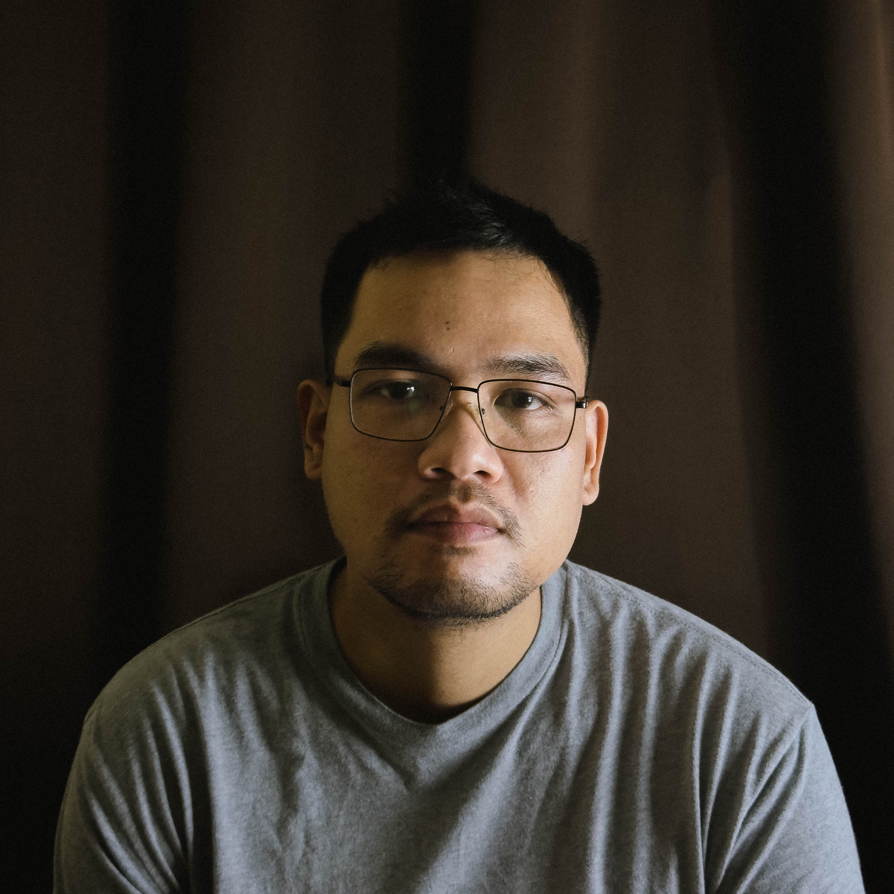
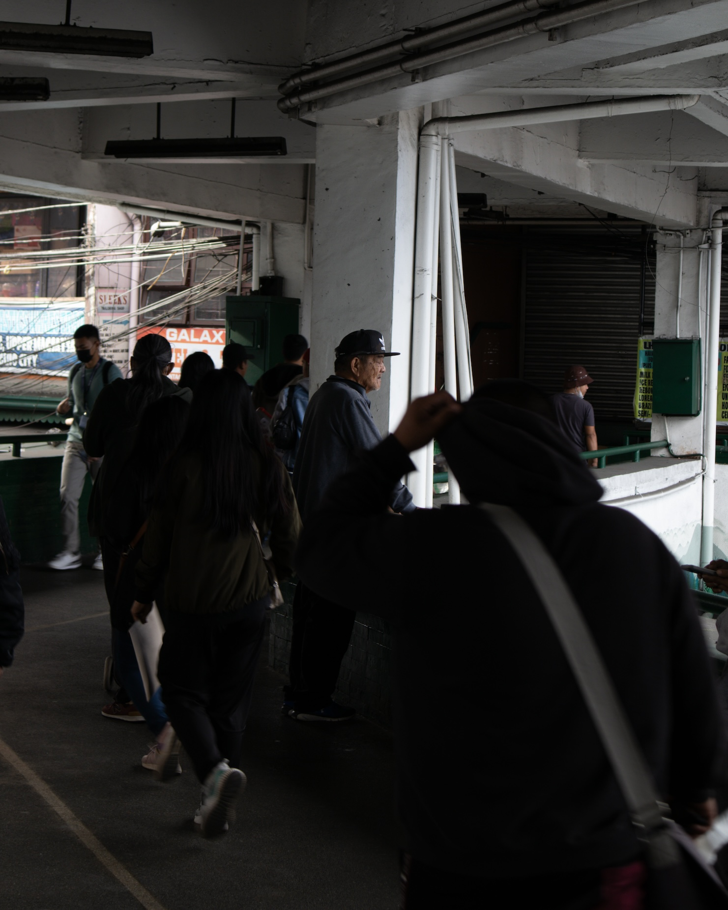
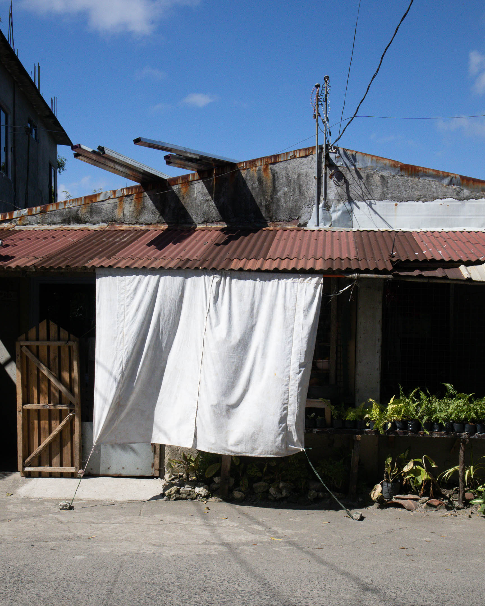

## Hi, I'm Vince Imbat

I'm a writer and photographer who walks. My poetry, prose, photographs, and walks are all attempts to find a free, creative, inquiring, and liberative spirituality.

I share glimpses of my journey in my almost weekly Substack newsletter. Consider subscribing. It's free and you can unsubscribe anytime.

  <a href="https://vinceimbat.substack.com/" target="_blank" rel="noopener noreferrer">
    <button style="background-color: #7b97aa; color: white; padding: 10px 20px; font-size: 16px; border-radius: 5px; border: none; cursor: pointer;">
    Subscribe
    </button>
  </a>

---

## My Official Bio

Vince Honrado Imbat is a Los Baños-based Pangasinense writer and photographer who walks. His essays and poems, recognized by the Gawad Bienvenido Lumbera and Gawad F. Sionil Jose, explore the convergence of place, history, and spirituality. His work has appeared in _Katipunan_, _TLDTD_, _Rappler_, _Northern Dispatch_, _Mountain Beacon_, and elsewhere, and his poetry and photography have been exhibited in Laguna, Cavite, and Rizal. He is a fellow of the Ateneo National Writers Workshop, Palihang Rogelio Sicat, and Saling Panitik.

---

## My Story

### My Spiritual Life

I was once an ordained minister and young pastor of a small evangelical congregation for the Deaf and hard-of-hearing. However, an unexpected crisis of faith led me to the painful decision to leave my childhood religion in 2012. This decision launched me into years of nearly solitary spiritual wandering, which brought me to atheism, New Age spirituality, Zen, and finally to the minimalist teachings of a humble Japanese visionary of progressive and liberal religion named Shin'ichirō Imaoka (1881-1988). His idea of _jiyū shūkyō_ (自由宗教), often translated as "free-religion" but best understood as "a creative, inquiring, free, and liberative spirituality or religion," brought me back to religious life in 2023. Since then, I've been studying and practicing _jiyū shūkyō_ alongside a small group called [Kiitsu Kyōkai](https://andrewjbrown.blogspot.com/p/kiitsu-kyokai.html) (Returning-to-One Gathering) associated with the [Cambridge Unitarian Church](https://www.cambridgeunitarian.org/) led by their minister [Andrew James Brown](https://andrewjbrown.blogspot.com/).

Our small group's study and practice take inspiration from the few writings that Imaoka Shin'ichirō left, particularly his "Principles of Living," a short document made of tentative affirmations, which practitioners are encouraged to customize for their own unique spiritual expression. This cultivation of one's individual unique, creative, and autonomous spiritual expression while recognizing that such autonomy could only be possible through embracing one's interconnection with others—one's neighbors whether human or non-human—is, I think, what is at the core of _jiyū shūkyō_.

I'm still in the process of deepening my understanding of _jiyū shūkyō_ and I don't have all the answers, but I try to write whatever I learn so I could share them to others. Some of the pieces I wrote on the subject that others found helpful are:

- [A Goodness Lurking: The Quest for a Free, Subsistent Spirituality](https://vinceimbat.com/tlw/024/)
- [Where the Sun Warms: Nietzsche's Prognosis for Existential Illness](https://vinceimbat.com/tlw/029/)
- [A Sunday Walk](https://vinceimbat.com/tlw/033/)
- [Godless Spirituality: A Primer](https://vinceimbat.com/essays/godless-spirituality-a-primer/)

One of the gifts that _jiyū shūkyō_ has given me is that it has encouraged me to be more receptive to new yet aligned religious ideas and practices. Since late 2023, I have transitioned from Zen meditation, which I practiced for eight years, to seiza meditatiton in the tradition of Okada Torajiro (1872–1920). I've also recently deepened my study of Jōdo Shinshū (Shin Buddhism) and the practice of nembutsu. In both seiza and Jōdo Shinshū, I am guided by my friend and teacher [Miki Nakura](https://www.youtube.com/@mikinakura2666). I've written about this new segment in my journey in my essay [The Ground That Is My Belly: Doing Seiza with Miki Nakura](https://vinceimbat.com/tlw/044/).

### Walking

I've always walked. Growing up in an evangelical household, it was something I just did. When I became a minister and young pastor, part of my duties was to walk miles and miles around the hills of Baguio City and nearby municipalities to search for the Deaf and hard-of-hearing individuals my congregation could preach to. When I left the church, walking became a way for me to clear my path ahead.

While finding my way around different spiritual circles, I fell in love with Henry David Thoreau. I [read his journals](https://vinceimbat.com/about/essays/reading-thoreau-journal) and started translating some of my favorite entries. I also started experimenting with walking as a spiritual practice and a platform for writing. Walking in the afternoons along dirt paths cutting through rice fields in my hometown of San Jacinto, Pangasinan, I developed an intimate relationship with walking and the outdoors.

It was in the middle of a 22-kilometer walk I did on June 9, 2022, from my current town of residence (Los Baños, Laguna) to San Pablo City, that I found _jiyū shūkyō_. The strenuous yet meditative nature of that long walk moved me to finally confront my complex religious past, a confrontation I detailed in my essay ["Traversing Liminality Through Walking: An Auto-Ethnography"](https://vinceimbat.com/essays/traversing-liminality-through-walking/), which landed me a spot at the 20th Ateneo National Writers Workshop.

Before this walk, I've tried so hard to avoid my religious past, thinking it is a period of my life no longer of use to me. However, as I wrote in the essay, what walking does to us is that it allows us to perform our internal condition of being in-between so that we could experience and perhaps finally see the distance between our former self and present self, a moment that, with faith, leads to integration. What walking has helped me perceive is that the past is not something to avoid but is something that holds a few useful things to create and give meaning to the present. Walking helped me realize that despite not being affiliated to any formal religion I am still very interested in questions about reality, meaning, and being in the world. In short, I was and always is spiritual.

Since that long walk from Los Baños to San Pablo, I've continued to experiment with walking as a platform for creativity, contemplation, and communion. Since 2022, I've performed the following walking projects, which I've documented in pop-up newsletters and essays:

- 2023 April 20 and 27: "Nasa Labas ang Ili" (Home is Out There) guided walks
- 2023 December 4–10: [Roots ྾ Gravel: A Week-long Walk of Los Baños](https://vinceimbat.com/about/rxg)
- 2024 January 15–21: [Tall Tales: Baguio Walk No. 1](https://vinceimbat.com/tt1/)
- 2024 March 5–6: [Walking Binondo](https://vinceimbat.com/tlw/031/)
- 2025 January 25–31: [but Overall is beyond me](https://vinceimbat.com/boibm/)
- 2025 March 7–9: [Walking Bangkok I](https://vinceimbat.com/tlw/039/), [Walking Bangkok II](https://vinceimbat.com/tlw/040/), and [Walking Bangkok III](https://vinceimbat.com/tlw/042/)

In 2024, the _Katipunan_ journal published my hybrid (draft) poetry collection _[Mapa ng Los Baños Patungo Sa'yo (A Map of Los Baños to You)](https://archium.ateneo.edu/katipunan/vol11/iss2/63/)_ in its Buhian literary issue. In the essay that accompanied the collection, ["Ang Borador Bilang Panitikan ng Paglalakad" (The Draft as a Literature for Walking)](https://archium.ateneo.edu/katipunan/vol11/iss2/63/), I delved into my intimate history with walking and discussed how I've developed a walking practice that fuels my writing and spiritual life.

In the same year, I wrote an essay in Pangasinan entitled "Ikurit Ko'y Sali-salik ëd Sayan Dalin: Pitoran Akar" (I Will Write My Feet on This Land: Seven Walks), which won in the [2024 Gawad Bienvenido Lumbera](https://www.facebook.com/share/p/15y2bEbCH2/). The essay introduces seven of the more than a hundred Pangasinan words refering to walking I discovered in the Spanish-era Cosgaya dictionary. I then used these words as prompts for recollections of several walks I've done in Pangasinan, including my first walk as a child, my first funeral procession, and the walks I did as a youth preaching the Bible with my parents.

I have provided a summary of the intricate interconnection between walking and my spiritual life in a 2025 talk I presented to the Global Network of Rainbow Catholics (GNRC) entitled ["Encountering a Creative, Free Spirituality (Jiyū Shūkyō 自由宗教) through Walking."](https://vinceimbat.com/tlw/043/)

### Writing

While writing came to me in childhood and I developed a measure of skill later on, it only began taking root in me when I left my earlier faith. Words naturally filled the void left by that religious calling, and I saw myself pouring my heart out onto page after page of my journals. Writing was instrumental in grieving that old life and building a new one, which surprisingly still had a very strong religious flavor. My collection of Pangasinan poems called _Bëltangën Tayo'y Këlpa_ _(Cut Through This Fog)_, which won in the first [Gawad F. Sionil Jose](https://www.facebook.com/share/p/15RLmH2MBB/) in 2024, explores my complicated relationship with my father before and after I left the church.

Today, I see writing as the primary contemplative expression of my _jiyū shūkyō_, a way to nurture trust in myself, others, the cosmos, and the wholeness that holds everything together. It is a practice that is individually nurturing and holistically transformative at the same time.

As a practice I do alone, I see writing as an act of reverence. I treat words that come out of my consciousness as valuable gems or seeds—miracles waiting to happen. Often, I pick them up during my walks both in geographic space and in what I like to call "the wilderness of the mind," a walk I perform daily on my journal. These words are held together in my _[talahardin](https://talahardin.vinceimbat.com)_ (literally, "note garden"), a digital archive of my notes, poems, essays, stories, translations, vignettes, and other "species of thought" in different states of development. The talahardin is anchored in the idea that writing artifacts, being children of an ever-changing mind, are also never really finished. This is what writing means to me: a quest and a never-ending exploration for what it means to be a child of the cosmos.

But I also believe in writing's potential to be a platform to bring us together in community. Since 2025, I've practiced writing weekly with a group of fellow contemplatives, adopting the principles and practices of Pat Schneider's [Amherst Writers and Artists (AWA)](https://amherstwriters.org/) method.

My essays and poems have appeared in _Katipunan_, _TLDTD_, _Rappler_, _Northern Dispatch_, _Mountain Beacon_, and elsewhere. I am also a fellow of the Ikalawang Saling Panitik: Bienvenido Lumbera Seminar-Palihan sa Pagsasalin, the [20th Ateneo National Writers Workshop](https://www.facebook.com/share/p/1BGYG4y87E/) (ANWW20), and the [17th Palihang Rogelio Sicat](https://www.facebook.com/share/p/1GtkxEiq2Y/) (PRS17).

### Photography

My interest with photography has always been driven by my desire to deepen my walks. My walks require me to look closer at objects and to look underneath what seems apparent in the landscape or the street. Photography, particularly the practice of contemplative photography seems to help me with both goals. I regularly share my photographs in my newsletter and some of them have also been exhibited at the Kalooban Arts Initiative space at Imus, Cavite.

During times when I can't write a single word on the blank page or just don't know what else to say, I find myself looking for the silence and modesty of photography. I like to think of it not as a complement to but an extension of my writing. Through photography, it is impossible for me to stop writing. Photography, after all, is writing with light.

The success of my photographic practice relies heavily on how much I'm able to remove the inner hurdles one often associate with it. I couldn't overstate that the healthiest and most democratic way to approach photography is to never feel or make others feel insufficient around a camera. As I have written in a previous essay, "To be able to let the light in, to truly open myself up to the wide variety of images waiting to permeate themselves into my being, I have to increase the size of my inner aperture by shedding my leaves of insecurity, self-distrust, and pain that may have accumulated for years."

I've written more about my thoughts on photography in my essay [Let the Light In: Notes on Photography and Self-trust](https://vinceimbat.com/tlw/041/).

## Let’s Keep in Touch

I created this website to share my work and in the process find fellow companions in this journey. If you are interested about anything I wrote here, don’t be a stranger and email me at [vince@vinceimbat.com](mailto:vince@vinceimbat.com). I would love to start a conversation with you.

Otherwise, the best way to keep in touch with me is through my [newsletter](newsletters).

I don't spend a lot of time on social media, but I do have an Instagram account where I post sometimes. You can also [follow me there](https://www.instagram.com/vinceimbat/).
