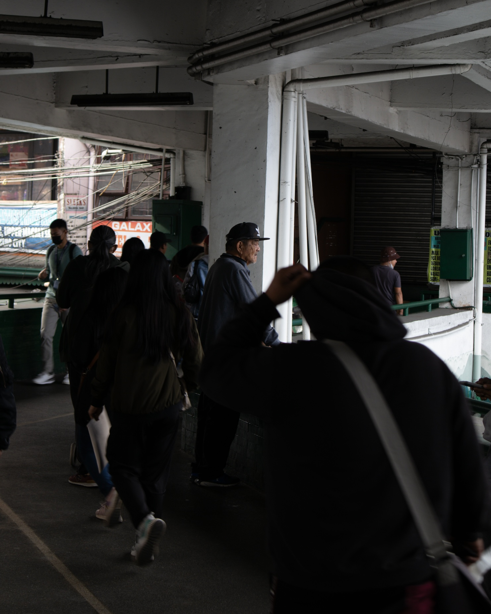

## I’m a Los Baños-based walker, photographer, and writer in three languages, exploring a creative, inquiring, free, and liberative spirituality.

## Contact or Follow

- Email: [vince@vinceimbat.com](mailto:vince@vinceimbat.com)
- Instagram: [@vinceimbat](https://www.instagram.com/vinceimbat/)

***

## Subscribe to my monthly newsletter

_**Uman**_ is a distillation of my current thinking on spirituality, walking, writing, and photography.

It’s free and you can unsubscribe anytime.

You can check the _**Uman**_ archives [here](uman).

<form action="https://sendy.lawak.ph/subscribe" method="POST" accept-charset="utf-8" style="text-align: center; margin-top: 20px;">
  

    <input 
      type="email" 
      name="email" 
      id="email" 
      placeholder="Your email address" 
      style="display: inline-block; font-size: 16px; width: 100%; max-width: 300px; padding: 10px; box-sizing: border-box; border: 2px solid #d3d3d3; border-radius: 4px;" 
    />
  

  

  

    <label for="hp">HP</label> 
    <input type="text" name="hp" id="hp" />
  

  

    <input 
      type="hidden" 
      name="list" 
      value="zX1Mon0bSpW6R6Ujfy5KzA" 
    />
    <input 
      type="hidden" 
      name="subform" 
      value="yes" 
    />
    <input 
      type="submit" 
      name="submit" 
      id="submit" 
      value="Subscribe" 
      style="display: inline-block; font-size: 16px; padding: 10px 20px; width: auto; background-color: #7b97aa; color: white; border: none; border-radius: 4px; transition: transform 0.3s ease, background-color 0.3s ease;" 
      onmouseover="this.style.transform='scale(1.05)'" 
      onmouseout="this.style.transform='scale(1)'"
    />
  

</form>

***

## Particulars

### Publications

I co-authored a zine called _**[so we must meet apart](https://vinceimbat.gumroad.com/l/apart)**_ with Cagayan de Oro writer [Jesa Suganob](https://flammablematerials.substack.com/). It is a collection of epistollary essays delving into the poetics of walking.

My hybrid (draft) poetry collection *[Mapa ng Los Baños Patungo Sa'yo (A Map of Los Baños to You)](https://archium.ateneo.edu/katipunan/vol11/iss2/63/)* and its accompanying essay ["Ang Borador Bilang Panitikan ng Paglalakad" (The Draft as a Literature for Walking)](https://archium.ateneo.edu/katipunan/vol11/iss2/63/) were published in the Buhian literary issue of *Katipunan*.

My Pangasinan poem ["Gawat"](https://tldtd.org/poet/vince-imbat/) and its translation ["Tagsalat"](https://tldtd.org/poet/vince-imbat/) were published in the fifth issue of TLDTD.

### Newsletters

I have one active newsletter called _**[Uman](uman)**_, a distillation of my current thinking on spirituality, walking, writing, and photography.

But I've written other newsletters in the past, including "pop-up" newsletters that I write during walks. Browse my newsletter history [here](newsletters).

### Awards

My collection of Pangasinan poems called "Bëltangën Tayo'y Këlpa" (Cut Through This Fog) won in the first [Gawad F. Sionil Jose](https://www.facebook.com/share/p/15RLmH2MBB/) in 2024.

My essay entitled "Ikurit Ko'y Sali-salik ëd Sayan Dalin: Pitoran Akar" (I Will Write My Feet on This Land: Seven Walks) was the grandprize winner of the [2024 Gawad Bienvenido Lumbera](https://www.facebook.com/share/p/15y2bEbCH2/) in Pangasinan Personal Essay.

### Fellowships

- Ikalawang Saling Panitik: Bienvenido Lumbera Seminar-Palihan sa Pagsasalin
- [20th Ateneo National Writers Workshop](https://www.facebook.com/share/p/1BGYG4y87E/) (ANWW20)
- [17th Palihang Rogelio Sica](https://www.facebook.com/share/p/1GtkxEiq2Y/) (PRS17)

***

## My Story

### Jiyū Shūkyō (自由宗教)

Jiyū shūkyō (自由宗教), often translated as “free-religion,” could also mean “a creative, inquiring, free, and liberative spirituality.” It is what the Japanese visionary of progressive and liberal religion Imaoka Shin’ichirō-sensei (1881-1988) envisioned as his ideal foundation for a way of being in the world. The more contemporary works of [George M. Williams](https://www.georgemwilliams.com/), [Andrew James Brown](https://andrewjbrown.blogspot.com/), and a small community called [Kiitsu Kyōkai](https://andrewjbrown.blogspot.com/p/kiitsu-kyokai.html) (of which I’m a part of) are among the few things that breathe life to this long since overlooked religious and spiritual viewpoint.

Current interpretations of jiyū shūkyō take inspiration from the few writings that Imaoka Shin’ichirō left, particularly his "Principles of Living," a short document made of tentative affirmations, which practitioners are encouraged to customize for their own unique spiritual expression.

This cultivation of one’s individual unique, creative, and autonomous spiritual expression while recognizing that such autonomy could only be possible through embracing one’s interconnection with others—one’s neighbors whether human or non-human—is, I think, what is at the core of jiyū shūkyō.

I found jiyū shūkyō after a 22-kilometer walk I did on June 9, 2022, from my current town of residence (Los Baños, Laguna) to San Pablo City. The strenuous yet meditative nature of that long walk moved me to finally confront my personal history as a former minister of the Jehovah’s Witnesses, a confrontation I detailed in my essay [“Traversing Liminality Through Walking: An Auto-Ethnography”](essays/traversing-liminality-through-walking), which landed me a spot at the 20th Ateneo National Writers Workshop.

Before this walk, I’ve tried so hard to avoid my religious past, thinking it is a period of my life no longer of use to me. However, as I wrote in the essay, what walking does is perform one’s internal condition of being in-between spaces so that one could experience and perhaps finally see the distance between one’s former self and present self, a moment that, with faith, leads to integration.

What walking has helped me perceive is that the past is not something to avoid but is something that holds a few useful things to create and give meaning to my present reality. Walking helped me realize that despite not being affiliated to any formal religion I am still very interested in questions about reality, meaning, and being in the world. In short, I was and always is spiritual. Stumbling upon jiyū shūkyō through Andrew James Brown’s blog [Caute](https://andrewjbrown.blogspot.com/) was the balm to my existential illness.

I’m still in the process of deepening my understanding of jiyū shūkyō and I don’t have all the answers, but I try to write whatever I learn so I could share them to others. Some of my essays on the subject that others found helpful are:

- [A Goodness Lurking: The Quest for a Free, Subsistent Spirituality](tlw/024)
- [Where the Sun Warms: Nietzsche’s Prognosis for Existential Illness](tlw/029)
- [A Sunday Walk](tlw/033)

### Walking

I’ve always walked. Growing up as a Jehovah’s Witness, it was something I just did. In college when I really started to go deep in the religion of my childhood, I volunteered in a sign language congregation that ministered to the deaf and hard of hearing in Baguio City. There I became a minister and young pastor. Part of my duties was to walk miles and miles around the hills of Baguio and nearby municipalities to search for deaf or hard of hearing individuals we could preach to. After I left the Jehovah’s Witnesses in 2012, I used walking to grieve and begin creating my path ahead.

While finding my way around different spiritual circles, I fell in love with Henry David Thoreau. I [read his journals](essays/reading-thoreau-journal) and started translating some of my favorite entries. I also started experimenting with walking as a spiritual practice and a platform for writing. Walking in the afternoons along dirt paths cutting through rice fields in my hometown of San Jacinto, Pangasinan, I developed an intimate relationship with my feet.

Encountering the Japan-based writer and photographer [Craig Mod](https://craigmod.com/) in 2021 inspired me to move beyond Thoreau and consider other ways of fusing walking, writing, and photography. Aside from my first long walk from Los Baños to San Pablo in 2022, I also did other walks:

- 2023 April 20 and 27: "Nasa Labas ang Ili" (Home is Out There) guided walk
- 2023 December 4–10: [Roots ྾ Gravel: A Week-long Walk of Los Baños](rxg)
- 2024 January 15–21: [Tall Tales: Baguio Walk No. 1](tt1)
- 2024 March 5–6: [Walking Binondo](tlw/031)

As of now, I’m continuing my study of walking as a method and platform for thinking and creativity. I’m particularly interested on how the contemporary dérive as theorized by Phil Smith sits alongside Filipino indigenous conceptions and experiences of walking and how these embodied acts could serve as platforms for exploring jiyū shūkyō (or variants of it) in the Philippines.

In November 2024, the *Katipunan* journal published my hybrid (draft) poetry collection *[Mapa ng Los Baños Patungo Sa'yo (A Map of Los Baños to You)](https://archium.ateneo.edu/katipunan/vol11/iss2/63/)* in its Buhian literary issue. In the essay that accompanied the collection, ["Ang Borador Bilang Panitikan ng Paglalakad" (The Draft as a Literature for Walking)](https://archium.ateneo.edu/katipunan/vol11/iss2/63/), I delved into my intimate history with walking and discussed how I've developed a walking practice that fuels my writing and spiritual life.

In the same year, I wrote an essay in Pangasinan entitled "Ikurit Ko'y Sali-salik ëd Sayan Dalin: Pitoran Akar" (I Will Write My Feet on This Land: Seven Walks), which won in the [2024 Gawad Bienvenido Lumbera](https://www.facebook.com/share/p/15y2bEbCH2/). The essay introduces seven of the more than a hundred Pangasinan words refering to walking I discovered in the Spanish-era Cosgaya dictionary. I then used these words as prompts for recollections of several walks I've done in Pangasinan, my home province, including my first walk as a child, my first funeral procession, and the walks I did as a youth preaching the Bible with my parents.

### Writing

I was very fortunate to grow up in a household with books. By high school I had a decent handle of both English and Filipino I could express myself in these languages. That said, my earlier relationship with writing in the context of traditional schooling was mired with competition, heartbreaks, and insecurities.

As a religious minister using sign language as my primary mode of communication, I wrote almost nothing. When I left the religion of my childhood I noticed I started writing once more but with a very different intention. I wrote only for myself under the private pages of my journal to help me understand what I was going through and to chart a course for the life ahead. In a way, writing was like walking with pen and paper.

As of now, I’m experimenting with what I call the *[talahardin](talahardin.vinceimbat.com)* (literally, “note garden”), a digital archive of my essays, notes, poems, quotes, stories, translations, vignettes, and other “species of thought” in different states of development. I see my talahardin as my body of work. As an archive, everything it contains are drafts as it itself is a draft. Seeing my body of work as a draft is anchored on the idea that art is never finished, which means that like one’s state during a walk, I see my art as being in a perpetual state of liminality. Because of this, I put priority on the process rather than the product of my writing. I have sympathies with the process movement in literature, particularly the work of Pat Schneider and her [Amherst Writers and Artists (AWA)](https://amherstwriters.org/) method.

### Photography

My interest with photography has always been driven by my desire to deepen my walks. My walks require me to look closer at objects and to look underneath what seems apparent in the landscape or the street. Photography, particularly the practice of contemplative photography I first learned from [Louise Far](https://makingvisiblewithlouise.com/) seems to help me with both goals.

My walks and photography work hand in hand. Almost all my photographs are taken during my walks.

As of now, I’m also exploring how jiyū shūkyō could be practiced through photography. In thinking about photography this way, I take inspiration from a quote from Andrew James Brown's essay ["The Freedom to Be Tomorrow What We Are Not Today"](https://andrewjbrown.blogspot.com/2022/05/the-freedom-to-be-tomorrow-what-we-are.html):

>I always try to pick up my camera and go out into the world without a ready-made, fully worked-out blueprint, theory or plan about how, when or where to take a photograph. In this sense, what the surfboard is to the surfer, the camera is to me the photographer. In doing this I’m attempting to keep myself open to whatever whooshes-up or shines before me, whether that is in the form of an obvious “subject”, “view”, or a simple passing play of sunlight and shadow. When something does whoosh-up or shines before me, I stop and take a photograph. To do this I must, of course, temporarily “take a position.” Not only by standing still in this or that place but also by taking a position with regard to the camera settings I am going to use, the f-stop, the shutter speed, film speed and whether to shoot in black and white or colour. Now, were I never to take this or that position with regard to all these things, I would never be able to take any photo (good or bad). However, it is vitally important that, having taken a photograph, I never become wholly wedded to this or that particular position, subject, view, passing play of sunlight and shadow or this or that set of settings—instead, I must move on, intra-actively, on the crest of the unfolding world, to attain another perspective and so allow something else to whoosh-up or shine before me which calls me to shoot, click!

## Let’s Keep in Touch

I created this website to share my work and in the process find fellow companions in this journey. If you are interested about anything I wrote here, don’t be a stranger and email me at [vince@vinceimbat.com](mailto:vince@vinceimbat.com). I would love to start a conversation with you.

Otherwise, the best way to keep in touch with me is through my [newsletter](newsletters).

I don't spend a lot of time on social media, but I do have an Instagram account where I post sometimes. You can also [follow me there](https://www.instagram.com/vinceimbat/).