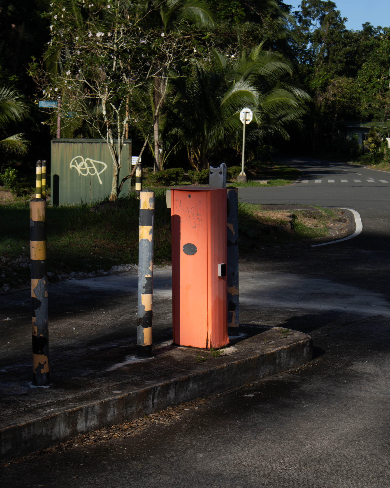

What photographs to take and not?  
Also, why take a photograph that shouldn't have been taken?

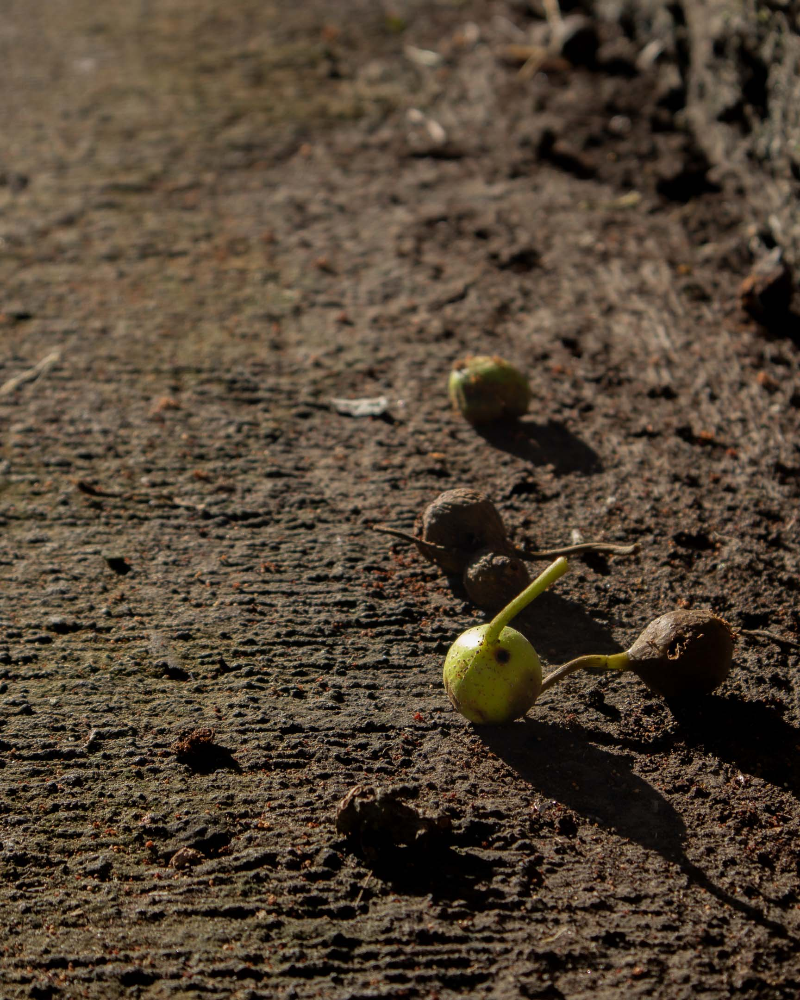

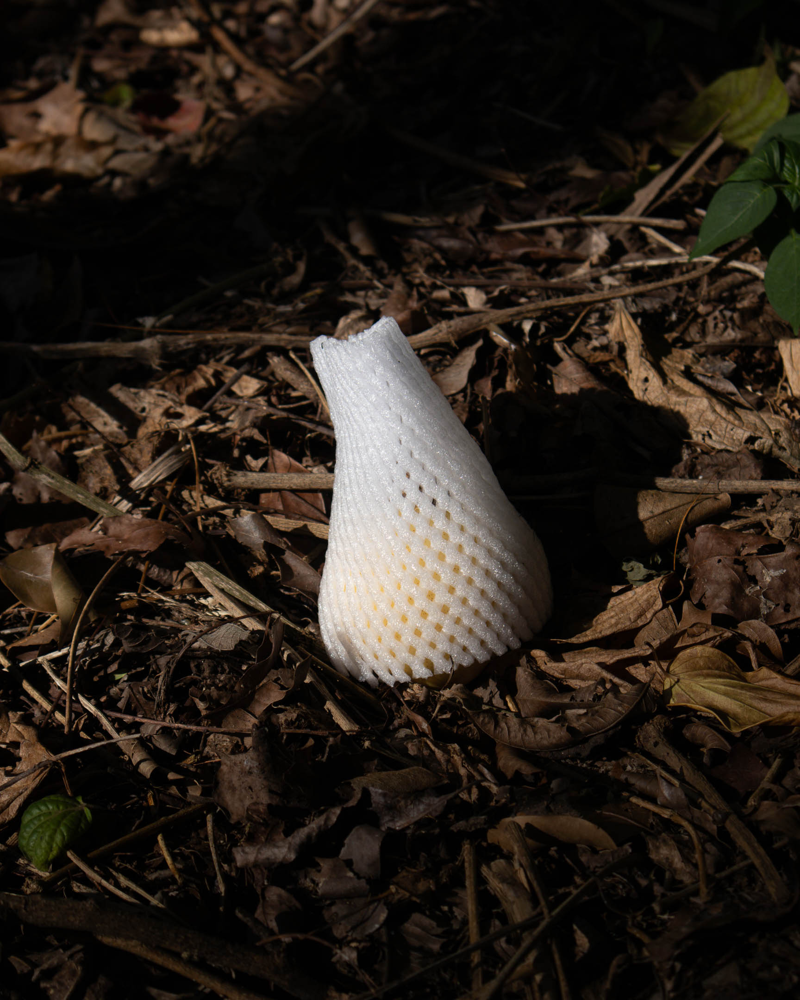

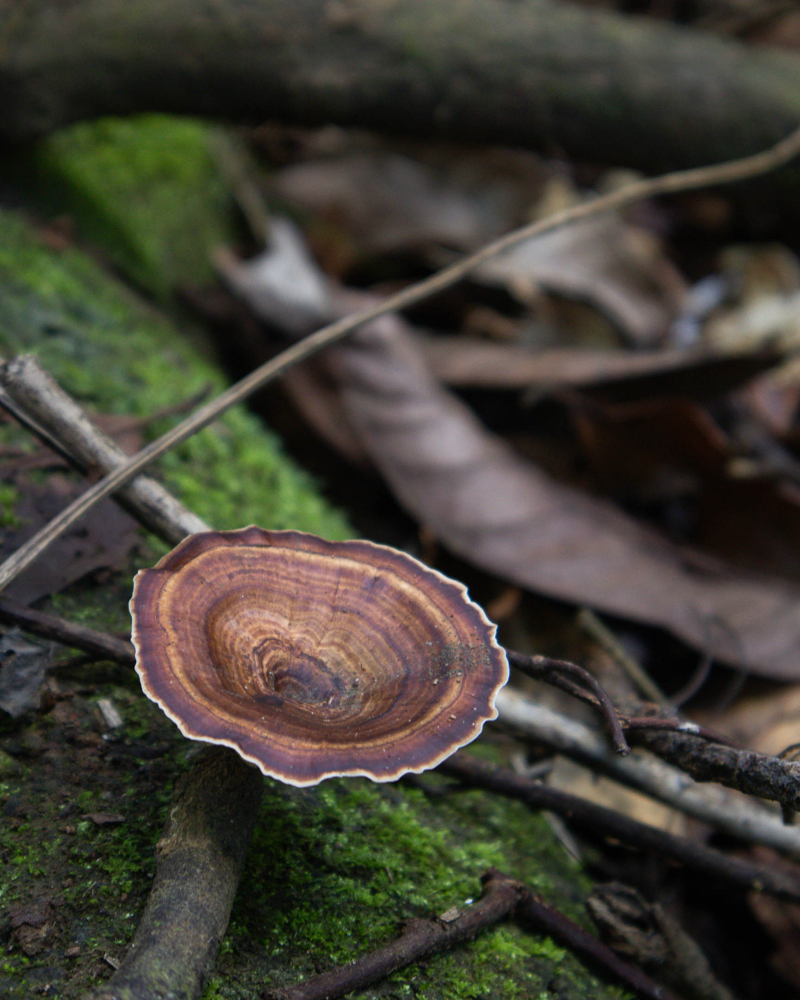

What better thing to think about, to be in, to ponder, to revere?

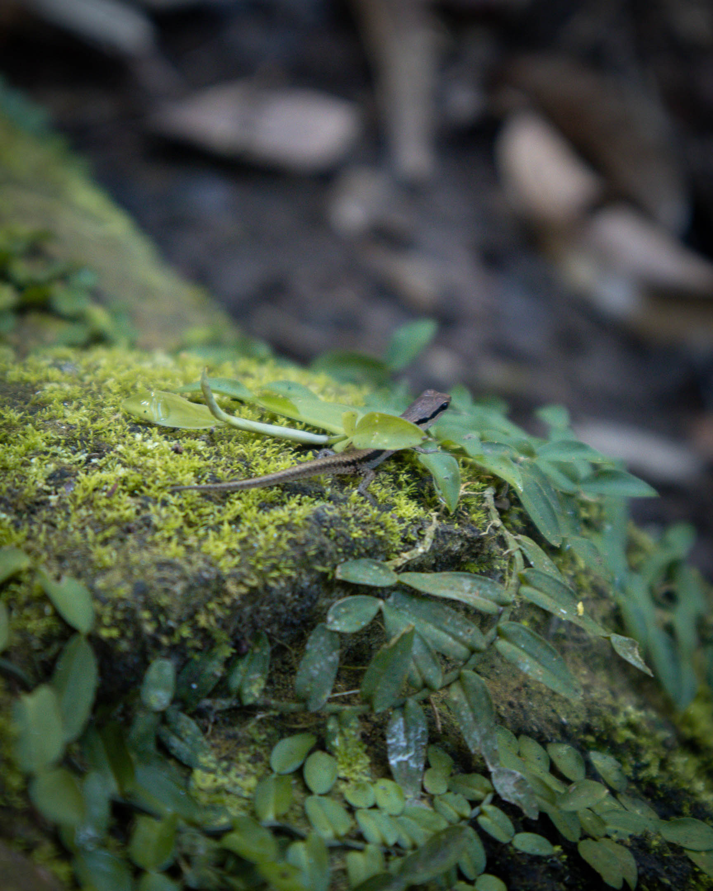

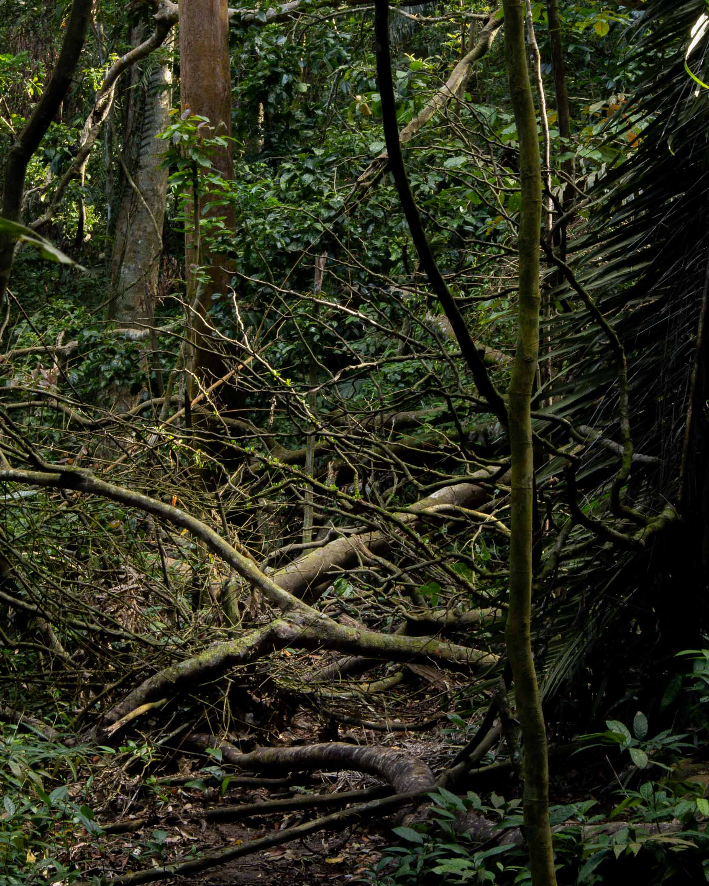

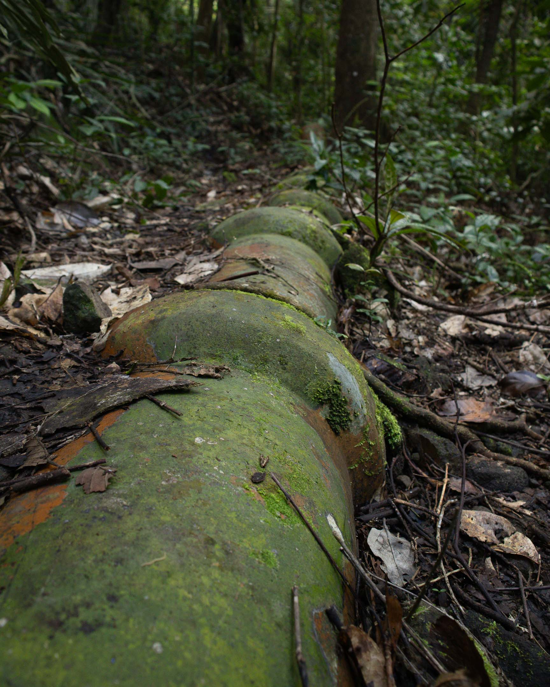

Just now, I caught myself second guessing myself again. What is the better attitude here? Rather than doubt, perhaps, stay with it. Perhaps the "right" feeling or action will emerge later. Perhaps, in this walk, allow myself to be excited and be out of the need to be as present as I could if that is what I'm feeling at the moment. Then, when I catch myself suddenly awakening out of that surge of passion, I'll take it as a reminder to return to the present and just be. When I feel another surge of passion, perhaps, I'll let it hold of myself once more. And the cycle goes on.

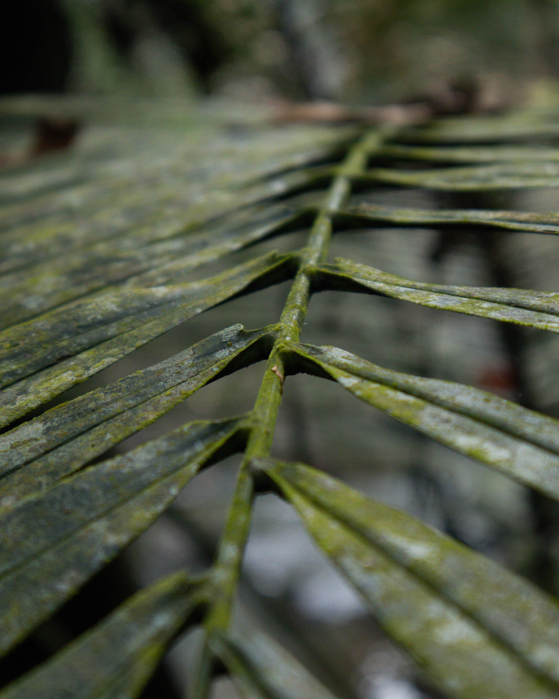

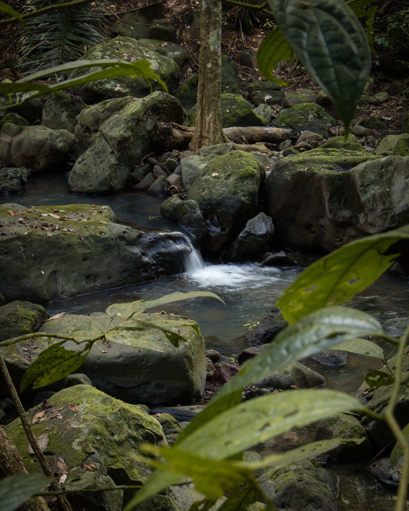

On this walk there was a long period of passionate looking—not searching for images but responding to a lot of new ones. And then a realization that I was no longer present in the walk so I have to call myself back to it. And then a getting lost and having to be in survival mode. Then an acceptance of defeat that I have to return. A sense of relief that I'm back on the path. And then a return to listening to the birds.

But no cameras now.

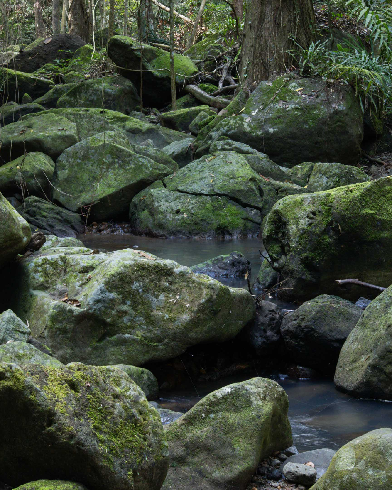

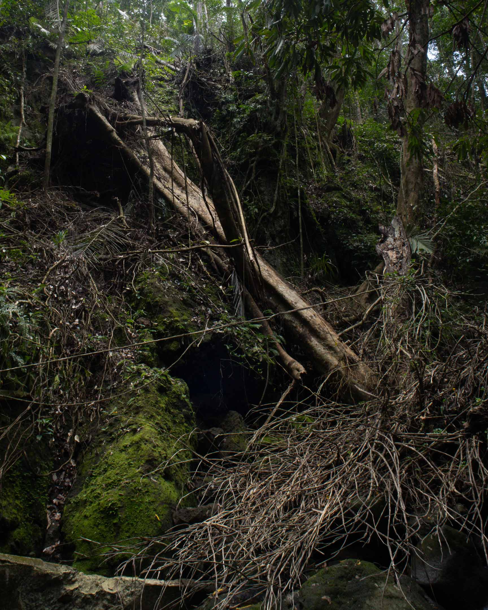

A long branch broken  
fell on the path  
something to hold on

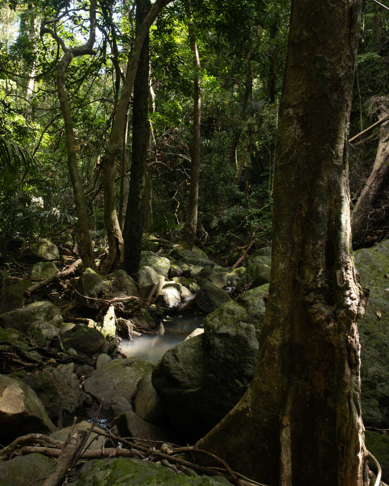