Large fishes on this creek.  
A bird hops on stones.

Maya birds so light they perch on the tip of grass.

Vendors used to sell these outside of school.  
Inside rattan cages.

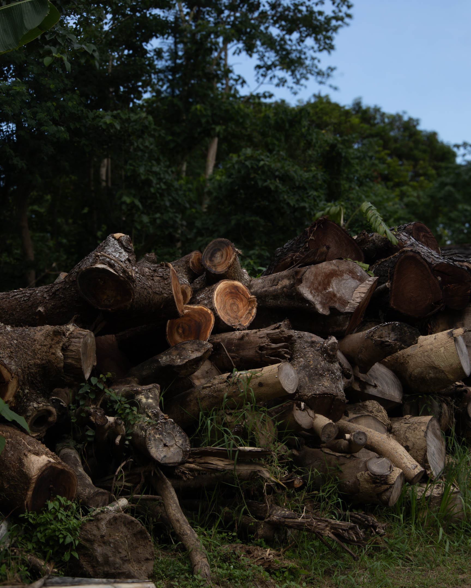

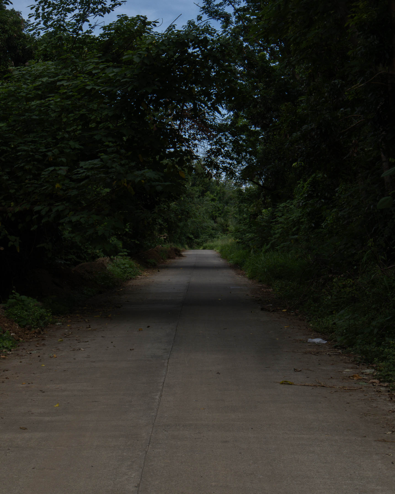

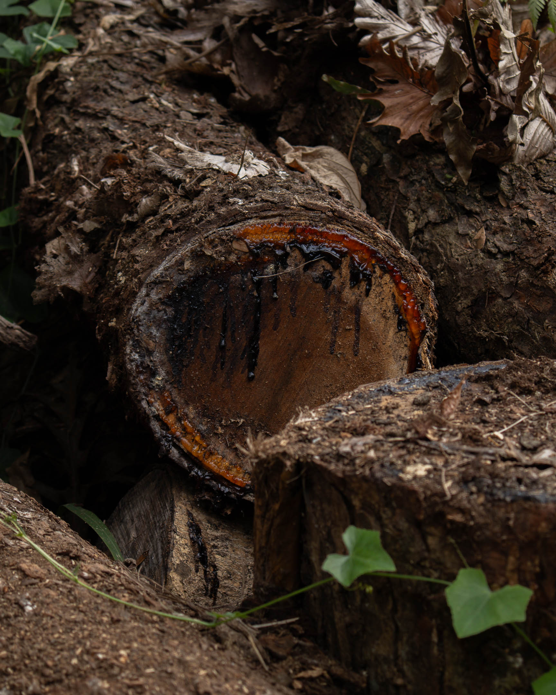

We cut them. And then they still grow.

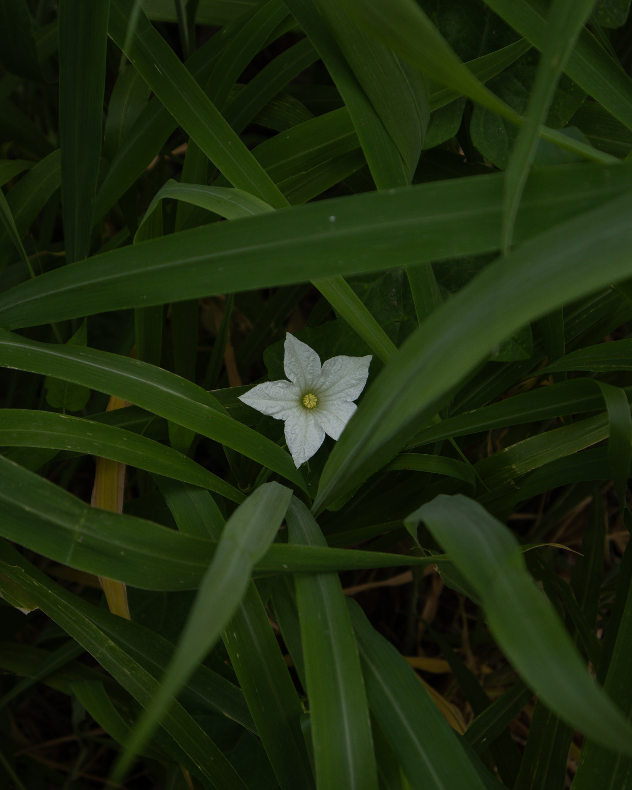

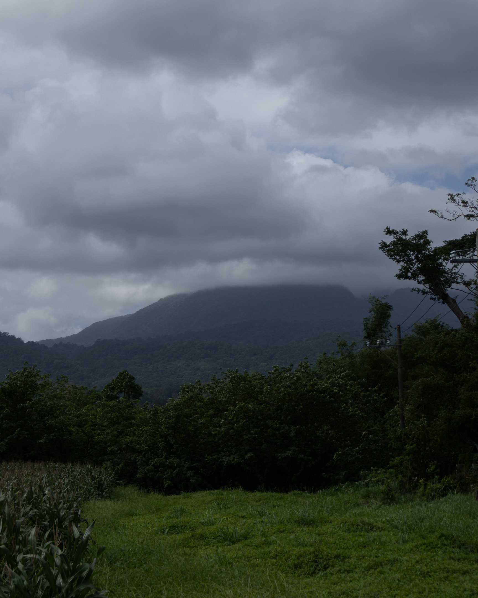

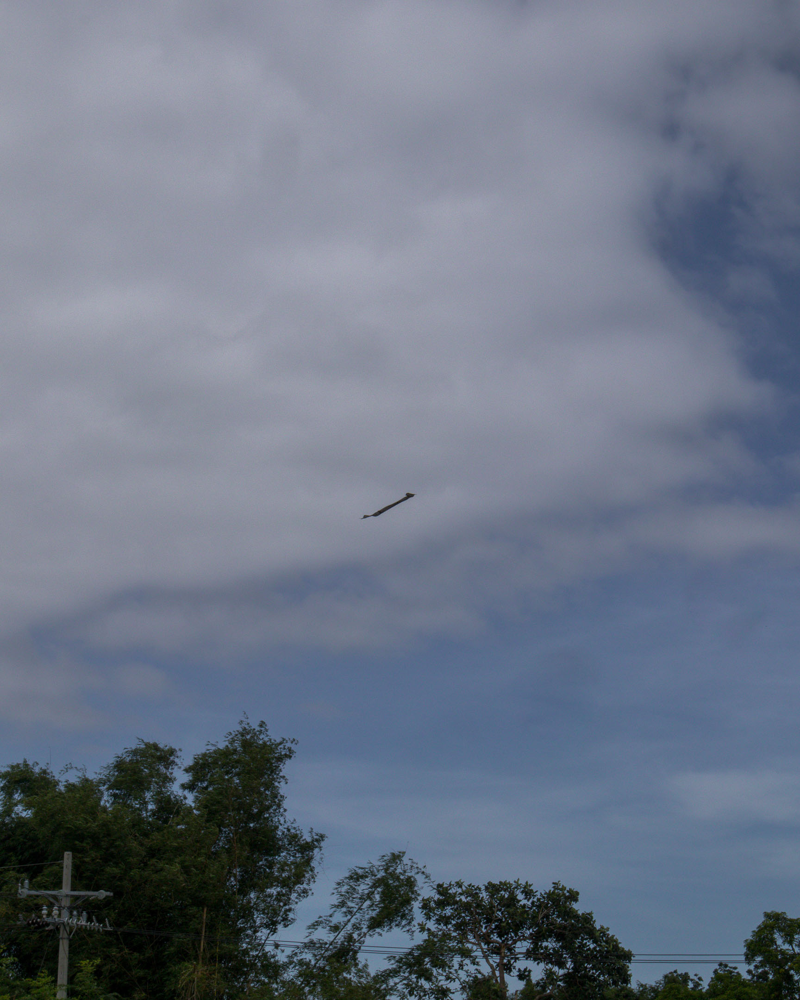

This is a place children can still fly their kites.

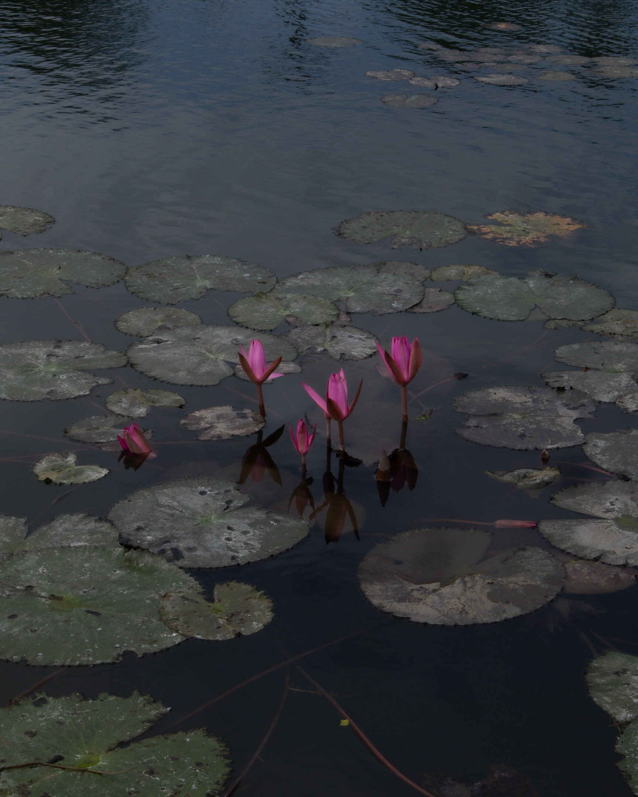

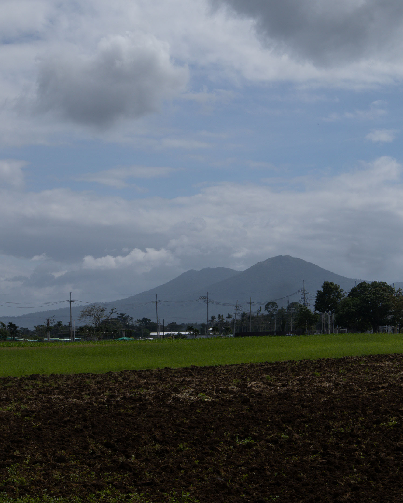

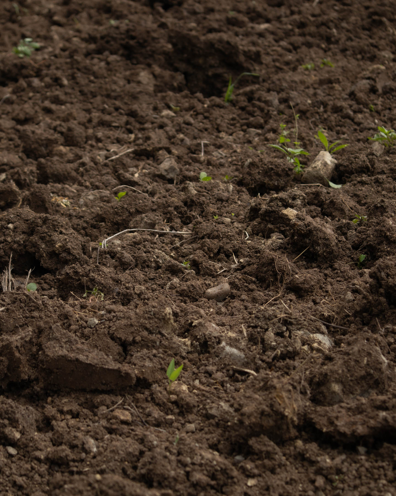

They dance, petals flutter,  
sometimes as if to submerge  
they go round in circles  
draw near to a partner  
sway toward one direction  
before turning to another

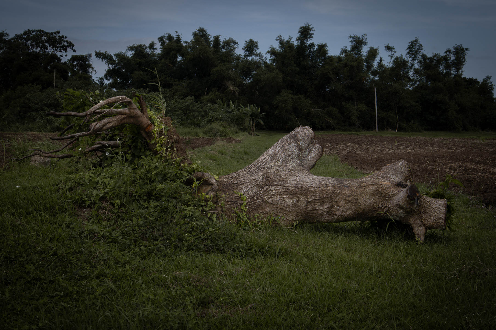

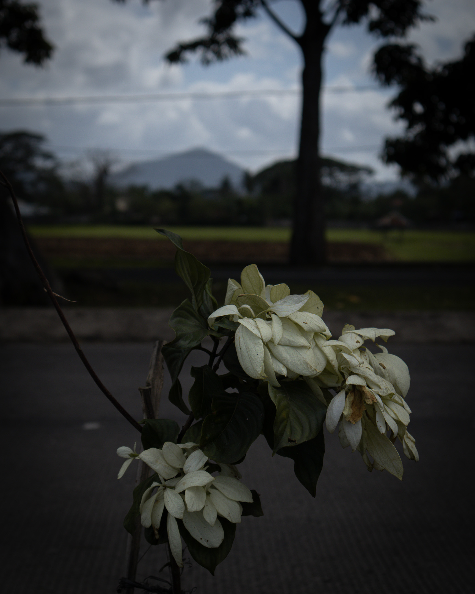
