The crow dropped something from its beak.

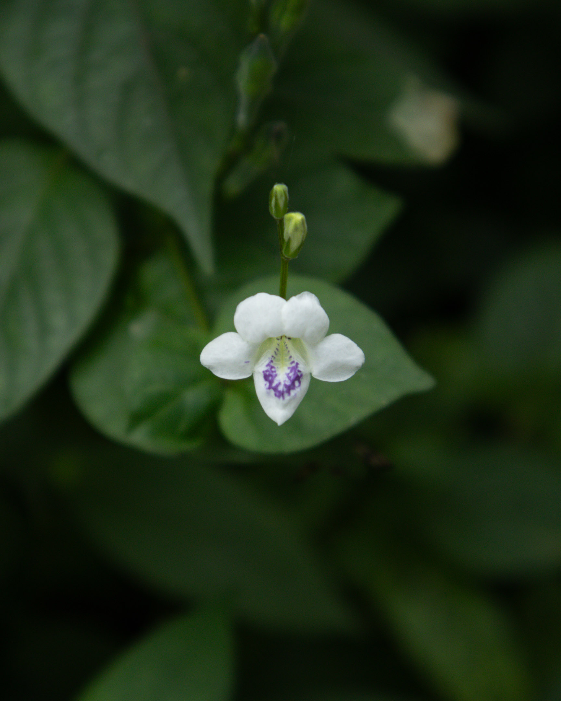

The tiny weed with a tiny orchid-like flower appears yet again.

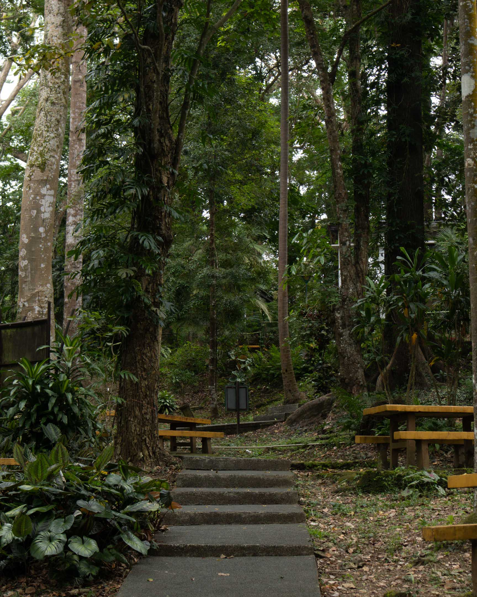

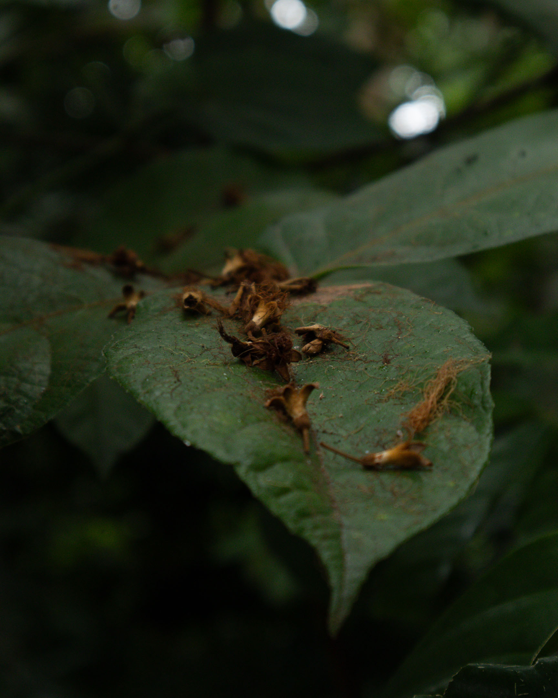

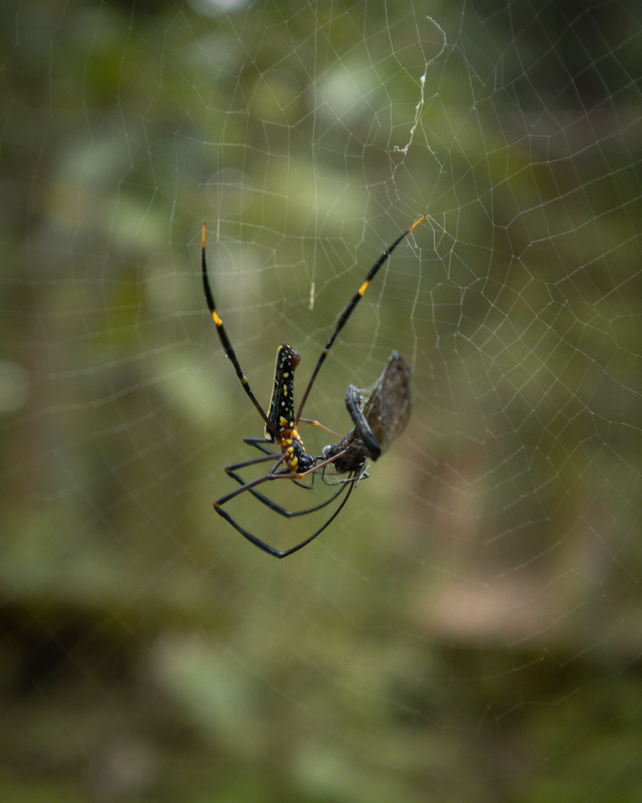

The sharpness of the image relies heavily on how I could hold my breath longer to stay still.

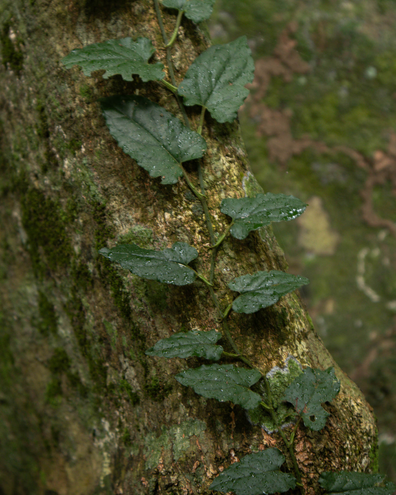

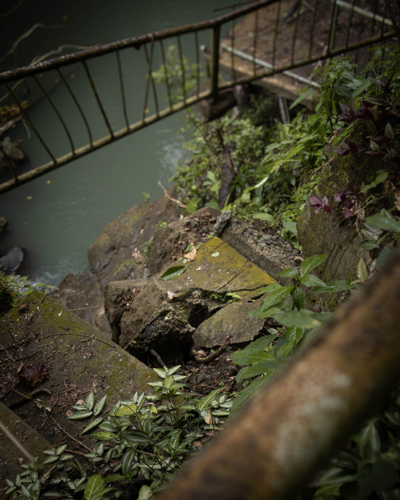

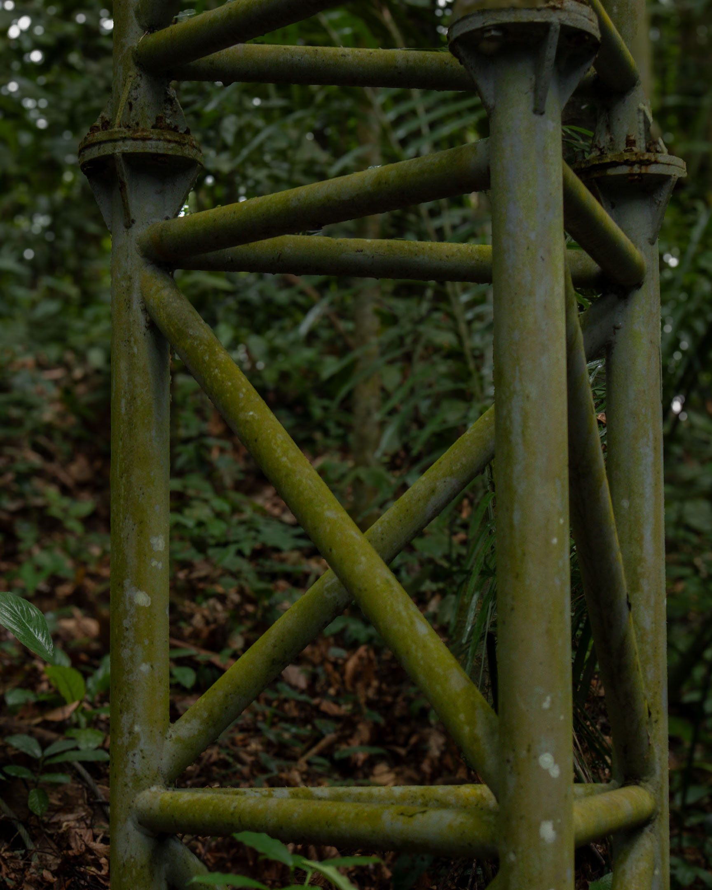

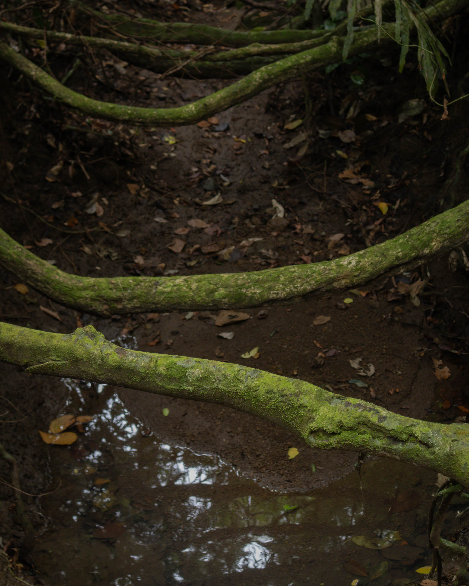

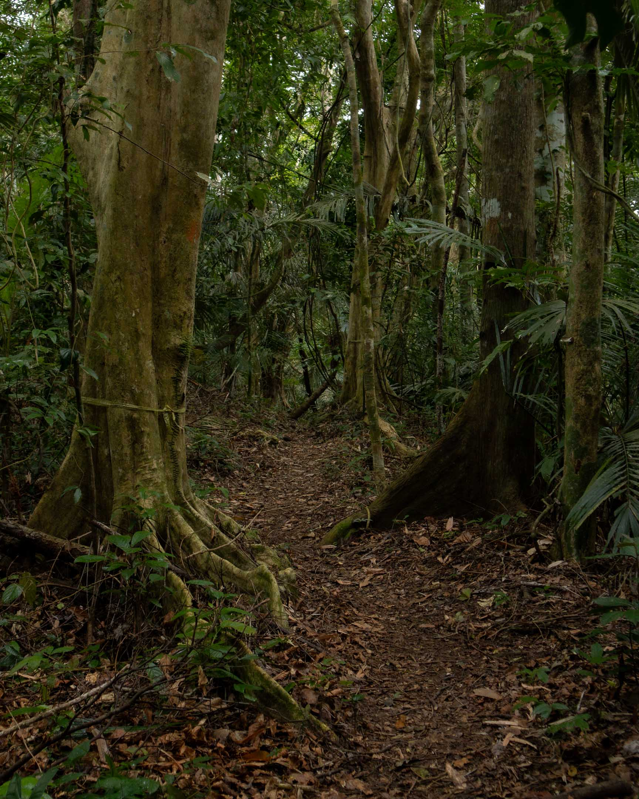

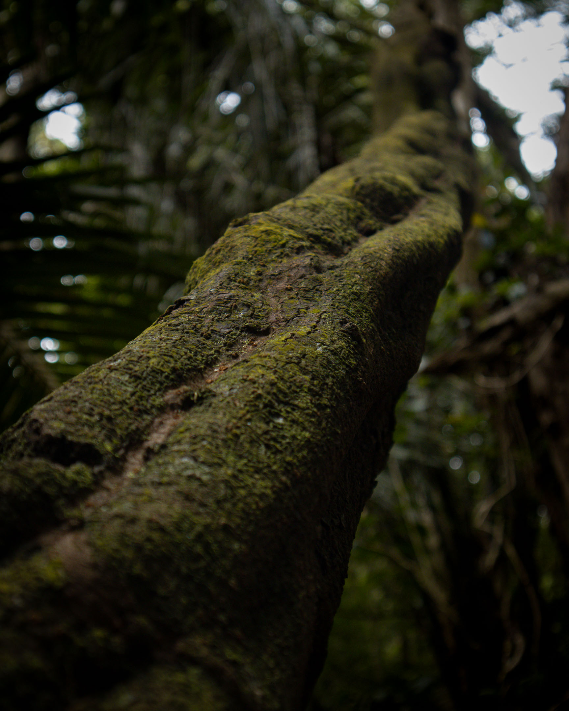

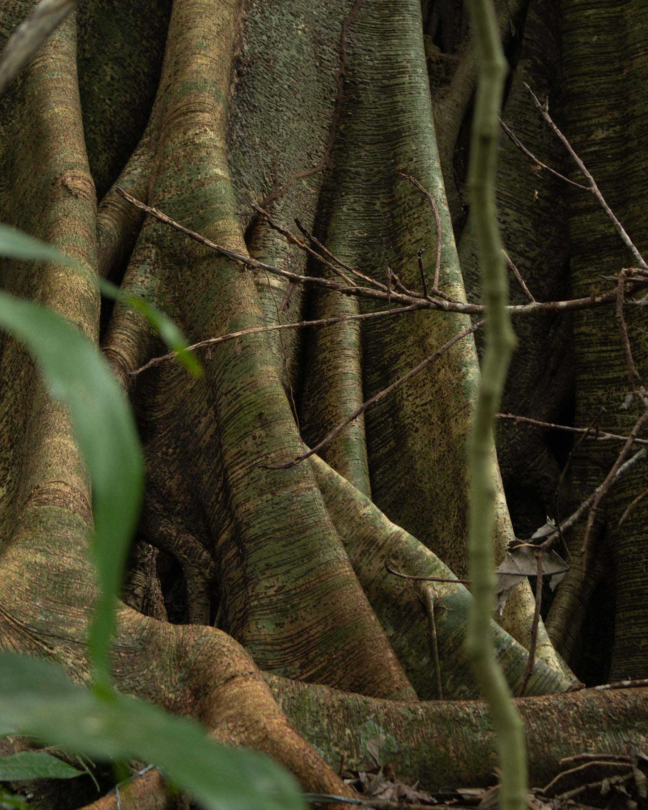

And then a sudden silence.

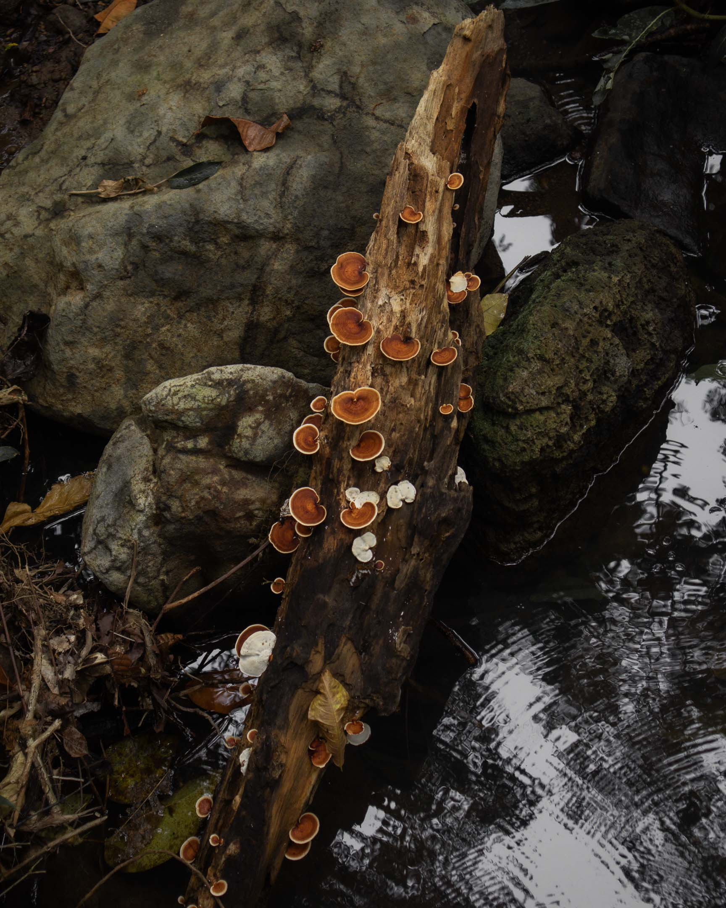

Roots of these trees  
my stairs.