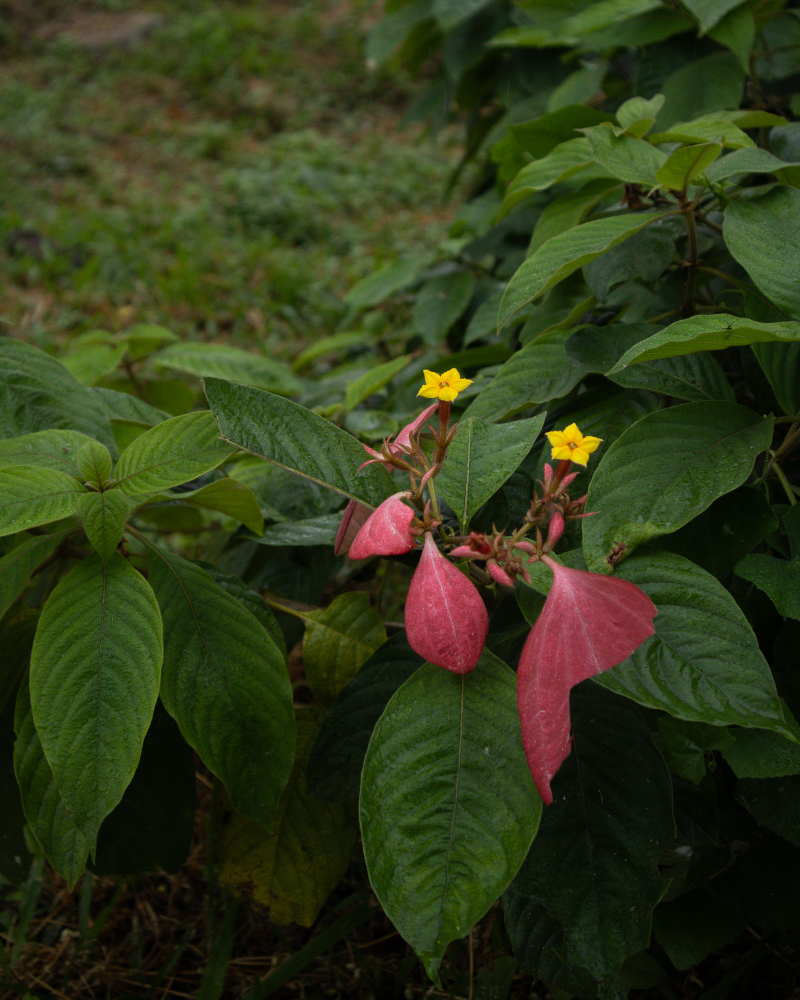
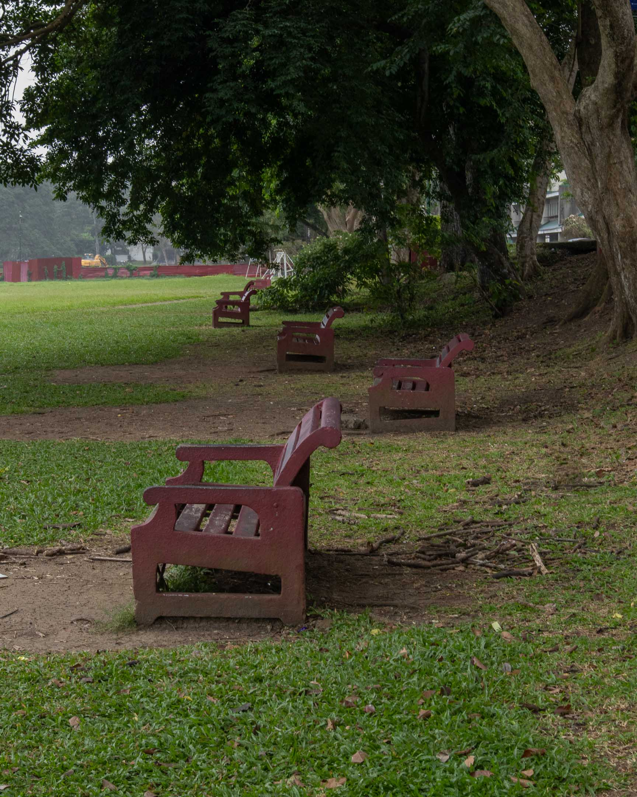
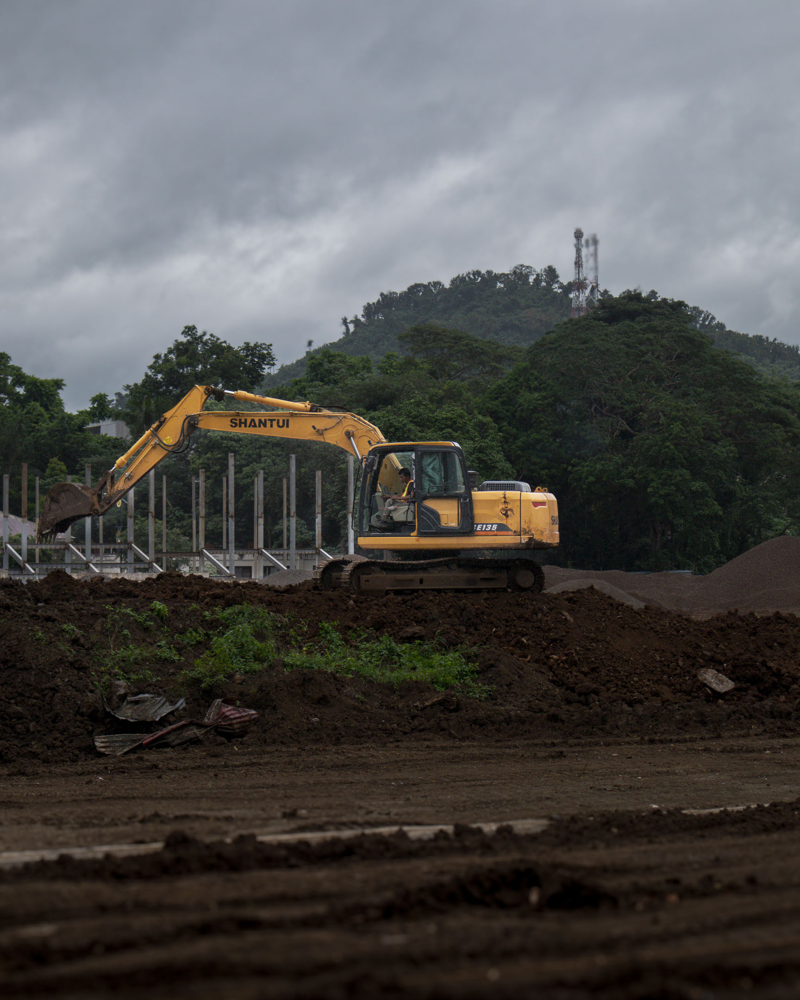
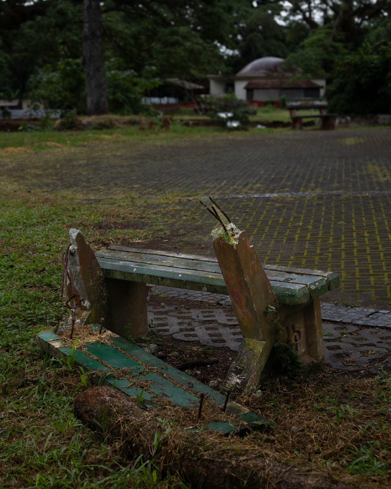
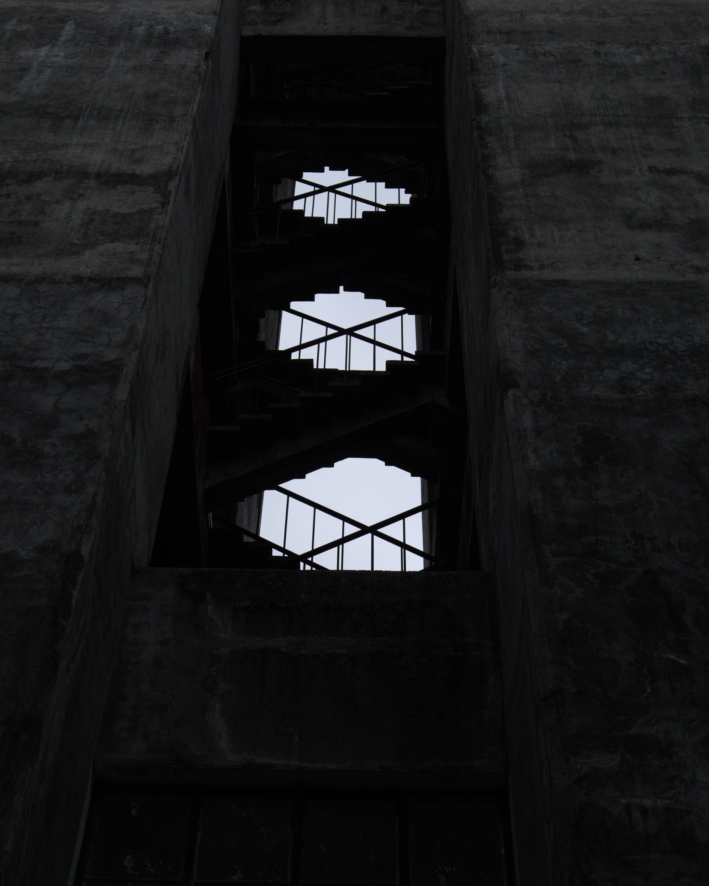
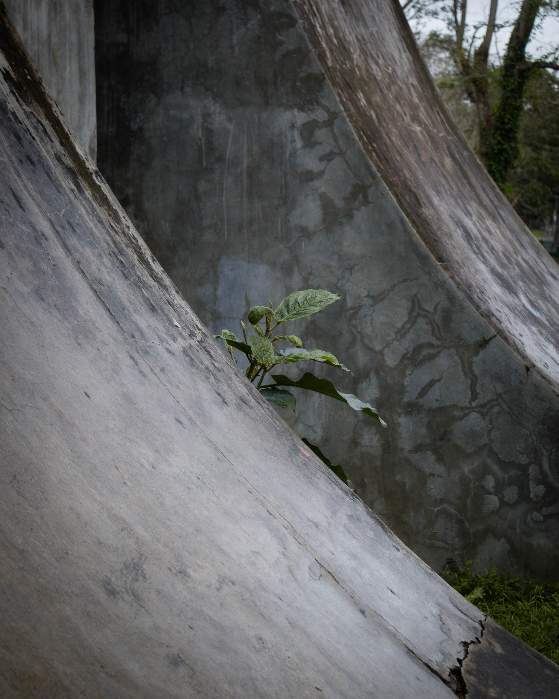
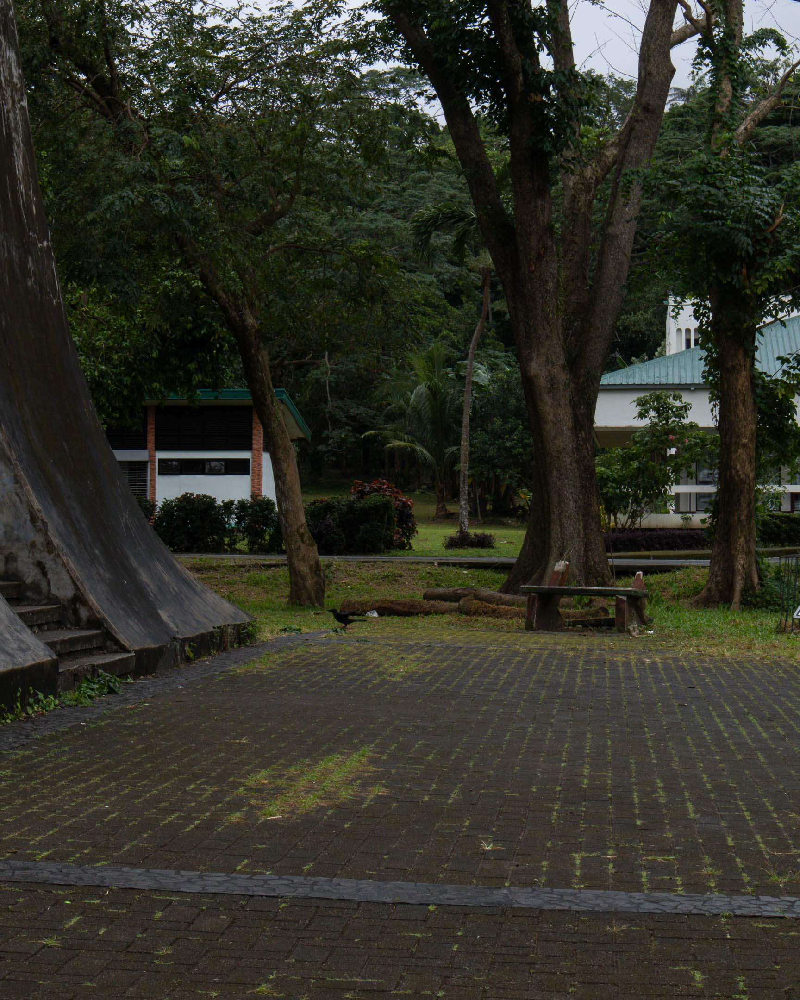
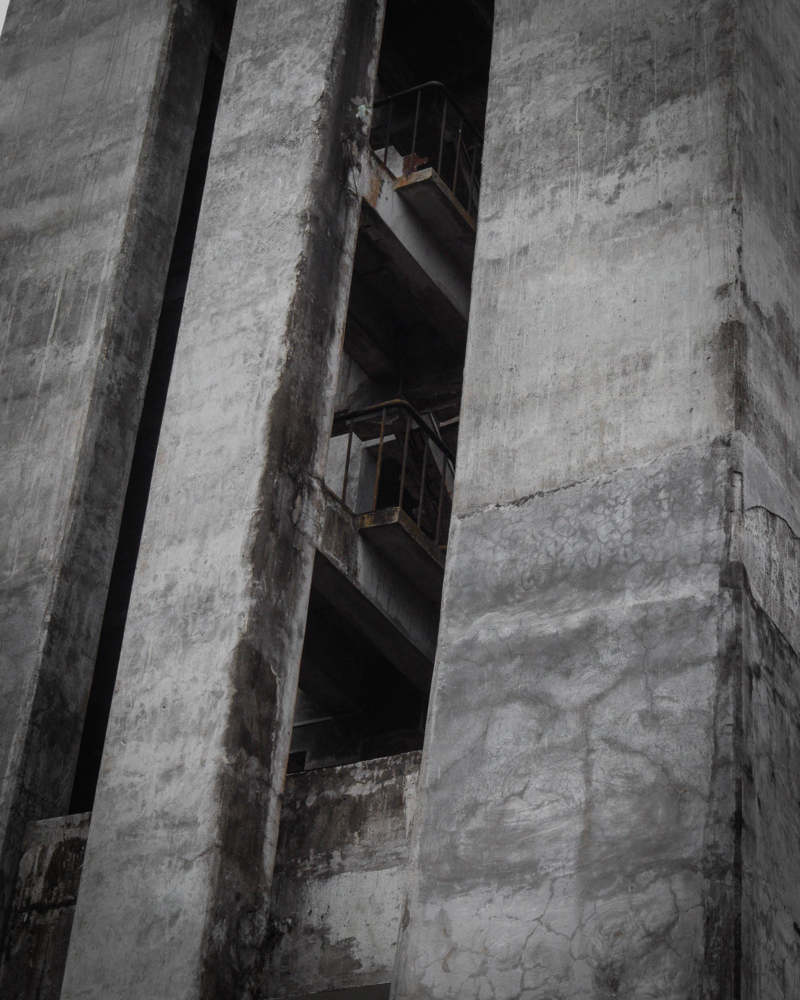

I realized I'd never counted these trees before.  
I count them now. Twenty-nine.  
As far as my eyes could see.

Silence exists in time, not space.  
I go here and it's usually vibrant.  
Today, I can hear nothing but its full honesty.

Nowhere else to go,  
I sat there.  
Watched him blow those leaves away.
