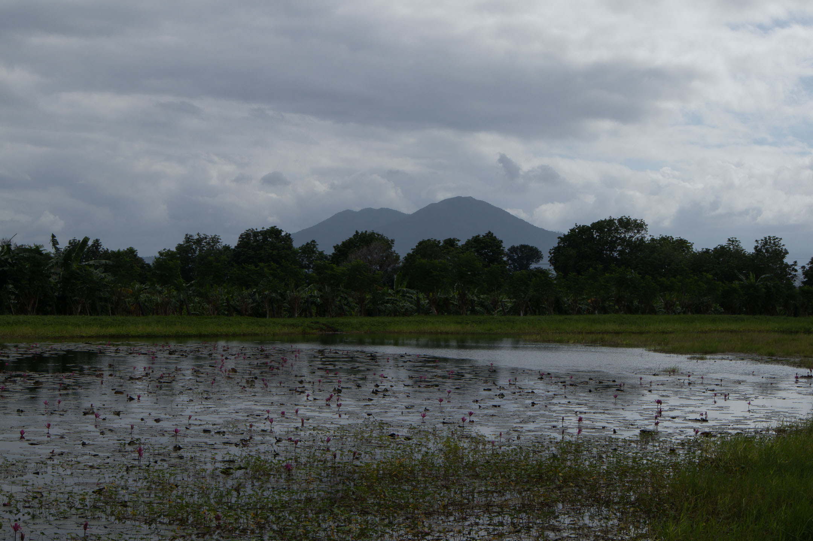
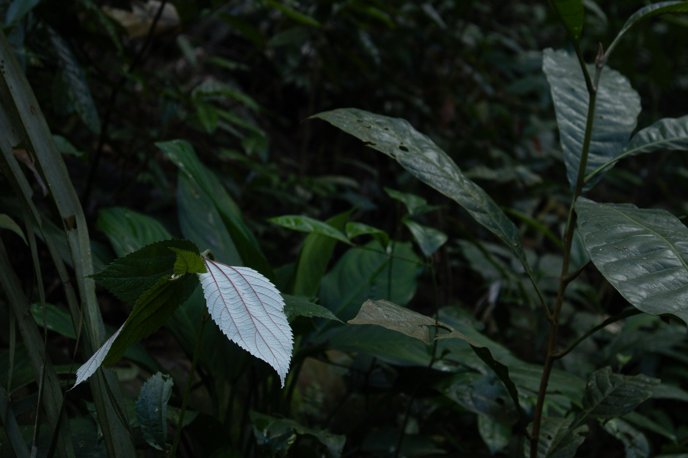

Dear friends,

_but Overall is beyond me_ (bOibm) is done.

This is a short email I'm writing to wrap up the project before I delete this email list.

## Thank you

First, I want to thank all of you who joined me, through this _still_ intimate online space we call email, while I walked all six walks I did from January 25 to 31, 2025. It was the first time I invited readers to sign up on a separate temporary email list (what the Japan-based walker and writer [Craig Mod](https://craigmod.com/) calls a "pop-up newsletter") to follow the walk. My main intention for doing so is to avoid sending daily emails to people who would rather not receive them. I'm very much aware of the amount of email clutter people receive, and I don't want to add more to these. However, I also realized that doing this makes my walk truly more rewarding as I know from the get-go that I'm only sending the missive to individuals who truly care about the project. Many other readers did follow along through social media, but those of you who read my emails have a special place in my heart. You were enough to motivate me to process, prepare, and send those emails every day after the walks (despite the fatigue).

For those of you who signed up late and who didn't receive the earlier emails, I'm happy to say that all the daily missives I sent during bOibm are now uploaded to my website and can be accessed on this [link](https://vinceimbat.com/boibm/). I encourage you to visit the link and look at any issue you missed.

## The Routes

Also, some of you might wonder where exactly did the walks happen. In case, at an unforeseen time in the future, any of you would like to follow the walks yourself, I'm sharing the routes here. These are the last silent spaces in Los Baños, a rapidly industrializing suburb in between the legendary Mt. Makiling and the largest lake in the Philippines, Laguna de Bay.

Day 1: Aranas route to Flat Rocks
- The Aranas water intake is an old structure that supplied water coming from Mt. Makiling to the upper areas of the University of the Philippines Los Baños during the 1920s. The trail is marked by really old and broken concrete water pipes. However, the trail was recently destroyed by the deluge of storms that devasted Southern Luzon during the last quarter of 2024. Because of this, I was lost during the walk and was forced to return without reaching Flat Rocks.

Day 2: "Nasa Labas ang Ili" (NLAI) route
- This is the route where I brought two groups of walkers back in 2023 for a walking meditation on self, _kapwa_, and place. I decided to rewalk to the route as it still is one of the best routes in Los Baños. The walk combines walking on a sidewalk of the university, a community of informal settlers, footpaths between farm lots, and a vacant concrete road dedicated to walkers and bikers. It also features one of the best views of Mt. Makiling.

Day 3: Batis route
- This route leads one to a closed road that lies alongside a creek of the Molawin River, the main tributary of Laguna de Bay. The old name of the road was Caimito (Star Apple) but is now named after Jose Drilon Jr. Friends who discovered this route call it _Batis_ (spring). It is one of the most accessible routes to the Molawin River, where locals also do their fishing when the water is high. The road has been closed since before the pandemic, but the university has invested in improving it in recent years, leading us to think it might open up for vehicles soon.

Day 4: Rest day

Day 5: Makiling Botanic Gardens
- The route around the Makiling Botanic Gardens (MBG) gives one a taste of what hiking Mt. Makiling might entail. While the majority of the route features "artificial" forests curated by the management, about a third is a natural forest that visitors seldom enter. I walked under those trees there for the first time in my four years in LB and I would say it is one of the best walks I've ever done. There were lots of trees, lots of terrain to hike, and lots of birds singing. A huge portion of that walk consisted of one of the longest stretches of silence I've ever listened to in a long time.

Day 6: Freedom Park
- While not the most silent of places, I still think Freedom Park is one the most accessible places for people to connect to themselves, their neighbors, and nature in Los Baños. When one is fortunate enough to walk here during the early morning when students haven't yet arrived or during vacation days when there are very few around campus, one can hear the place's full honesty. About half of Freedom Park served as a prison camp for Americans and Europeans captured by Japanese soldiers during World War II. Thousands died from hunger on its grounds. Later, when the remaining prisoners were liberated by American forces, the Japanese killed hundreds of Filipino locals of Los Baños in response. I'm always mindful of this history whenever I walk here.

Day 7: Mariang Makiling Trail (MMT)
- On the last day of the week-long walk, I walked four stations of the MMT under some heavy rain and strong wind. I felt the need to stop the walk after coming on a large tree that tumbled down in the middle of the road due to a landslide that may have happened during one of the strong typhoons that came into the area last year. The MMT leads to two peaks of Mt. Makiling, a hike that would require about eight hours (climbing and returning) by foot. Like the other mountains in Southern Luzon, Mt. Makiling's terrain has given birth to tens (hundreds?) of stories that syncretize ancient Tagalog anitism with Catholic and European beliefs.

While I'm closing this project, I'll still be writing a few of my reflections about the process of doing this walk on an upcoming issue of [Uman](uman). Now that a second walk of Los Baños has been done, I also feel ever more confident to begin a long-postponed work of writing a book about walking here. As I see it now, the book ought to braid two narratives: (1) a narrative of befriending a place (Los Baños) through walking and (2) a narrative of conversion into a creative, inquiring, free, and liberative spirituality or _jiyū shūkyō_. To write these two narratives, I will have to return to earlier journal entries, do some research, and piece my findings together. I'll also be working with a friend who practices both mindful photography and biography work to help me write these narratives as honestly as I can through text and photos. All of these will be enough to keep me busy this February.

That's all from me for now.

Again, thank you for walking with me during bOibm, and I hope to walk with you again in the next months or so.

## Acknowledgements

The name of this walk "but Overall is beyond me" as well as the titles of each missive come from the poem [Corsons Inlet](https://www.poetryfoundation.org/poems/43073/corsons-inlet) by A. R. Ammons. Hat tip to [Andrew James Brown](https://andrewjbrown.blogspot.com/) who first introduced me to this poem.

