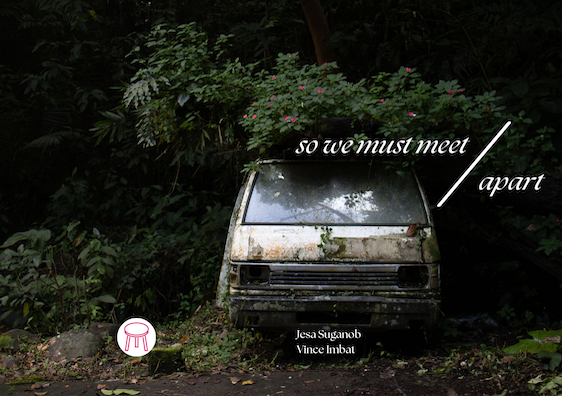

## so we must meet apart

[Purchase a digita copy.](https://vinceimbat.gumroad.com/l/apart)

Inspired by Gabrielle Bates and Jennifer S. Cheng's collaborative work of the same name, this experimental project delves into the poetics of walking and writing from the perspective of different genders. The walks were conducted around Los Baños and Cagayan de Oro.

***

_**so we must meet apart**_ is my first zine and collaboration with Cagayan de Oro-based writer [Jesa Suganob](https://flammablematerials.substack.com/). The zine was an experimental project that used walking as a method and platform for writing epistolary essays. The process was simple: Jesa walked around Cagayan de Oro City while I walked around Los Baños. During or after each walk, we wrote letters to each other. We sent and read each other's letters only after the experiment ended. We then processed everything through a written dialogue, which became an afterword.

The experiment was surprisingly demanding. The letters crawled into diverse subjects—body, gender, religion, mental health, grief, poetry—and bordered into confessions. If you are a fan of epistolary essays, you will love this work.

Jesa laid out a few of my Los Baños photographs at critical intervals in the zine alongside a typography that is easy on the eye. It's pretty. I love what Jesa and I made!

The zine was published under [Bangkô](https://www.facebook.com/bangko.collective).

Limited print copies were first sold at the Better Living Through Xeroxography (BLTX) event at Sikat Studio, Tomas Morato, Quezon City, last August 3, 2024. The zine is now out of print, but you can [purchase a digital copy via Gumroad.](https://vinceimbat.gumroad.com/l/apart)