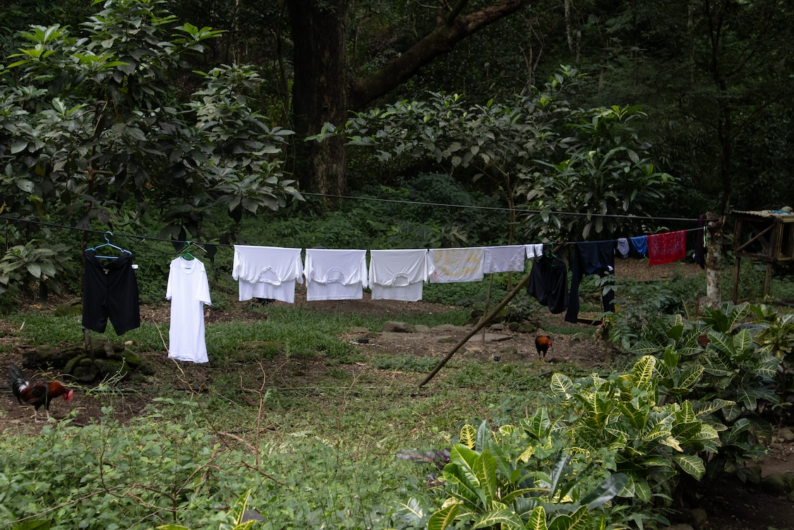
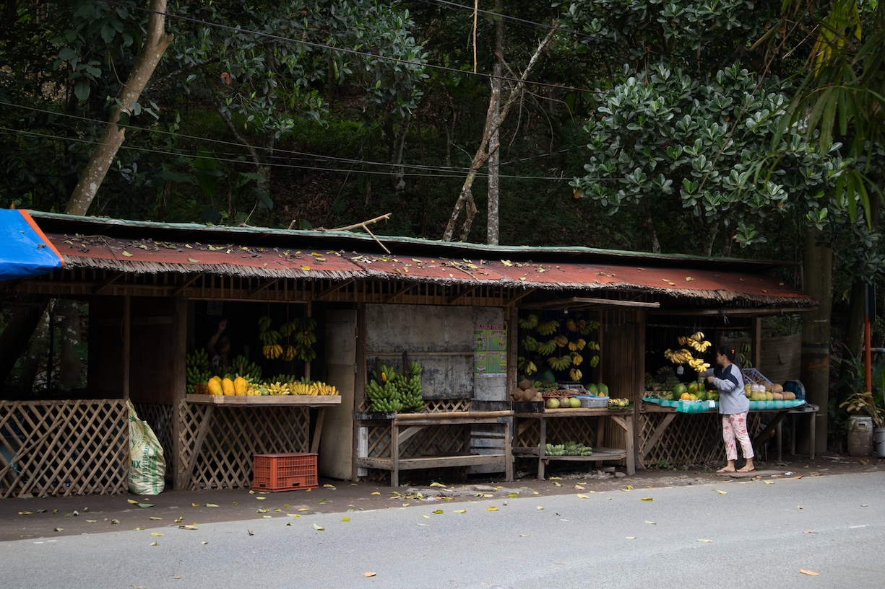
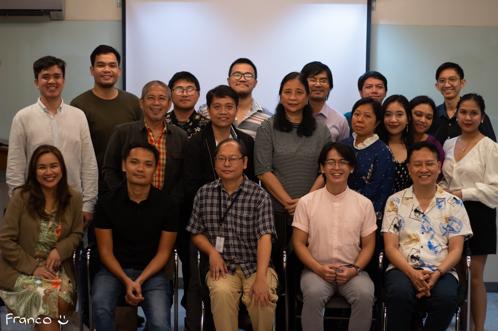
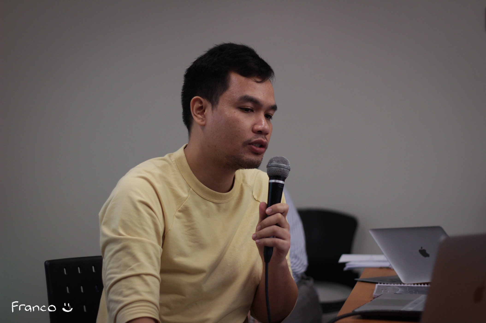
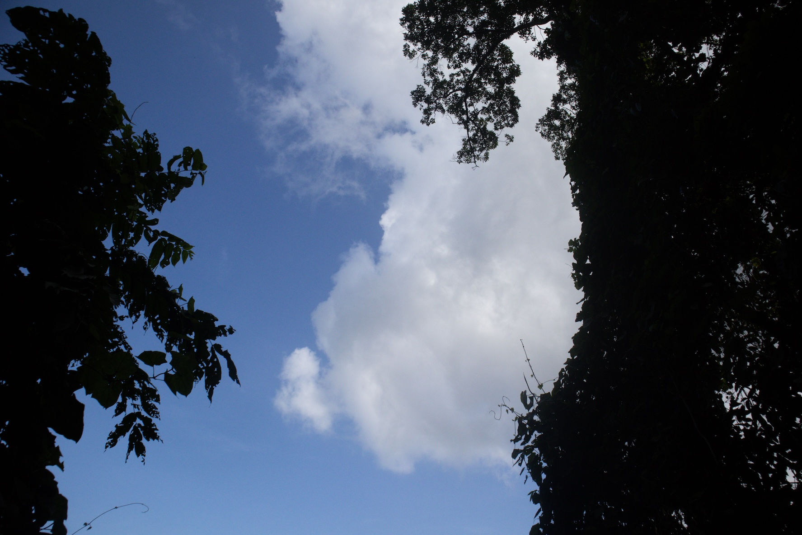
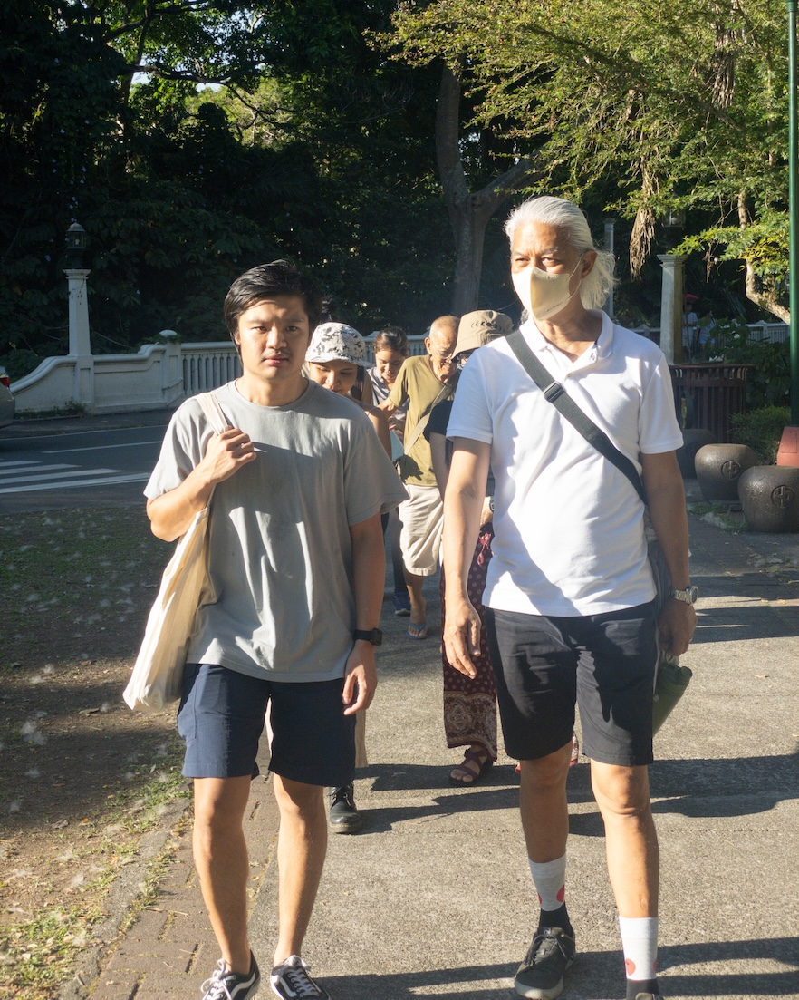
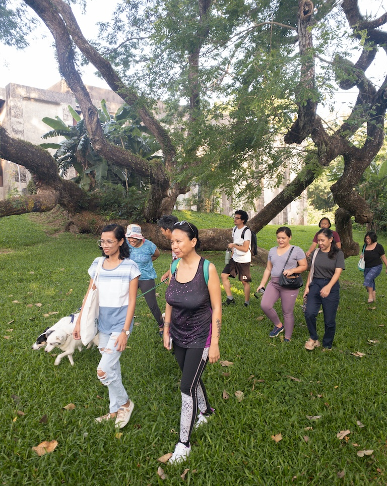
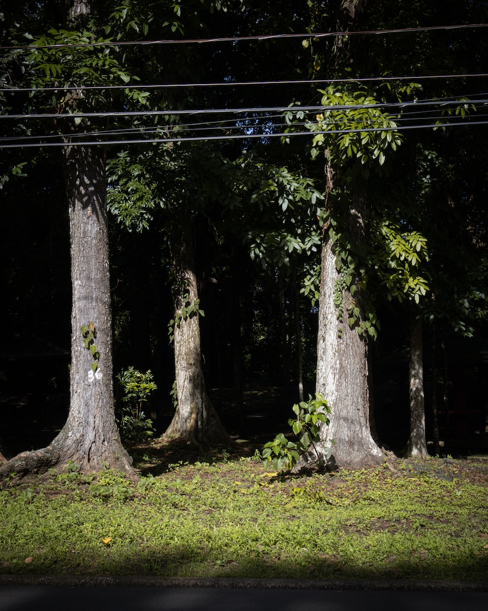

Before 2023 began, I was caught between the outcomes of two challenging, unexpected events: the loss of a significant person and a primary source of income.

The first came earlier. In October 2022, the Batangueño poet, facilitator, and fellow pathfinder, [Rem Tanauan](https://hanggangsamuli.culturalcenter.gov.ph/obituaries/ryan-rem-tanauan/), who I'm honored to call my dearest friend, died in his sleep at the age of 40, a week after spending a night with me at the launch of *Saglit* (A Moment), the latest book of the Philippines' foremost spiritual poet, Rofel Brion.

A few weeks after Rem died, I received an email from the agency that has become my main source of freelance editing projects for the past three years informing me that I was cut from their roster of contractors. As a creative writer relying heavily on freelance editing projects to support myself and my artistic pursuits, receiving this email was undeniably painful. I had to drop all my other projects to focus on looking for work. It also meant that processing my grief for losing Rem had to wait.

This is the backdrop from which I began 2023. I entered the year thinking it would be the least creative and most boring of all my years. I was prepared to focus solely on making money and survival.

Oh, how wrong I was.
***
This is my 2023 annual review. While preparing it, I was surprised to learn that I've been writing [[annual review article|annual reviews]] for almost a decade. It's a practice I learned from the earliest bloggers that stuck with me through the years. I see each annual review [[cairns to mark the journey|as a cairn that marks a certain point in my long walk]]. Once in a while, when I'm feeling down or lost, I return to these cairns to see how much I've covered and how far I've come. These revisits often boost my confidence in my choices and the path I'm currently treading.

In the past couple of years, I've tried to experiment with the format of these reviews. [[2022 annual review|Last year]], I returned to a recap of each month of 2022. For my 2023 annual review, I'll share the most important events of my year and some lessons I learned along the way.
***
## Live Simple, Trust Others

Tackling the loss of a major source of income in 2023 taught me two important lessons. First:

>If you want to do important work, which isn't immediately profitable, and you face some employment hurdles **live as frugally as you can**.

It's not like I don't know this already. I grew up in a household with minimal means and a religion that preaches radical simplicity. I've embraced this radical simplicity and kept it as my own even after I left home and my childhood religion.

But I've never viscerally felt the wisdom of simple living until confronted an employment challenge when inflation was at an all-time high and the economy wasn't doing well. I was surprised to see how many expenses I could cut to live even more simply without feeling deprived. Without losing that source of income, I wouldn't realize how much more money I could save and how much more time I could keep for the more important things in life. With this, I'm grateful.

Second:

> If you're looking for work, the best place to search is your own existing network (i.e., friends, acquaintances, and previous employers).

This, of course, is not a secret. Almost all sound career advice books or articles will say this, and it is true. Looking for new clients through people who don't know and trust you is tough. The day after receiving the severance email, I jumped into applying at other editing agencies. I did this for the entire month of January 2023. None of it worked.

What saved me was a positive response to an email inquiry I sent to a previous boss. That kind human being offered me two editing projects that got me through the first three months of the year. When that ended, a research writing project referred by a friend, which I closed with some luck and hard work, got me going for another month. And when that ended, two friends with small businesses hired me to design and develop [their](https://ililikhaan.com/) [websites](https://candent.ph/). These two projects sustained me for more than half of the year.

These gigs kept me afloat until I started receiving a consistent flow of editing projects from my previous boss in the last quarter of the year. This financial stability allowed me to return to my studies, creative projects, and grief.

## Contentment Through Faith

I burned the first three months of the year just doing freelance work. I was surviving, but my soul was beginning to suffer. I wasn't reading at all. I wrote very little in my journals. I didn't publish a single newsletter. I didn't touch my camera. Only my daily evening walks reminded me that I'm called to do something other than ensure that I feed myself.

The Ateneo Institute of Literary Arts and Practices (AILAP) released a call for submissions for its [[anww20|20th Ateneo National Writer's Workshop (ANWW20)]] earlier in 2023. AILAP was particularly interested in essays that combined academic writing with literary, creative, and poetic writing. The deadline for submissions was April 1, 2023.

That date was at the back of my mind as I was wrapping up the last draft of a freelance writing project. I consider the essay, specifically the personal narrative essay, as my main creative writing form, and I was interested in how I could combine research and literary writing in my work, so attending AILAP's workshop made a lot of sense.

However, I only finished writing the client's paper ten days before AILAP's deadline. My brain was already fried from all the research and writing I had done for the past three weeks, so I doubted whether I could write anything worth sending to AILAP.

I was ready to let it go, but the fear of regret was too much to bear. The fact that I had just managed to write a paper for a client in just ten days was also staring me in the face. If I could do it, what's another ten days of writing? So, I decided to give it a shot. I told myself, whatever comes out of me in ten days, I'll send it to AILAP.

I got right to work. I decided to write about something I already know and incorporate writings I already have in my journals and website. The topic was easy: I will write about walking, specifically [[uman 2022-06|the long walk I did from Los Baños to San Pablo City]] in June 2022. I will explore the questions that that walk provoked, namely, "Why was I walking?" and mine my journals for answers.

Since AILAP requires work that uses a theory, I looked for something in the literature and discovered autoethnography. I used autoethnography to talk about walking, how walking can be used as an alternative method for research, particularly researching oneself, and how all of these tie up to me leaving my childhood religion and using walking to cope with it.

One evening, while walking around the buildings of the Department of Forestry in the University of the Philippines Los Baños (UPLB) and thinking about the outline of the essay I'll write, I caught myself using the word "faith" to describe what I'm doing. To pursue a creative project due in ten days after three weeks of working for money at a time when my financial security is still questionable, I told myself, is an act of faith. "Faith" is one of several words (including God, spiritual, and religious) that I've tried to avoid since leaving the Jehovah's Witnesses in 2012. Now, like my religious past, I'm forced to confront this word, question my aversion to it, and think of the possibility of reintegrating it into my daily language.

On April 1, with much faith, I managed to put together [[traversing liminality through walking|a five-thousand-word entry]], which I happily sent to AILAP. About three weeks later, I received an email from AILAP telling me that my entry landed me a seat as a fellow at the ANWW20, where I was joined by seven other young writers from different parts of the Philippines in three days of intense workshop.

ANWW20 is the most crucial event that defined my creative writing practice in 2023. It allowed me to have a glimpse of the Filipino literary community, learn about genres and subjects that remain unexplored in Filipino literature (two of which I know I could fill: nature writing and spiritual writing), and receive feedback on my writing from seasoned and published Filipino authors. Perhaps, more importantly, it allowed me to finally confront my past as an ex-JW minister through creative writing and share my story through a thirty-minute presentation in front of a group of strangers, a feat that by itself took a lot of courage and faith.

Three months later, as if once isn't enough, I re-encountered the word faith albeit in a more direct intellectual manner. This encounter came through the meditation timer I use.

Before the first practice of the day begins, the timer launches a question: "How are you feeling?" Below the question are several smileys for an answer. When I'm feeling okay, I tap on the smiling smiley. After I do this, a second screen appears, asking for reasons behind the answer (e.g., relationship, health, finances, etc.) and more specific words to describe my state of mind. One of the words available to tap is the word "content." Since 2023 started, I have never tapped this word. I reasoned that I was in the middle of fixing many things in my life, so how could I be content?

That month, I was reading the essay "Presence, Memory, and Faith" by Steven E. Webb from *Wilderness and the Heart*, a book about [[henry bugbee|Henry Bugbee's]] philosophy. In that essay, Steven discusses how Bugbee connected fishing with faith.

>Fishing stands for the life of faith, and the leaping fish stands for those exclamatory experiences—perceptual, mnemonic, or both—that may supervene upon that life. Apart from our active commitment to what the river may bestow, we would never cast our lines and the fish would never leap. This does not mean that the fish must leap. We can't control their presence, and if we seek for control we shall reduce our lives to continual frustration. Faith, like fishing, has the somewhat oxymoronic character of active waiting—of *keeping* oneself open to whatever may come. Thus wanting a saving experience at the end of one's days not only indicates an unwholesome fixation on something one can't finally possess, but is quite beside the point. The issue is not the availability or durability of such experiences as isolated moments, but rather what they confirm, if and when they do occur, about the "omnirelevant truth"—affirmed and kept in faith—that our world *is* a holy place, that things *are* worthy of love, and that our life together with them *is* affirmable even in our moments of obscurity, and even as we perish.

Reflecting on these words, I realized I could find contentment in every moment, regardless of the situation, even when things aren't okay. I could do this by believing that things will turn out fine eventually or that there are good things in the world, even if my present situation isn't something I want. In other words, contentment is always a choice. I can be contented no matter the situation as long as I have faith in [[a goodness lurking|the goodness lurking]] behind everything.
***
## Ask for Help, Be Surprised

I've always found it difficult to ask for help. Asking for help involves trusting others, and that, too, is quite consistently a challenge for me. Perhaps this is something I learned growing up in a family where both parents didn't check on their children as often as they should've. This tendency to be overly self-reliant and skeptical of other people's help was exacerbated by my decision to leave my childhood religion. Awakening to the possibility that I may have wasted a quarter of my life in an organization that has manipulated and perhaps even abused me further reduced whatever level of trust I have in institutions and strangers. I've resisted being mentored or taught directly by anyone for years, and the right archetypes haven't really appeared.

I would later learn that self-reliance can only get one so far. We will always be interconnected with others, so whether we like it or not, we will always need their help. I experienced this immediately while looking for work in 2023. But this lesson became ever more true in two other areas of my life: art and spirituality.
***
Since it was my first writers' workshop on a national scale, I feared that my lack of formal training would prevent me from participating effectively in the discussions at the ANWW20. After receiving news of my acceptance, I immediately contacted several friends and acquaintances who are already seasoned writers or have previously attended similar workshops. They all returned my messages promptly and were willing and excited to share their expertise and experiences. Three of these friends, in particular, provided detailed and practical advice that calmed my nerves and helped me focus on my most important job in the workshop: to be myself.

All of them told me to relax, enjoy the workshop, and trust that my co-fellows and the panelists would all be mature enough to show me mutual respect and give me what I need to improve as a writer. One of them told me I just had to be myself, do what I was already doing, and contribute to making the workshop safe for me and my fellow participants. Everything they said came true. All my co-fellows and panelists were kind and helpful in giving comments and criticisms. Everyone sought to create a safe space for all of us budding writers. Without these friends' encouragement and practical advice, I don't think I would've taken full advantage of a rare opportunity such as the ANWW20.
***
A day before the workshop, I met with [Louise Far](https://www.instagram.com/luwizowie/), whom I met a few months ago over a dinner with friends at Los Baños. Louise is a biography worker who also practices contemplative photography.

During our initial dinner, I told Louise about my desire to write a book about my walks in Los Baños and how I wanted to include photographs. I told her that I recently lost my primary source of income, which made it challenging to start the project. She then shared how she faced similar hurdles while creating *[[inahan sa sugilanon far|Inahan sa Sugilanon]]*, her photobook about her years of stay in a Steiner-inspired green school community in Davao City, Mindanao. Finishing that project, she said, required leaps of faith that provided her with opportunities to experience kindness and grace from others.

That initial conversation made a mark on me, and I liked how Louise approached photography, so I asked if we could meet before my workshop at Ateneo. She generously accepted my invitation and gave me an entire afternoon where she shared more details about her story and specific advice on how I could show up more authentically during the workshop. That conversation and the advice I received from my friends earlier got me through a challenging three days. Since then, I've always seen Louise as an archetype for my photography and the creative and spiritual life I'm trying to walk.
***
I should've already known that the walk would change something in me like walks often do, and yet I walked Magsaysay Ave. in Baguio City in October 2023, expecting nothing other than finding that highly rated Middle Eastern restaurant. I got home that afternoon feeling down and filled with doubts about the path I'd chosen. Worse, I felt inadequate compared to what I could've been had I never left, had I stayed more than ten years ago in Baguio city, still walking the same streets as a JW minister to people who are deaf or hard of hearing. I was surprised by what an innocent walk could do to my psyche. I realized that a decade of burying my past hasn't worked for me. Avoidance and fear, partners I thought I could consistently rely on, have now shown their true colors.

The sadness I felt persisted even after I left Baguio. I feared that another bout of depression would come. I started to worry. That was when I knew I could no longer bear the burden of the past alone. That was when I knew I could no longer live the life of a solitary walker, walking the long and never-ending spiritual wilderness with no signs of reprieve. That was when I knew I needed help.

Ask and you shall receive. Reprieve finally came in the person of [Andrew James Brown](https://andrewjbrown.blogspot.com/), the non-theist Unitarian minister of a small, liberal, and free religious community in Cambridge, United Kingdom. I've written about Andrew many times in my writings in 2023, and even I feel like I've been repetitive. But this untiring mention his influence on me at this point in my life illustrates how much I love and appreciate his work.

Since reaching out to Andrew in October 2023 and continuously working with him, I've started a new daily spiritual practice (seiza), which I continue to deepen through the assistance of a similarly unique and gentle human being, [Miki Nakura](https://higashihonganjiusa.org/). I'm now more comfortable using the words I once avoided, such as faith, spirituality, and religion. I've learned to own these words and customize their meanings to fit how I want to use them in my life. I'm also excited more than ever to explore and express my individual, unique kind of spirituality. I'm also more open to exploring practicing spirituality around others, perhaps even in a supporting community, with people like Andrew.

More importantly, I'm braver now. I feel like there is nothing to run away from, nothing to bury under the ground, just things to go toward. What I'm feeling now as I'm writing these words is the exact opposite of what I felt three months ago after walking in Baguio City, and this is the reason why I've decided to schedule a week-long walk of Baguio this January to intentionally confront my past finally by walking the streets where all of it happened after more than a decade later.

***
## Just Take the Next Step

If it isn't clear by now, the biggest theme of my 2023 was [[faith]]. That word, which I've tried so hard to erase from my psyche, is exactly what I had to relearn multiple times this year.

In one of his [articles](https://andrewjbrown.blogspot.com/2023/07/on-need-for-liberals-to-recover-their.html), Andrew likened faith to simply taking the next step. Using a scene from an Indiana Jones film, which I can no longer forget, Andrew explains why faith is essential even among liberal individuals.

>...within liberal social, political and religious circles we have increasingly been losing the ability to make **_any_** kind of leap of faith. Faith has for us become almost entirely replaced by a reliance on positive knowledge and technology which, alas, has also helped create the dream that, somehow, all danger of injury can be removed from the world. In consequence, we have become pathologically risk-averse and cannot move forward because we are caught in a loop of looking and looking and looking, again and again and again. All this looking **IS** fine, of course, when the looking really can provide us with useful information about the best way to proceed, but what about those situations, those existential situations, when no further looking can deliver the answer we need if we are to continue living well and with genuine hope?

Andrew concludes

>...although we can (and at times we will all) look "if we like" to try to discern the difficulties and dangers ahead before we leap, there will always-already come those times when we "will have to leap" without knowing what comes next because what comes next cannot be known beforehand.

This leaping, this taking the next step, resonates with me well because of my undeniable love of walking. In my life, walking has evolved from being a mode of evangelization to becoming a means for contemplation and, later, a platform for creation. In recent years, walking has also become a metaphor, which I've used to make sense of other pursuits, such as studying or reading, and even life itself (i.e., [[thoughts/the long walk|the long walk]]). Using walking language (e.g., "take the next step" or "leap") to help me re-learn faith has been excellent. Every time I take a walk these days, I can't help but see it as a practice of faith—faith that as long as I remain true to myself, I'll be alright; faith that despite the myriad of reasons and pressure to hurt me, my fellow human beings will show me kindness; and faith that behind all the suffering in the world is the potential for compassion to flourish.

In April 2023, through the invitation of [Ili Likhaan](https://www.instagram.com/ili.likhaan/), a small art business run by a good friend, I had the privilege of leading two groups of remarkable individuals in a guided, structured walk along a route inside UPLB, which I found during one of my afternoon walks. I called the walks [[thoughts/nasa labas ang ili|Nasa Labas ang Ili]] (NLAI, "Home is Outdoors") and did one before sunset (Dapit-hapon) and after sunrise (Bukang-liwayway) on different days. Conducting the NLAI walks was a walk of faith because  my walks had largely been solitary before this. After using walks to grieve and to find myself after leaving my childhood religion, I've become a firm believer in the power of walking to transform individuals "alone," and perhaps because of this, I doubted whether walking with others could have a similar effect. If any, walking with others might hinder an individual's pursuit of listening to oneself.

Of course, after taking a leap of faith, I saw that my initial fears were unfounded. I divided the walk into three segments. Each segment was an opportunity for each of the walkers to focus their attention on one subject. The subjects were *kapwa* (neighbor), *pook* (place), and *sarili* (self). By pairing participants who met for the first time in the first segment, walking was transformed into a communion with neighbors unlike any other I've witnessed. After just a few minutes, walkers who were complete strangers just moments ago were laughing, sharing stories, and listening deeply. One of the participants even told me he doesn't usually loosen up around strangers, let alone reveal stuff about himself the way the walk helped him do.

Cha Domingo, chef, writer, and activist who joined one of these walks, shared her experience.

>In the second part of our walk, we arrived at a field and it was revealed that this time would be used to rest “however that feels like to you.” We sat on the grass, some laid down and took naps, and others took photos. I idled in awkwardness thinking _but I’m not tired yet!_
>
>This is how I came to the realization that I never anticipate or plan for rest in any aspect of my life. As a chef, I was conditioned to operate on the perfectionist premise of leaving no task unfinished. In the kitchen we do as much prep as we can to be able to clock out earlier. The signifier for me to take a break was that I felt tired, and even while on break I couldn’t allow myself to relax because I was preoccupied with the same task I had just stepped away from.
>
>The way that Vince structured our program helped me unlock a new application for rest; how the mere addition of a purposeful break can add depth to any experience. It seems like a shallow observation but often times we’re too caught up in our routines and rely solely on instinct to tell us when to pause. I now understand that tiredness is an indication that I’ve already surpassed my capacity, which is never a good state to foster anything meaningful.

A few weeks before 2023 ended, I once more learned faith through walking. Before 2023 began, I wanted to do at least one week-long walk of Los Baños to take photos of the town and write about it. This is fieldwork, a way to collect data I would later use to write the book about Los Baños I've been telling myself (and my friends) I will write write. Because of the difficulties I mentioned above, I postponed the walk many times in 2023.

By December, I'd started to regain my financial footing and felt better about my spirituality, so I considered doing the walk before the year ended. I set the date: December 4 to 10. I released posters on social media announcing it to people. I wrote and sent email invites to my email list. It was my first time doing a project like this, and I was learning as I went. The biggest challenge came with the weather. Before December 4, Los Baños has experienced daily almost non-stop rains. Weather predictions say the week of the walk won't be different. And yet, I was determined to do the walk. I told myself I've been through so much this year to get to this point where I can walk, write, and photograph for an entire week. I'll do it, I said, rain or shine.

Guess what. December 4 to 10 was one of the driest weeks of Los Baños in 2023. I walked in the mornings, with no rain, and could take several decent photos. I went home by lunch, rested briefly, then wrote in the afternoon. In the evenings, I culled and edited the photos before sending the emails to those following the walk. [Roots x Gravel](rxg1) (what I called the project) is the single thing that I was happiest completing in 2023. Going through all those challenges last year to do the walk made me appreciate its completion even more.

***
Before Rem died, I often wondered how he could radiate so much faith to the world and others. He would often use the words "I surrender" when referring to things beyond his control, then finds peace in trusting that everything will eventually turn out okay no matter what. His faith in others, while still measured, is often brimming, and I feel like he just can't help but greet everyone he meets with a smile and a gesture of complete trust. No wonder his funeral took almost two weeks, and his eulogy took two days to end. So many people wanted to share how they were touched by the kindness and genuine care of this one-of-a-kind human being.

I've always wondered why I couldn't be the same. I asked why I couldn't seem to have the same faith in myself, others, and the world, a faith which my closest friend so effortlessly radiated every day.

After 2023, I feel I'm at least one step closer to understanding faith. If he were still alive today, Rem would've been the first person to know everything about it.