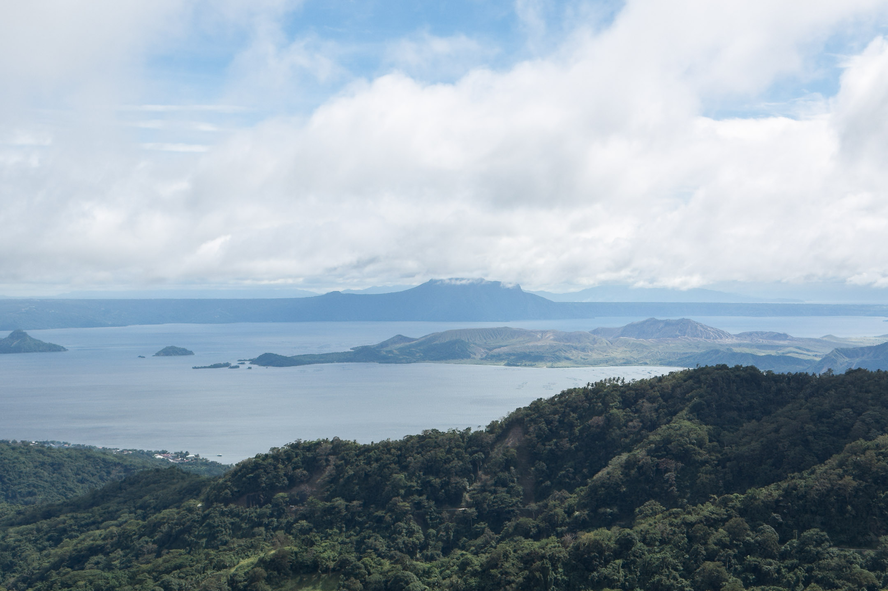
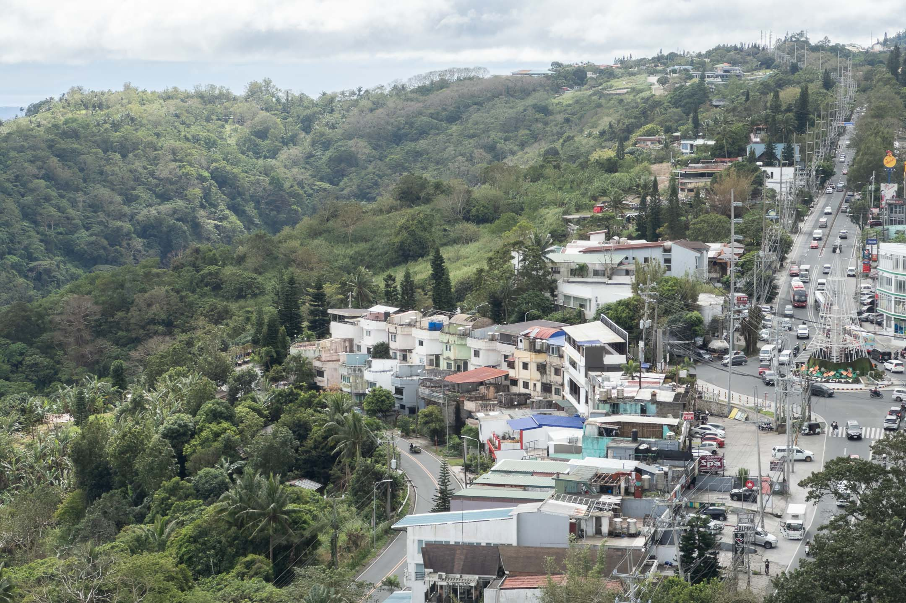

Yesterday, the sun began to show when we started walking out of the lobby. The strong wind was still there. The cold, too. But the rain has stopped, and light has started to get through the thick clouds hovering fast above us.

Not far from where we walked was Mt. Taal, lying perfectly still after a couple of reported minor eruptions, the latest of which happened the night before we came. It was invisible from where we walked. But a couple of days ago, the clouds let us see it as we took a sip from our cacao drinks.

We rented a room for three days. There, we put ourselves into a retreat, hoping to look back at 2024 as closely as we possibly could. This looking closer, we assumed, would tell us what worked in the past year and what we could step on as we enter this new year. While we were looking, we also tried to peek into what this new year has been showing us in its first two weeks, hoping to know what narratives to let go of and what intentions to set.

In this short essay, I hope to share some of the insights that came from that retreat, specifically the highlights of my 2024 and the things I learned from them.

## Tall Tales: Baguio Walk No. 1

Last January 15 to 21, 2024, I went to Baguio City to rewalk some of the routes I used to walk on as a former minister of the Jehovah’s Witnesses. You can read all of my missives from that walk [here](tt1).

In an [essay](tlw/028) introducing the project, I wrote my purpose for doing the walk:

>The decision to revisit these places and, dare I say, “re-own” them is not a rushed decision. It started about two years ago when I began making peace with my past. These days, I continue to ask myself what really happened back then and what I can learn from that seldom-visited time in my life that could enrich my present existence and the path I’m treading. For someone who has tried so hard to forget about certain places and specific periods of his life, to say that this project and everything it represents is necessary for me to continue living is an understatement.

One of the things that surprised me while doing the project was that while I grappled with difficult emotions, what I was most concerned and curious about was the fate of my friends in the congregation I associated with in Baguio. Suddenly, I felt a desire to see them even for just once to know where they’ve been, who among them are still alive, and somehow hope we would all still get along well despite how different we’ve become. This realization strengthened my resolve to meet my neighbors on my walks no matter how different they are from me.

## Where the Sun Warms

A few weeks after the Baguio walk, I started working on an essay that applied Nietzsche’s prognosis for existential illness in making sense of my desire to rewalk the ministerial routes I used to go to as a JW. What I learned from this process was that years after I left my childhood religion, I’m still healing from all of it and to finish my healing process, I need to honestly recognize elements of that past life that still work for me and incorporate their new interpretations into my present life.

You can read that essay [here](tlw/029).

## Kiitsu Kyōkai

[Kiitsu Kyōkai (帰一教會)](https://andrewjbrown.blogspot.com/p/kiitsu-kyokai.html), which literally means “Unity Fellowship” or “Gathering,” is the name of a small group that started congregating via Zoom in February 2024. Among its main aims is to explore and expand the ideas of the Japanese educator and interfaith pioneer Imaoka Shin’ichirō (1881–1988) summed by the term *[jiyū shūkyō](https://andrewjbrown.blogspot.com/p/free-religion.html)*, which can be translated as a “creative, inquiring, free, and liberating religion or spirituality.”

I have joined these Kiitsu Kyōkai meetings (or KK as I now call them) since the British minister [Andrew James Brown](https://andrewjbrown.blogspot.com/p/about-this-blog.html) invited me. Throughout 2024, they gave me a regular space to explore how I might practice my own customized spirituality in the context of a supportive community. Now, almost a year after I started attending the meetings (and I’ll elaborate on this further in an essay I’m writing about KK), I find myself compelled to call Kiitsu Kyōkai my spiritual community—a statement I don’t take lightly because it has been more than a decade since I last felt truly welcome, safe, and most importantly, authentic, in a spiritual community.

Reviewing my past writings during the retreat, I was surprised to discover that I felt a strong resonance with KK right after the second meeting I attended. I remember leaving that meeting feeling encouraged and motivated, which reminded me of similar feelings I had in the past when I attended religious gatherings as a youth.

## Mapa ng Los Baños Patungo Sa'yo (A Map of Los Baños to You)

This is the title of the (draft) poetry collection I sent to the *[Katipunan](https://archium.ateneo.edu/katipunan/)* journal of the Ateneo de Manila University (ADMU) last late 2023 for possible publication in their upcoming [Buhian](https://archium.ateneo.edu/katipunan/vol11/iss2/83/) literary issue. The Buhian issue was looking for literary works written in Filipino that used hybrid forms—forms that challenged or crossed the boundaries of existing traditional genres.

I discovered in 2023 that my writing thrives best in a hybrid form that combines techniques and styles from creative nonfiction, research writing, and poetry. What I sent for Buhian was a collection of drafts of some of my poems written while living here in Los Baños. These drafts are publicly accessible through a digital archive I call *[talahardin](https://talahardin.vinceimbat.com/)*. Using QR codes, I emplaced the poems on specific coordinate points on a partial map of Los Baños.

In the collection’s accompanying essay entitled “Ang Borador Bilang Panitikan ng Paglalakad” (The Draft as Literature of Walking), I explained how my experience of walking lends itself to producing drafts and draft-like materials that can then be captured and maintained through my *talahardin*. As I talked about walking, I also wrote a quick history of walking in the Philippines and presented a brief overview of the country’s existing walking literature. Since the essay is itself hybrid, I shared a bit about my personal history of walking, how it is connected with my complex religious past (mentioning jiyū shūkyō briefly in a footnote!), and how this spurred walking projects while living in Los Baños. To date, this is my first biggest publication and the first time my story of getting out of my childhood religion and exploring a freer, more creative form of spirituality has been shared in a national publication.

My contribution was accepted and the Buhian issue has been published since November 2024, and so my (draft) poetry collection and its accompanying essay can now be accessed online using this [link](https://archium.ateneo.edu/katipunan/vol11/iss2/63/). The work is currently in Filipino, but since I own the copyright of the entire piece, I’m planning on translating it soon and making it more accessible to non-Filipino-speaking readers.

## A Sunday Walk

Another essay I am proud of writing in 2024 is called ["A Sunday Walk."](https://vinceimbat.com/tlw/033/) It is an essay that talks about a practice my partner and I started doing in May 2024. It involved going out on a walk, writing together using a prompt that we prepared, and then sharing what we wrote with each other. We did the practice every Sunday, providing a spiritual practice that we could both do together. As soon as I shared the essay, many of my readers and friends reached out to tell me how they resonated with it. Some of these people are also exploring freer ways of practicing their religious life, but some, I was surprised, were churchgoers. Writing and sharing this essay reaffirmed my intuition that many people a thirsty for a creative, inquiring, free, and liberating religion or spirituality, and this people sometimes include individuals who practice their spirituality in organized institutions.

## Bathala Wala

About the same time I wrote the essay about our Sunday walks, I started feeling an itch to begin dipping my toes back into the waters of a religious subject that I’d avoided for too long. The itch may have been triggered by my conversations with my partner, who expressed her need to gain some measure of clarity on where she stands on the issue of metaphysical teachings she inherited from her childhood religion, teachings such as the existence of hell.

I tried so hard to avoid exploring my past metaphysical beliefs, feeling like these were less important than the work of finding and maintaining spiritual practices that felt right. My conversations with my partner, however, made me realize that metaphysical subjects can be very helpful to many people. One metaphysical subject that I know I could benefit from getting some measure of clarity on to arrive at a current position is the issue of God. In an essay I called ["Bathala Wala,"](https://vinceimbat.com/tlw/035/) literally “Bathala None,” a play on the Filipino expression “Bathala nawa,” which means “May Bathala will it to happen,” I introduced a project to use walking to confront the issue of God’s existence. I’m sad to have to park this project in place of others I did in 2024. But it is definitely a project I want to return to in 2025.

## Walking Studies

One of the intentions I set in 2024 was to deepen my understanding of the walking methodology in literature. I was partially successful in doing so. I got through around half of Vincenz Serrano’s syllabus for the course of walking he teaches at ADMU. Brought by these readings and my reflections on the subject, I published two things that I hope would help fellow Filipinos experimenting with walking:

- A talahardin page on [walking](https://vinceimbat.com/tlw/035/) - This page in my talahardin holds links to my own works and thinking about the subject as well as links to existing literature from other Filipino authors.
- [How to walk the Philippines](https://talahardin.vinceimbat.com/how-to-walk-the-philippines) - Another page in my talahardin, which contains a rough draft of my initial thoughts on some guidelines on how to walk the Philippines given its unique historical, social, and geographical context.

## so we must meet apart

Another project I was excited to finally release in 2024 was my first zine and collaboration with Cagayan de Oro writer [Jesa Suganob](https://flammablematerials.substack.com/). This was a project we started last 2023. Inspired by Gabrielle Bates and Jennifer S. Cheng’s collaborative work of the same name, *[so we must meet apart](https://vinceimbat.com/books/)* was an experimental project that delved into the poetics of walking and writing from the perspective of different genders. The zine is a collection of epistolary essays Jesa and I wrote to each other after walks we did in our respective locales. The letters crawled into diverse subjects—body, gender, religion, mental health, grief, poetry—and bordered into confessions. We released limited print copies at the Better Living Through Xeroxography (BLTX) event at Sikat Studio, Tomas Morato, Quezon City, last August 3, 2024. Readers who were kind enough to tell us their thoughts about it said the work was beautiful and that it kept them company during travels and some difficult days. Since this was my first zine, I had too many insecurities about releasing it, most I was afraid to admit even to Jesa. Hearing all those positive feedback helped me go through releasing the work and letting it go.

While print copies are sold out, you can still [purchase a digital copy via Gumroad](https://vinceimbat.gumroad.com/l/apart).

## Contributions to Pangasinan literature

After publishing my poem Gawat and its translation Tagsalat at [TLDTD](https://tldtd.org/poet/vince-imbat/) and encountering writers writing in my mother tongue who found it, I’ve since faced the dilemma of how much commitment I should give to writing in Pangasinan. I was primarily a writer in English, who somehow could also write in Filipino. To add another language to the mix seemed like too much work. While I doubted the measure of commitment I could give to it, I never lost my desire to contribute to Pangasinan literature, which has seen a scarcity of works produced since the half of the twentieth century.

My commitment to exploring my mother tongue gained a boost after learning about the death of Santiago Villafania, Pangasinan’s most important contemporary writer. In a time dubbed by some as Pangasinan literature’s Period of Silence, Villafania made his voice known and put Pangasinan literature not just on the nation’s map but also on the international literary scene. He died at a relatively early age, leaving the state of Pangasinan literature even more uncertain. While disheartening, his death also solidified the resolve of other Pangasinan writers to continue what he started.

In June 2024, at the Palihang Rogelio Sicat 17, I read my Pangasinan poem Obong (Nest), which received some generous feedback from my co-fellows and panelists. At the culmination of the workshop, several of my co-fellows and I presented a reading of the poem in five Filipino languages. The reading can be watched [here](https://www.facebook.com/100003608274029/videos/319657124413821/) and is still one of the best experiences I've ever had in 2024.

About a month after this, I met my Pangasinan writing colleagues for the very first time in the panel discussion “Pangasinan, Literature, and Nation” held at Urdaneta, Pangasinan. Attending that event and talking to my colleagues further inspired me to deepen my commitment to supporting the Pangasinan writing community’s initiatives. Through video clips taken of that event, several important issues concerning Pangasinan literature were finally brought to light in front of the public, where they received the attention and discussion they deserved.

Attending my first BLTX event also helped me put the plight of Pangasinan literature in a better perspective. Seeing how small-scale publishing could hasten literary production, I thought about using it to spur self-publication of works written in the language, something I tried to articulate in a post called [Muli-muliy Panself-publish ed Pangasinan](https://talahardin.vinceimbat.com/muli-muliy-panself-publish-ed-pangasinan) (Some Thoughts on Self-publishing in Pangasinan).

At the end of 2024, two other opportunities helped me solidify not only my commitment to contributing to Pangasinan literature but also my desire to use this avenue to explore my most important project: developing my own creative, inquiring, free, and liberating spirituality. The essay I sent as an entry to the Gawad Bienvenido Lumbera 2024, a nationwide contest that aims to recognize literary works written in several of the Philippines’ regional languages, was entitled “Ikurit Ko’y Sali-salik ëd Sayan Dalin: Pitoran Akar” (I Will Write My Feet on This Land: Seven Walks), included a narrative about how I grew up walking with my parents to preach about the Bible from house to house. Meanwhile, my poetry collection “Bëltangën Tayo’y Këlpa” (Cut Through This Fog), my entry for the first Gawad F. Sionil Jose, explored my complicated relationship with my father before and after I left the Jehovah’s Witnesses. Both works won in each contest and would soon be published in print.

***

It is nearly evening as I’m wrapping up this annual review article, and I’m here standing at my desk in my room at Los Baños. The sky, which has been gray most of the day, is now turning darker, while the air feels the same. Not far from where I’m standing, I hear someone pounding a hammer on what could only be a piece of wood.

I will always feel grateful for 2024, both for its challenges and rewards. But my eyes are already hovering above visions of the following days, weeks, and months when I return to projects I’ve parked and begin new ones, endeavors that I hope will bring deeper meaning to what almost always feels like fleeting time.

This sentence, then, is the brake, the much-needed pause, the only true anchor to everything real. And while I’m here on this pause, I want to look you in the eye, for longer than usual, and tell you how grateful I am for your time and silent companionship. I hope you stay around this 2025.

