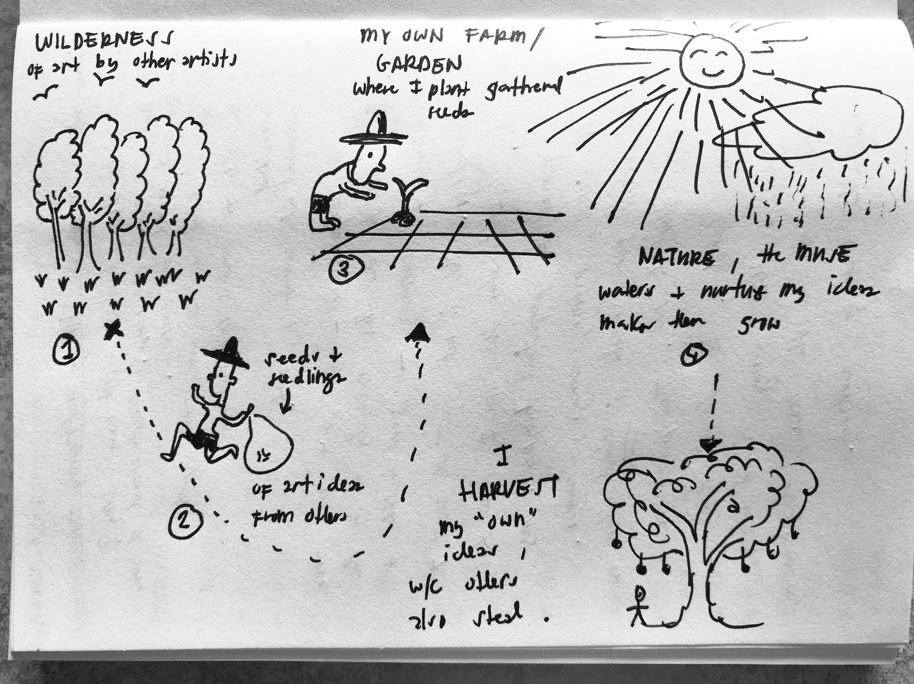

In Henry David Thoreau's 26 September 1859 letter to one of his most avid readers, Harrison Gray Otis Blake, he wrote the following:

> In short, you’ve got to carry on two farms at once,—the farm on the earth and the farm in your mind.

"The farm on the earth" was Thoreau's poetic representation of one's livelihood, one's source of income, while "the farm in your mind" is as it sounds_—_a figurative representation of that place where one's ideas are planted, cultivated, and grown.

Comparing the two farms, Thoreau said,

> It is easy enough to maintain a family, or a state, but it is hard to maintain these children of your brain (or say, rather, these guests that trust to enjoy your hospitality), they make such great demands; and yet, he who does only the former, and loses the power to think originally, or as only he ever can, fails miserably. Keep up the fires of thought, and all will go well.

Aside from comparing his work with farming or gardening, Thoreau has also compared his explorations of the natural world to harvesting. After hearing the sound of flail for several mornings in August 1854, he wrote in his journal:

> It leads me to ask if I have spent as industrious a spring and summer as the farmer, and gathered as rich a crop of experience. If so, the sound of my flail will be heard by those who have ears to hear, separating the kernel from the chaff all the fall and winter, and a sound no less cheering it will be. If the drought has destroyed the corn, let not all harvests fail. Have you commenced to thresh your grain? The lecturer must commence his threshing as early as August, that his fine flour may be ready for his winter customers.

This morning, as I woke up on a chilly morning, as I have been for about a week or so already, gray clouds covering the Cordillera, I felt deep gratitude for my work_—_sitting down, morning after morning, reading a few pages, then writing, drawing, or translating on my journals. I realized that whatever I have now is the most ideal life I could ever have. The work that I do is what I want to do, and it is also the life I want to live.

Like Thoreau, I am a gatherer of perpetual seeds of thoughts from other artists_—_songs, poems, essays, books, drawings, photographs, letters, quotes, movies, scientific findings, philosophical arguments. And then I bring these seeds home to my journals (both digital and analog), where I nurture and cultivate them through revisiting them. By doing so, I become a farmer, a gardener, of the children of my mind, which, in turn, grow into my own ideas_—_or, more accurately, my own rendering of already existing ideas. Sometimes (or most of the time), I can't even take ownership of them for while I plant and cultivate them, it is the Muse, that mysterious part of the brain I prefer to call the Subconscious, which seem to make them grow.

This is what I would like to call, the "Orchard of Ideas". Every artist has one. You put all these orchards together and you basically get the "Wilderness of Ideas", where people could borrow or even steal wild seeds that they can replant and reuse in their own orchards.

Here's a drawing I made this morning to illustrate these ideas:

