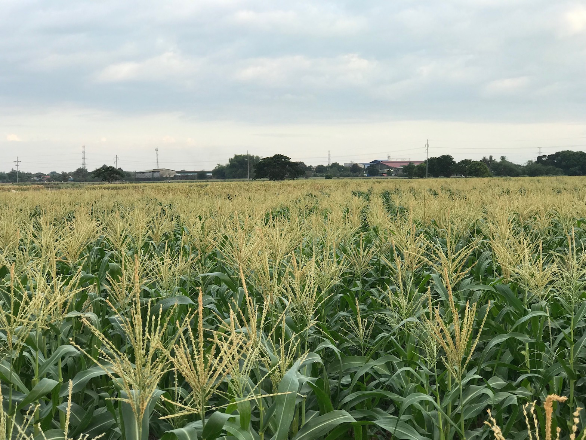
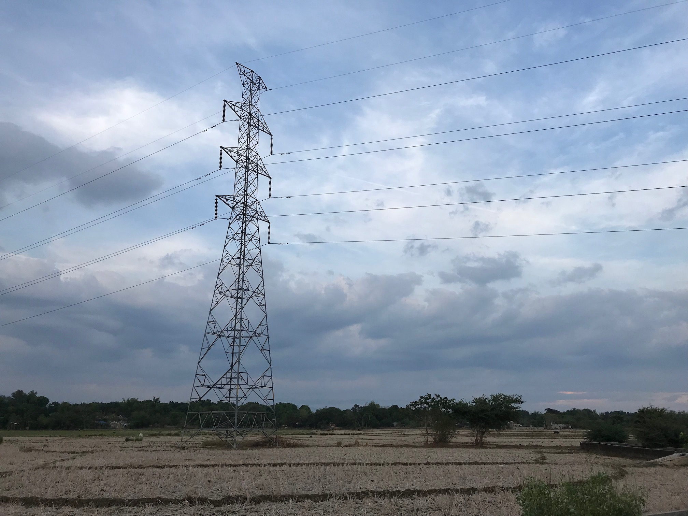
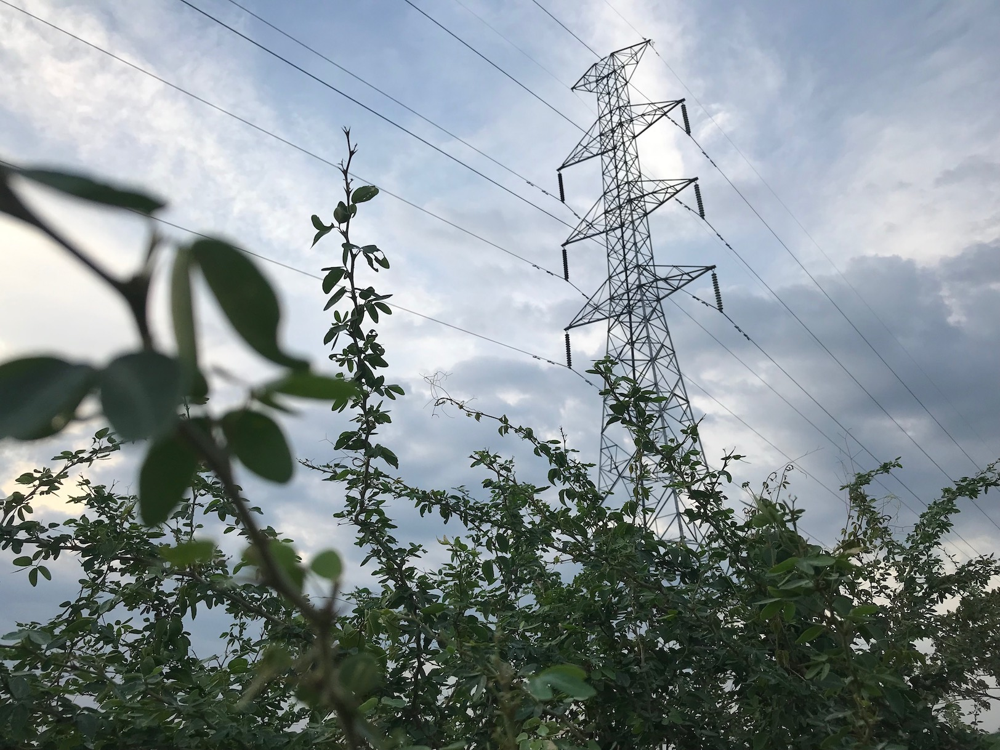
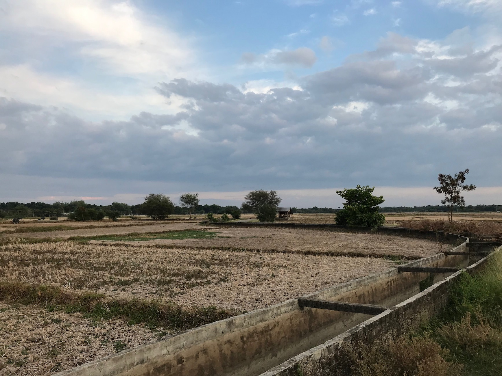
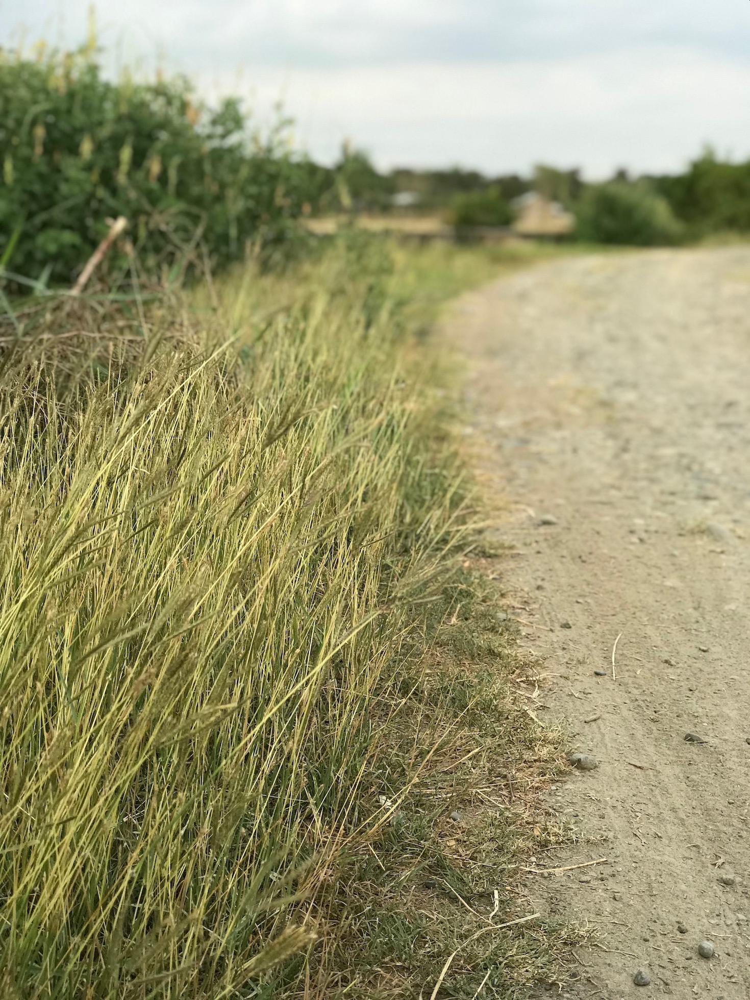
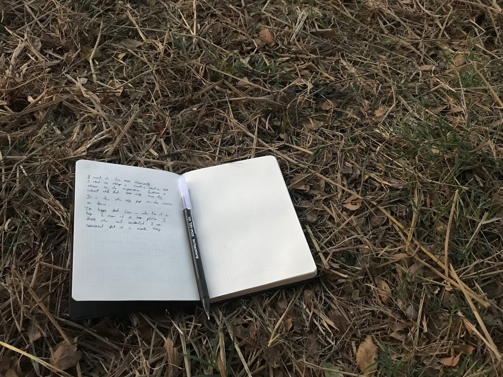
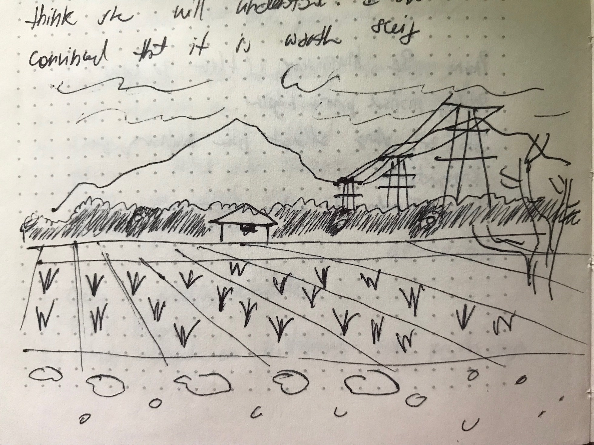

Field notes and pen strapped on my bike carrier

A couple of years ago, I was fascinated by this interview with [James Prosek](https://onbeing.org/programs/james-prosek-fishing-with-mystery/), a nature writer who wrote his first popular book at the age of 19. After listening to his stories, I dug him up on the internet where I found his site. There, I made an even more interesting find, which I will later on use in my own creative process.

James regularly goes out into the wild, in different parts of the world, to find inspiration for his art, writing, and research. He calls these visits ["fieldworks."](https://www.troutsite.com/field.html) He had a few fieldworks on fishes, one on a rare orchid, and another on monarch butterflies. At that time, I was already making daily walks and bike rides around my locale, taking photos of the surroundings and writing notes on my phone. These afternoon escapades where time spaces when I could just commune with nature, my body, and the creative muse. I didn't really gave these everyday adventures a name. Not until I learned about James' fascinating work. Since then, I stole James' language and started calling my afternoon bike rides "fieldworks." Doing so made my daily adventures more interesting.

My creative process while doing my afternoon fieldworks usually involves the following:

1. I ride my bike to a particular spot: a dirt path, a road, a hill, a small piece of forested land, anywhere that is mostly silent and secluded. I do my fieldworks around 5:00 in the afternoon when farmers are making their journeys back home and the nice spots begin to welcome the silent evening.
2. When I reach a nice spot, I begin to walk, towing my bike beside me and stoping to write notes about or take photos of interesting things I see in the environment.
3. When I feel like writing a poem, I sit on the grass or under the tree as I wait for the words and the rhymes to come.
4. While sitting, I take the time to watch the clouds, breathe the fresh air, and just be with the present moment.
5. I usually make the ride home before 7:00 when there is still a few light left in the sky.

Yesterday, after reading this interview with [Austin Kleon](https://extraordinaryroutines.com/austin-kleon/), I decided to add something new to my process: for the first time, I brought a physical notebook and a pen with me in my fieldwork. Before yesterday, it was always just me and my phone.

I really think this small change made a huge difference in my fieldwork yesterday. I noticed that I was more intentional with how I communed with my surroundings. I think this is what really happens when we revamp our creative processes. Creativity is about creation after all, and nothing gets created without "change."

When I reached my spot, I got off my bike and started walking. Then, I took the following photos.

After taking the photos, writing a short note about the terrain, walking, and trying out a new path, I sat down under a favorite tree and wrote on my notebook. No one else was in the field at this time: just me, my notebook, and birdsongs.

After scribbling on my notebook, I drew the terrain in front of me. I haven't drawn for a long time now, so I'm quite proud of my humble sketch. It's the view of the Cordillera ranges from where I sat yesterday.

After finishing the sketch, I closed my notebook, strapped it back on my bike carrier along with the pen, and rode my bike home.

Adventures don't always have to be big to be awesome. They can be as equally rewarding when we do them with full intentionality . . . and when we introduce little changes such as bringing a physical notebook and a pen for the first time.