Last June 28, 2025, while the Pride March was happening at Quezon City here in the Philippines, I was invited by the Global Network of Rainbow Catholics (GNRC) through its Contemplative Spiritual Formation committee to give a talk. Argel Tuason, a new friend and collaborator whom I met just this month, extended the invitation and asked me to talk about jiyū shūkyō, the foundation of the spirituality and religious life I'm building. I decided to share my encounter with it, which is best represented by the three walks I did from 2022 to 2025.

I've provided both the recording of the talk and its text below. The Zoom recording wasn't working, so my partner and I had to hack the recording at the last minute using the built-in screen recording on Mac. Unfortunately, our recording captured my partner blowing her nose and coughing! Haha. Apologies for this. The rainy season in the Philippines means viruses abound. I managed to edit out all of the coughs, but the blowing of the nose is harder as it intersected with my speech. I hope the interruptions don't disturb much of your listening.

---



---

Thank you, Argel, and thank you, everyone, for coming. A big thanks, of course, to the Global Network of Rainbow Catholics, particularly its Contemplative Spiritual Formation committee, for arranging this talk and inviting me.

Since I'll be talking about walking today, I thought I would be amiss not to mention that hundreds of thousands gathered and walked on the streets of Manila a while ago for this year's Pride March here in the Philippines. As you know, this form of communal walking is an integral part of the LGBTQ+ community's history worldwide. In the Philippines, as is around the world, the Pride March serves as a space for safe gender expression and celebration, while also being a form of protest against the continued injustices that the community faces.

As a super fan of walking, I can't help but marvel at how the simple act of moving one foot in front of the other while being together could and has changed societies worldwide. The power of walking, I think, lies in its simplicity and inevitability.

My talk tonight, as the title suggests, is about walking. However, I'll be dedicating the time given to me today to talk about solitary walking and how it has particularly affected me as a religious and spiritual person, like all of you are. I'll be sharing three walks I did in the past four years and share how they led me into my current spiritual partialities and practices.

## The Los Baños–San Pablo Walk (June 2022)

Here is a map of the first walk I'll be sharing tonight.

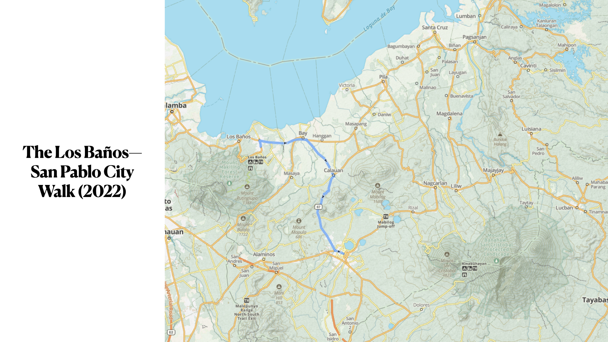

I currently live in a town located two hours away from Manila. It is a town called Los Baños, which is Spanish for "The Baths." The town's name comes from the many hot springs that have drawn tourists from all over the country since the Spanish occupation. Los Baños is sandwiched by the largest lake in the Philippines, the Laguna de Bay, and one of the most legendary dormant volcanoes in the country, Mount Makiling.

On June 9, 2022, a Thursday, I walked more than 22 kilometers (13 miles) from my apartment in Los Baños to San Pablo City, one of the largest and oldest cities in the country. The long walk, signified by the blue track you see on the map, took over 35,000 steps to complete in more than five hours, traversing the Manila South Road and passing by the towns of Bay and Calauan. From Calauan, which was around the geographical midpoint of the walk, the walk suddenly turned into a 10-kilometer hike on a highway with an elevation of 630 feet. I missed this while preparing for the walk, so I was surprised. Had I known, I would've cut some weight off the six kilograms my backpack was holding. It was about 10:30 in the morning when I started making the unexpected climb. By 11:00, the sun was peaking, my back was aching, and I was soaked in sweat.

I'm beginning with this walk because it was in the middle of it that I was overpowered by a question that began a spiritual journey that changed my life in the coming years. Physically and mentally exhausted as it was nearing noon, I stopped on a clearing along a ridgeline and leaned on a lone tree. As I was leaning, I turned my glance to my right, and that was when I saw it—one of the three summits of Mount Banahaw, the active complex volcano of Laguna, often associated with the supernatural. On the map, Mount Banahaw is that dark green mound located at the lower right side corner.

Here is a photo I took of the mountain at that moment.

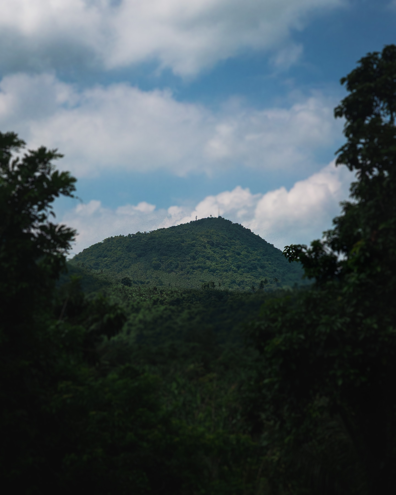

As I stared at Mount Banahaw, I felt like it was watching me. It was then and there when the question came to me: “Why am I walking?"

That first long walk was very significant because weeks after it, I continued to revisit that question: "Why was I walking?" It was a question I realized I didn't really put a lot of thought into before the walk. I have walked almost my entire life and have particularly developed an insatiable appetite for walks, years before that long walk, which inevitably led to it. However, I never really questioned my motivations for walking.

Thinking about my motivations for walking naturally pulled me back to my very first walks, and those very first walks were rooted in the religion of my youth: the Jehovah's Witnesses. As a child, I grew up walking with my father along the remote roads of my hometown, wearing a polo shirt, slacks, and leather shoes, carrying a bag filled with pamphlets and magazines, to go house-to-house, knocking on doors and watching my father talk to people about the Bible.

When I went to college, I began embracing the religion as my own and volunteered for a group in my congregation that visited people with hearing impairments. I learned sign language and joined long treks through hills and mountains to find people we could teach about the Bible. The more I poured myself into the faith, the more I walked. This became even truer when I became a full-time minister and an assistant pastor in charge of creating preaching maps. To create those maps, I had to survey the territories. To survey the territories, I had to walk. I was walking because it was an expression of my faith in Jehovah and his organization.

But this was ten years ago. I'm no longer a Jehovah's Witness. So, why was I still walking?

The physicality and solitariness of the long walk from Los Baños to San Pablo opened something within me that unleashed that question. In turn, that question opened something in me that helped me feel less uncomfortable revisiting my religious past and conversing with it, after many years of avoiding doing so. The long walk from Los Baños to San Pablo helped me entertain the idea that perhaps my insatiable desire to walk is a reclamation of something in my religious past. It underscored the possibility that perhaps I was still very spiritual and religious despite not being affiliated with any religious or spiritual group for over a decade.

However, the long walk also brought forth difficult emotions that made me aware that I was still grieving and dealing with the fallout of leaving the religion of my youth. It made me realize I was spiritually sick, and the walking was a symptom of that sickness. It was another walk, however, a shorter one, that made me realize how much I needed guidance and community to get through this spiritual sickness.

## The Baguio Walk (October 2023)

Here is a photo of Baguio City, the setting of the second walk I'll be sharing.

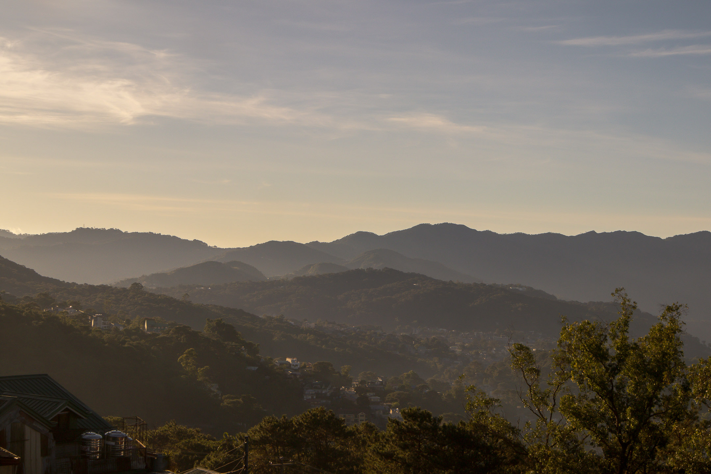

Baguio City is a city located in the Cordillera mountain range in Northern Philippines. It was formerly an American colonial hill station, where sick soldiers and American colonial government officials recuperated due to its colder temperature.

It was here where I studied in college and where I eventually embraced the religion of my childhood. This was where I served as a full-time minister of the JWs from 2008 to 2011, while I was studying, and where I became an assistant pastor from 2010 to 2011. It was also here, however, where I developed symptoms of a major depressive episode in March 2011. The suffering I experienced during that time crushed my faith in the organization, the Bible, and eventually God. In April 2012, I decided not to attend the memorial of Christ's death, which is the only celebration the religion observes, to signify my decision to leave the JWs.

Of course, I would return several times to Baguio after this. But during all those returns, I purposefully avoided places that reminded me of my previous life. Since I walked around almost the entire city, this was difficult to do.

One Sunday in October 2023, while I was visiting my sister's family, who were living in the city, I stumbled upon a walk that unintentionally exposed me to spaces and encounters that triggered difficult memories and emotions.

Here is a map of that walk.

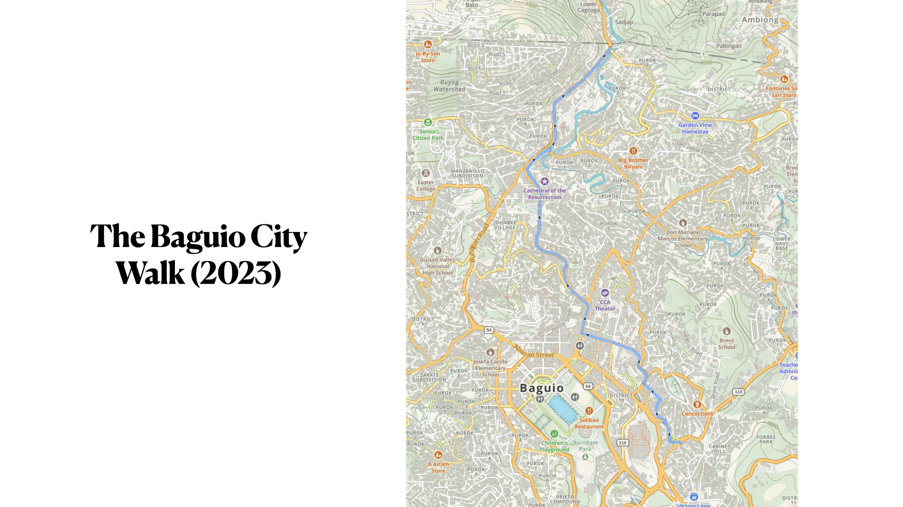

That morning, I set out to find a well-reviewed Middle Eastern restaurant. After locating it on the map, I decided to walk toward it because Baguio City is very walkable. From my sister’s house in Engineer’s Hill, which is at the lower right corner of the map, I made my way up to Magsaysay Avenue. There, I found the restaurant. However, the food I was hoping to try wouldn’t be ready until about an hour or so, so I decided to continue walking. I headed toward Bell Church, a Chinese Buddhist temple near the border of Baguio and La Trinidad that blends Buddhism with elements of Filipino indigenous religion.

On the way, I passed by another restaurant that stirred memories about some fun times I had with previous JW friends. Later, at an intersection, as I paused to let cars pass by, a woman in the backseat of one looked me in the eye as the car went by. I knew the woman. We had been close in my old congregation. She was one of the many friends at the congregation I chose to leave without saying goodbye. Suddenly, memories of those brief but full three years in Baguio came rushing back. Because of this, the walk and the visit as a whole turned out to be unexpectedly emotional.

My little walk in Baguio convinced me that to truly reclaim my spirituality without hurting myself any further, I needed to ask for help. I can no longer do it alone.

So, tt was at this time that I decided to reach out to a UK-based minister named Andrew James Brown, whose blog I discovered a year before while searching the internet for information about Henry Bugbee. Henry Bugbee was a philosopher who walked. But unlike other philosophers, he wrote very little. His magnum opus, _The Inward Morning_, was a collection of his philosophical and religious journal entries. I encountered him in 2022 after the long walk from Los Baños to San Pablo, as I was seriously considering rebuilding religious texture into my life. While Bugbee's work was important, he isn't as discussed as other philosophers, and there were very few writings online about his work. One of these writings was an essay by Andrew in his blog.

Here is a screenshot of that essay.

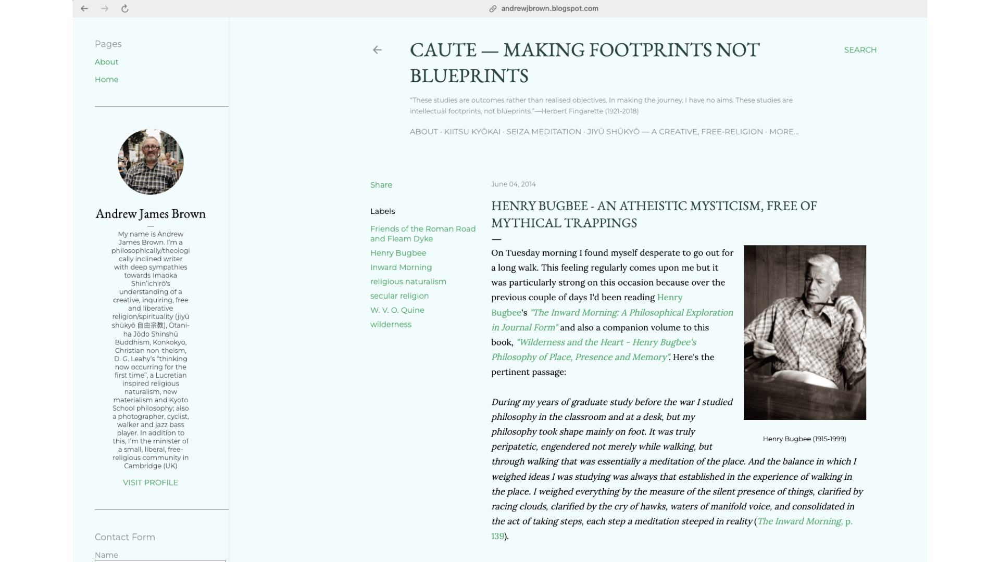

Naturally, after reading the article, I read the About section of Andrew's blog. There, I learned that he is the minister of a small, liberal, free-religious community in Cambridge, UK. I continued reading Andrew's articles, many of which were also sermons he delivered at his church. I resonated a lot with his writings because, like him, I too was a non-theist, and yet I'm beginning to see very clearly that I was still very spiritual.

Around this time, Andrew was already writing about this Japanese religious idea called jiyū shūkyō, articulated and proposed by a Japanese theologian named Shin'ichirō Imaoka who lived from 1881–1988. While often translated as "free-religion" (with a dash), Andrew believes that a more accurate translation of jiyū shūkyō is "a creative, free, inquiring, and liberative religion or spirituality."

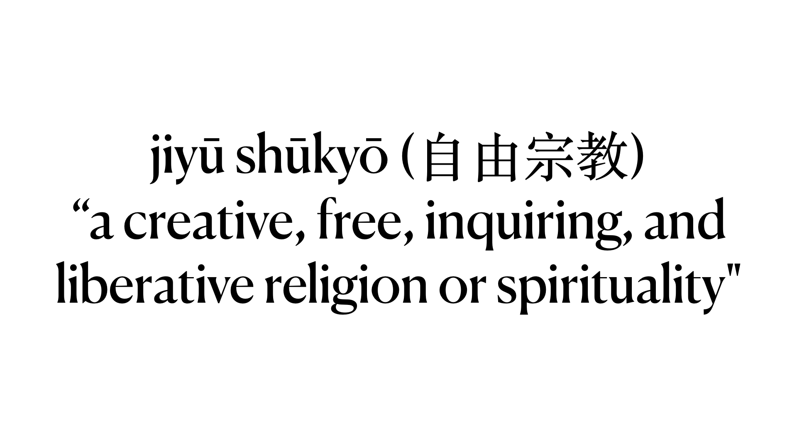

I was reading a lot of things at this time, but Andrew was the only religious minister I felt comfortable reading. However, I didn't feel any need to reach out to him until that difficult walk at Baguio, when I felt I definitely needed help. So I went to his blog and filled up his contact form. I told him briefly about my religious past and that he was the only religious minister I've read for a long time. I was honest, telling him I'm opening myself to the possibility of being religious again, and yet I'm finding the process difficult and painful.

Andrew responded with a brief but welcoming reply. He thanked me for reaching out to him and invited me to continue to keep in touch if I have any questions. I indulged and responded with my first question. I asked how one might begin in this open, free religious path or jiyū shūkyō that he has been writing about in his blog. This led to numerous email exchanges and a couple of Zoom calls.

One of the things Andrew shared with me was critical when beginning a jiyū shūkyō practice was the importance of maintaining an open heart and an open mind, both on what is happening within me and what is happening around me. With this, he suggested the importance of meditation, which I'm already very familiar with as I've maintained a Zen meditation practice for almost eight years now. Andrew, however, introduced me to a form of sitting meditation devoid of doctrines, sacred texts, and lineage. The practice, called seiza, employed a meditation method that combined the traditional Japanese sitting form of the same name with a breathing technique that emphasized out-breaths over in-breaths.

Andrew referred me to a Jōdo Shinshū Buddhist minister named Miki Nakura who conducts weekly free seiza sessions via Zoom. For a year, beginning in late 2023, I attended his Saturday sessions and met other seiza practitioners from around the globe as I slowly transitioned from a Zen to a seiza practice.

Recently, just this June, Miki visited the Philippines, so I got to finally meet him and practice with him in person. Here is a photo I took of Miki conducting a seiza session during his recent visit here in the Philippines.

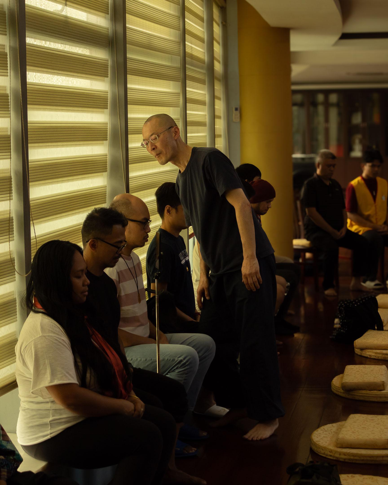

Andrew also invited me to join a weekly Zoom meeting he was starting to test interest in jiyū shūkyō. He called the meeting Kiitsu Kyōkai, which literally means, "Returning-to-One Fellowship or Gathering."

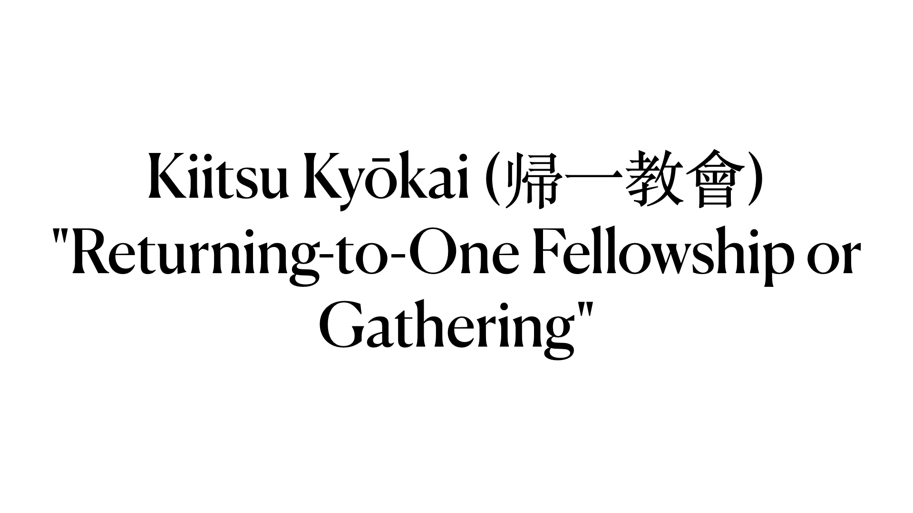

It is also the name of two groups Imaoka Shinichiro was associated with, one of which was the community he started after World War II, where he also explored jiyū shūkyō with a spiritual community. I attended my first kiitsu kyōkai meeting on February 8, 2024. The Kiitsu Kyōkai format was simple. It followed what Imaoka did for his group. We begin with a seiza practice that lasts at most 20 minutes, followed by a short prompt shared by any volunteer from the group, then another short piece of music. All of these were followed by about an hour of free conversation.

I've been with the group now for about a year and a half, and I've made real friendships with the people in the meetings. The Kiitsu Kyōkai community also helped me cautiously re-encounter my religious past to look for gems that I could re-integrate into the new religious life I'm building. Through the community's help, I've started using religious words that I've purposely avoided using since leaving the JWs. For example, I'm now using the word "faith" once more, not to refer to a strong conviction or belief in something but to signify taking the next step and acting despite not knowing the entire picture. For a walker, this doesn't just make complete sense. I also find it very beautiful.

After more than a decade of wandering in spiritual wilderness, I could now say with a clean heart—and I don't take this lightly because it took a very, very long time for me to get here—that in Kiitsu Kyōkai, I've found a spiritual community I can call my own.

## bOibm (January 2025)

In retrospect, one of the biggest things that attracted me to jiyū shūkyō was its minimalism. Why was this important to me? Remember that leaving the JWs has made me into a spiritual wanderer. Leaving something the way I did not only made it difficult or impossible to return, it also made it difficult for me to trust religions or spiritual groups that resembled that which I left—that is, communities with highly complex doctrines and hierarchical structures. If there is any real chance for me to express my spirituality and be part of a religious community of any sort, that platform has to be as minimal as possible, at least while I'm still discovering who I am as a free-religious person. In walking language, give me a portable spirituality, something that I could carry inside my backpack as I continue my wandering, something that could continue to sustain me as I figure more about how I want to proceed.

Jiyū shūkyō has given me this minimal, portable sustenance in the form of Shin'ichirō Imaoka's principles of living, which he has repeatedly revised throughout his life to articulate the center of gravity of what he calls jiyū shūkyō.

Here is a simplified version of Shin'ichirō Imaoka's Principles of Living, which he shared during a TV interview in 1974. This draft translation is by Andrew James Brown.

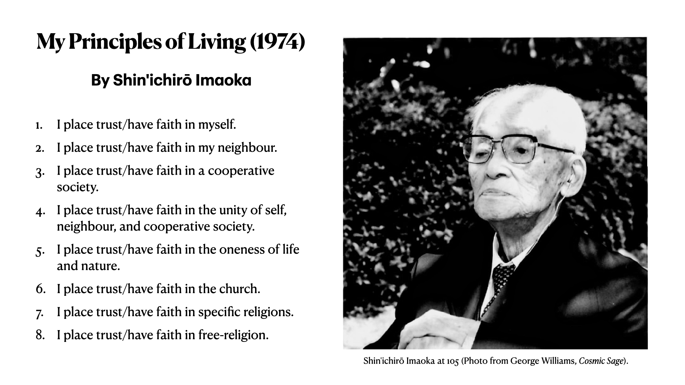

1. I place trust/have faith in myself.
2. I place trust/have faith in my neighbour.
3. I place trust/have faith in a cooperative society.
4. I place trust/have faith in the unity of self, neighbour, and cooperative society.
5. I place trust/have faith in the oneness of life and nature.
6. I place trust/have faith in the church.
7. I place trust/have faith in specific religions.
8. I place trust/have faith in free-religion.

In Kiitsu Kyōkai, we are constantly encouraged to come up with different ways we can apply these principles in our daily lives. Since some of us delve into the arts, we've also used these principles to prompt specific creative projects, which were also forms of religious expressions. For example, one of my friends in the community, Celia, uses the principles to think of new sculptures and interpret old ones she did in the past. For example, she returned to her first wood carving about the story of Jacob wrestling with the angel and used jiyū shūkyō to come up with new interpretations of her own work.

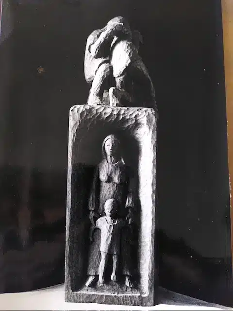

This photo shows just the first of four panels that Celia carved. All four panels are topped by the image of Jacob wrestling with the angel to find his name. Using a jiyū shūkyō lens, Celia reinterprets this image as a representation of our struggle to affirm ourselves, matching the first principle in Shin'ichirō Imaoka's Principles of Living: "I place trust/have faith in myself." Under the carving of Jacob and the angel is an image of Rachel and Joseph. According to Celia, the image represents Jacob's capacity for love, which reminds us of Shin'ichirō Imaoka's second principle of living.

As a writer and photographer who walks, I've begun to look closer at how I might be able to use walking as a way to express and further explore jiyū shūkyō. I constantly ask myself, how can I treat walking as a form of meditation or a ritual to sanctify both the time I spend walking and the space I tread on as I walk? These thoughts led to several spiritual walking experiments I've done in the past two years. One of these experiments was a week-long walk of Los Baños I did last January, and this is the last walk I'll be sharing with you today.

I called the walk bOibm or "but Overall is beyond me."

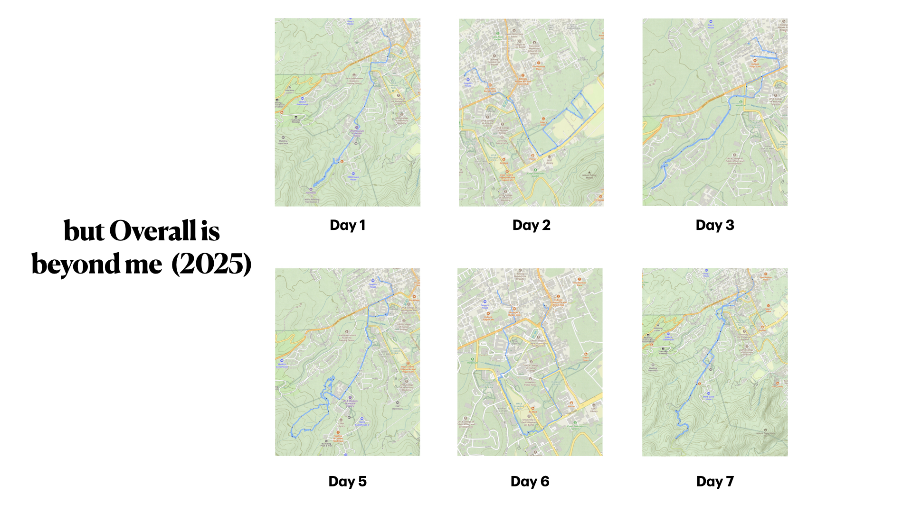

The name comes from a beautiful walking poem called _Corsons Inlet_ by A. R. Ammons. In that walk, I plotted six routes around Mt. Makiling, which I covered each morning of the week, less one day in the middle for rest. The routes led to the last silent places in Los Baños, a town that is at the foot of a mountain but is rapidly urbanizing. I started around 8 in the morning and ended before noon. I held several intentions that guided me during each walk. For example, I intended to come to each walk as open as possible, with no expectation or theory to interpret what I see or experience on each walk. I also intended to focus on images, but only take photos when I'm truly called. I allowed words to come and wrote them on my phone if they did come, but I didn't force them. As I completed each walk, I contemplated on Shin'ichirō Imaoka's fifth principle: "I place trust/have faith in the oneness of life and nature." After I come home from each walk, I take a rest, then begin culling the photographs I took, choosing about ten or fewer photos. I then edited these and juxtaposed them with the little words that came to me during the walk. The final output was a short missive of photos and text, which I sent to a few friends who opted to receive it via email.

To show you an example of the missives I sent, here is what I sent on Day 7, the last day of the walk. I'll leave it to all of you to read the missive in silence.

(To read that missive, [click here](boibm/006).)

---

As I get deeper into walking as a contemplative jiyū shūkyō practice, I grow into a deeper appreciation for its openness as a platform of religious expression. However, one of the things I really love about walking is that it is also a great metaphor for the religious life, and it could represent both the beautiful and the messy parts of our religious and spiritual journeys.

Walking involves leaving, which in my case represents my decision to leave the JWs. Walking could also involve wandering and getting lost, which in my case represents more than a decade of spiritual wandering, going to one group after the other but failing to find one to settle down. But walking also dramatizes the act of getting there and of arrival, which aptly represents my encounter with jiyū shūkyō and the Kiitsu Kyōkai community where I'm currently exploring my spirituality. But I think what makes it a great metaphor is that walking maybe repeated. In other words, it could be a practice, a vocation, a path. As Ammons said in _Corsons Inlet_, "tomorrow, a new walk is a new walk."

Tomorrow, our partialities could change, our ideas and the things we put our trust in could be easily shattered and replaced. And so like a walking practice that is repeated and kept, perhaps a free religious life is not necessarily about finding a place to settle in but finding comfort in the life of a perpetual wanderer—a wanderer who is continuously renewed and remade by movement, a wanderer constantly becoming, traversing an open spiritual expanse and perhaps even finding a home there, en route to nowhere.
