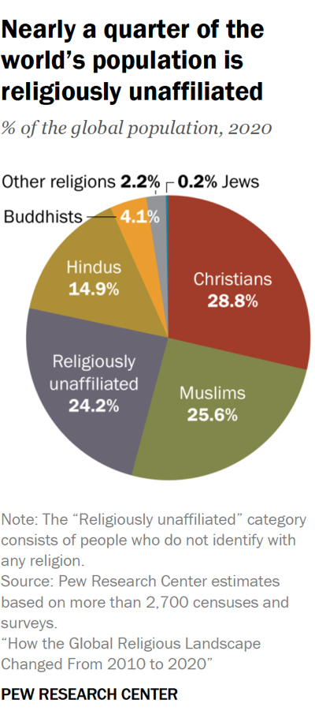
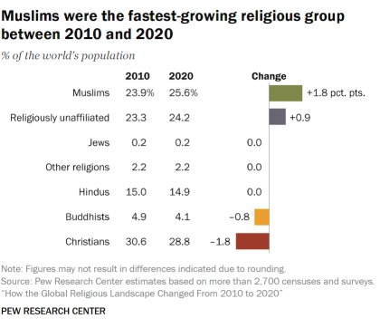
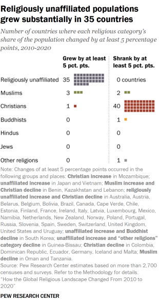
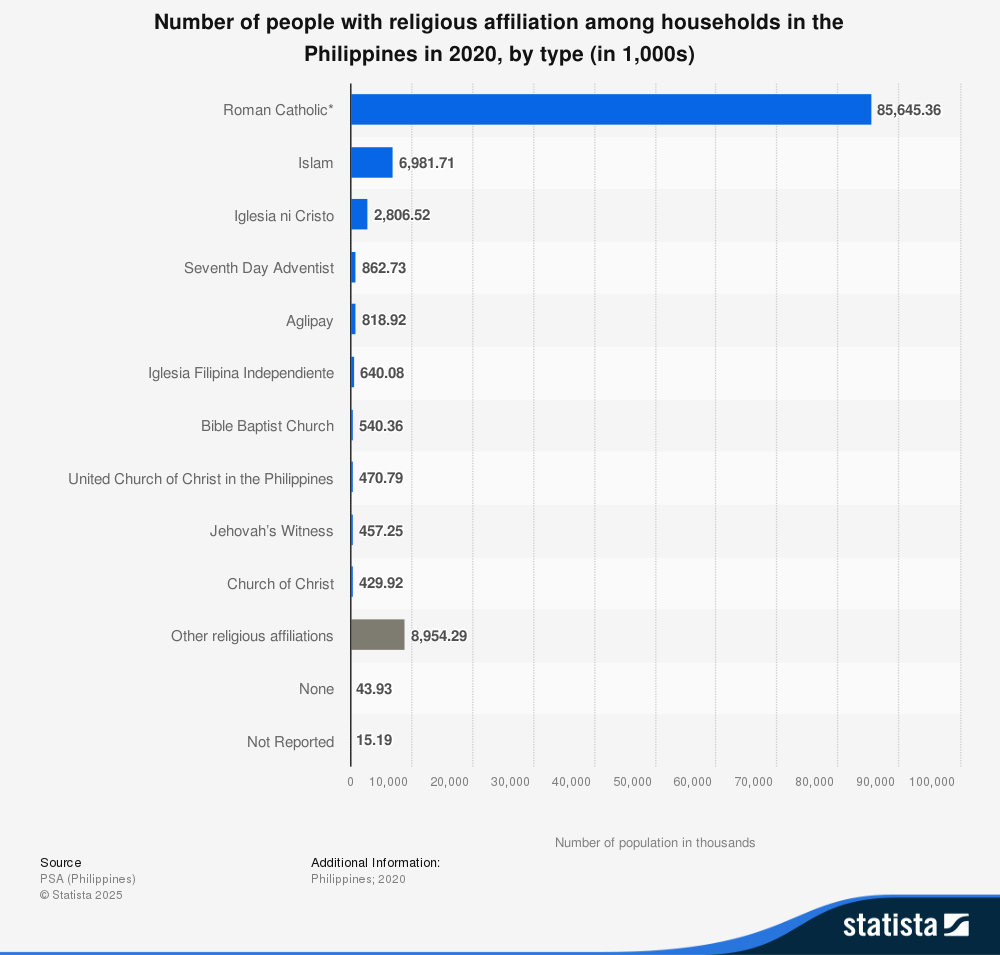
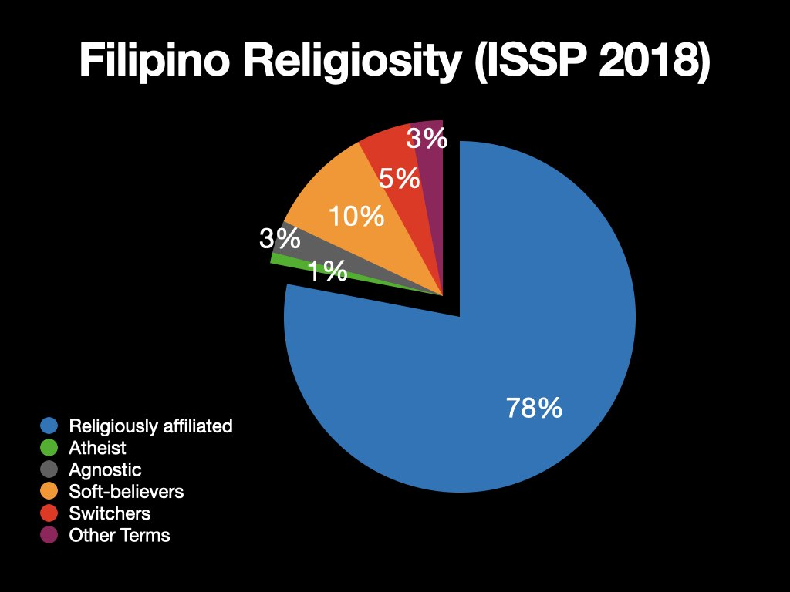
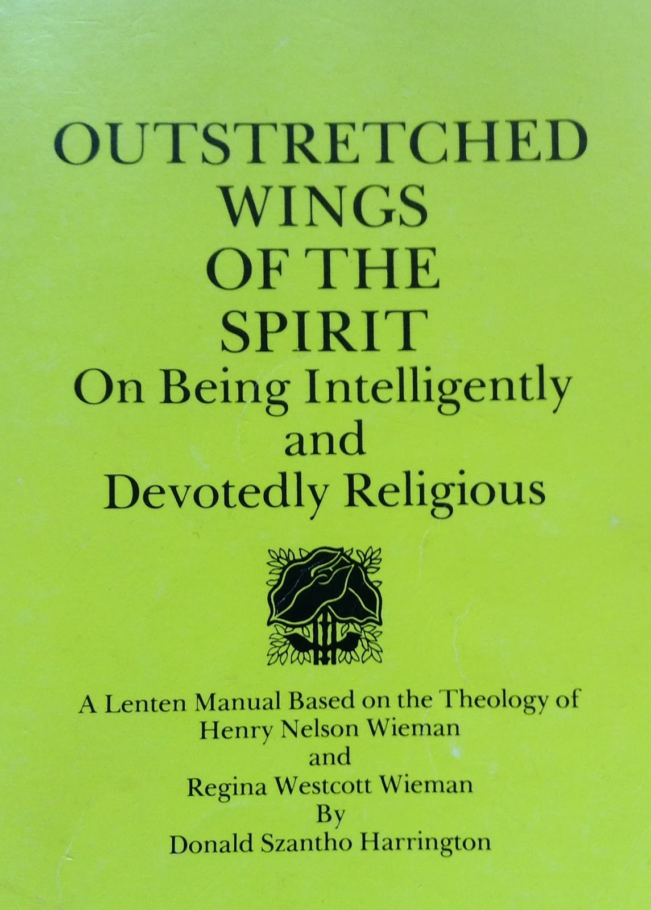
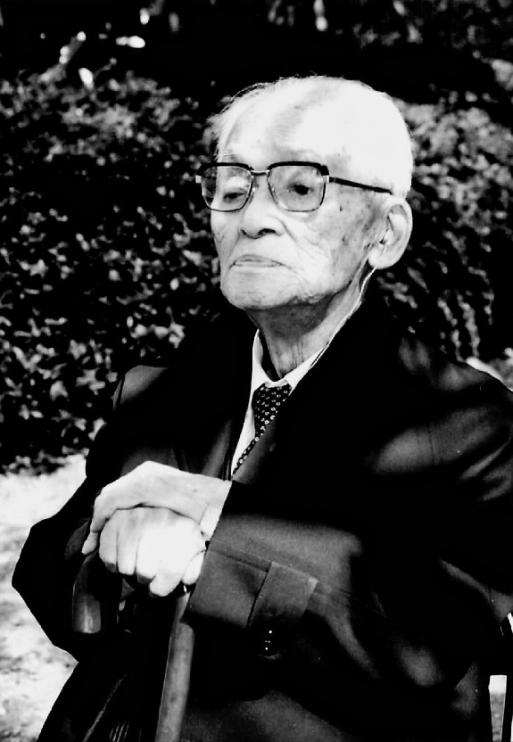

On November 15, 2025, I delivered a talk in front of about forty students at The Atrium of the College of Saint Benilde of the De La Salle University (CSB-DLSU) in Malate, Manila. My friend, Argel Tuason, was teaching there and was kind to include me to be part of a series of talks under the college's Religious Experience, Spirituality, and Recollection (REEXECO) class.

I had a hard time thinking about what topic to present because I had lots of options. Last June 2025, I delivered [a talk on walking and jiyū shūkyō](essays/encountering-a-creative-free-spirituality-jiyu-shukyo-through-walking) in front of the Global Network of Rainbow Catholics. I could've gone with a similar topic. However, after hearing from Argel that he thinks there are atheists, agnostics, and religious skeptics in his classes and he wants them to feel included in the talk series, I decided to take on the subject of spirituality without God.

I myself have struggled about the subject of God, and I'm far from being competent with my grasp of it. However, my knowledge, understanding, and personal partialities have grown in the past two years that I've gone deeper into jiyū shūkyō. I thought I now have some things to share, no matter how meagre. What is important is to provide some space for young people to talk about the possibility of being spiritual and religious despite (or perhaps even because of) being "godless."

Below is a written approximation of that talk.

---

## The Religiously Unaffiliated Worldwide

I wanted to begin by sharing a very interesting [study](https://www.pewresearch.org/religion/2025/06/09/how-the-global-religious-landscape-changed-from-2010-to-2020/) released just last June 2025. The study was by the Pew Research Center, a nonprofit organization that conducts public opinion polls and social science research. The study provided a glimpse into the global religious makeup in 2020 and is probably the latest and most comprehensive research of its kind so far.

This pie chart, which came from the Pew study, shows the share of the world's major religious categories in percentage of the global population in 2020. The chart shows that after Christians and Muslims, people who were religiously unaffiliated made up the third-largest religious category in the world.

The religiously unaffiliated includes atheists (those who disbelieve in God), agnostics (those who believe it is impossible to determine whether God exists or not), those who are or have become uninterested in religion and spirituality, and those who identify as "spiritual but not religious" (SBNR). These people are also often called "Nones" because they often indicate "None" when asked about their religious affiliation in surveys.

The [John Templeton Foundation](https://www.templeton.org/grant/godless-religion-a-spiritual-yearning-research-initiative-project) refers to these individuals as "godless" for the following reasons:

1. They are "godless" in their religion in the sense that they would typically be regarded as having abandoned Christian churches.
2. They are "godless" because they reject traditional theology while remaining within religious structures.

In other words, most religiously unaffiliated people and the like can be referred to as "godless" not necessarily because they don't believe in a God or gods but because they go against conventional religion and spirituality, particularly in a Christian sense.

Meanwhile, in his 2021 book _[Spirituality for the Godless: Buddhism, Humanism, and Religion](https://www.cambridge.org/ph/universitypress/subjects/religion/philosophy-religion/spirituality-godless-buddhism-humanism-and-religion?format=HB&isbn=9781107162013)_, Michael McGhee used the term "godless" to refer to traditions like Buddhism and secular humanism that allow a form of spirituality that does not rely on a conception of a one God but still engages with spiritual practice and community.

In this talk, I'm going to refer to atheists, agnostics, religiously apathetics, spiritual but not religious, and the like as "godless." I will also refer to the form of spirituality that many of these people practice as "godless spirituality."

Now let us return to that Pew study.

According to Pew, the religiously unaffiliated made up 1.9 billion of the 7.8 billion people in the world in 2020. This means that 1 in every 4 people living in the world that year was religiously unaffiliated.

According to the same study, people who were religiously unaffiliated were also the second fastest-growing religious category after Muslims. While most religious categories declined in their share of the world population between 2010 and 2020, the religiously unaffiliated gained nearly 1 percentage point as they increased in number.

Furthermore, among all religious categories, people who were religiously unaffiliated increased in the most number of countries. While the Christian populaton shrank in 40 countries and Muslims grew in only three countries, the religiously unaffiliated grew significantly in 35 countries.

## The Religiously Unaffiliated in the Philippines

So this is in the world stage. How about in the Philippines? How many Filipinos do you think are religiously unaffiliated?

At first glance, people who are religiously unaffiliated seem like a minority in the Philippines.

For example in a 2020 census, those who indicated "None" as their religious affiliation numbered just nearly 44,000. This was only less than 1 percent of the population of the Philippines in 2020. In comparison, Roman Catholics, which make up the majority of the Philippine population, numbered more than 85 million.

However, a more accurate survey suggests that a more sizeable number of Filipinos harbor unconventional views about God despite being religiously affiliated. In 2022, the International Social Survey Program (ISSP) released its findings from a survey it conducted in 2018.

Here are some findings from that survey:

- Atheists (those who answered “I don’t believe in God”) were about 1 percent.
- Agnostics (those who answered “I don’t know whether there is a God and I don’t believe there is any way to find out”) were about 3 percent.
- Soft-believers (those who answered “While I have doubts, I feel that I do believe in God”) were about 10 percent.
- Switchers (those who answered “I find myself believing in God some times, but not at others”) were about 5 percent.
- Those who answered “I don’t believe in a personal God, but I do believe in a Higher Power of some kind” were about 3 percent.

Taken together, about 22 percent of Filipinos who responded to this survey had unconventional views about God or entertained some measure of disbelief in God. This means that even if atheists and agnostics make up a very small portion of the Filipino population, the percentage of Filipinos who are skeptical about traditional beliefs in God are quite significant.

## Why are the Religiously Unaffiliated Increasing?

But here's the question: what is causing this increase in number among religiously unaffiliated people or those who are starting to be skeptical about traditional beliefs in God?

According to the Pew study I cited above, this growth among the religiously unaffiliated was surprising because most of them are relatively old with relatively low fertility rates compared to religiously affiliated people. So there is no way they could be growing by reproducing and raising children in non-religious households.

According to Pew, religiously unaffiliated people are increasing because people who previously had religious affiliations are leaving those religions. Most of them are Christians in Europe and the United States. Take note that in the Pew study, the religious category Christian encompassed not only Catholics but also all Protestant groups.

But there is an even more important question here: Why are people leaving their religions?

## The Rise of Normal Nihilism

In his 1997 book _[The Plain Sense of Things](https://www.psupress.org/books/titles/0-271-01677-9.html)_, James C. Edwards argued that the world is going through what he calls "normal nihilism."

You might be familiar with the word nihilism. To review, in philosophy, nihilism refers to a viewpoint wherein traditional values and beliefs are considered unfounded and that existence is senseless and useless. While nihilism could lead to normal nihilism, they aren't the same. According to Edwards, in a society going through normal nihilism, traditions and practices may continue. However, what is lost is a strong sense that these things matter in a deeply meaningful and serious way.

For example, nowadays people may still say grace before meals. They still bow their heads, speak familiar words, and perform all the expected gestures during prayer. However, they no longer do it with profound seriousness. They no longer say gratitude in a way that helps them truly feel their dependence on a giving world. Saying grace has become a custom or routine that people just do before eating.

When Edwards wrote this book in 1997, he said normal nihilism is happening primarily in the West. While this is still true, we could argue that given the rise of technology in recent years, we in the East are now more Westernized and consumer culture has grown even more. Therefore, even here in the Philippines, normal nihilism is already felt.

But what is leading us to this normal nihilism?

Edwards pointed to two main causes. First, is extreme skepticism to systems of beliefs. Nowadays, more and more people are skeptical of religion or any other belief system. Religion no longer holds the same power over people it used to have. Today, religion is just optional—one of many other belief systems that could be replaced entirely by a secular worldview.

The second factor that causes normal nihilism is the rise of technology and a technological approach to life. Nowadays, we view things and people as means toward an end (which could be profit or other forms of gain) rather than seeing them as ends by themselves. The rise of consumerist technology has inspired a similarly technological approach to life. We now see life as something to calculate, manage, or optimize rather than lived and experienced deeply. Furthermore, because our days are filled either with tasks to make us richer or activities to consume the various products of capitalism, there is less and less room for the slowing down and intentionality needed to be religious or spiritual.

In my opinion, these factors are two of the greatest drivers moving people away from their religions, contributing to the increase of religiously unaffiliated people in the Philippines and worldwide. The combination of these two things has made many of us disinterested in looking at the world and being in it in a sacred way.

## Why I'm a non-theist and not an atheist

But why am I sharing these? What is my personal stake on all these?

I am sharing these things because I'm a non-theist person. Like most religiously unaffiliated people I don't believe in God (or at least in the way I was raised to believe in one). However, I know that despite this (or perhaps because of this disbelief) I am very spiritual and religious. In fact, I feel like I have a religious calling.

And so what I'm hoping to do is to present to all of you, especially those of you here tonight who have already identified themselves as religiously unaffiliated or perhaps still religiously affiliated but are already very disinterested in religion, with options as to how to move forward.

I believe that since we live in a very religious country and most of us grew in very religious households, even if you have already decided that you are godless, this attitude still has religious roots and so it is important to talk about how to tackle that.

Before I move on, however, I would like to briefly differentiate two critical words.

In face value, both the prefixes non- and a- mean the same thing: "not," "without," or "the opposite of." This is why some people argue that atheism and non-theism are the same thing. However, in one interpretation, which I subscribe in, these words have a very important distinction.

Atheism is an active disbelief in God. This active disbelief sometimes pushes a person to a militant rejection of all religious affiliation and spirituality. However, not everyone who disbelieve in God feels this way. In fact, some people are not actively rejecting or disbelieving God. They are simply apathetic or silent toward the subject. For example, Buddhists are not actively rejecting the idea of a God and are definitely not militant toward religious affiliation and spirituality. However, a God is not the center of their belief system. And so many scholars and practitioners of religion feel like there is a need to differentiate between an active rejection of God (and call that atheism) and an apathetic and silent attitude toward God (and call that non-theism).

I identify as a non-theist and not an atheist because even if I don't believe that a personal God in heaven exists, I am not actively pursuing this disbelief. And because I still fervently feel that I am a very religious and spiritual being, I can't be militant and advocate for the removal of all religions and spiritualities. Furthermore, as time passes by, I'm becoming less and less interested in discussing or debating how a God may or may not exist. I no longer find this philosophical discussion as useful as I may have thought about it before. For me, it is more important to think about how I could continue to be spiritual and religious despite not believing in a personal God.

However, I did went through a brief period of atheism. How I got from theism to atheism and then to non-theism is something I want to share next.

## How I became a non-theist

I was very much a theist most of my life.

I grew up in a Christian evangelical household. Since I was a baby, I was already accompanying my parents going door to door preaching. By around Grade 3, I was already reading the Bible in front of the church and by Grade 6, I was giving short Bible talks. In high school, I conducted Bible studies with four classmates, three of whom eventually converted into the religion.

And then when I went to college in Baguio City, I started getting more serious with the religion of my parents. I made it my own. I built a personal and intimate relationship with God, which included long prayers with tears at night and promises that I will devote my entire life to Him. I diligently read the Bible and deeply studied our church literatures. To signify my devotion publicly, I approached the elders in our congregation and told them that I would like to become a full-time preacher. In my childhood religion, full-time meant rendering 70 hours of preaching every month. I did this on top of college studies. To challenge myself further, I learned sign language and joined the ministry for the Deaf and hard of hearing. By age 18, I became the youngest assistant pastor in our congregation. I regularly gave talks at church, while leading preaching activities every week. During the three years leading up to 2011, I had a clear purpose. I knew exactly who I was and what I wanted to become. I wanted to be a missionary for the sign language ministry.

But then came my unraveling. On March 2011, while nearing the end of the second semester of my third year in college, I started experiencing symptoms of what will later be diagnosed as major depression. I filed for leave of absence at my school in Baguio, and went home to my province in Pangasinan to recover.

While I did recover, the experience really shook my faith in myself, the religion of my childhood, and ultimately God. I questioned how God would lead me to such suffering after all my expressions of faith and devotion toward Him. I started having doubts. The first domino to fall was the organization. I lost faith in the church. Then I started questioning the claim that the Bible is God's word. When I no longer believed in the divine inspiration of the Bible, it was easier for the next domino to fall. If the Bible wasn't the divine word of God then everything it said about God, including that He was up there in heaven listening to my prayers, was already questionable. For the first time in my life, I started to question whether this persona I was talking to at length during my prayers at night really existed in the first place. When I became convinced that He doesn't, I left my religion.

I identified myself as an atheist almost immediately after I left my childhood faith. I was angry and militant and went into social media tirades with Facebook friends who commented their disagreements to my atheist posts. When I was alone, what my atheism looked like was that I just ceased talking to God altogether. I stopped praying. Without prayer, it is impossible to create a personal relationship with God. And without church, without public expressions of faith, a religious life organically dies.

As my disbelief deepened, I became very, very uncomfortable with the idea that a powerful being up there oversees my life and rewards or punishes me based of my actions. By choosing to leave my religion, discarding the Bible, and then letting go of my belief in God, I experienced two immediate benefits:

1. Relief from guilt. When I believed in God, I was always ridden with guilt because I felt like I wasn't measuring up to his rules. I was always sinning and this led to a lot of feelings of guilt.
2. Freedom. I felt very, very free. Real freedom in a way I've never felt before. I was eager to try out things I've never tried before because they were either discouraged or outright banned in my childhood religion. For example, I only celebrated my first Christmas in 2012 with my cousins when I was already 19 years old.

While choosing to be an atheist gave me these immediate reliefs, it also led me to a profound existential crisis, something I never expected. It was a state similar to Edwards's normal nihilism, characterized by a deep loss of purpose, although in a personal level.

Since my relationship with God was the spring from where a sense of purpose and meaning came forth, my decision to disbelieve in a God immediately cut that spring of purpose and meaning. Without a solid purpose, it became difficult to assess what was important in my life. It became difficult to assess what was valuable. And because it was difficult to determine what was valuable, it was difficult to commit to anything, whether it was a relationship, a friendship, a community, or a vocation. Furthermore, my sense of what was right or wrong became more blurred.

When I left God, I left the source of the path I was walking on. It felt like I threw myself in the middle of a forest with no existing trails. In order for me to make it through the forest, I needed to create my own path.

What did that path look like?

## I was still spiritual

Like Edwards said, in cultures that are deeply religious, a rejection of religion (and this includes God) has a religious root. Therefore, one needs to find a way to be religious even if in a very secular context. This is exactly how I started creating my new path.

This rebuilding process was purely guided by intuition. And so it involved a lot of trial and error. And because it involved a lot of trial and error, it necessitated a willingness to learn how to stay and feel comfortable being in a state of liminality.

What helped me find my path again was that freedom gifted to me by my rejection of God and my decision to leave my childhood religion. Since I was as free as I have ever been, I began to devour all sources of information I could get my hand on. This reading led me to Eastern spiritual and religious traditions. I started reading a blog of a writer who was also a yogi and who read books like the _Tao te Ching_ and the _Bhagavad Gita_.

Being inspired by this writer, I read both of those books. I never truly unerstood them. I still don't. However, what reading those books helped me realize was that despite my rejection of my Christian religion, the Bible, and ultimately God, I still resonated very much with spiritual and religious writing that leads me to think and experience the deepest questions of humanity in a more profound way. Furthermore, I realized that what drew me into Eastern spiritual and religious traditions—especially Buddhism—was its lack of obligation toward a personal God. Learning that Buddhists are able to maintain deep religiosity despite not believing in a God was hugely inspirational to me.

In short, I realized that I was still very much a spiritual person. This was an important realization, and it was enough to begin clearing my trail in the forest. However, it didn't point me to the exact direction of where to look. For me to do that, I needed to test different options and learned patience as I suffered heartbreak after heartbreak just trying to find the right expression of my religiosity. Between 2014 and 2024 (an entire decade), I dabbled into various religious traditions before finding a framework and community I'm now settling in.

Now, I'm going to share a few things I learned from that long journey. These are three options you can try if you feel like you are godless and yet you want to still have and pursue a spirituality.

## Options for Godless Spirituality

Before you move forward, you have to recognize the following truth:

**Spirituality and even religion is not the monopoly of religious groups. You can live spiritually and religiously even if you are not affiliated to any religious group or institution.**

In fact, given the effects of normal nihilism, a religious affiliation or a belief in God is no longer necessary to be spiritual and religious.

According to Edwards, one can continue to be spiritual and religious even in a normal nihilistic society as long as one has two things:

1. A way to move away from conventional life (dominated by technology and consumerism) and move toward a free, creative, and meaningful life.
2. A way to ensure that as one pursues a free, creative, and meaningful life, one does so without hurting others or destroying the world or nature.

Now, how could a godless person pursue a spirituality like this? I'm going to share just three examples of how to do so.

But before that I need to emphasize one thing. If you've identified yourself as an atheist, non-theist, agnostic, religiously apathetic, spiritual but not religious, or the like (in short, godless), and yet you still wanted to practice a form of spirituality and religiosity, you have no choice but to embrace religious liberalism.

What is religious liberalism?

Here is a definition I really like:

> Religious liberalism is a philosophical stance that posits the coexistence of multiple religious truths and emphasizes the importance of individual interpretation over a singular authoritative doctrine.

Based on this definition, a religious liberal is, therefore, someone who believes the following:

1. There is no one single source and expression of religious truth.
2. All religions could hold religious truth.
3. Multiple religions could coexist and, therefore, should be tolerated.
4. Religious truth could be reinterpreted by an individual for their own individual benefit.

I believe that when you choose to be godless and yet you still want to practice a spirituality or religion, it is inevitable that you become a religious liberal, because you have to reinterpret existing spiritual or religious language to support your unique godless spirituality.

Once you have accepted that you are a religious liberal, then you could begin trying out the three things I'm going to share next.

## Option 1: Use the concept of "God" but reinterpret it.

When I left the religion of my childhood and chose to not believe in God, I naturally stopped using the word God. I avoided it and since I no longer prayed, it no longer meant anything to me.

However, around 2023, when I was exposed to the writings of a minister of a small, liberal, free-religious community in Cambridge, UK, named [Andrew James Brown](https://andrewjbrown.blogspot.com/), I learned that some religious liberals actually opt to continue using the word God but reinterprets it to move away from the traditional monotheistic God of Judaism, Christianity, and Islam.

According to Andrew, who also identifies himself as a non-theist, there are two reinterpretations of the word God that he resonates with. The first comes from the American philosopher and theologian Henry Nelson Wieman.

Wieman offered the following reinterpretation of the word God:

> Whatever else the word God may mean, it is a term used to designate that Something upon which human life is most dependent for its security, welfare and increasing abundance. That there is such a Something cannot be doubted. The mere fact that human life happens, and continues to happen, proves that this Something, however, unknown, does certainly exist.

Wieman went on to say that, following the reinterpretation he proposes, God could either be the Universe as a whole or a portion of the Universe, which humans and Life are most dependent on. Note, however, that in Wieman's reinterpretation, while God is no longer a person, God is still some fixed thing.

The second reinterpretation of God Andrew resonates with came from the American philosopher John Dewey. Dewey offered the following reinterpretation:

> We are in the presence neither of ideals completely embodied in existence nor yet of ideals that are merely rootless ideals, fantasies or utopias. For there are forces in nature and society that generate and support the ideals. They are further unified by the action that gives them coherence and solidarity. It is this active relation between ideal and actual to which I would give the name 'God'. I would not insist that the name must be given.

I'm putting emphasis on that second to the last sentence: **"It is this active relation between ideal and actual to which I would give the name 'God'."** In his reinterpretation of God, Dewey has stopped treating God as a noun and started treating God as a verb. God has become a relationship between ideals and actualities. This relationship continues to happen and manifest, giving birth to ideas and their concrete realizations, without human control. In other words, for Dewey, God has become a dynamic process and has ceased to be a fixed being.

An atheist may be very uncomfortable in using the word God even if reinterpreted in either way. However, a non-theist or another kind of religious liberal may find this option helpful as there are definitely some psychological benefits in continuing to use the word God and the concept behind it. For example, if one chooses to subscribe to Wieman's reinterpretation of God, one recognizes that God's value is supreme over all others. Given this, God could continue to serve as a backbone for meaning and purpose in a religious liberal's life without requiring them to subscribe to metaphysical or superstitious claims about God. Another benefit of this option is that one could continue to use religious and spiritual language and continue to enjoy their benefits.

A great example of this is the devotional _[Outstretched Wings of the Spirit](https://andrewjbrown.blogspot.com/2021/02/outstretched-wings-of-spiriton-being.html)_ by Donald Harrington, which was based in the theology of Henry Wieman and his wife Regina Wieman. In this Lent devotional, Harrington showed how the Wiemans reinterpreted concepts like sin, repentance, forgiveness, and other Christian concepts and terms in a way that conforms with a more radical reimagination of God. For example, they defined sin as action moving against the laws of Nature or against the growth of interconnectedness and Love, which they argued was the law of Nature. Then they defined repentance as the act of recognizing that one has gone against the laws of Nature and Love.

This first option may especially work for individuals who are already skeptical about God but still want to keep their religious affiliations.

## Option 2: Let go of the concept of "God" and devote your life instead to something meaningful to you.

A second option—and this is probably the option that most atheists and agnostics will choose—is to let go of the concept of God altogether (along with most religious and spiritual language attached to it) and be satisfied with creating your own set of values, beliefs, and practices based on something meaningful to you. This is actually what James C. Edwards said is the antidote to normal nihilism. Given that all belief systems can no longer escape the severe skepticism of modern life, and all religious beliefs are now treated as just one among many options, Edwards suggested why not build your own values, beliefs, and practices instead? In more creative terms, DIY your spirituality or create your own religion.

Since one chooses and nurtures one's own values, one doesn't have to justify their relevance or protect them from the skepticism of normal nihilism. These values are worth pursuing because one has chosen them based on one's unique life conditions. In addition, because these values are based on one's unique life conditions, they don't have to be imposed on others.

Edwards offers the example of writing as a godless religious vocation using Henry David Thoreau, the American transcendetalist writer and author of Walden, as a model. While raised in a Christian household, Thoreau left organized religion and pursued writing instead as his religious practice. That practice later added daily walks in nature and together, walking and writing transformed into Thoreau's individual, customized religion of the imagination. Thoreau didn't had to debate with others to defend what he was doing. He has purposefully left the traditional concept of God and pursued a religious life not centered around a concept of God but around a philosphy expressed and practiced through writing and walking, which then enriched his relationship with Nature.

This option is perfect for those who want to practice spirituality but want to do most of it alone or those who are not yet ready to be part of a community. For a long time, this is the option I chose. But if someone had delivered a talk like what I'm giving now ten years ago I may have saved time and I would immediately choose the third option.

## Option 3: Pursue free religion with a community.

While you could indeed DIY your spirituality and religious life by yourself as I presented in the second option, you could also look at existing frameworks and begin there. After trying to DIY my religious life for nearly a decade, I ended up feeling exhausted and lost. Although I wanted as much freedom as I can, I realized that too much self-reliance has also hurt me in some way. An easier approach would have been to look for an exisiting framework that guides an existing community and from within that community and through its support begin a project of creating a spirituality I could call my own.

In 2022, I stumbled serendipitously to the [blog](https://andrewjbrown.blogspot.com/) of Andrew James Brown, the UK-based minister I mentioned earlier. At that time, he was already exploring a religious philosophy called _[jiyū shūkyō](https://andrewjbrown.blogspot.com/p/free-religion.html)_.

_Jiyū shūkyō_ is often translated from Japanese to English as "free-religion," but it is best understood as "a free, creative, inquiring, and liberative religion or spirituality."

By the end of 2023, I was too exhausted in my spiritual journey that I knew I could no longer do it by myself. I reached out to Andrew, told him that I resonate with _jiyū shūkyō_, and asked for advice on how to begin studying and practicing it.

_Jiyū shūkyō_ was first articulated and expanded by the Japanese theologian and educator Shin'ichirō Imaoka, who lived from 1881 to 1988. Imaoka provided the following definition of _jiyū shūkyō_:

> ...living freely and autonomously, unbound by the frameworks of established religion; to believe that one is a member of the Great Life of the universe, and to live in oneness with it.

_Jiyū shūkyō_ is best understood by its principles of living. These principles were first articulated by Imaoka as his personal principles of living. However, as time passed, they became a collective property of his group, the _Kiitsu Kyōkai_, and are now a representation of _jiyū shūkyō_.

Here is a translation of the 1974 revision of the principles of living. The translation is from Andrew James Brown.

1. I place trust/have faith in myself.
2. I place trust/have faith in my neighbour.
3. I place trust/have faith in a cooperative society.
4. I place trust/have faith in the unity of self, neighbour, and cooperative society.
5. I place trust/have faith in the oneness of life and nature.
6. I place trust/have faith in the church.
7. I place trust/have faith in specific religions.
8. I place trust/have faith in free-religion.

Notice that the principles of living do not require placing trust or having faith in a God. In fact, Shin'ichirō Imaoka himself was a non-theist. However, the principles of living do place trust into other people, society, and the universe in addition to placing trust in oneself. Therefore, _jiyū shūkyō_ as a spiritual framework satisfies the requirements Edwards said a godless person needed to combat the effects of normal nihilism. In addtion, _jiyū shūkyō_ places trust in gathering with others into a community (what is referred here as the church), where everyone receives mutual encouragement and learning. It recognizes the importance of practicing spirituality with others and the significance this entails in a world where everything, including challenges are interconnected. Take note, however, that the word church here is a translation of the Japanese word _kyokai_. In Japanese, the word originally meant a place where mutual learning happens between members, not a place where fixed doctrines are transmitted from a clergy to laypeople.

Notice also that in _jiyū shūkyō_, one still expresses faith in specific religions. One doesn't have to reject them. Instead, one views them as essential sources of wisdom to help and support a life that is personally fulfilling yet socially interconnected. One is able to do this because someone who practices _jiyū shūkyō_ doesn't see religions as authoritative and final expressions of religious truth but instead as ever-evolving, dynamic receptacles of religious truth that could provide inspiration and support to one's unique individual spirituality.

Since 2024, I've been part of _Kiitsu Kyōkai_, the namesake of Shin'ichirō Imaoka's original group and now a community that gathers weekly to discuss _jiyū shūkyō_ and its application in daily life and society. What the group has given me is a safe space to explore my personal spirituality and experiment on its various expressions while being given a regular opportunity to listen to other people's own person spiritual expressions, which challenge and sharpen my own.

It has been the biggest difference maker in my spiritual life. Through the support of _Kiitsu Kyōkai_, I was able to cautiously re-encounter my religious past to look for gems that I could re-integrate into the new religious life I'm building. For a religious liberal, the world can be a very challenging place to live. Being part of a community like _Kiitsu Kyōkai_ makes things a little easier. _Kiitsu Kyōkai_ also encouraged me to explore new religions I wouldn't have had I not been taught about more liberal ways to look at religion. This year, for example, I started a closer study of _Jōdo Shinshū_ or Shin Buddhism of which your teacher and I have been fellow students.

---

These are the three options I offer the godless who realizes that they are still extremely spiritual. I sincerely hope that whatever path you choose brings you back into yourself, which is also the way toward others—toward oneness.
