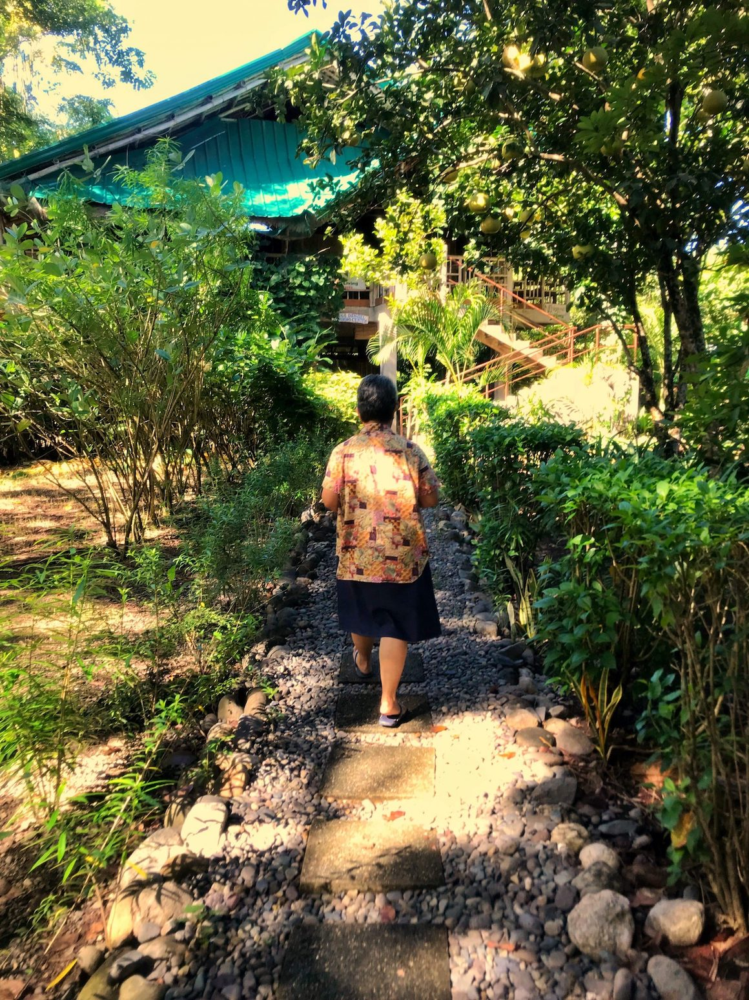
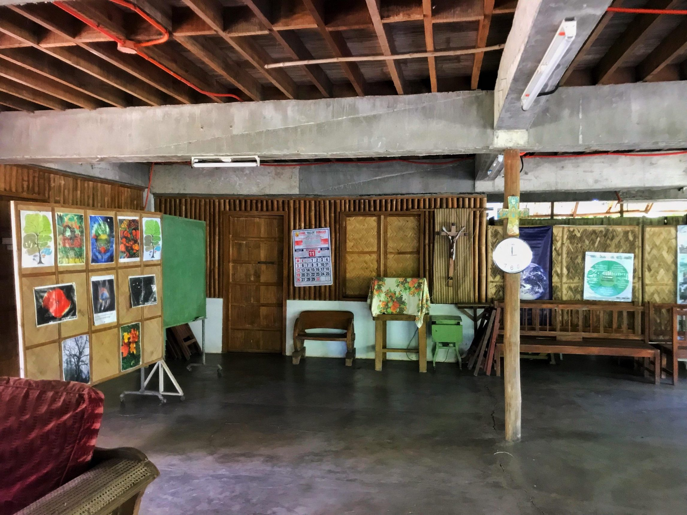
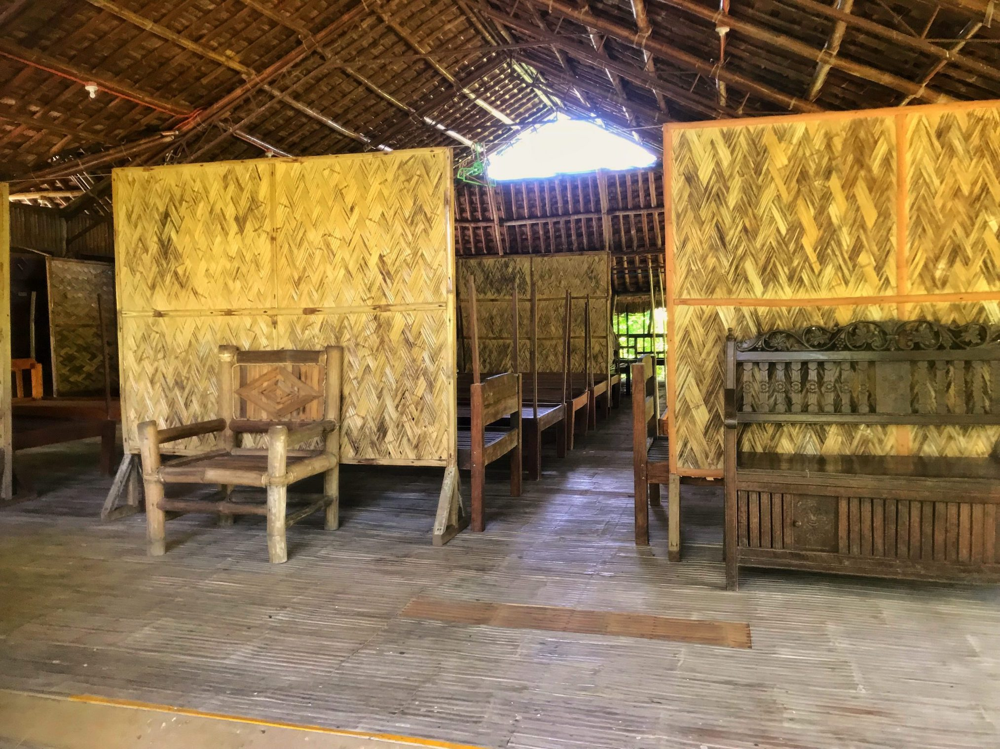
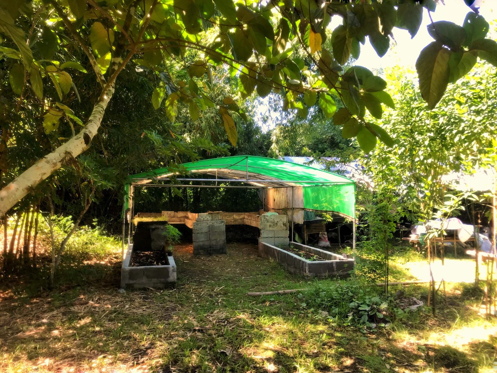
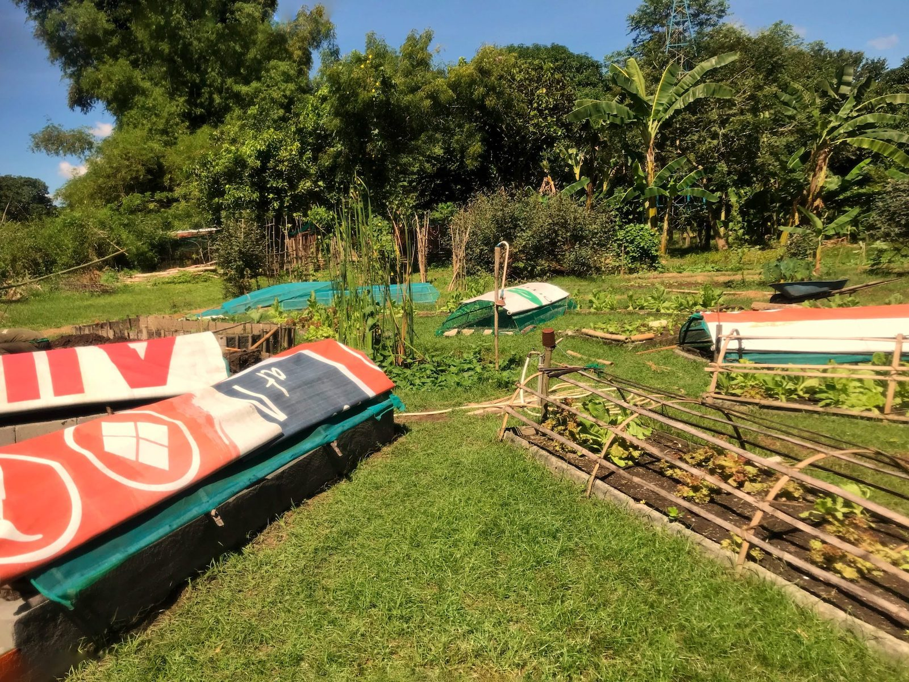
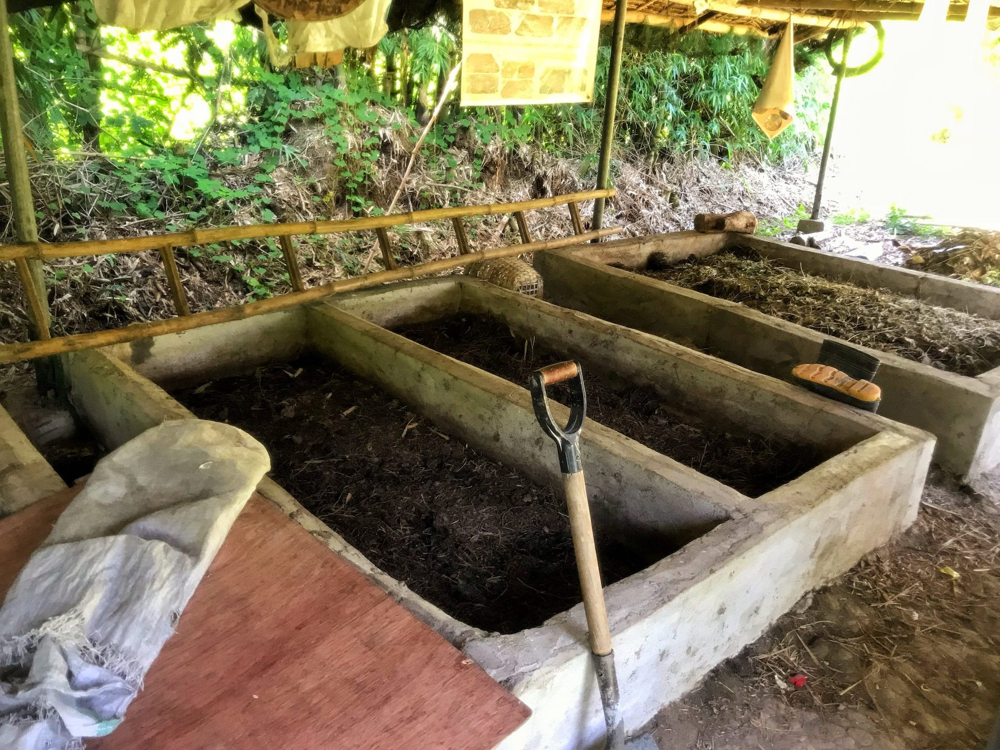
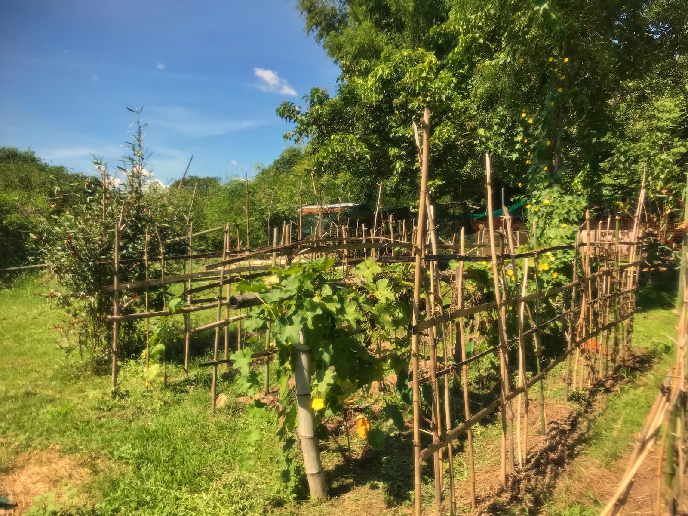
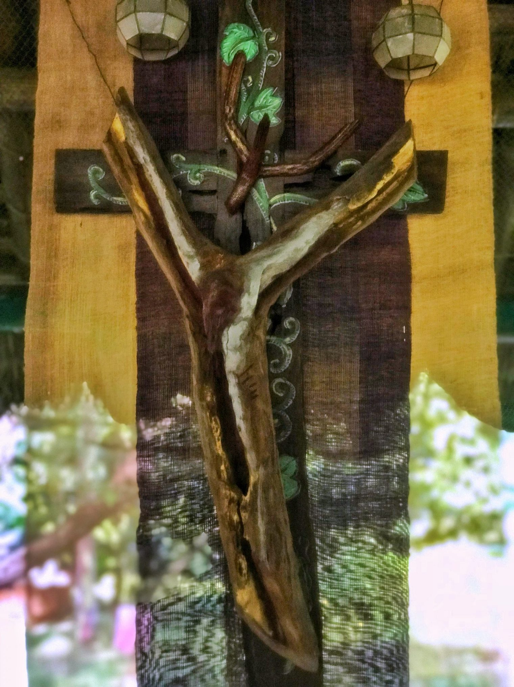

I thought the road will never end.

On the left was a large piece of land, mostly uncultivated, unfenced, filled with _talahib_, and encircled by large trees, probably mahogany. Trees lined up that side of the road, creating a natural border that prevents trespassers from entering.

Whoever owns the land may have lost interest in it. Perhaps because it was too far from town or because they had no enough resources to develop such a large estate. Whatever their reason, birds, reptiles, insects, and weeds are happy about it. They rejoice for the success of their very own crusade to reclaim what was their ancestors’ land. The more disinterested people are about their lands the better it is for them.

On the right side of the road were several houses, many of them clustered together and separated from other houses by smaller pieces of uncultivated land. The grass on this side is short and goats graze on whatever is left in them. There were also very few trees and even little human activity.

This place is silent, I told myself—a perfect place to build a farm.

***

I was already the only passenger in the tricycle when we entered this never-ending road. I paid extra for the driver to bring me directly to HEAL, the permaculture farm I was visiting. We left town full—three inside the main carriage then two outside, along with the driver, who had to move a seat forward towards the motor’s gasoline tank to accommodate both of us behind him.

I always pity tricycle drivers whenever they do that. To earn more, they had to put another body behind them. This forces them to sit in a very uncomfortable position—their groin over the gasoline tank and closer to the steering rod, their legs folded as if already kneeling, and their heads bowed down while, of course, looking in front of them. But I am not sure what I am more afraid of—the driver’s legs breaking or the tricycle tumbling altogether.

As I neared my destination, the tricycle started emptying up—one passenger after another. When the main carriage was empty, I had the option to go in. However, I chose to stay behind the driver, where I had a closer view of what was happening outside.

The illusion of the never-ending road was an illusion after all. After just around three minutes, I saw the end of the road—an open gate with large letters painted all over it:

HEAL

HAVEN FOR ECOLOGICAL AND ALTERNATIVE LIVING

MEDICAL MISSION SISTERS

I got off the tricycle, gave P40 to the driver, thanked him, and started my way in.

I started walking towards the first visible structure—a small two-story house covered in green.

As I made my way towards the house, I felt a sense of relief. The travel was too long for a place that seems just near. To get here from our house in San Jacinto, I had to ride the bus from Dagupan bound to Cubao, which passes in front of our house and stops at Manaoag, the popular pilgrimage town. There, it waits for 30 minutes to get filled up. To catch it, I could either wait for it in front of our house or ride a jeep to Manaoag, hoping that the bus is still there. I usually do the latter as, most of the time, the bus is indeed still there, cutting my waiting time. If I wait for it back home, I will still wait for another 30 minutes once we get to Manaoag.

While on the bus, we passed over several towns in Eastern Pangasinan—Laoac, Binalonan, and Urdaneta. These are the new towns, differentiated from the old towns by the sheer number of Ilocano-speaking people that inhabit them. In the early 1800s, Ilocanos began their diaspora from Ilocos to nearby provinces, populating thousands of acres of open arable land. Since most Pangasinan-speaking folks lived near the coastal areas of the province, the inner forests and grasslands were left open to migrants to cut, cultivate, and develop. These areas became the Ilocano-speaking towns of Pangasinan.

After Urdaneta, our bus arrived at Villasis, the second to the last Ilocano-speaking town of Pangasinan that the bus passes by before entering Tarlac. The bus dropped us at the famous vegetable market or _bagsakan_ and behind it, I started looking for a tricycle bound to Capulaan. I found one and waited for it to get filled.

After waiting, it was still a long ride from town to HEAL. The view along the way is mostly fields—sometimes rice, sometimes onions, other times just a small patch of a vegetable garden. I remember seeing wide wooden trellises filled with ampalaya in one of the wide fields we passed along the way.

I wouldn’t say that the travel from San Jacinto to here was arduous, only that it was longer than usual. And so I felt relieved to finally arrive, especially after seeing how well-shaded the farm was. There were large trees everywhere—very large trees.

Before coming here, I communicated with Sr. Lynn, one of the five senior nuns living on the farm. I got her number from their website. She was supposed to meet me, so I texted her when I arrived. She replied and asked me to wait.

I arrived at the two-story house surrounded by plants. It had a cemented first floor and a wooden second floor. An old woman was sitting on a tiny chair outside the door. I greeted her and she greeted me back. I would later know that this was Sr. Naty, the oldest nun living at HEAL.

I chatted with Sr. Naty for a while until Sr. Lynn finally showed up and welcomed me. She asked me to follow her to a large open building in the middle of tall trees. Like the previous building, this structure had a foundation built using concrete but with kawayan and wood on its walls and second floor.

“We tried building with pure wood alone, but termites are so ferocious here in Pangasinan. We decided to use cement even for just our foundations,” Sr. Lynn explained.

The first floor was mostly open. There were almost no walls covering it, only those that covered rooms. The second floor was of course walled for safety purposes. It had several beds lined up one after another, covered and divided only by large boards of rattan, which made it look like a dorm of some sort. This is where the nuns accommodate guests or retreat participants, which frequent HEAL every year.

“If you opt to start volunteering here, you will be staying here for the night, Vince. I hope you don’t mind that the space here is mostly open. And please don’t be afraid of rats. When you see them walking around, they’re probably hunting for snakes,” Sr. Lynn shared. She continued saying that they don’t kill snakes here. When a snake is lost inside any of the farm's buildings, they pick it up using a stick and put it back to the rice fields so it could find its way back home. In Sta. Maria, we killed all snakes we see.

I was not sure what bothered me more, the mention of rats or the mention of snakes. But whatever. I was here to learn about a different way to live and not even rats or snakes could derail me from that.

After showing me the accommodation building, Sr. Lynn guided me to the immediate surroundings outside. She showed me a short tree with clusters of round, green plump fruits surrounding its trunk. They covered the trunk so much that they looked like parasites—children pulling down an old woman to the ground. The fruits were too many they were falling around the poor tree. The tree was really short, just about five meters, and I felt like these bunches of fruits were making her even shorter.

“Where this tree grows, there is water. Thus, it is called _tibig_,” Sr. Lynn said.

The tree is one of several indigenous trees that the nuns planted around HEAL. As I spent more time on the farm, I learned more about our indigenous trees and their relationship with plants introduced from outside the Philippines. But the _tibig_ tree was special because it made me realize how little I knew about the trees that flourished in this country long before I was even born.

Beside the _tibig_ tree was a large box that looked like a treasure chest with a green cover. It stood with four long legs. Sr. Lynn laid her hand on the box and started explaining that this box used to house honeybees during a time when the farm attempted to keep them.

Sr. Lynn also showed their plant nursery and the mandala-shaped vegetable beds in the middle of the farm.

But what really fascinated me was their vermicompost facility. Housed under a structure made of bamboo and _nipa_ were three concrete containers filled with what looked at first like soil and rotting vegetables and leaves. Sr. Lynn introduced me to Julius, one of the three or four gardeners working full-time at HEAL. He was about my age but is already a father of one. He was in charge of the vermicompost and he explained to me the basics of what was happening in front of me.

The rightmost container held the raw materials for composting—mostly made up of vegetable scraps but also chopped banana trunks and other materials that are intentionally introduced by Julius. These served as food for the vermiculture worms that live underneath the container. They eat the scraps and excrete them into a very potent fertilizer—the vermicast. When vermicast accumulates, Julius shovels and transfers them into the two containers on the left, where they are later harvested for farm use. Sometimes, they are also sold for extra income. I’ve never heard of vermiculture before and so this really fascinated me.

After leaving Julius, Sr. Lynn showed me their vegetable trellises and greenhouses.

Then she showed me this fascinating shrub that had pointed leaves, red stems, and pink flowers.

“This is the roselle. I learned from the local people that they use the flower to cook _sinigang_. But we also use it to make jam,” Sr. Lynn shared.

This comment was interesting to me because Pangasinan-speaking folk do not use this flower in cooking _sinigang_. This practice seems to be an Ilocano practice and so was hidden from my knowledge for a very long time until now.

As Sr. Lynn continued her tour of the farm, I can’t help but notice this large structure that loomed above trees all over HEAL. It looked like a windmill with a large container underneath it. When I asked Sr. Lynn about the structure, she said that it harbors wind energy to extract water from the ground, which then fills up the container. This structure helps HEAL become more self-sufficient in its water supply.

Fittingly, Sr. Lynn ended our tour at the farm’s chapel—a relatively small circular structure, which like most buildings in HEAL, had a concrete foundation but wooden frames all throughout. And like the other structures, it was open-aired.

There was an altar in front of chairs arranged in a semi-circle. A gong was nearby, perhaps used as a time-keeping instrument throughout religious services. There was a guitar on the side, as well as a podium and a table with images and icons.

But the most striking of all the objects in the chapel was the cross—two rugged wooden planks attached together, beautifully adorned with garments and paint, with a three-fingered branch of a tree nailed on them. This branch was Jesus—faceless like the earth.

It had a raw, laid-back look that camouflaged with its surrounding, almost concealed by the colors of the trees, the branches, the wood that filled all of HEAL.

I am not a Catholic and have long left the Christian path. But there is something about the humility of this cross that resonated with me deeply.

I left HEAL in the afternoon, promising to go back soon to start volunteering. I planned on trying out just two days, sleeping over for a night, to test if doing work on the farm will suit me.

I walked the same narrow road that led me to this quiet abode in Villasis.

I looked at the same trees, the same rocks, the same sky.

But, oh, how different they were!