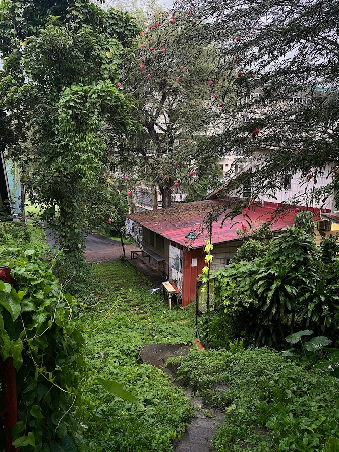

## A Photograph

I found these mossy concrete stairs while walking one of the streets that my friends and I have walked in the past. There is something about walking by yourself that makes you notice facets of the environment that you never knew was there before. And those facets break the monotony of walks. They are what you want to see. They’re like a vacation from the walk—a new discovery, dopamine triggers, eye candies, feet candies, worthy of being written down on your diary. And when they do come, sometimes they bring with them something extra on top.

When I was walking down these stairs, looking for this angle, this shot, a woman, possibly in her 40s, definitely way older than me, was walking up, talking on her phone and holding a stick—not a walking stick, but a _batuta_. I waited for her to walk past me before opening up my camera. I didn't like another subject crowding this already crowded photo. But after taking this shot, or was it the shot before it, I heard her voice, _“Kuya, kuya, sandali lang. May sasabihin ako.”_

I looked up and she was walking back, down the stairs towards me. I saw her _batuta_ again, and all kinds of thoughts came rushing into my head—“Is she a _tanod_? Or part of the police force that keeps on pestering my walks? Why is she a woman? I have never seen woman police inside UP before. Did I do anything wrong? I have my mask on. Perhaps the shield?”

She stopped on a stair, socially distant from me, and began uttering the most surprising words I heard that entire afternoon, perhaps even the entire day, or the entire week:

_“Kasi kuya nagpipicture ka diba? Ano, magdasal ka muna bago ka magpicture. Kasi baka mamaya iba na ang mapicturan mo.”_

_“Ah, okay sige po,”_ I said.

## A Thought

**In your work, be a sage and a child.**

Whatever you do, it will be either art or science or both. Either way, you will be more effective and satisfied if you use both focussed and fleeting attention. You need to be able to transition between focus and play. You need to be both a sage and a child.

In order to do so, you need to have a flexible strategy that facilitates the easy transition between these two states of mind because flexibility requires an equally flexible work structure.

## A Quote

> The key to creativity is being able to switch between a wide-open, playful mind and a narrow analytical frame.

— Jeremy Dean

## A Question

What is the mental state you desire the most?

\***

Thank you for reading. If you enjoyed this issue, please consider forwarding to a friend.