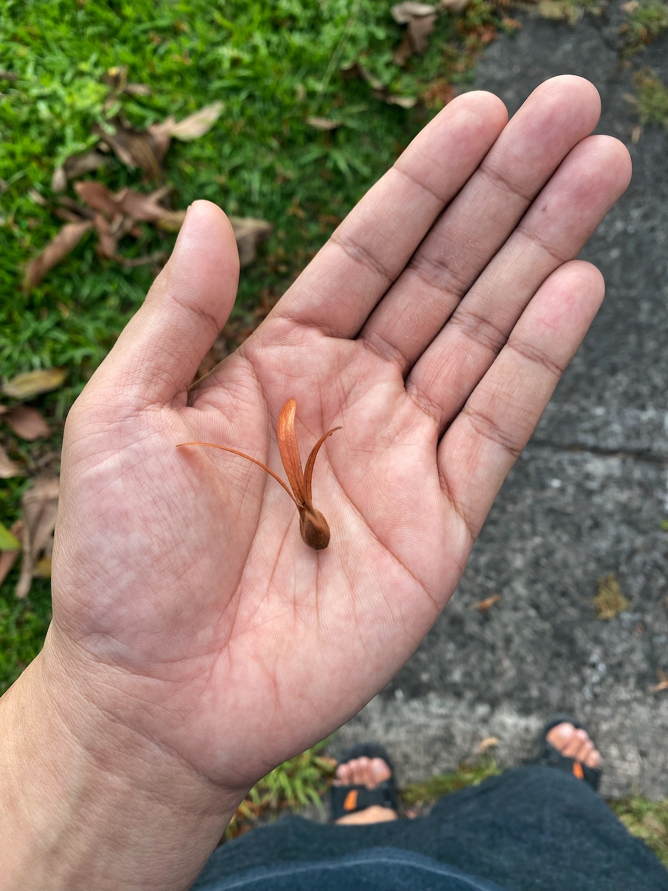

Here I am this morning, sitting on my office chair, looking at the gleaming leaves of a thin tree growing outside my window, covering my view of Makiling with a green translucent mask.

I am uncertain whether it is even appropriate to call this a “tree.” Its kind just grows whenever the rain comes. We've had lots of rain in the past few days and boy do these "trees" grow fast! The owner of the piece of land outside my window had them cut a few months ago. Now they’re back with vengeance, blocking my once picturesque view of the mountain.

I am in a mild trance looking at the green light when all of a sudden, I see a bubuli crawling around the branches of the tree. At first, the sun skink seems to be going down this one thin branch. But then it goes back up the same branch, as if it realizes that it is going the wrong way. Before it even reaches the tip of the branch, which is too small to carry its weight, the bubuli relocates into a leaf stem. The leaves of this tree are large, but they are less thick than the already thin branch that holds the bubuli. And yet, it feels like the creature is so sure that the leaf stem will be able to carry its weight. It proceeds without any hesitation or fear. Talk about lizard brain!

From the leaf stem, it is only a few seconds before the bubuli reaches the large leaf, where there is no stem to support it. Naturally, its weight pulls the lighter leaf, which starts to bend down. At the exact moment when the bubuli would have fallen from the leaf, the animal jumps acrobatically to where it is really going—the sturdier trunk of another tree. It crawls down fast before I can even blink my eyes.

What did I just see?

In her masterpiece [*A Pilgrim at Tinker Creek*](https://www.goodreads.com/book/show/12527.Pilgrim_at_Tinker_Creek), Annie Dillard shared that when she was six or seven years old, she would hide pennies under the roots of trees or inside the holes of sidewalks just for fun. She would draw arrows that point toward the pennies and write a label like "SURPRISE AHEAD." She never returned to these pennies and didn't care who would receive them. “A free gift from the universe" is what she called them.

Then she draws the following comparison:

> There are lots of things to see, unwrapped gifts and free surprises. The world is fairly studded and strewn with pennies cast broadside from a generous hand. But—and this is the point—who gets excited by a mere penny? If you follow one arrow, if you crouch motionless on a bank to watch a tremulous ripple thrill on the water and are rewarded by the sight of a muskrat kit paddling from its den, will you count that sight of a chip of copper only, and go your rueful way? It is dire poverty indeed when a man is so malnourished and fatigued that he won’t stoop to pick up a penny. But if you cultivate a healthy poverty and simplicity, so that finding a penny will literally make your day, then, since the world is in fact planted in pennies, you have with your poverty bought a lifetime of days. It is that simple. What you see is what you get.”

What Dillard is proposing is to develop [a humble eye](https://vinceimbat.com/umbrellaworts-and-truth-partners/)—humble enough to treat small moments of surprise with gratitude and possibly even reverence. This is because, compared to peak experiences that are very rare, these simple, ordinary moments, which Abraham Maslow calls [“plateau experiences,”](https://vinceimbat.com/uman-april-2022/) are abundant. They are always here, always around us, if we only care to look.

These plateau experiences, these surprises, are more reliable sources of inspiration both for times when we need to create or times when we just need to go through a tough day. They are the pennies that a generous hand has left for us to pick up if only we care. And that is the point. If only we care.

For Dillard asks, “Who gets excited by a mere penny?” No one. Almost no one. Everyone wants the big things in life. Everyone wants fireworks—extravagant experiences. Meditators revere samadhi or kensho—the deep self-forgetfulness. Writers worship the rare flow of inspiration. Everyone wants the divine. Almost no one wants [the ordinary](https://vinceimbat.com/good-art-reorganizes/), the mundane, the earthly.

But the big things are big for a reason—there are only a few of them. Few can afford expensive experiences. Few reach samadhi and kensho. Eureka is rare. There is no assurance we can ever get any of them. To rely on the big things for happiness and fulfillment is to set ourselves up for inevitable frustration. And this is while we are surrounded by pennies—millions of them, hidden in plain sight, all under our noses. The air we breathe. The sweet taste of watermelon on a hot day. The sight of little ants on a crooked line. “The world is fairly studded and strewn with pennies cast broadside from a generous hand,” Dillard says. “The world is in fact planted with pennies.”

If I pick all of them up, I might go home one afternoon with a good thousand in my pocket. But the key is that I have to be poor enough to do this. Otherwise, I wouldn’t care. And that is what Dillard admonishes us never to become: to never get too rich and too proud to crouch and pick up a penny.

That bubuli, who generously graced me with its presence on this cold and crisp Sunday morning, was one of Dillard’s pennies—an unwrapped gift from the universe.

