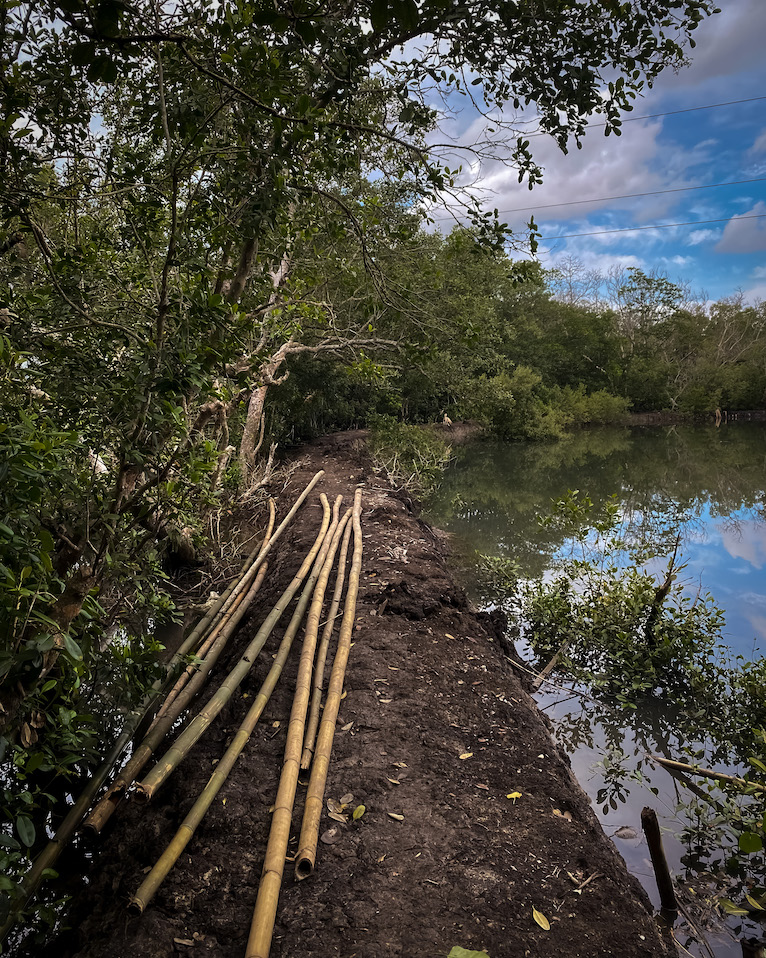

The white dog walked briskly on the muddy trail, a _pilapil_. Its small feet seem to float over the soil and led the animal as if they have a mind of their own. They know this trail, for they probably walk it every day. I couldn't keep up.

Not far from where I started, the mud began to get softer, and my heavy feet pressed on the ground. They couldn't float over the soil, so I am unable to go any further.

I stood up instead and looked around me. Nearby, I saw a fisherman's house built on the banks of the fishpond over the water. Some clothes hang outside under the _nipa_ roof. If those clothes fall, which they will by a strong wind, they will fall directly into the water, which reflects the house and the trees behind it.

In front of me, on the trail, a few long bamboo poles were lying down. They are big enough to build a bridge over these fishponds, but not big enough to provide structure for a house. Someone left them here, but he'll return to get them back when the soil on the trail starts to harden again. Over the horizon, large cumulus clouds begin forming over the blue sky.

My eyes got tired of looking around. Perhaps they were trying to do the walking I couldn't do now. My feet couldn't float over the muddy trail. But my eyes, my eyes could do the floating anytime, anywhere. And yet, they are tired, so I settled my gaze on the water and the banks of this fishpond below my feet. I crouched and looked for what I could find.

A few young mangroves grew here. Around one mangrove, I saw something move fast over the mud. It was almost invisible. Its color blended with the ground and was very, very tiny. Here, the locals call it _tustusak_ or _mananaltak_. A Google search would say it is a mudskipper. This one is so small, it is probably a baby—but a baby who knows how to swim, who knows these waters, and who moves really fast.

Not far from it, something larger began to move. It had an irregularly circular form. Whatever was underneath it, it patiently carried that dome. Meanwhile, on a dead mangrove branch nearby, a cone-shaped shell was also on a very, very slow expedition. I was looking at both shells, patiently waiting for whoever completes its journey first, when, out of nowhere, a gray _katang_ (crab) walked sideways between the two.

I stood back up, still smiling, my legs a little cramped. The cumulus clouds over the horizon grew much bigger, and what was once a bright morning was starting to dim. I couldn't walk this trail, but it didn't matter. The creatures I saw were enough. Like my eyes, they did the walking for me.

I started my way back to the railroad when a large figure swam under a forest of mangroves on my right. It stopped, as if it sensed my movement when I stopped. I moved slightly, and it too moved, swimming towards the next mangrove. This time, I looked at it intently, reminding me of the _tustusak_ I saw just a while ago. But this had a brighter color, yellow-green, and it was bigger, much, much bigger. So, this is how they look like as adults.

They say that mudskippers are fishes that learned to walk on land. Some speculate that they are the ancestors of four-limbed vertebrates, like apes, where we came from. If they are right, I am looking at my grandfather or grandmother right now. And that is a good thought to end this very, very short walk.

