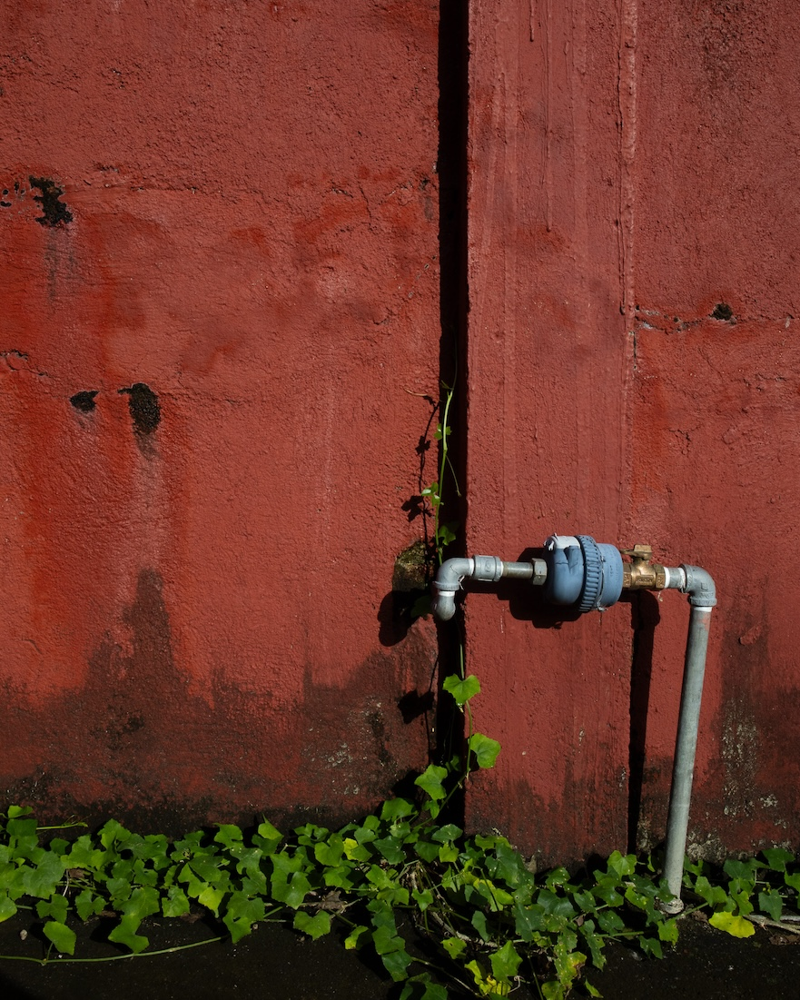

December 4, 2023

***

What sustains me in Los Baños?

Surprisingly, it seems to all begin with anonymity.

A friend once told me about this book that talked about the art of hiding. I remember her saying that according to the book, animals animals in nature know best how to hide survive longer than most others. After hearing this, I sometimes wondered whether I was hiding too much.

I live in the farthest unit of a four-unit apartment compound. The family at the first unit, the one nearest the gate, has been here the longest. When I first came here, they were my first friends. The father was keen on introducing himself to me when I first entered the gate. His wife warmed up with me later and gave me a bowl of kimchi she made herself. The couple had two children, both boys, one currently based in Canada, while the other lives with them. I don't see and talk that often with their son who lives with them, even if he seems to be the same age as me. But I often hear his name called by delivery men.

Early on, I was surprised to learn that this family was Jehovah's Witnesses. I heard them singing familiar songs while passing by their unit one time in 2021 when most religious gatherings were done online. In my first year here, the father approached me and invited me to the memorial of Christ's death, the only religious event JWs celebrate. I took the invitation but never attended. He never sent me another the following year; until now, this family doesn't know that I used to be one of them.

***

***

Anonymity can sustain you. Anonymity can be your saving grace. Even a forced one, I imagine, might bring something good.

A few months ago, I met Jhoanna Lynn Cruz, who threw herself into her own spiritual wilderness in Davao after a broken marriage. She brought with her her two children. She didn't know a single soul in that large city. Malaria got her son twice and made her want to give up. But she stayed. She persevered and now calls herself a Mindanaoan.

Sometimes, it's better to start over.

***

***

Surprisingly, I am also sustained by this morning rush. This blood flows from my arteries to my veins when I open my eyes and get out of bed. Full of innocence, these children playing on the streets of Los Baños this early morning are the blood that flows into this town's arteries.

***

And what of the sari-sari stores that are our bridge to the factories that make our food, soap, shampoo, and other things that become the cells of our body, that become, at one point, us? Do they not sustain us, too?

Last year, on the day my best friend was buried, a storm came so strong that the entire Los Baños electric power system came down for around three days. Most areas in the town also didn't have running water. Mt. Data Street, where I live, surprisingly, had flowing water. But that was it. We used to rely on an electric stove. Without electricity, we cannot eat. Rain was nonstop, and many of the streets I now walk lay underwater.

We got by through processed, packaged food bought in the store. This is the Philippines. This is nothing new. But it is still worth writing about.

These stores, perhaps inherited from the Chinese (but we call them the Spanish word _garita_ in Pangasinan, which warrants some research), are so prevalent we've refused to even think about them. We try our best to avoid them if we can. All those sachets hanging inside the sari-sari store, along with all those sugar wrapped around with colorful plastic, are more expensive by a few pesos compared to those we buy in the grocery. And yet when I'm in the middle of a long essay that has to be written, and I'm sleepy of hunger and no food is in the fridge, I walk toward the humble sari-sari store near my house.

***

***
Here at Mt. Data Street, the white, fat dog who once stood out from all the others is now overrun by scabies. He frequently sits and turns his upper body behind his back to scratch the scabies with his mouth. He sits on clear, pristine roads, cleaned by house owners. Here in LB, the street segment in front of your house is yours. You park your car in front of it if you don't have a garage. If you own no car, this is still an unspoken rule: you clean the segment of that road. Walkers like me will forever thank you for it.

***

Tiny dogs often bark at me when I walk here. They constantly remind me that I can't have a dog unless I want my life to get more complicated. The night I left Pangasinan to relocate to Los Baños, I left two dogs at our family's house in Pangasinan. I will never see one of them again.

The first place I rented while looking for a more permanent place to stay was a large room on the second floor of an apartment complex. The floor was wooden, and I smelled the cigarette smoke from the single mother renting below me.

A cat befriended me, a tilapia colored female, while there, so I felt obliged to buy food for her. Later, a second cat, a black and white female, appeared. I shooed her at first but felt bad about myself for doing so. I decided to treat them equally.

When I left that room after two months of renting and finding the unit I am now renting, I couldn't wrap myself around the thought of leaving the two cats. So, I took them with me. I remember hiring a tricycle driver and sitting inside while holding between my legs a large cage with the two cats loudly meowing around Lopez Ave., Santos Street, and finally Data Street. It is one of the most expensive decisions I have made with my life here. But I don't think I could've survived that first year in Los Baños without the friendship of these two cats.

***

***

It is 7 a.m. now. I've been walking for 30 minutes. I hear the sound of the train from afar. Perhaps this is the first train to arrive today. A train arrives at 7 in the morning and 7 in the evening, with others arriving intermittently in between. Of course, the train from Manila and traverses Laguna, bound to as far as Bicol, has been passing by Los Baños for over a century. When I arrived here in 2021, there was no train, however. It only resumed operation this year, if I'm not mistaken.

When I first heard the train one morning, I was too ignorant I thought it was the water pipe in our bathroom, which sounded similar when broken. Another time, I mistook it for the sound of our blender. Only after seeing the train one evening while walking at IPB Road and hearing the same sound did I finally figure out what is too obvious to many.

***

It rained yesterday—torrents of it. So, I wasn't expecting all this sun. Often, LB gives a lot of sun briefly for 30 minutes in the early morning before it rains for the entire day. The brief sun we are given in the morning is a gift. We have to wake up early just to have our clothes dried. When I see clouds beginning to move fast, I rush to the clothesline.

Hopefully, this sun lasts.

***

***

When you see tarps of the recently graduated, especially those with the words cum laude on them, you remember it is a university town, after all. Dorms usually have these tarps. When dorms hang these, I interpret this as them saying that, somehow, what made these good souls succeed in their studies is the warmth of their beds, the security of their rooms, the friendliness of their landlords, perhaps. Once in a while, you'll see one of these tarps hanging from a house or a business establishment: Son of the owner. Daughter of the owner. And you can't help but think, she's from here. She studied here, when will she ever leave?

Sometimes, I wonder which is more important for Los Baños, which brings more business to folks: the school or the baths? Living too far from the baths to feel their presence consistently, I tend to think the school is more important. But both the school and the baths have the power to draw traffic.

***

The reason why it was so easy to adopt cats in LB is because there are too many of them on the streets it's almost a thing here to adopt at least one. No other place in the world has such a love of cats.

A few months ago, one of the cats inside the University of the Philippines campus got hit by a car. It died right away. Students built an altar of flowers for the cat near the spot where it got killed, which stayed there for about a week. People came by to pay their respects or to take photos. I heard they are still on a manhunt for the suspect. That is how much people love cats here.

This makes me sad when I hear that live kittens are sometimes left inside drums or under bushes, crying for days before they die. Perhaps such is the paradox of place.

***

***

Los Baños streets are uncharitable for walkers. They're too small and yet hold too many cars. Except inside UP, most streets have no sidewalks. Even narrow streets can be surprisingly busy sometimes.

I love empty roads with no cars or those not too busy. They make me feel like they were designed especially for walkers: an oasis in a town intoxicated with cars.

***

I reach Ruby and it is now past 8:00. I'm no longer alone. Students walk with me, tiptoeing over wet stones and going to the road's edge to avoid cars and tricycles. I wish I could walk for my parents and family again like these students do now.

We pass by apartments for rent and laundry houses near them. In Banawe Street, the front yard of a house was turned into an eatery. A few blocks away at Sapphire, a family opened a restaurant in their garage. This is a town built for students. There is a budget price for almost anything. Incidentally, those who choose to live cheaply while they do their art find solace in a town made for students.

I walk slowly to savor the smell of butter on rice.

***

***

But it isn't students alone who walk here in the morning. I share the road with some of those who just came from work. And these are blue-collar workers, men in slippers, eyes sleepy, hugged by tight sweatshirts.

I pass this compound at Banawe Street with a large bungalow house and cat cage outside. The cage has several floors, and pet bowls and beds are on each floor. There are no cats now. I wonder whether this is a shelter for cats or a property of the Cats of UPLB.

***

I heard neighbors joking around and laughing as I felt a sudden increase in the volume of people walking. It's about 9:00 am. I feel a slight change of mood within me. From gratefulness, I now welcome a feeling of survival. Along with all of these, the sun has grown hotter.

It seems that it will be a sunny day after all.

***

There is a weird-looking apartment complex on Mt. Pulog Street. I like to call it the castle. Spiral stairs that connect floors are like towers of a fort. That is too much brick on a building. No one would dare build something like this now; it must have been here long ago.

***

***

Speaking of Mt. Pulog Street, this name is a typo. There is no such thing as a mountain in the Philippines named Pulog. This is Mt. Pulag, one of the many peaks up north in the Cordillera. But who cares? The name has worked for many for a long time already, nobody bothers anymore. I, too, call the street Pulog.

Aside from its name, there are other funny things to behold on this street: cut plastic bottles made bulbs for lights on fences. And as if that wasn’t enough, someone was riding his bike with a loudspeaker playing.

***

Los Baños is an old place with old people. Old people like fallen twigs, like these quiet houses.

***

***

Something has to be said about water meters. Often left outside compounds alone and only checked once a month, they are one of the loneliest objects ever invented.

In 2021, my first year here, a garbage collector stepped on my water meter to get over our fence. I bet he was eyeing to get a piece of metal or wood lying around our front yard. He never made it over the fence. Instead, he broke my water meter and my water pipe. For the next three days, I fetched water from my neighbor’s faucet while waiting for the water company to come to repair what was broken.

What was really broken was my faith in the scrap men who ride their tricycles around. It took me a while to regain my respect for them. But when I did, I started a conversation with one. It was in the middle of a tight lockdown. I asked him how often he moves around buying metal and scraps. He said he harbors ill feelings for the present mayor for only giving them the weekends to earn their living. I empathized with him.

***

***

Above Mt. Makiling Street is an open vacant lot with trees and bamboo. It is elevated. I see below it the roofs of houses. I rested here as a strong cold breeze blew, comforting my perspiring body. From afar, dogs bark.

***

I am grateful for students saving the businesses here.

I am grateful to the river for its patience.

I am grateful for mothers waiting for their children outside the school gate.

I am grateful for a local government that seems to be functioning.

I am grateful for this sidewalk.

I am grateful for drivers who stop for pedestrians crossing.

9:30 am on Lopez Ave. I hear the train once more.

***

Just now, I used the viewfinder to take a photo of this leaf. There is something about using the viewfinder that is magical, almost mystical. The little box is a meditation on objects and our interdependence with them.

***

***

These long walks are like seiza. You let yourself be sucked by images and thoughts worthy of being written later. But then you remind yourself that you are walking. You remember the main task at hand. It centers you. This is particularly useful when you start to feel impatient with the heat, tiredness, or boredom.

I pass by balitbitan trees, and the memories of my first weeks here return.

***

Theory: The houses on the right of Lopez Ave. going to UP are those of locals who have lived here for so long, while the estates on the left are subdivisions and apartment complexes made for those staying in Los Baños temporarily.

***

***

A friend said that half of Halcon Street is privately owned. The land owner was intent on making this as clear as possible that he placed tens of large concrete barrels on half of the road. This effectively deterred motorists from avoiding the road. It is a perfect reminder of how far one can go in protecting his property.

***

***

There is a single mosque in Los Baños (as far as I’m aware of): the IMSA Jammi Al-khair at Bulusan Street. One of the best moments of my stay here was my first Christmas Eve morning when I heard the Imam sing.

I stopped to take a photo of the mosque, which reminded me that it took me a while before I felt comfortable pointing my camera at it. It was an afternoon last year. The imam was also singing, and the dogs were howling with him. I took my phone out of my pocket and grabbed a photo of its beautiful blue dome. I felt ashamed of fearing what was different. This is why I’m so grateful for walking. It shows me my blind spots.

***

***

What sustains me in Los Baños?

Jericho’s pandesal and the occasional Micha’s.

***

***

Mt. Data Street → Sierra Madre Street Extension → Sierra Madre Street → Banawe Street → Cordillera Street → Onyx Street → Mt. Pulog Street → Mt. Makiling Street → Amethyst Street → Mt. Kitanglad Street → Ruby Street → Mt. Isarog Street → Jade Street → Taal Street → Diamond Street → El Danda Street → Lopez Avenue → Halcon Street → Bangkal Street → Daang Kalabaw → Jose Street → Dinorado → Elon-elon → Intan → Oregano → Lemongrass → Basil → Rosemary → Mint → F. O. Santos Street → Pearl Street → Banahaw Street → Bulusan Street → Opal Street → Ruby Street → Mt. Arayat Street → Sapphire Street

15.7 km
22,332 steps

