December 05, 2023

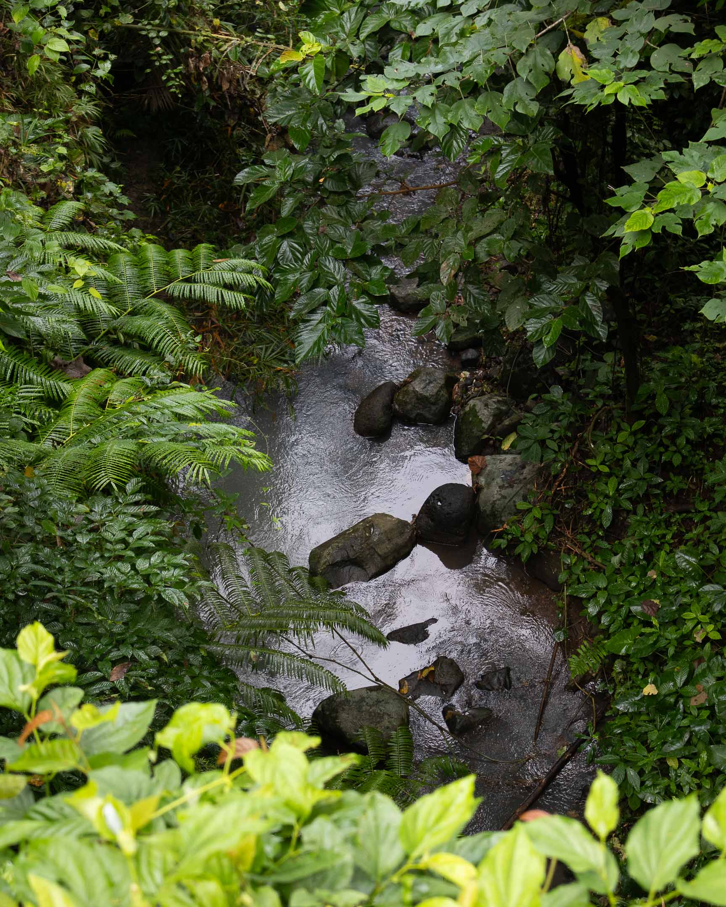

***

Yesterday, when I started walking around 6:30 in the morning, I remember feeling the slow arrival of the day. It was only around 7:00 when I started to feel the streets changing and with them, my mood. Today, the morning gushed to me both from and toward Raymundo Gate. I march alongside students entering the campus, choosing our own spots as vehicles make their way out of the gate. The traffic enforcer and the pedestrian lane have no use in these instances. We all follow each other's movements, an unspoken agreement, bringing us to where we need to be.

After Raymundo Gate, I walked the slope of Jose R. Velasco Avenue.

***

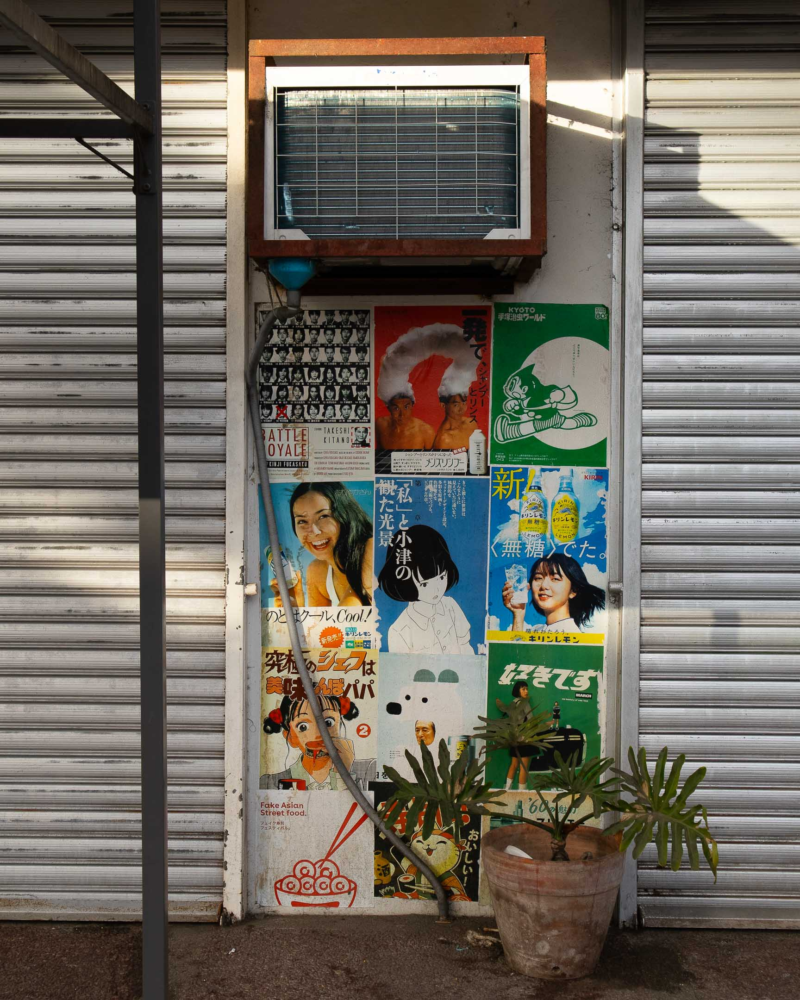

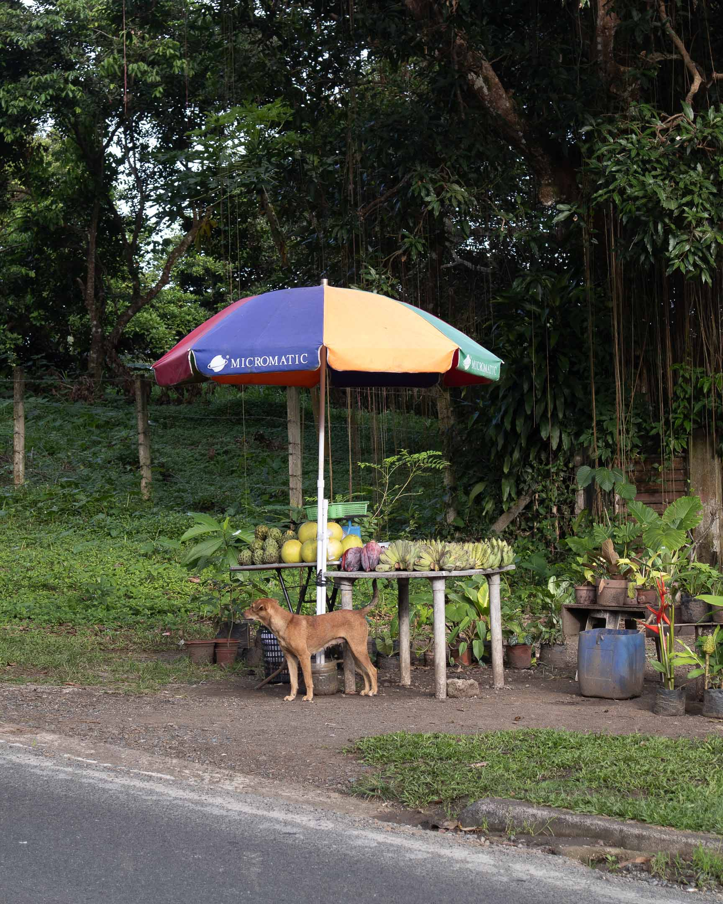

***

Welcome to UPLB, a campus of interesting histories, some unwritten, including the story behind these street names.

If one becomes a regular walker of the campus, one would notice that some streets would have concrete signs, on the side, way below. Most of these names are one word: usually, the name of a tree. The first sign I saw was one under a large tree at the extension of Jose D. Drilon Jr. Street. It is "Caimito" (star apple). The second I saw was in front of the Pulp and Paper Research and Training Center at the College of Forestry along Domingo M. Lantican Avenue. This one said, "Narra." Interestingly, nearby is the Narra Guest House, perhaps the biggest house along the avenue, often empty.

I think I came to the conclusion slowly by myself that these were the old names of the streets. Jose D. Drilon Jr. Street was once Caimito. Domingo M. Lantican Avenue was once Narra. Writing this now, I discovered that someone wrote about this change in a blog post dated October 24, 2012. According to the writer, the change of streets started around 2008 with the new names after esteemed alumni and professors of the school.

All this makes me think about how we name the structure of dirt, rocks, soil, grass, and cement that we call roads, streets, and avenues. As a walker, I don't have any say as to how to name these paths my feet kiss daily. Those with the power to name and rename them do so with a specific agenda I won't always be able to connect. These new names are like the Linnean taxonomy. They uproot me from my experience of the object being named. I wonder whether I should rename these streets with my own fictionalized names. Fiction sometimes is closer to truth.

***

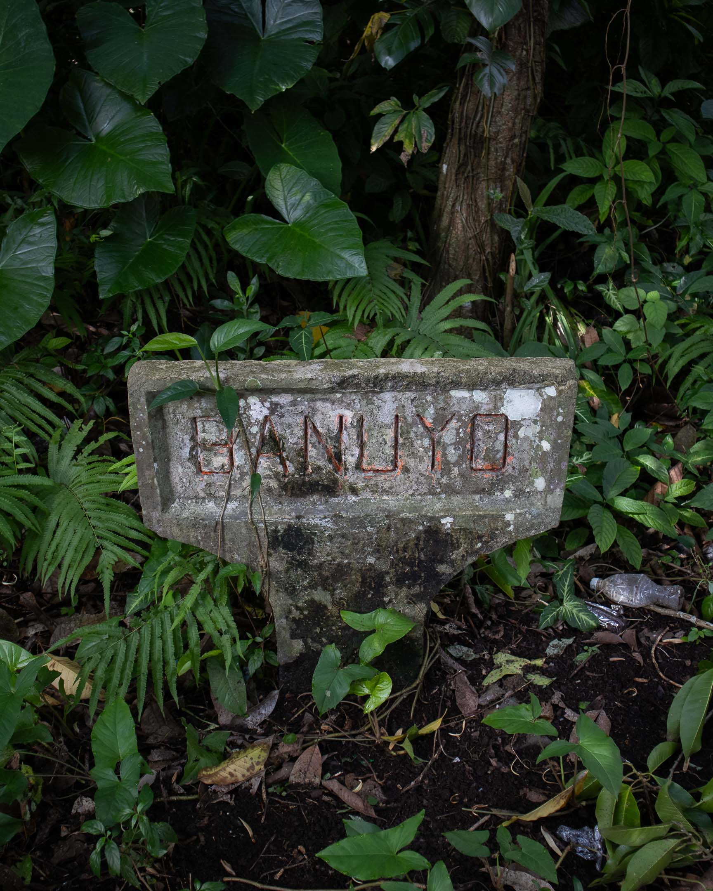

***

Cars, people jogging, students brisk walking, laborers having breakfast while in their boots, and work clothes—such is the quality of the morning rush inside UPLB.

At Makiling's foot, man cannot keep up with nature. Nature cannot keep up with man. Each point in the geography, in the landscape, and even one's immediate space is a manifestation of this tension. Sometimes, they even out (as in Freedom Park). Sometimes nature consumes all (as in abandoned houses near Forestry). Sometimes, man is obviously winning (as in the new library being built at Jose B. Juliano Avenue).

***

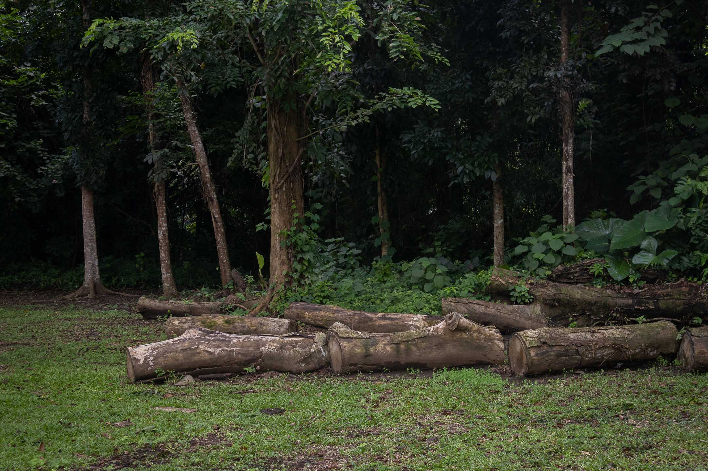

***

I slept too late last night. Too much blue light entered my eyes while editing photos and preparing the first missive of this series. I could've finished the thing faster had not my vet come for routine vaccinations. She recently came home from Japan, so I made her talk. She said that the current Philippine dairy sector has a lot of similarities with Japan. Both countries don't have an indigenous milk-producing cow breed and have imported their cows for dairy purposes. Also, both are experimenting with strengthening their beef production capabilities through genetics. In terms of Japan, they have started crossbreeding their indigenous cows with an imported variety creating Wagyu beef. My vet said we don't need crossbreeding as our indigenous carabao's meat can compete. The carabao, she said, could be a draft animal, a dairy animal, and a meat animal. She went on to praise her decision to specialize in large animals. She said working on large animals is less complicated because people are not emotionally invested in them. They are there for draft, dairy, and meat. Meanwhile, small animals are there mainly for their love.

I am reminded of this conversation while walking inside UPLB this morning. The question of how we relate with animals is the question of how we relate with others and places. Everything boils down to which people and places we are most emotionally invested in and not. Contemplating this, surprisingly, could explain all sorts of prejudice.

***

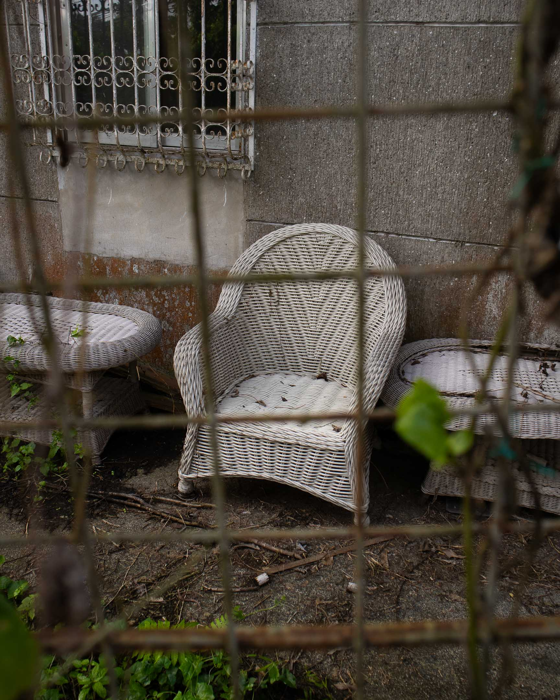

***

As I turned toward Jasmin, two tiny girls sat on the top of a huge hill of sand. The road is currently under repair. I stopped, turned to them like I was James Bond, and jokingly aimed the camera at them. They seemed to like this very much. I went back to walking, but they called me again. I looked back, and they giggled.

Sometimes, I want to leave LB. But often, I realize what the alternative is. And that makes me feel more grateful for the status quo.

A yellow and black butterfly appears.

***

Some of the best houses on the campus are located on this long road called Doña Aurora. It is a path parallel to the larger Jamboree Road and the smaller Jose D. Drilon Jr. Street. I enjoy walking in this neighborhood for its silence. Without clouds, one would also see Mt. Makiling's peak.

At the end of Doña Aurora, you could turn right to a small tree-filled street called Heliconia. Heliconia will bring you to SEARCA's Executive Houses. I imagine these buildings are for the most esteemed guests of the university. They're often empty, with only a single guard to watch them.

I often walk here in slippers. Walkers and joggers seem to avoid this road.

In front of an executive house, a new building is being built. This morning, the workers lined up for a picture-taking. I ran quickly behind them to avoid the camera. As I continued walking, a van full of laborers (some already hanging outside the vehicle) passed by. They seemed to be going to where the picture-taking was happening.

Many buildings are being built in the university. Man and gravel is currently winning.

***

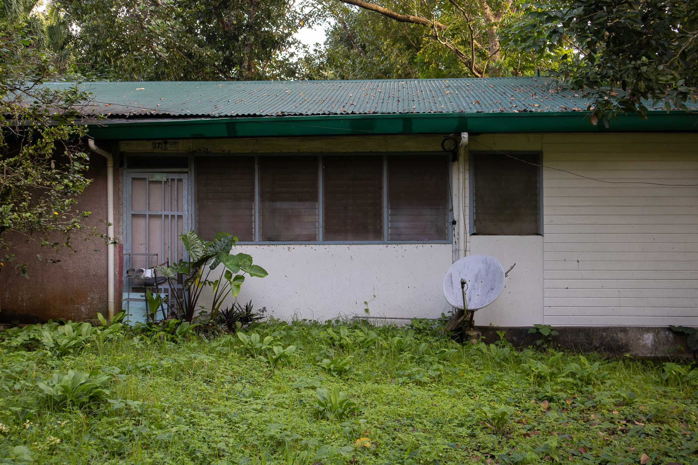

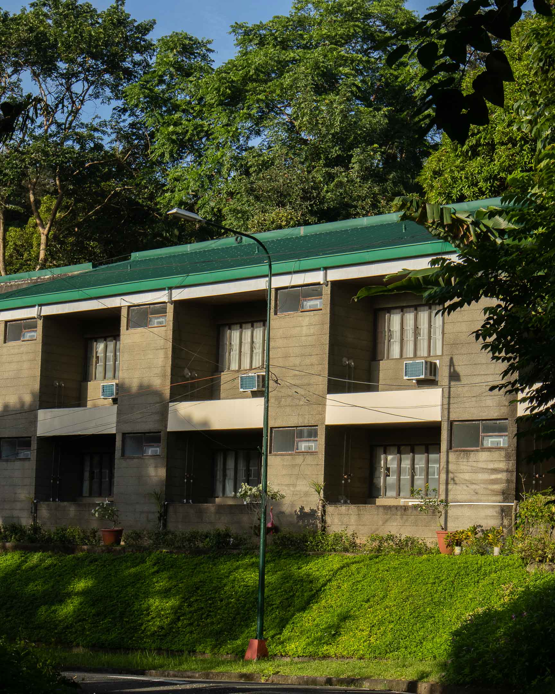

***

These walks are a dance between walking, writing, and photography. I never force the writing. I focus on looking, and that is photography. As long as you take care of images, words will follow. You take care of images by walking right.

Yesterday, I took around 160 photographs in five hours of walking. That's like one photo every two minutes. I don't take photos with that rhythm, though. I notice I take more photos when I'm walking slowly and not thinking, often in the earliest hours of these walks. By 10, I start to lose steam, and the photo capturing becomes less frequent.

Not all photos are worth keeping, and not all worth keeping are worth sharing. Among 160 photographs, I only shared about 20 photos yesterday.

A shitzu's head outside the window of the front passenger's seat just passed by me. That would've been a nice photo. But the best photos are often the photos we never take.

***

As I leave Doña Aurora, I spot a few herons walking on the short grasses under the sun. A few yards from them, someone is cutting the grass.

At the back of our house in San Jacinto, Pangasinan, herons follow the motorized plow or tractor whenever it begins to till the soil at the beginning of the planting season. They look for mollusks, insects, and other little things they can eat. I once called this a symbiosis between heron and machine.

I wonder whether they are drawn toward the sound of the motorized cutter.

I smell someone cooking _daing_, which brings me right back to that dining table in Pangasinan.

***

Walking down Melanio A. Gapud, I remember that when I set the route for today's walk, I did it mostly by intuition. I knew I needed to begin in Velasco before hiking up to Forestry and going down to the streets around Freedom Park to sort of embrace the campus. I've walked these streets too many times I feel like there are no more words and images to be found in them. I have written their names on my computer many times, I can recite them by heart. That is how much I have walked these paths. I am not sure whether this is love, though, or whether it is obsession.

***

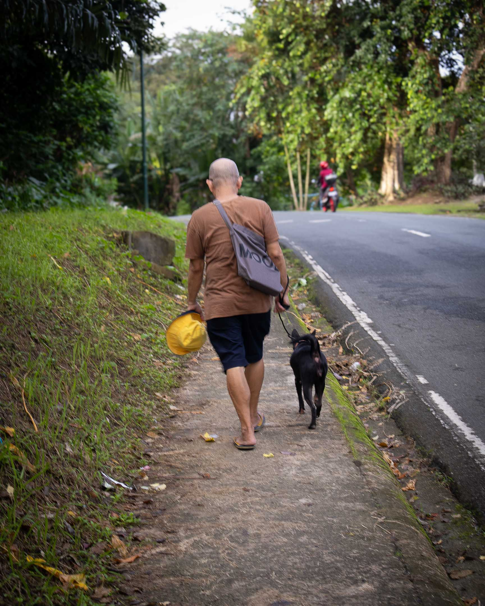

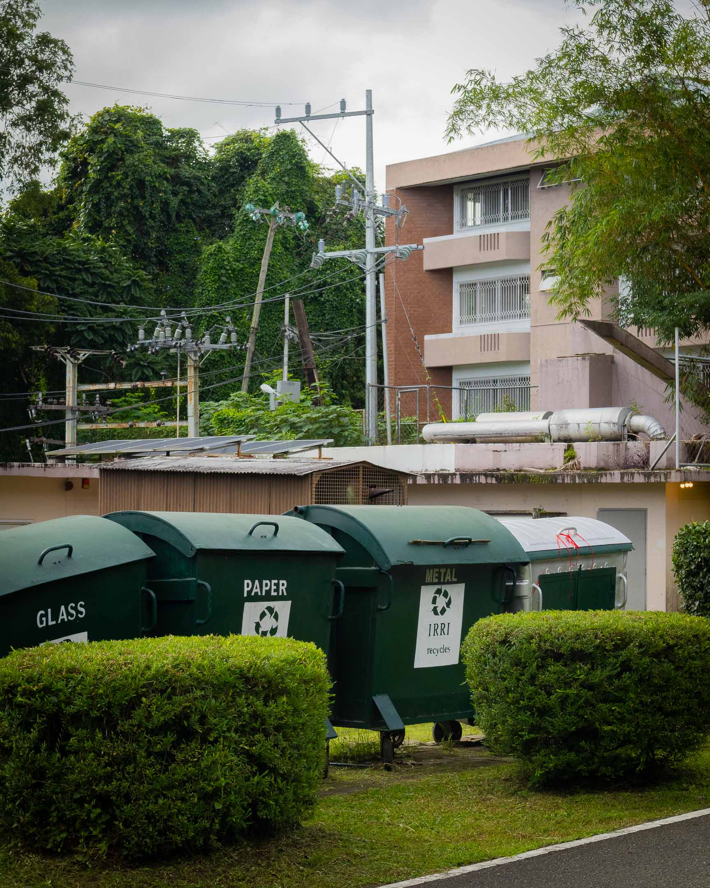

***

A family passed by.

I sometimes find myself debating whether to have children or not. Things are getting worse, it seems evil to bring people into this mess. I think I'll be overly attached to them and to their children. And I am afraid I might pass on something bad. I now know that love is impossible without these fears. LB is a good place to have a family. It lessens the bad inherent in the world.

***

Walking up this steep, mossy sidewalk toward the College of Forestry, I see that talinum has overgrown once more. Talinum was part of the stew that Japanese soldiers fed the over 2,000 prisoners inside the infamous Los Baños internment camp during World War II. The camp encompassed half of the present-day Freedom Park and most of the College of Veterinary Medicine and the dorms around it.

The Japanese would feed the prisoners, mostly Westerners, at 7 in the morning. Their breakfast was usually just rice and coffee. Their next meal would be dinner at 5 pm, which was usually rice and stew full of talinum leaves that must have grown abundantly inside the campus and tiny pieces of meat hidden under the talinum. The Westerners called talinum "New England spinach" and described it as "slimy and metallic." As the Japanese were losing the war, the internees missed their talinum as they were only fed rice.

Many internees, including children, died of hunger inside the camp. Those who were fortunate to survive the hunger were rescued in the famous Raid of Los Baños on the morning of February 23, 1945.

***

***

I have finally arrived at Forestry. Passing by Arbor Square, I see a few lone students sitting under the sheds. A group of grown men, perhaps professors or admin workers, gather under a tree, sharing stories and laughter.

Someone told me recently that today's kids wear clothes different from what we wore ten years ago. I beg to differ: jeans are still the go-to pants, shirts abound, and sneakers are still the national footwear. Or is this true among UP students alone?

***

Why are power lines positioned dangerously low here?

Those of us who live on Makiling's foot are so close to nature that we've been so unaware of it. UPLB residential areas here are like solar punk communities gone wrong. Houses yield to the shape of surrounding trees that one would often see roots by gravel. Wild plants from fallen seeds grow on roofs liberally. And yet there seems to be something missing despite all of these: a feeling that all of what surrounds Makiling's foot isn't sustainable.

The entire thing is still a keg in a huge industrial-capitalist complex.

***

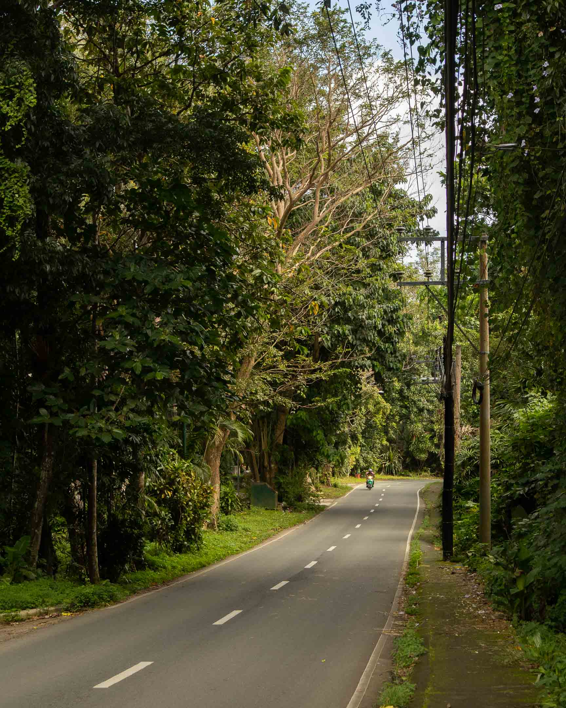

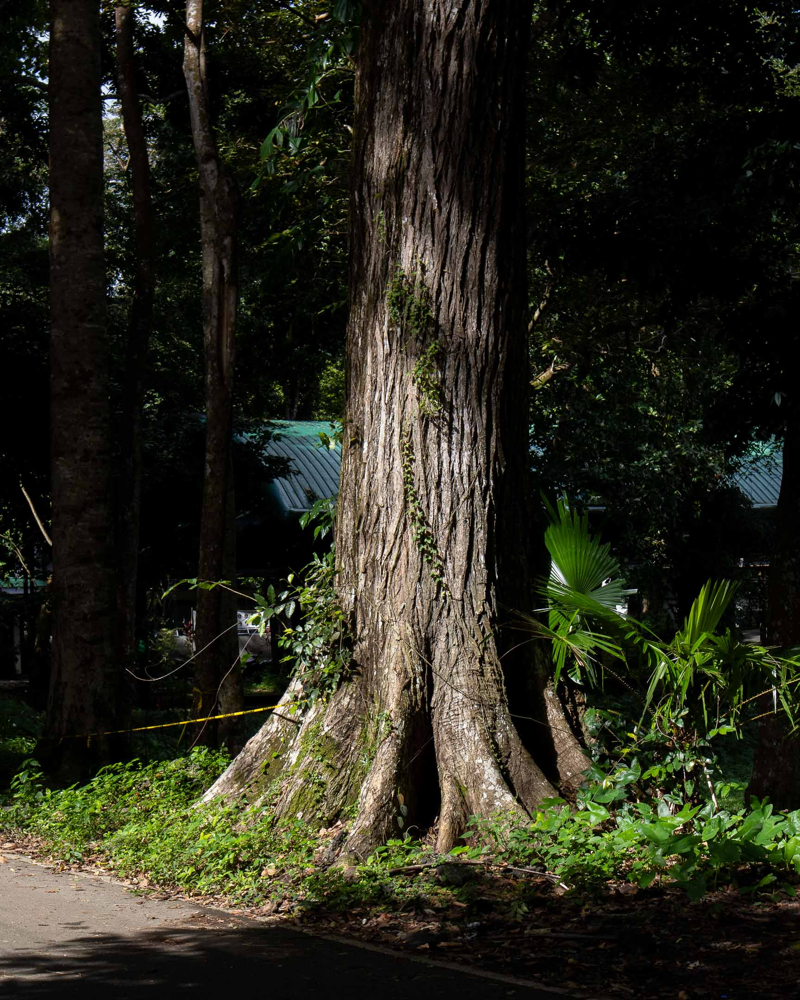

***

In the forest, there is no chatter. It’s like an ongoing _sesshin_, broken only by natural sounds. If this is the wilderness of the spirit, I would very much like to stay here. Forever.

I feel the tension on my feet and the tiredness in my limbs. But I keep on.

***

At the end of Forestry is the entrance to the Mt. Makiling Trail (MMT). Beside the trail are two branches that both lead to a dead end. The first dead end is wherever the Makiling Botanical Garden ends. The second dead end, I assume, is this: Banuyo. The last of the streets in Forestry I'm walking today.

Before you reach the cluster of homes at the end of Banuyo, you will pass by a short bridge. At the mouth of the bridge are two interesting objects: a broken concrete staircase covered with vines that lead directly to the river below and a broken van at the side of the road left to be consumed by the forest. Over the van, flowers blossom.

It is just my second time to visit this scene. I was so enthralled by the van the first time that I didn't notice the staircase. I surrounded the van like a police enforcer looking at a crime scene.

Today, I noticed both the stairs and the van, and I can't help but ask whatever turn of events led to where all of these objects are today. I remember Aristotle's notion of the "unmoved mover" that he presented in Book XI of his Metaphysics.

In plain terms, Aristotle argued that everything that changes is in motion. This staircase and the van move even when not in motion because they decay. Now, everything that moves was moved by something else. The vines corrupt the staircase. The forest eats the van. In turn, primordial forces make the vines and the forest grow. And so on and so forth.

Now, here's where Aristotle's explanation begins to climax. According to him, we cannot trace the source of movement from infinity. We can't have an infinite cause. What we can have is—a first cause. This first cause, this ultimate cause, could not be made of physical matter (because if it is, it could have been moved by something else). Its nature is so mysterious religious people all around the world latched into the notion and called this unmoved mover God.

I haven't made peace with the idea of an unmoved mover. For me, its simplicity is beautiful. This is the only reason why I entertain the possibility of the existence of what people would call a God. But to say that this unmoved mover talks and thinks like me is too far a leap to my taste.

***

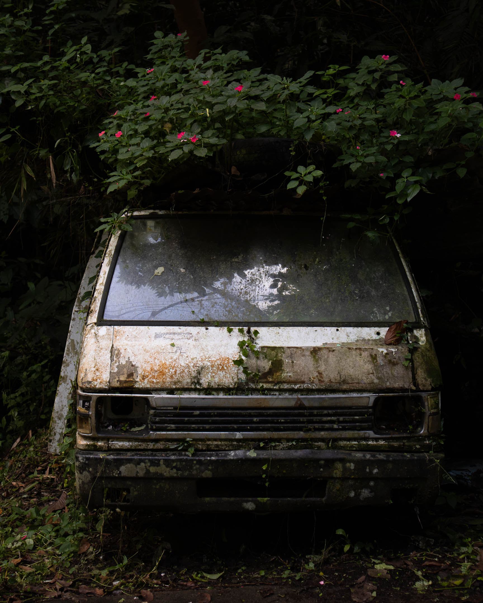

***

In the past, I would pray to Jehovah before I sleep in the evening and before I wake up in the morning. The evening prayers are unusually long. It got to the point where I was talking to him more frequently and deeply than I talked with my real father.

The prayers would mostly be about gratitude and asking for forgiveness. In retrospect, all those prayers made my ego too small I was willing to sacrifice everything for an invisible Big Father in heaven. I never asked for anything that would improve my lot materially. I felt like it was wrong to ask for favors.

I can no longer remember when I last talked to him. All I know is that conversation was full of anger, and things didn't go well.

From 2012 until today, I have never felt the need to talk to someone invisible. I could function well and live my life without serving an omnipotent power. I am no longer afraid of displeasing anyone, especially someone I couldn't see. And I seldom ask for forgiveness, only to those I love that I did hurt (and usually to myself).

I honestly think one can do away with life without a God. I don't need one to be kind and good and loving. I can be kind and good and loving by myself, by my own choice. I could nurture these habits for myself. I could help others nurture it for themselves. We could all be good without fearing punishment. A purely natural, ethical way of life is possible without a God.

The only reason why I call myself an agnostic instead of an atheist is because I intentionally want to make known that I no longer care that much about this issue. The Buddha had some metaphysical ideas but he avoided explaining his metaphysics too much to his disciples that they forget what matters most: compassion.

The idea that a god (or gods) exists is perfectly logical, and it is a common belief even among ancient people. A belief in an omnipotent persona solves several metaphysical and epistemological issues. But it doesn't solve everything, and it isn't necessary to be good toward others.

I respect everyone who believes in an omnipotent persona. But I find that it is also my duty to remind people that I can still love them deeply despite our differences. There would be nothing more that would make me happy if they could learn to love me back.

***

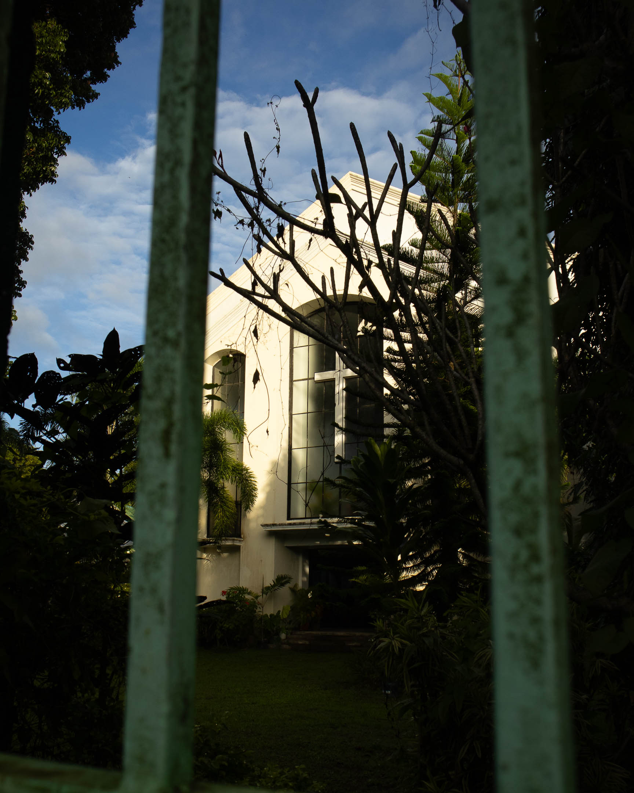

***

I am so deep in my thoughts, so deep I fly like this hawk hovering over the green-blanketed sentinels of Makiling's Foot.

***

I ended today's walk by walking down Juan V. Pancho Street and turning left to Getulio B. Viado Street to join students walking toward their dorms. It's past 11:00, and everyone is hungry. I stopped briefly to take a photo of another building overcome by nature before turning toward Copeland Gymnasium.

Here, at Joseph C. Madamba, sunrise shines the best, or so I heard. I walked past an empty lot filled with short trees and bushes that used to be a barn for cattle before turning left to the College of Veterinary Medicine. There, I saw the Carillon Tower emerge out of the trees of Freedom Park.

***

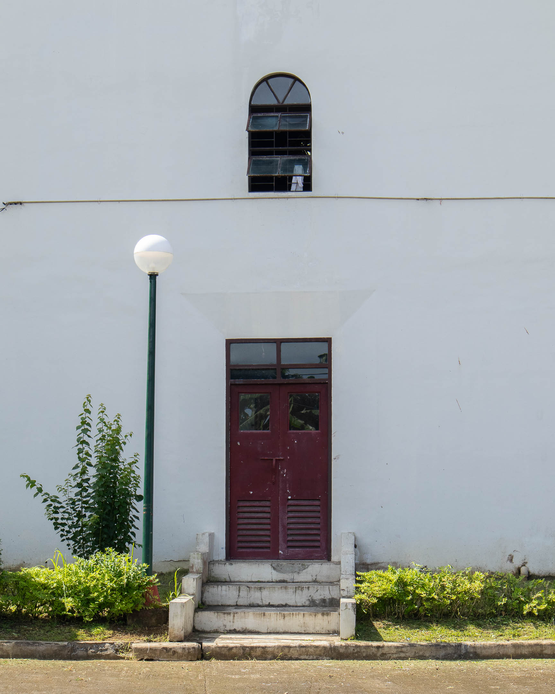

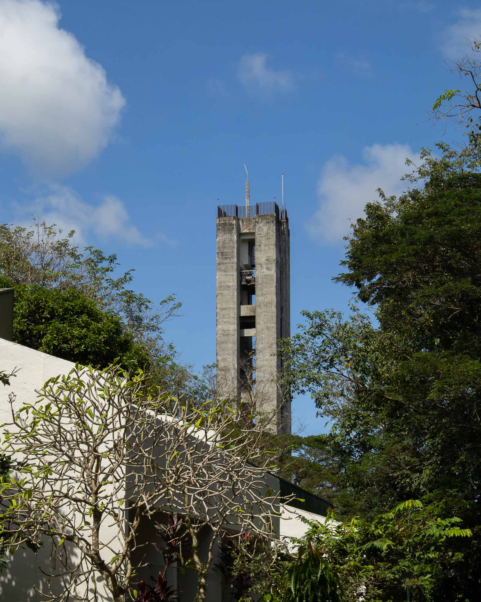

***

Jose R. Velasco Avenue → Kanluran Road → Jasmin → Doña Aurora → Heliconia Street → Melanio A. Gapud → Jose D. Drilon Jr. → Domingo M. Lantican Avenue → Makiling → Felix O. Chinte → Valentin Sajor → Rosario Cortes → Banuyo → Tindalo Street → Juan V. Pancho → Getulio B. Viado → Joseph C. Madamba → Archibald R. Ward → Manuel L. Roxas → Mariano M. Mondonedo Avenue → Harold Cuzner Royal Palm Avenue → Andres P. Aglibut Avenue → Jose M. Capinpin

23,212 steps
16.8 km

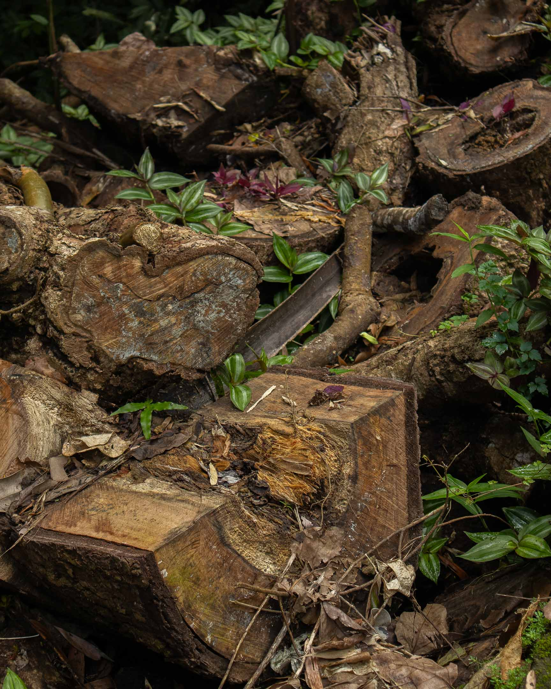