December 06, 2023

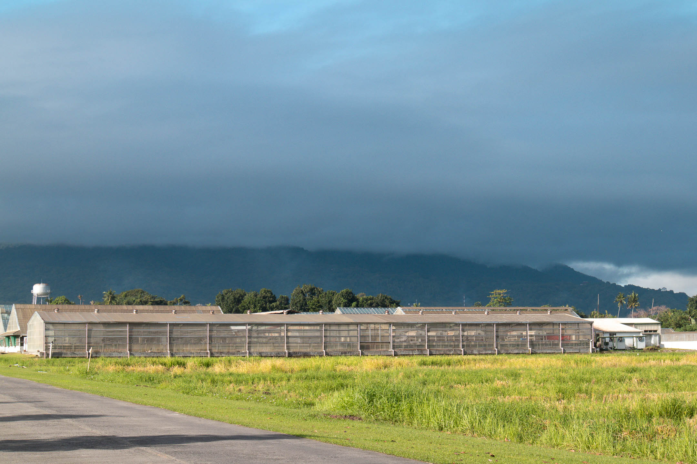

***

I underestimated the endurance needed for these walks. Since yesterday, I started feeling a strain on my left foot, which has a history of strains like this one. It's also the first time I woke up at 6:00 in the morning for three straight days in a long time. On top of this, the time required to prepare these email missives is surprisingly huge.

When I reach home around 11:30 in the morning, I immediately upload the photos from my camera to my Macbook, which takes a lot of time. I'm currently doing it via wifi, and I'm not sure whether I should be using a wire instead (and what wire?). It's taking years for the photos to upload. But this forces me to write the missives first, which I tend to finish at least before dinner.

After dinner, it's all photo-related work: culling, editing, and collating images with text. I usually finish around 12 midnight, which gives me just six hours of sleep in the past two nights. I think I'll take a day off from these walks tomorrow and resume on Friday. This means I must cut the number of walking routes for this week-long project. It's okay. We'll have more walks in the future.

***

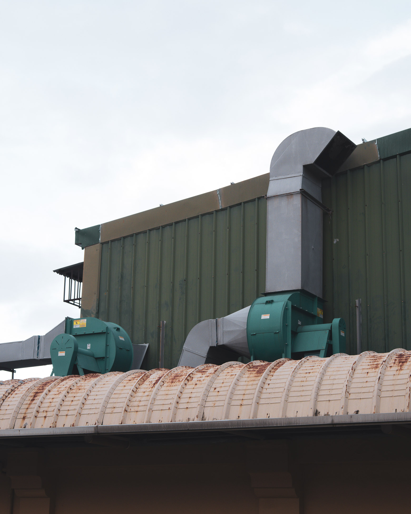

***

This morning, I walked on the side of the Manila South Road, the road that connects Los Baños to the rest of Luzon. The road is connected to a network of other roads and highways that would bring you as far as Infanta, Quezon, to the northeast and Matnog, Sorsogon, to the South. It connects with roads that surround Laguna de Bay and those that lead to Batangas.

I walked this path a few times. Perhaps this is the fifth walk. I walked here twice during the pandemic, a third time when I walked to San Pablo City, and a fourth when I searched for Maahas Road—a search that led me to the Nasa Labas ang Ili (NLAI) route where I guided two groups on contemplative walks last summer.

This is the first time I have walked here this early. Amid all these noises, I feel an unexplainable calm. Perhaps it is the coolness of this December breeze, a breeze that isn't typical for Los Baños but reminds me of my December in Pangasinan and Baguio. During my first Christmas season here, I often complained that the Los Baños December was too wet. It rains too much. Up north, I'm used to having long, cold, dry days in December, which often extends until February. The weather is a reminder that I have uprooted myself from my past—that I live far, far away from the old home.

It took me a while to hold my camera. It dangles down my neck, hitting my heart as I walk, but I feel no need to point it at something or someone. I miss this breeze. This is all that matters to me right now.

***

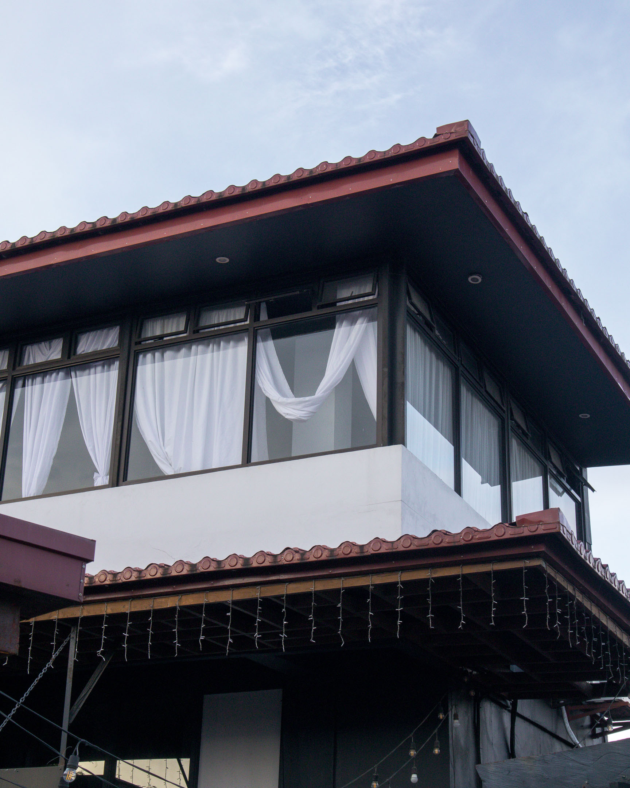

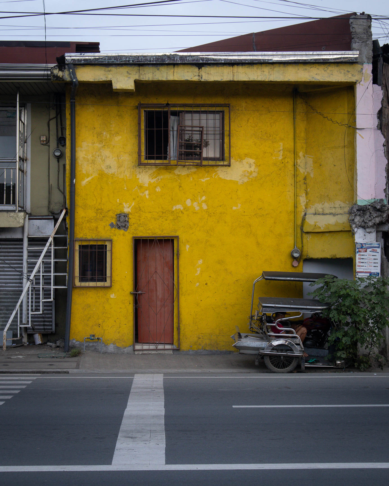

***

What called my hands to touch my camera are these colorful houses along Manila South Road, which I am only noticing right now. I’m amazed at how near they are to the road. This road is as busy as highways could ever get, and yet these people chose to live with all this noise. Being the ultra-sensitive person that I am, I'm easily bothered by noisy neighbors, construction, and the infrequent karaoke singing. One thing I love about Mt. Data Streets is it's one of the quietest places here in Lost Baños. This quiet is something I lost in my old home in Pangasinan but which I now have. Silence sustains me.

So, I’m compelled to ask: How does one live in the middle of all this noise? I look at the locals, some really old, sitting outside their houses this morning full of contentment, and I'm reminded of how resilient and adaptable all of us can be. We can all learn to find peace in the middle of noise and perhaps even find contentment in it.

I remember that absolute silence is impossible, and there is always sound around us. I remember most of my ancestors lived beside rivers that constantly filled the air with sound.

***

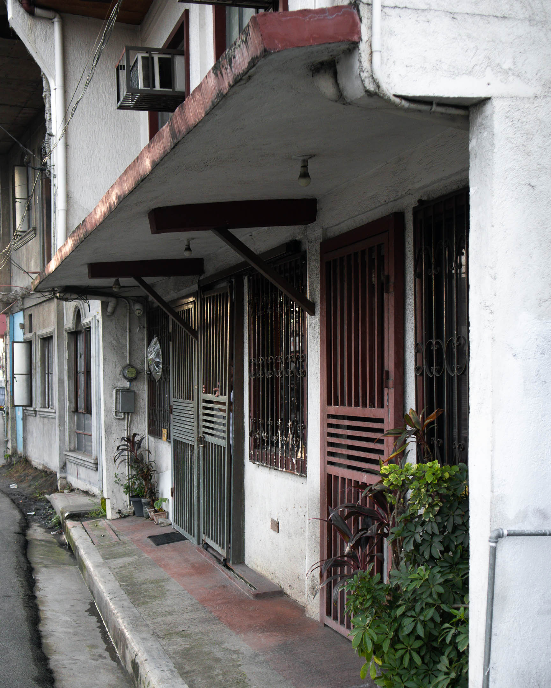

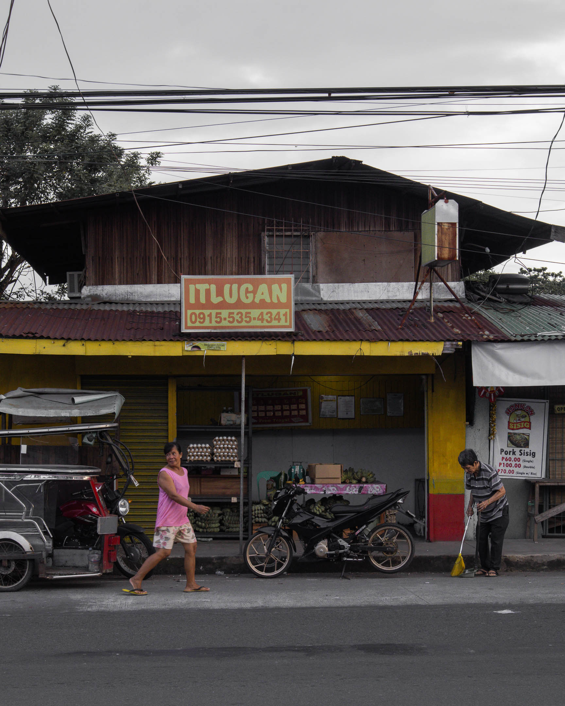

***

I trail behind a man who talks to people he passes by. He briefly stopped by the small bridge that crosses a stream of the Molawin River to exchange pleasantries with someone living in a three-story building beside the river. He continues walking only to stop again to talk with another man. I would very much want to be like this person.

***

My plan was to walk past the entrance to Maahas Road and get inside the University of the Philippines Open University (UPOU) and the International Rice Research Institute (IRRI) to walk around for a bit before returning to walk Maahas Road. However, upon entering the gate to UPOU, I realized how easy it is to access IPB Road from IRRI, so I decided to skip Maahas Road altogether. I have walked that road in the past anyway and have actually written about it, too. UPOU and IRRI, on the other hand, I am yet to walk around.

There's much to be said about one's first walk in an unfamiliar place. The potential to discover something new regardless of the pleasantness of the sites by itself is fulfilling. I think a big portion of this fulfillment comes from confronting what is unknown, what has been a dark part of one's world for so long until now—the wilderness.

***

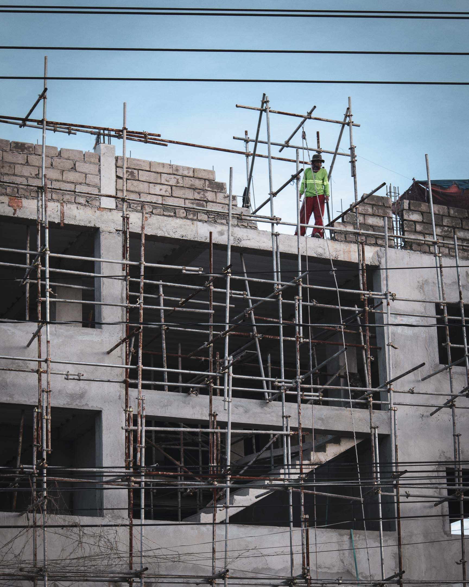

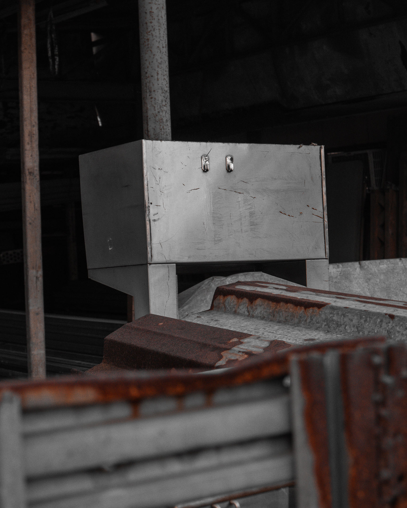

***

Aside from visiting the Veterinary Teaching Hospital at UPOU and the famous IRRI canteen, most of this place is a wilderness for me. Security measures here were really strict during the pandemic, so I never dared to enter either, even if they were relatively near Pili Drive, where I often walk. In fact, I just learned that Pili Drive extends to the IRRI-UPOU complex.

Today, I sought to know whether the complex is already open to the public and if it has returned to pre-pandemic situations when motorists and pedestrians come and go liberally. I warmed up by taking photos of the parking space just outside the UPOU gate. Then, I walked alongside two ladies who seemed to be students entering the guarded gate. I was let in. No questions were asked.

When I walk around a large place for the first time, I use a map. But the map only tells possible pathways. It won't tell you whether those pathways lead you to places you could access or are allowed to access. I had many experiences when I followed the map and was led to a path that was no longer used. For fear that this would happen here, I followed the path people were taking, the right sidewalk, which eventually led to IRRI and its portion of Pili Drive.

***

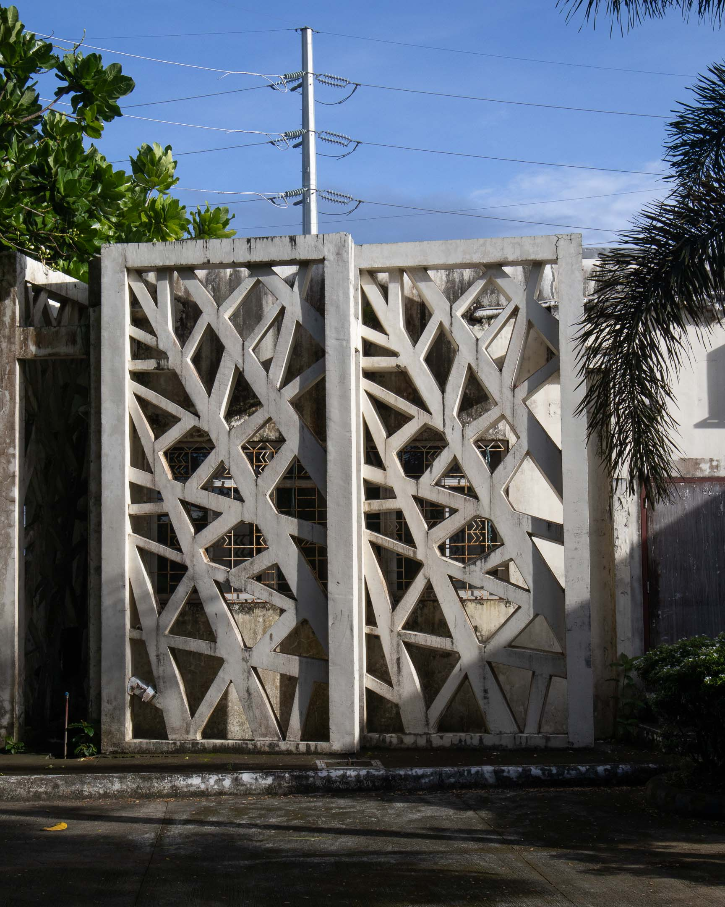

***

There is a constant flux of vehicles in and out of IRRI. It must have been open now for motorists. I last got in here in 2020 before the lockdown. Now is my first time walking around it by myself.

IRRI is an international research body located in 17 countries, mostly in Asia, but which chose the Philippines to be its headquarters, built here in Los Baños, Laguna. IRRI was founded in 1960, but I am yet to know at what year exactly this headquarters in Los Baños was built.

I walked on the sidewalk dangerously near Pili Drive, where vehicles come and go, and across are what seemed to be these large greenhouses filled with specimens. Talk about wilderness, I am confronted with my ignorance of what is happening inside this place.

***

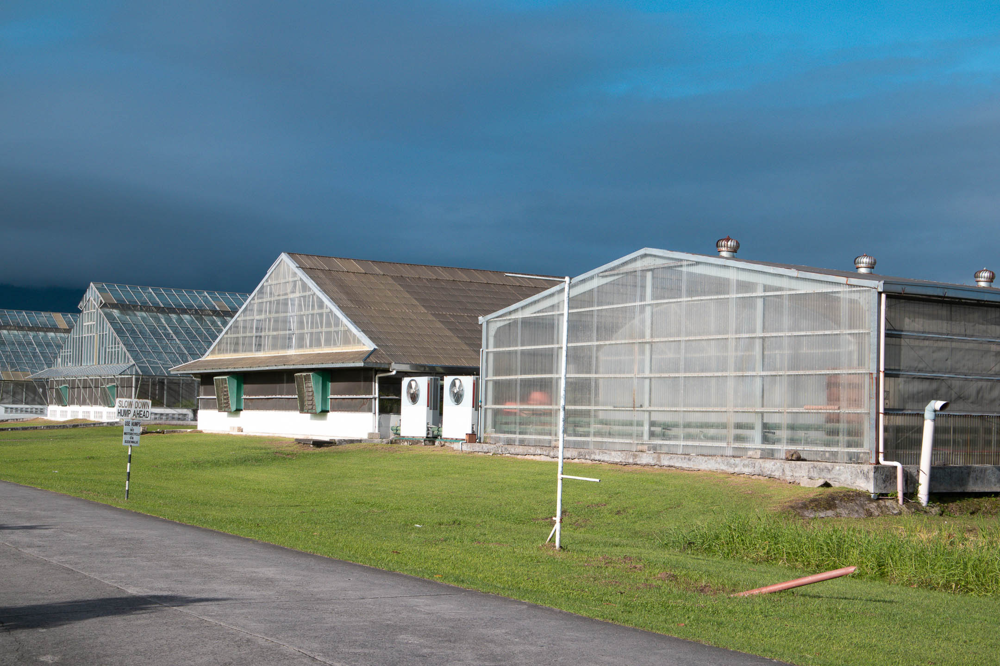

***

A co-fellow at the Ateneo National Writers Workshop, whose MA thesis was about the agricultural sector of the Philippines, presented a paper that offered a critique of agricultural modernization in the Philippines. He mentioned that IRRI has become famous for inventing many rice varieties, such as the IR-8, which grew in popularity under the name "miracle rice" in the 1990s.

While it promises to feed more people and achieve rice sufficiency, what rice varieties, such as miracle rice, do to once-rural areas like Los Baños is significantly reconstruct them by replacing century-old rice varieties and the traditions that come with them. The new rice varieties that replace them increase food production, a goal tied with nation-building but which is sometimes dislocated with the goals and traditions of local farmers.

Sitting now to rest at this shed in IRRI, I see several employees working in the fields. Their bodies are fully covered against the sun. They hold dirt and carry sacks of hay. I am forced to think about food, and especially rice, the most trivial of all food in the Philippines, a food that has defined Asians in general and a food that has sustained my ancestors for millennia.

Rice is what enabled anthropologists to identify where my race came from. Through rice stuck in ceramics, they were able to correct early mistaken claims that the first men to people the Philippines came through land bridges. No, they didn't. They came through boats: a sea-faring people. And they took with them this white food from heaven. Through rice, anthropologists were able to describe the Austronesian (or Nusantao), the ancestors of Filipinos, Australian aborigines, Pacific islanders, and even the Malagasy of Madagascar.

***

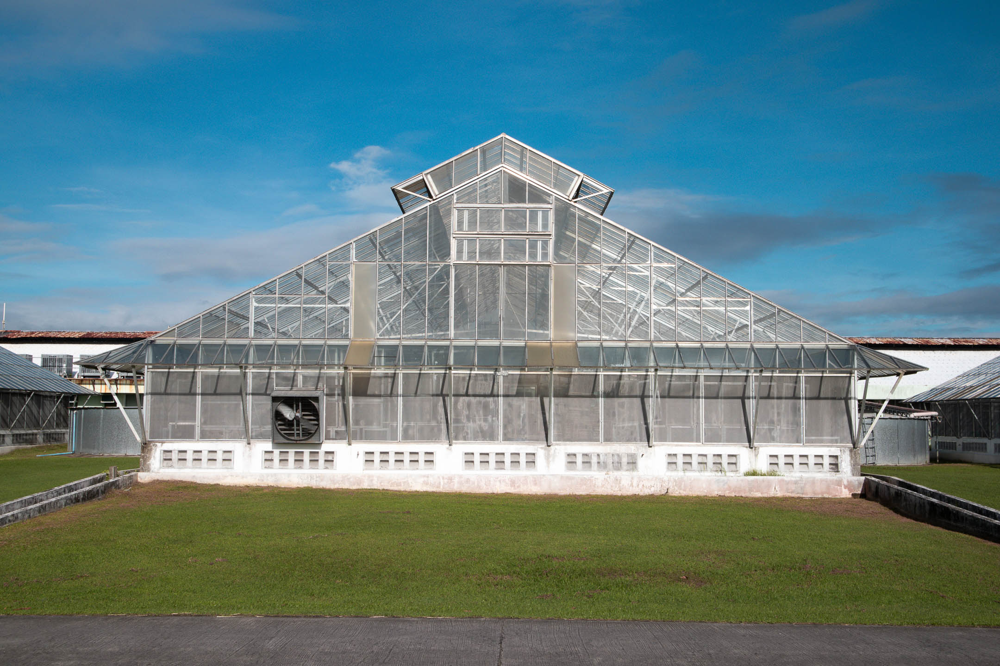

***

Food is worth thinking about. Rice, among all food, is worth thinking about. Rice and all food are matter that sustains me and replaces the cells that my body sheds. I couldn't exist without food. I couldn't think or speak without food. I couldn't write these words now without food. And yet, I seldom think about it. I seldom think about the amount of violence that happens just for a spoonful of rice to reach my mouth.

***

Food makes Los Baños an interesting place. While large, powerful bodies like UPLB and IRRI are here, constantly dictating the discourse and policies surrounding food, a small, disorganized grassroots movement made of organic food sellers, organic farming advocates, and healthy food alternative sellers exist. Unfortunately, this movement (if we can even call it one) has been struggling recently.

One business, which used to be my go-to source of organic vegetables, has been forced to reimagine itself into a Japanese restaurant, perhaps to save itself from dying. Another business is closing its shops to transition to supplying. Thinking about these advocates and sitting here inside IRRI makes me feel powerless. I stood up, took a few more photos, and walked the rest of Pili Drive, which brought me out of IRRI.

***

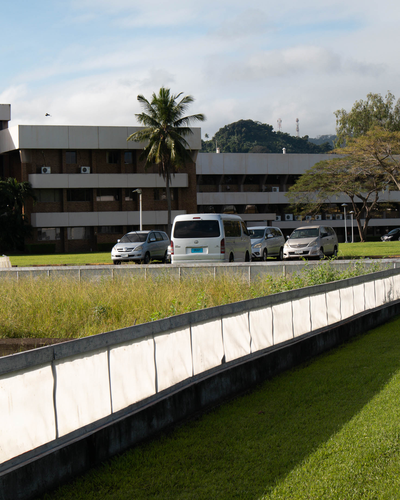

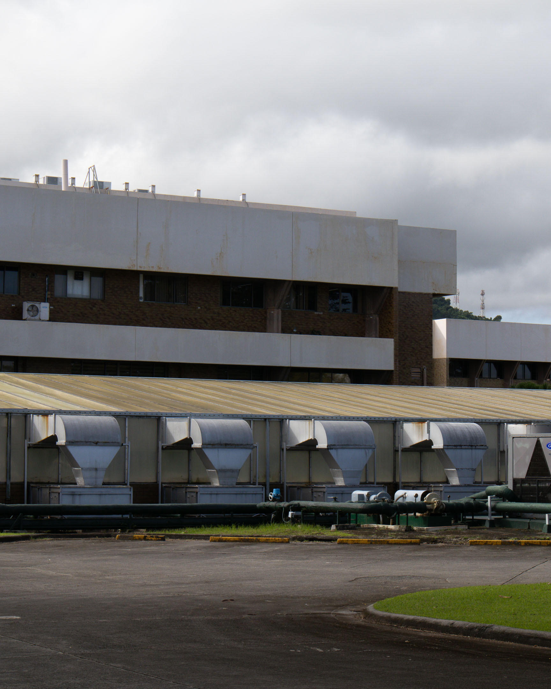

***

A few months ago, I decided to walk Maahas Road for the first time (Maahas means "full of snakes"). I started at the mouth of the road from the Manila South Road, which led me to IPB Road, the road parallel to the train tracks of Los Baños. At IPB Road, I saw a footpath on the side of one of the fields owned by UPLB along Pili Drive. I followed the path and discovered a beautiful trail reminiscent of those I took beside rice fields back in Pangasinan. When given the privilege to guide a group of lovely humans for a late afternoon walk in April, I brought them here. I am walking it again, saying hello once more.

As I walk this dirt road and remember the past walks, a group of myna's perched on the power lines above me. They stayed there for just a second when one of them released a loud call, which made all of them fly.

***

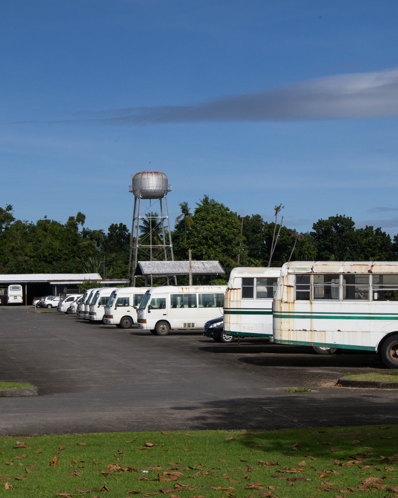

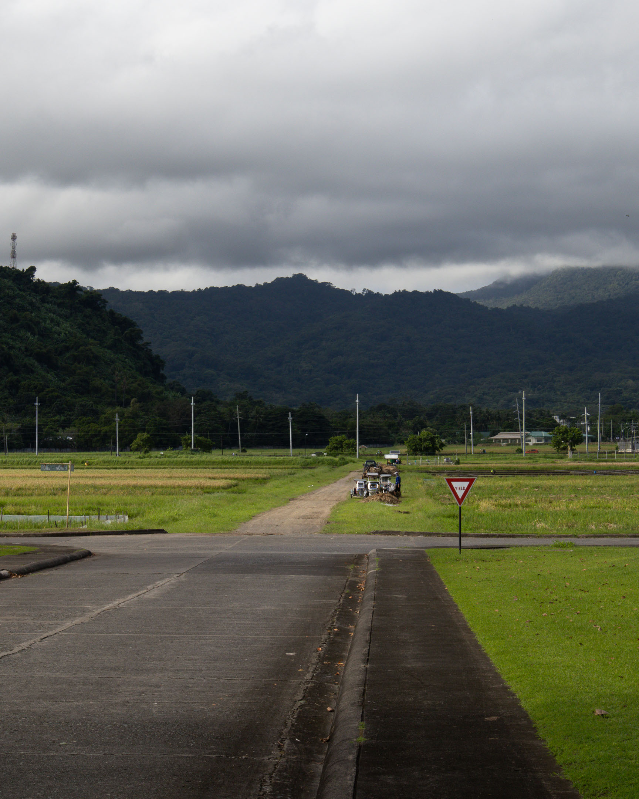

***

It is grass-cutting season inside the campus. Yesterday, cutters were clearing a part of Forestry. Today, a group of men gathered outside the irrigation machine beside a deep rice paddy field on this trail. The men wore long sleeves, and grass cutters lay on the path. I smell the smell of newly cut grass. One of them was inside the small chamber of the machine as smoke was coming out. He seemed to be cooking. It is eleven, and these men are hungry.

I walked past them, and in front of me, another man on his motorcycle approached me. I moved to make room for him. Behind him, two dogs ran to follow him.

The grass is indeed tall. The spot where the first batch of walkers I guided here last summer sat and lay down to rest at the second leg of our walk is now less friendly to those needing rest. I continued walking. The sun above me is too hot, and the light is less generous for photographs.

***

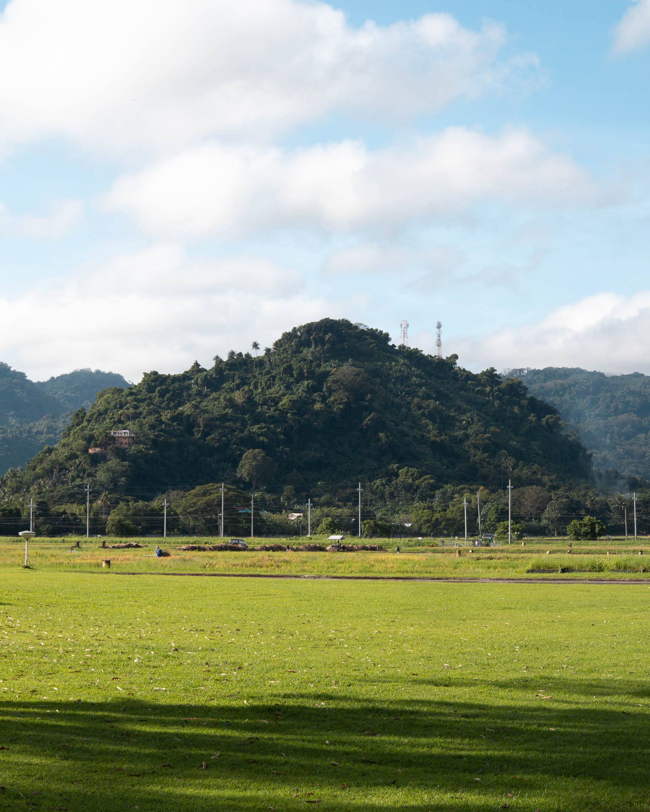

***

After reaching the end of the dirt path, I turned left to Pili Drive once more. An event is ongoing, blocking the entire half of the road reserved for walkers, joggers, and bikers. I crossed the roads to walk to the other side. The moment I stepped on the elevated footpath, a person ran toward me putting his arm around my shoulders—a friend, someone who joined one of those walks I guided last April. We walked and chatted a bit before he left me for work. Pili Drive is home to several engineering departments. Here, alongside rice fields, students study how to structure society better.

I continued walking toward IPB Road, looking for decent shots of the mountains of San Pablo. Sunlight is too strong now, and I'm starting to doubt whether I should still take photos.

All these walking led me to the final segment of the walk: the San Luis Road that cuts through Barangay Putho Tuntungin, the jump-off point to Hill Road, home to some of the fanciest houses in Los Baños.

***

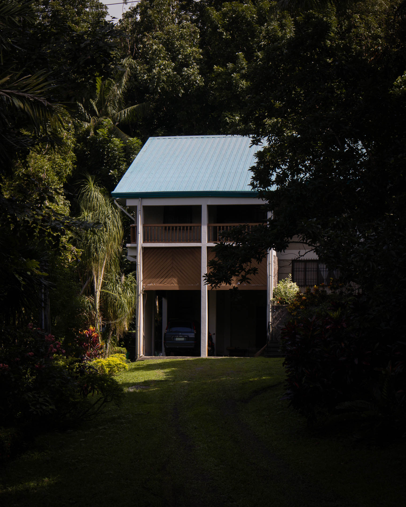

***

These walks are like religious activities. One of the root words of "religion" is "religare," which means "to bind fast." To bind fast could mean to put yourself under an obligation or a bond with another, whether a human or deity. This is where the idea of religion being something that constricts us comes from.

But binding oneself to something could lead to more freedom. Absolute freedom can never exist, and too much of it can be crippling. I find that I need a healthy dose of binding to feel structured enough that I can start feeling free. For example, I need to bind myself to work that earns me a living so that I can be free to write and do walks like these on occasion. Binding oneself to a vocation, a belief, or a person could bring a sense of security that would allow one to be free. Of course, binding always involves a measure of sacrifice and patience.

These walks are binding as I am required to follow certain rules to perform them well, and they can feel strenuous sometimes. But they bring a kind of freedom that is so difficult to find in a world where I am almost always bound.

***

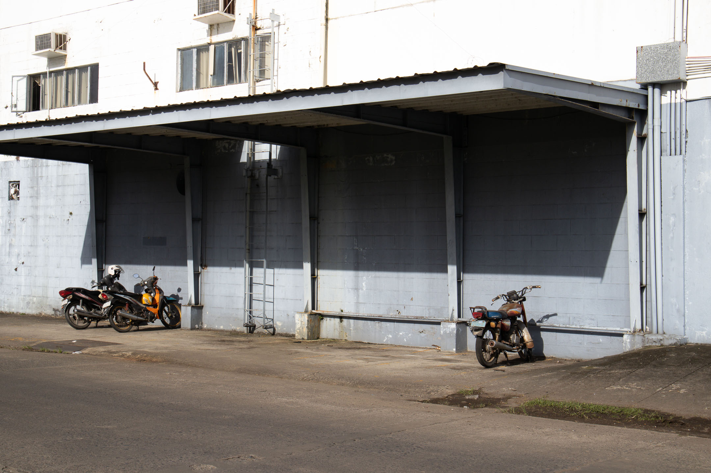

***

Speaking of structure, I notice that a significant portion of my walk today has been spent thinking about the structure of this missive. This makes me wonder whether treating some portion of our lives like a project could give us a similar sense of structure.

Turning our lives into a project doesn't mean making our lives presentable to others but presentable to us. Can we weave a story that we can tell ourselves later when we badly need direction and structure?

Here's my main point: the structure doesn't come by sitting down and thinking about it. It often comes when you are doing something else, something between consciousness and unconsciousness. Something like walking. I walk, and then later, I forget that I'm walking. My feet do the walking for me. This frees my mind and opens it up for the structures, the stories that I need to make sense of my often chaotic self.

***

As I end this walk, I utter a few words of thanks to the crows that seem to follow me from IRRI to Tuntungin Putho. I give thanks to the Molawin River, which has been utterly patient to all of us.

***

Manila South Road → University of the Philippines Open University (UPOU) → International Rice Research Institute (IRRI) → Maahas Road → Molawin Creek Dirt Road → Pili Drive → IPB Road → San Luis Road (Tuntungin Putho) → Hill Road → Valentino G. Argañosa → Andres P. Aglibut Avenue → Vicente M. Dawis → Victoria M. Ela Avenue

21,074 steps
14.2 km

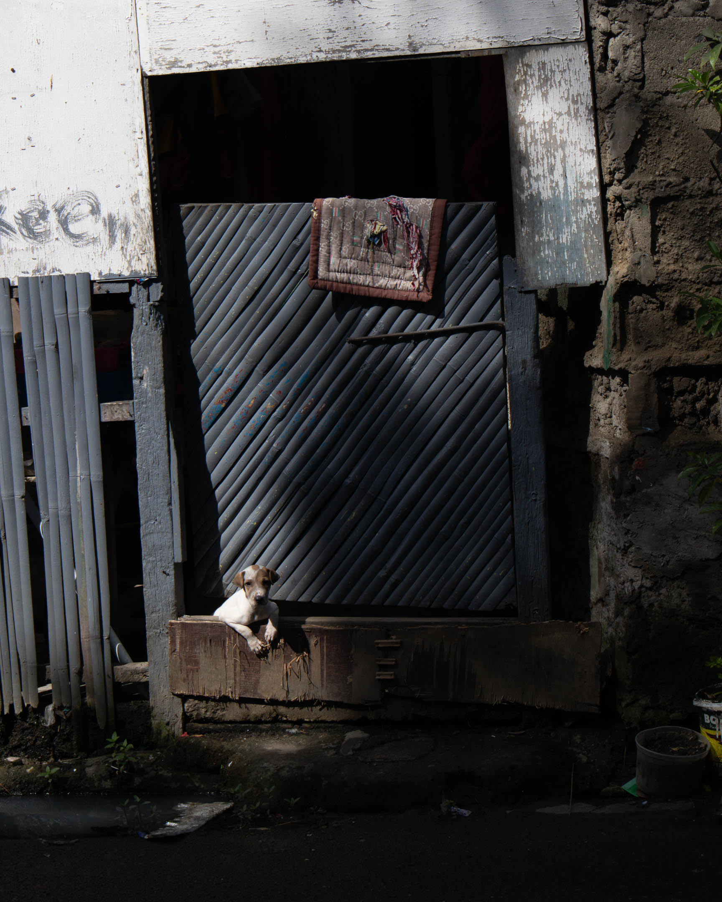