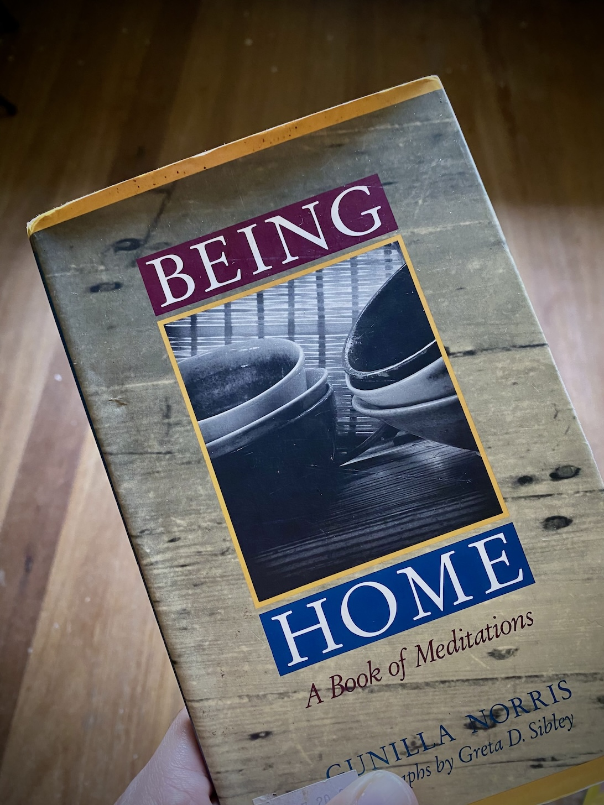

Day 07, 2023

No walking in the morning. No waking up early, too. I set my alarm clock at 8:00 but turned it off and waited until after 15 more minutes before getting up. Around 8:45, I locked myself inside my office to sit the entire morning. These feet are tired. They must rest.

The only walking I did from 8:00 to 12:00 was the back and forth from my room to the dirty kitchen to do my laundry. The three long walks that commenced broke my daily routine, and I, mind you, am a human of habits. Today is way past my usual laundry day, so this most domestic of all domestic tasks must be done now.

Not much writing happened today too; only a couple of journal pages reflecting on an early experience that made a scar on my writing self. I’m finding my way slowly through Pat Schneider’s book _Writing Alone and Writing Together_, and this is her second exercise.

After this, more laundry, then lunch, then doing the dishes. Ah, I couldn’t remember when these chores last felt this good. Somehow, in between long walks, these chores become healing. Somehow, in between long walks, I find myself in love with being home.

I’m keeping this missive short. I still have a couple of hours before hitting the bed, and I would very much want to enjoy this day off while it lasts.

Tomorrow, we walk away from Mt. Makiling to visit two bodies of water. I suspect tomorrow’s walks will be shorter than usual. Nonetheless, I still need my pair of well-rested legs for two more days ahead after tomorrow.

Once again, thank you for reading. I appreciate everyone responding kindly to these emails and sharing the walk on **[Instagram](https://www.instagram.com/vinceimbat/)**. Knowing that, somehow, these walks remind you of how beautiful your own walks are brings me so much joy. Somehow, these walks are accomplishing what I intended them to do.

More soon,

Vince

