December 08, 2023

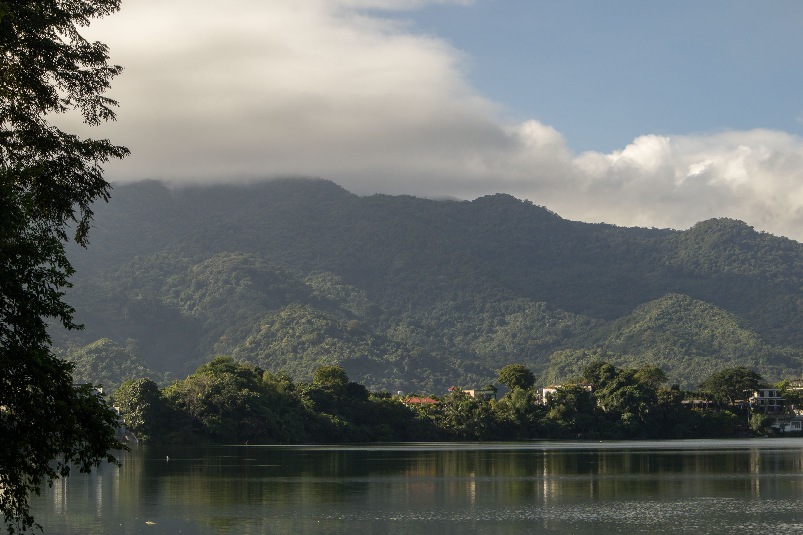

***

December 17, 2021, a Friday afternoon. The jeepney arrived at Bagong Kalsada with rain pouring hard. I got off, opened my umbrella, and ran to the nearest shade: a bakeshop at the mouth of the road that would take me to my destination.

As soon as I took shade, the rain weakened. I bought a piece of _pan de coco_ and a piece of Spanish bread before beginning my walk. Despite the bad weather, people were busy buying fish at the nearby wet market. Perhaps we were all fooled by the slight brightening of the sky a while ago.

***

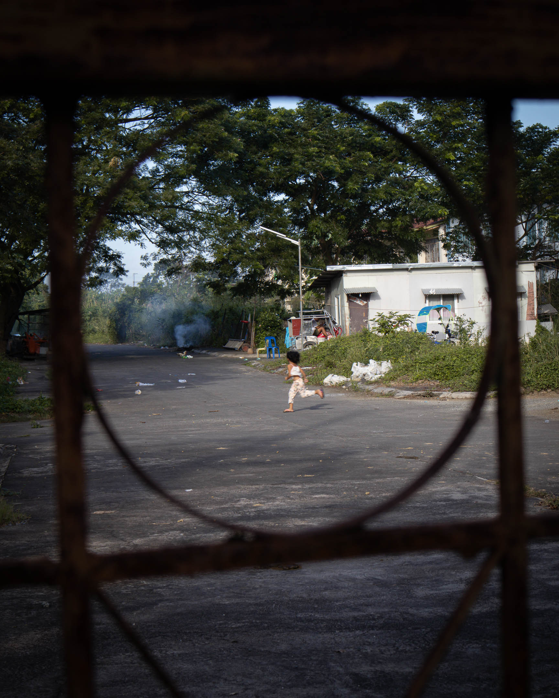

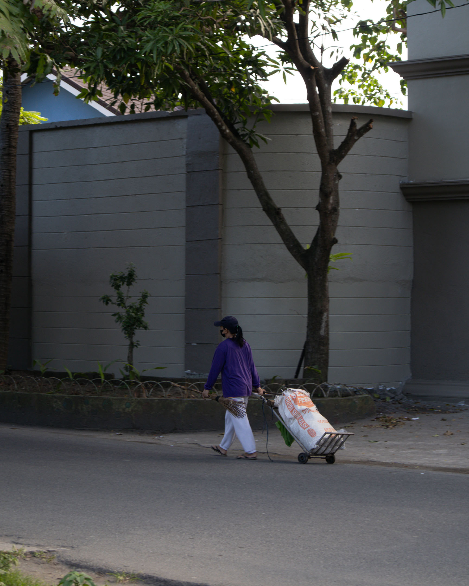

***

Lopez Avenue was virtually traffic-less. My jeep immediately reached the avenue's junction with the Manila South Road. Inside are several young people, some with large bags, perhaps en route to Manila. One reached out to the passenger nearest him and asked for help with his fare. He told the driver to drop him at Olivarez Plaza.

At the junction, we halted and waited for the streetlights to do their thing. The traffic system at this junction is more functional than most I’ve seen. I've seen many municipalities, even cities in the Philippines, with less functional junctions than this one. In Pangasinan, whenever my father stops the car at the signal of a traffic enforcer, he utters the exact words: "It gets longer when there's a traffic enforcer." I believe him. Often, in Pangasinan, drivers figure out the traffic by themselves. Without rules, they do the job faster by intuition or pure respect for other drivers. I wonder whether it's a generational thing, though. Perhaps younger drivers need enforcers.

***

An old traffic enforcer, who seems past the retirement age, sits inside the shed and talks via a microphone. He calls out errant drivers or gives directions for each lane. Whenever I see him at this junction, I often hear him utter, "Sige lang. Go lang ng go."

He isn't here this morning. Perhaps he'll come later, or has he finally retired?

The jeep stopped at the Olivarez Plaza, the drainage system of which is being repaired. People waiting for buses are forced to wait beside a bank.

On our way to Bagong Kalsada, two motorcycles blasted to overtake our jeep on the right. Briefly, I feared for the lives of two cyclists slowly making their way up the slope of the highway.

***

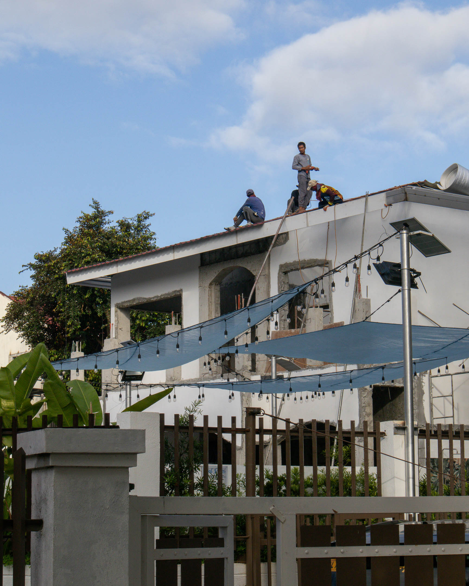

***

I ambled as the road was still wet. The rain weakened to a drizzle, and I saw motorcyclists driving without coats.

On a resort nearby, construction continues, a sign that business is doing okay, even recovering, despite the intermittent lockdowns.

I stopped to read the welcome sign. So it is: I am in Masili, a barangay of Calamba in its Real district. This is no longer Los Baños.

It began raining hard again, so I opened my umbrella. It wasn't long before I started feeling large drops of rain from the inside. I looked under my umbrella to inspect it and saw that there was indeed a hole.

Still, with my umbrella opened, I walked to a nearby iron shed ironically shaped like an umbrella.

This walk was starting to feel off.

***

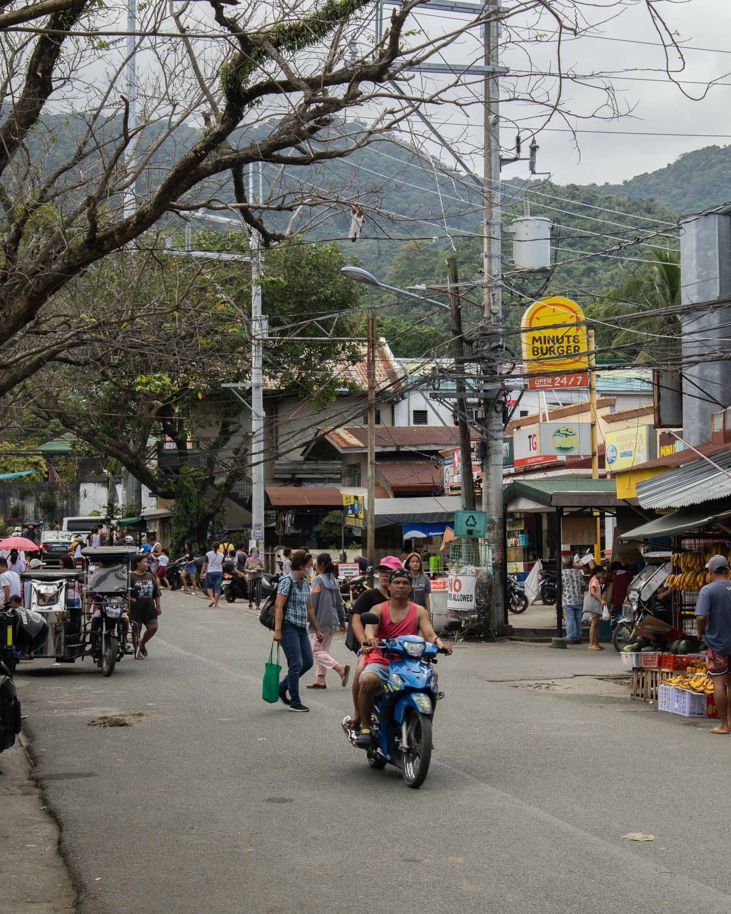

***

"Bagong Kalsada" (New Road) is an interesting name. I wonder how it got its name. If it has the word _bago_ (new), what did this place look like when it was _luma_ (old)?

Both sides are filled with either gates to subdivisions or resorts. Some resorts are almost invisible, with a signboard hanging outside but an entrance out of sight. Perhaps they are located inside these heavily guarded subdivisions.

It must be said here that Los Baños—the Baths—has always been famous for the hot water that runs under it. When I bathe here around December, I don't need to warm my water. Mt. Makiling warms it for me. A dormant volcano, it is the source of this geothermal water that has given many locals from Pansol to Masili good business since the Spanish occupation. If Masili isn't Los Baños anymore, it is piggybacking on the success of the older and more popular resorts on the highway.

***

***

When I arrived at the corner of Bagong Kalsada and Tadlac Street, I was surprised to see a railroad. I thought I would walk on the rails toward the lake or perhaps ride trolleys. I was relieved to see that a cemented road for cars was just beside the rails. Turning right, I walked on this road to the lake.

Walking on Tadlac Street felt like walking in Rizal, Quezon, on the streets beside the rails, except there are no trolleys.

Along the street, the side of the road started to ascend, houses began to descend, and the mountain—great Mt. Makiling was revealed.

I just passed by a signboard about the lake. Its name is Tadlac. Google Maps calls it Alligator Lake for a reason I am still to find out. On the sign board, Tadlac is mentioned as a barangay of Los Baños, which means that Masili and Tadlac are the boarder barangays of Calamba City and Los Baños. Bagong Kalsada, the street I just walked on, is their border.

***

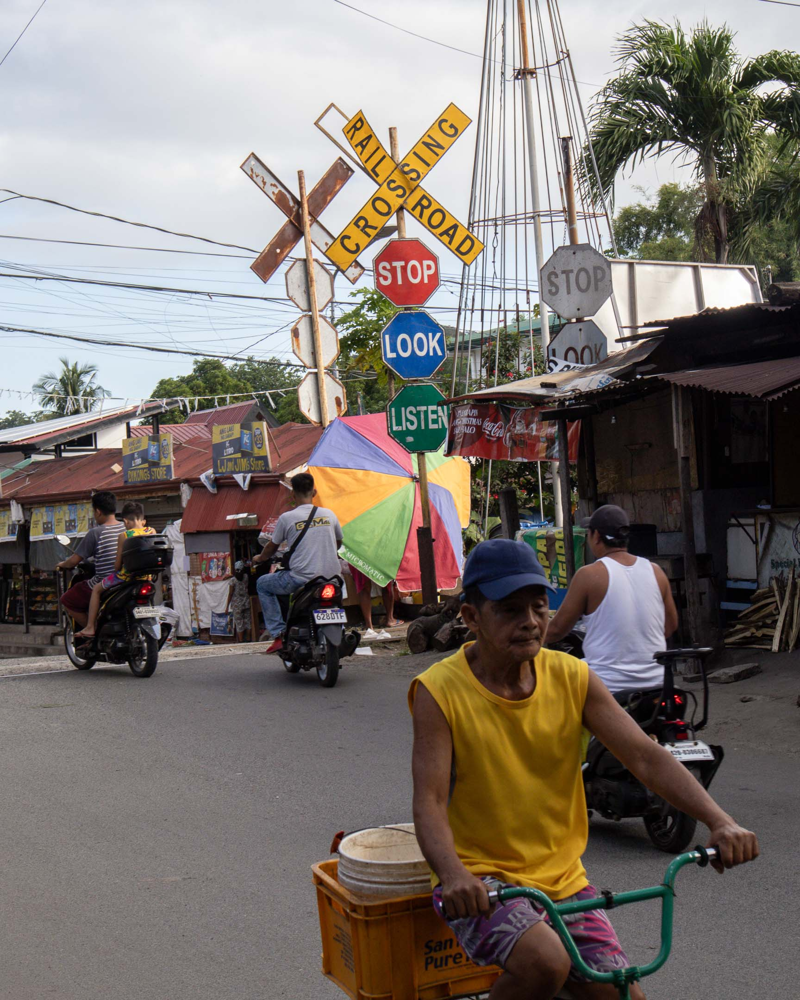

***

Crossing the railroad and continuing my walk of Bagong Kalsada, I couldn't help but notice a tight-knit community of locals. I've walked some communities deep inside Calamba City and I've never seen something like this. Neighbors gathered outside their houses early this morning. Some sell their products to their neighbors themselves. Everyone talks to everyone. Everyone knows everyone.

But do they have any choice? Their houses are beside each other; some even share a single wall. With your neighbors living this near you, you have no option but to be good to them. Unlike other places in the world, proximity seems to be saving this community. I always feel safe whenever I walk here.

***

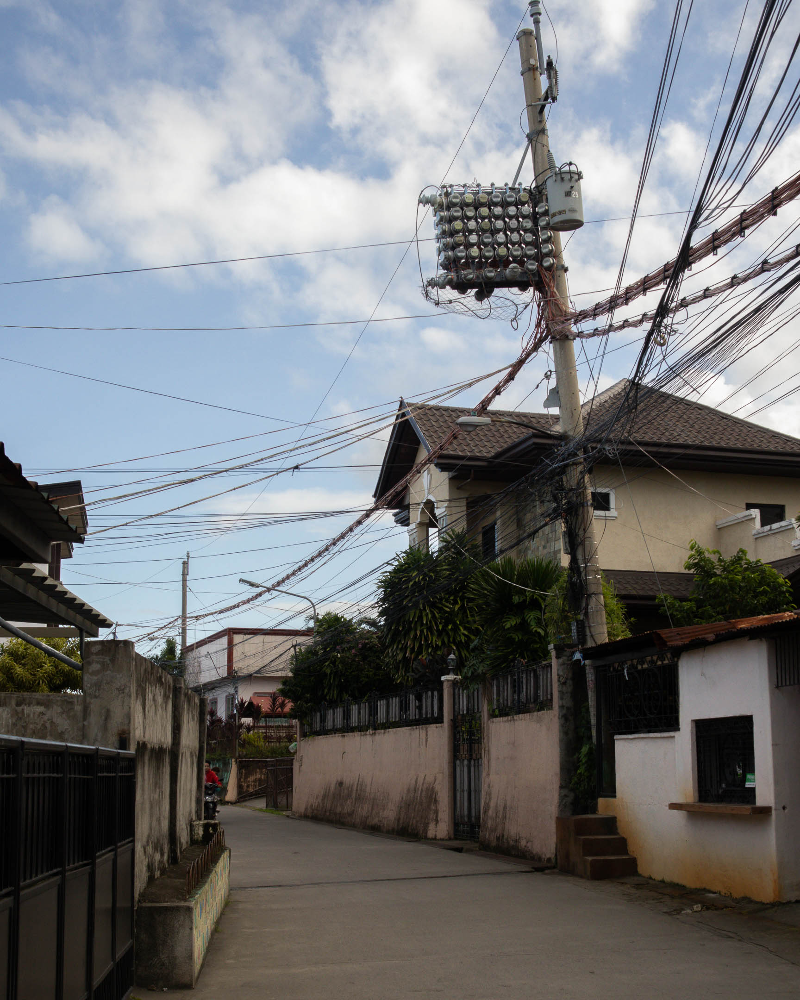

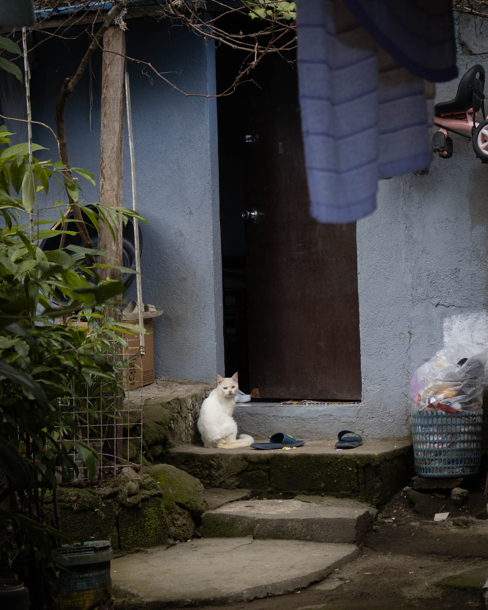

***

As I got deeper into Tadlac Street, I noticed signs of the pandemic—writings on the walls on the side of the road reminding people of curfew hours, community gardens perhaps built to address hunger at those times, and the biggest surprise of all, an isolation facility at the heart of the barangay.

***

The rain started pouring hard as I was about to make a left turn toward the lake. I started talking to myself, calling the walk a lousy idea. To make matters worse, there was no shade to run to.

I saw a closed store with a small portion of its roof protruding in front. I dragged my feet under the water to reach it and stood there as straight as possible under the roof. While waiting for the rain to stop, I felt my socks squishing around my feet. I remember buying these shoes three years ago because they were waterproof. Now, they seemed to have lost all their waterproofing.

Realizing that the roof I stood under wasn't saving me from all the water, I decided to continue walking and taking in all this rain. It was impossible to check my phone to know where I was, so I followed the trail.

After a few minutes of walking an elevated part of the road, water rushing through my feet, the other lake, the bigger one, Laguna Lake, emerged from my right. The sky was all gray, but the lake was there.

***

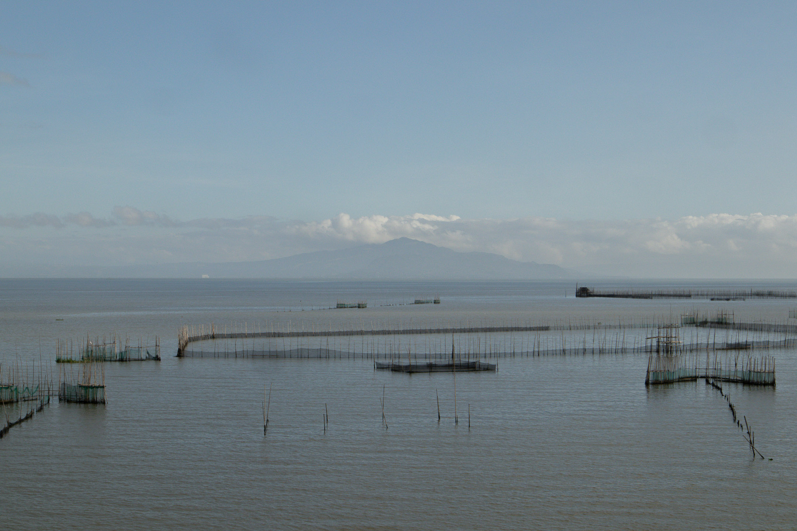

***

After walking between houses on a footpath that could only fit one person and climbing the stairs that came after, I finally saw Laguna Lake. On this overcast morning, the waters gave off their deep blue color, and a mist barely concealed the mountains over the horizon.

An older man was already there. He sat on the protective wall of this viewing deck with his knees on his chest. I moved carefully not to destroy his peace.

After I stood a reasonable distance from him for a while, he stood up, perhaps satisfied with his morning dose of lake beauty, and went down the stairs I came from.

Five children emerged from the stairs that led down to the houses below on the beach. I looked down and saw two other children fixing a boat. The older one was pulling what looked like a rope, and the small one watched while sitting on another boat.

Two of the five children who emerged from the stairs asked me to photograph them. I did so joyfully. They thanked me after. The boy asked me what I was doing. I said I'm just enjoying how beautiful their place is. He said, "Yes, indeed."

***

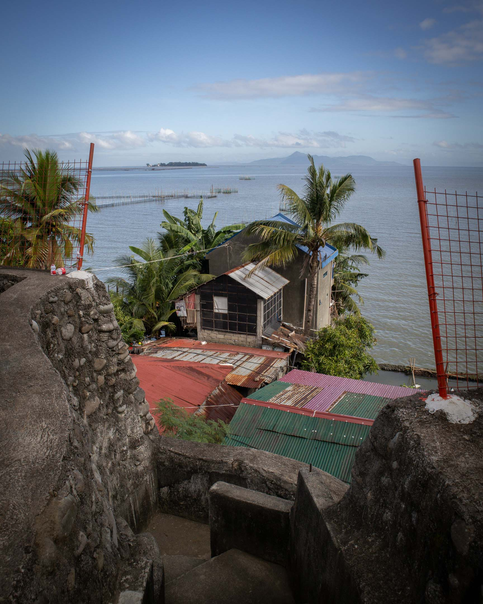

***

I knew I was near, so I continued walking despite the rain not showing any sign of letting up. A man was sitting in a shed having his coffee. He wore an old blue cap and a green jacket. Behind him, I saw it: Tadlac Lake.

The path to the lake was a long set of stairs, which, right now, was overrun by brown water flowing from the road to the dock and then the lake. I began descending toward the lake, walking carefully over running water to avoid slipping.

It's weird, but the rain made the lake look perfect. It brought with it a mist that concealed Mt. Makiling at the horizon. There was no other human here, only some herons perched on a few trees at the north end of the lake, some small wild ducks swimming at the edges of the water, and the occasional tiny blue kingfishers diving and then hiding under leaves.

I stood under the shade of a large and tall tree with my broken umbrella open. I reached inside my bag for the bread I bought at the bakeshop and started eating.

While I was enjoying the still-warm bread, it stopped raining. My goodness, it finally stopped. I realized this walk wasn't that bad after all. A heavy rain meant no one else would be here.

I remembered the artificial lake I frequented back home at Pangasinan, a dam that traps rainwater for the crops below it. Seeing Tadlac Lake was the first time I've been close to a body of water since the lockdowns started.

I stayed for at least an hour: I took photos, watched the birds through my binoculars, took some videos, and left.

***

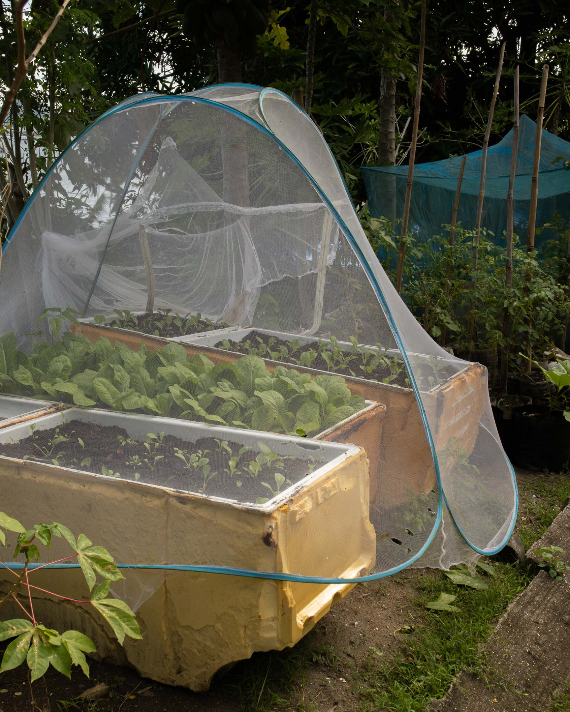

***

A couple was already on the lake when I arrived. Two young people sitting beside each other at the end of the dock, giggling, exchanging inaudible murmurs. I walked toward the inverted boats at the other end of the pier and started taking photographs of the lake and Mt. Makiling over it.

Here is the best view of Mt. Makiling over a body of water. From where I was standing, I could see the details of lumps of trees on Mt. Makiling’s side. One could never see this much detail when the mountain is over Laguna Lake.

There were no fishermen today, no boats tied near the dock. It is no-fishing season on the lake from April to December says a sign. Everyone seen fishing on the lake will be apprehended. I didn’t see this sign on my first walk here in 2021, which was December, too. Perhaps the lake's fish population is declining and must be protected. If this no-fishing season continues to be implemented, local fishermen will have to look for alternative jobs for more than half of the year. Obviously, the larger Laguna Lake is on the other side of this hill. But how easy is it really to find work as a fisherman?

***

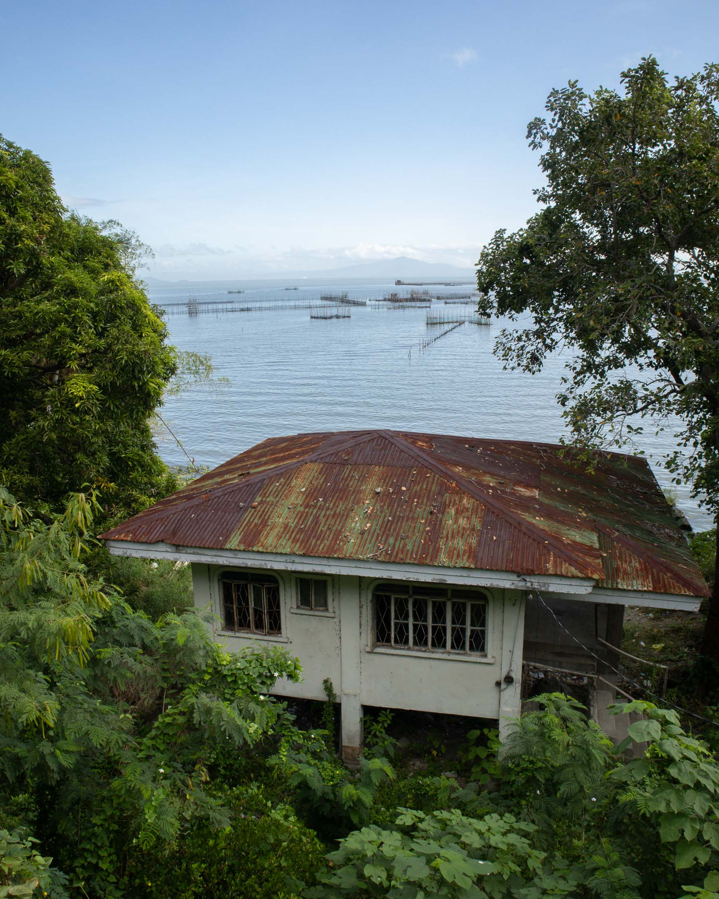

***

Walking back to Bagong Kalsada through Tadlac Street, I passed by a railroad community. I couldn't help but notice that this is a community that communicates. It communicates through words written all around them. Signboards abound.

A puppy approached me, encircling my feet, so I tried to distance myself. Its master, a middle-aged man fixing his laundry outside, noticed and said something briefly about his dog. I welcomed his words and responded with a smile.

***

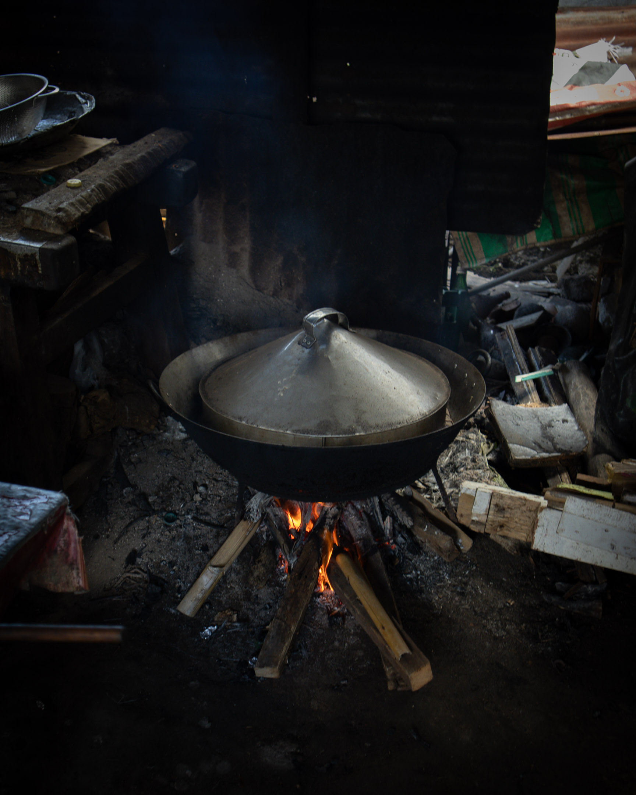

***

Turning from Tadlac Street to Bagong Kalsada, I noticed two older women talking while standing across a table. The younger woman was buying _kakanin_ (rice cakes) from the older woman. I approached them and waited for their transaction to finish.

"I've eaten a lot of _kakanin_ in my life, but I’ve never seen it done," I told the older woman when the younger woman left. "Come, come here," she said. "Have a taste of our _latik_ (toasted coconut milk curd) and see how crisp it is!"

I pinched a small amount. "Go on. Pinch a bigger one!" she said.

Behind her was a large covered wok under lit firewood. Its smoke released no smell. I wondered what was in it.

A younger woman saw us talking and approached us. After introducing myself, she started telling the story of their family. "I'm Lorena, and this is my mom. People call her Aling Maring," she answered when I asked for their names.

"This is what we've been doing all our lives. I learned to cook _kakanin_ from my grandparents. My lolo lived until 102 but only stopped making _kakanin_ four years before he died," Lorena continued.

Aling Maring explained how their _kakanin_ is different from the others. "As you can see, we don't cook them in machines. We don't mass produce. And that's why we've always been poor. _Kakanin_ cooked by machine is too hot. Ours is colder and thus has a different texture than most you can buy in the market."

"My _kakanin_ has reached other countries. I may be poor, but the rich respect me. You say you are from town? One of the candidates for vice mayor. Oh, he lost. He buys only from us. Christmas is coming. We get a lot of orders this season."

I bought one order of each of the _kakanin_ available on the table: an order of _puto_, _biko_, and _tikoy_. They gave me their phone number so I could contact them for future orders.

Back home, after lunch, I took a bite of Aling Maring’s _tikoy_. It is smaller than most tikoy, more dense_,_ and stickier. But it is tastier. Every particle seems to burst with flavor. And the _latik_, oh the _latik_. It definitely is crispier.

I remember IRRI. I remember rice. _Kakanin_ is rice and shall be the point of departure through which I could understand this rice grain better.

***

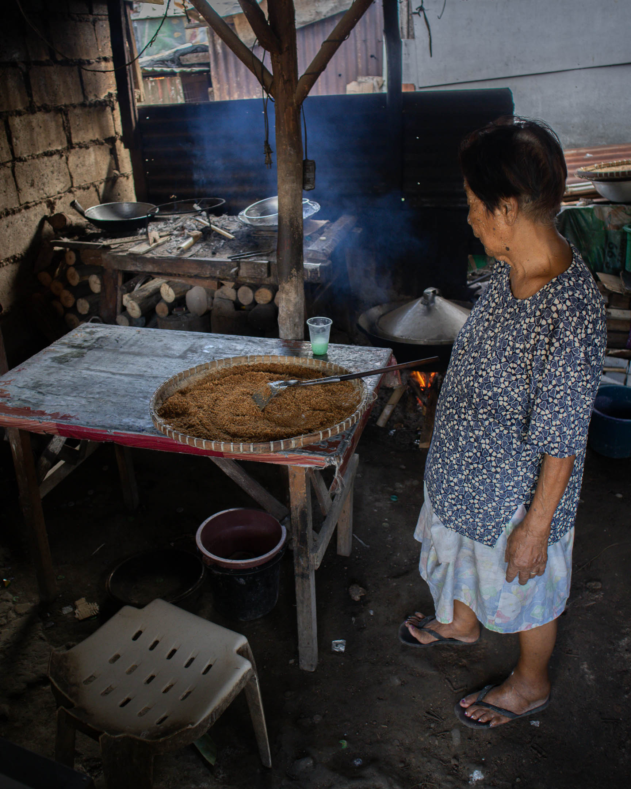

***

Never shall I walk this stretch of the Manila South Road again. Although some areas have sidewalks, sharp curves do not. It was a dangerous walk on these curves, and I am grateful to have made it past them in one piece.

But walking on this suicidal stretch of the Manila South Road reveals a part of Los Baños often unnoticed. Hotels, subdivisions, resorts, and resorts within subdivisions abound. One can't help but notice the largeness of the Makiling Onsen Hotel. Reading those words Makilng (a heavily Filipino word) and Onsen (a heavily Japanese word) feels interesting. Meanwhile, some establishments are left abandoned, perhaps more ruins from the pandemic.

***

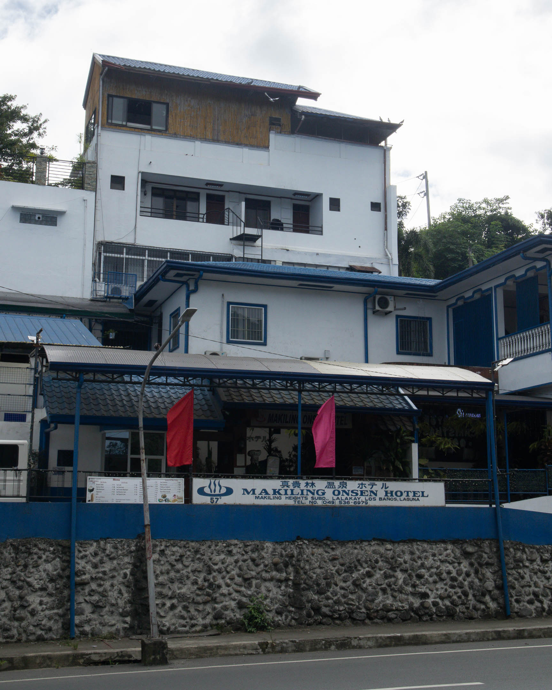

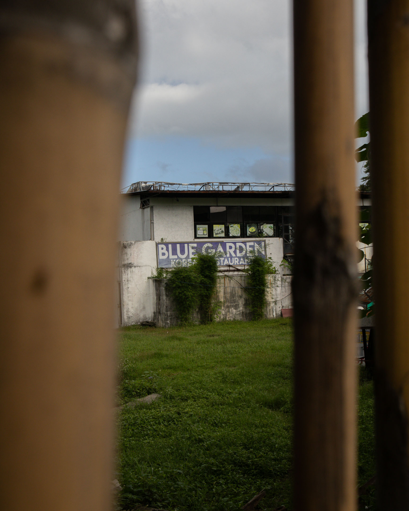

***

After walking past stretches of "the baths," I reached Lalakay, my final destination for this walk. As an enormous truck approached, I crossed the pedestrian lane, running for my life. I heard its brakes screech.

I walked past the school. I was looking for a signboard pointing to Dampalit Falls but couldn't find it. I saw an _eskinita_ that seems familiar. This might be it. To be sure, I looked for a local to ask. There was an early Christmas Party at the school. Or was it part of the barangay festivities? It was Lalakay's barangay fiesta. Vertical flags of various colors adorn its streets. A lady was watching the event inside her sari-sari store, so I peeked and asked her, "Is this the way to Dampalit?" She said yes, and I thanked her.

This walk to Dampalit was surprisingly faster than the first walk I did here early this year. Before a steep hike, one would pass by bungalows through a small _eskenita,_ just large enough to fit a tricycle. But the road is too steep; only motorcycles and bicycles can access it. Locals earn a small amount for parking fees. But since one can only bring bicycles and motorcycles, I don't think they get enough money from parking fees. One house has a signboard with rates. Ten pesos for bicycles. Twenty pesos for motorcycles. I was surprised to see thirty pesos for cars. A car won't fit this _eskinita_!

As I approached the entrance to the falls, a group of children came to me and asked, "Are you going to the falls?" I said yes. "Do you know how to get there?" I said yes, and they left me alone.

***

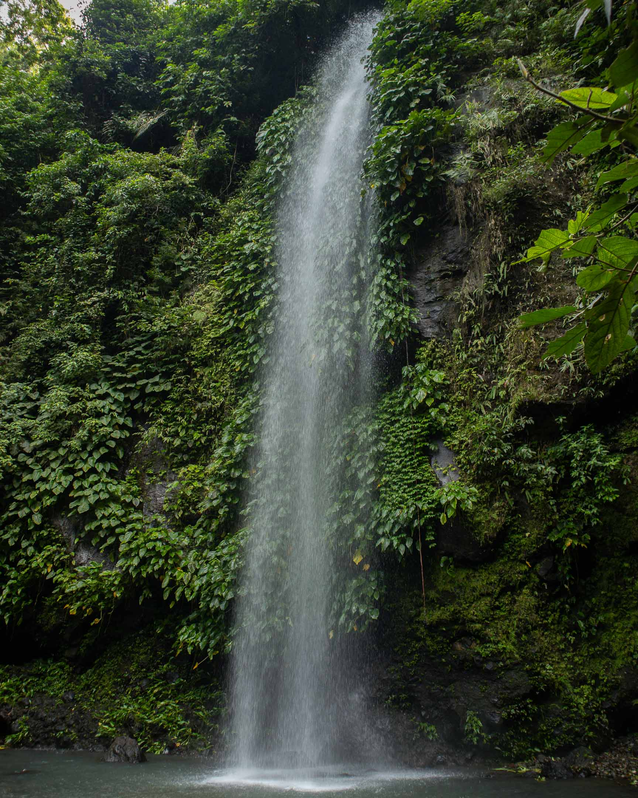

***

The water is cold here. Really cold. All silence is broken. But here is a sound so alluring I don't think I can live without it again. The strength of the falls depends on the season. There was not much rain the past three days but there was lots of it last week. The strength of the water falling is not as strong as I remember it. I like it better this way—a steady, soothing rhythm.

***

We are all pilgrims. A pilgrim approaches something she holds dear and shows deep care or perhaps even just a brief effusion of awe toward it. But what if the germ from which awe and deep care come is even way simpler than both? What if this desire to break the monotony of one's days, to experience something different for the first time, even if it is as simple as posing in front of a camera, is where all our religiosity comes from?

I have a pretty good feeling it is.

***

Bagong Kalsada Street → Tadlac Street → Manila South Road → Dampalit Falls Path

17,429 steps
8.88 km

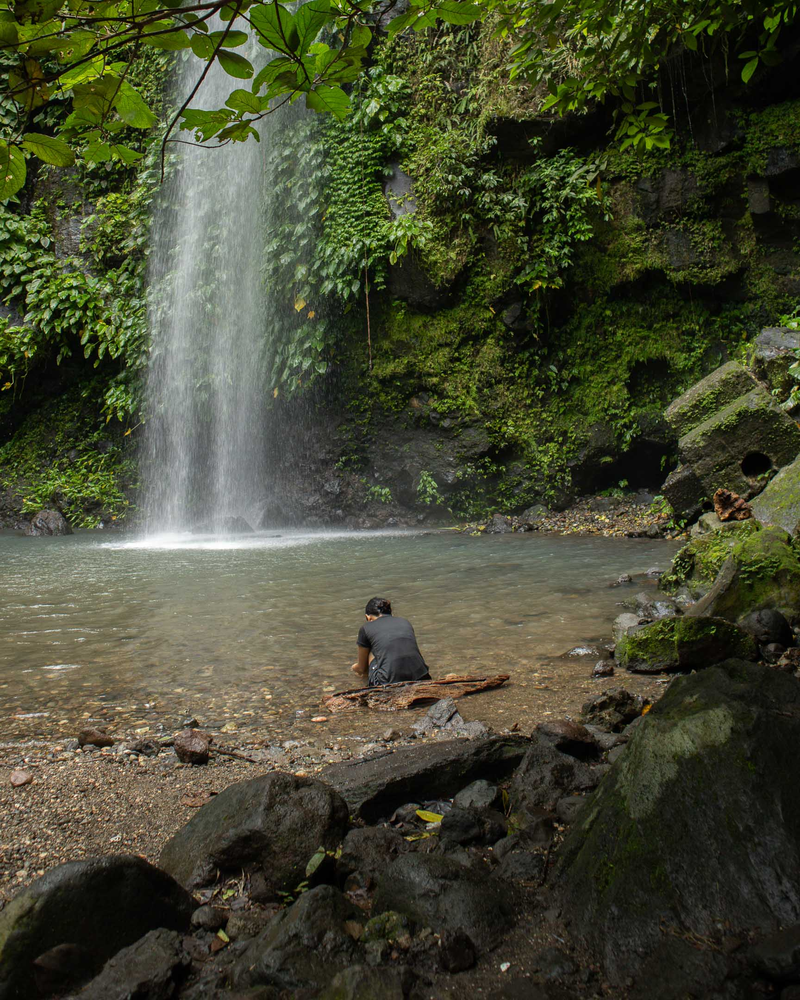