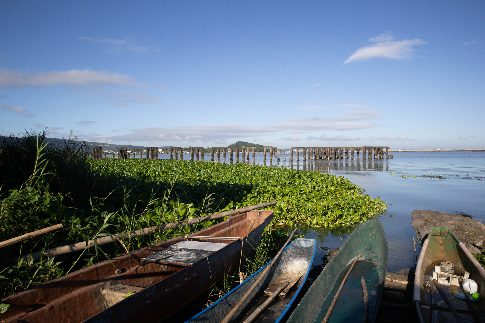

December 09, 2023

***

When the Wardaman people of Australia walk for days on end to move in groups, they sing. Their songs speak of stories attached to places in the landscape. These songs, they say, mirror songs about specific spots in the sky. The songs are maps through which the Wardaman people remember exact locations and the events and myths attached to them. Bruce Chatwin was the first to call these songs "songlines" in his book of the same name. A character in the first chapter of that book said that the Aborigines may have songlines for the entire Australia, making all of Australia sacred.

In his book _Cosmic Sage_, George Williams said that many Japanese unitarians in the early twentieth century believed everything was religion. Politics, commerce, and education were all religious. They didn't see a distinction between the religious and the secular. Because of this, Japanese pastors, who were ministers of other Christian denominations but who had unitarian sympathies, ran for public office. Successful business people gave their money to churches, while those who found themselves inside the classroom committed themselves to the whole religious development of children. Shinto, Japan's ancient way of life, may have influenced this inclination to view everything as sacred.

***

***

I was thinking about the songlines and the Japanese unitarians while inside the jeep that would take me to where I ended my walk yesterday. As I exited the vehicle, I told myself that this walk would be about encountering the religious and spiritual in places where we were taught they would never exist. I wonder whether there is anything sacred along the fishing communities of Los Baños: Bambang, Baybayin, Malinta, Mayondon, and Bayog.

***

***

A man seemed so surprised to see his neighbor. His neighbor said he was already living in Pangasinan. The man asked him what he'd do with his house. "Will you rent it out?" he said.

On my left is a concrete wall not too high to prevent one from seeing what's inside. On top of the wall are curled chicken wires.

Bambang is home to a large military camp, Camp General Macario Sakay. Behind it, toward the beach, are resorts. The railroad, home to many low-income families, separates the soldiers from the vacationers.

I saw an Ilocano restaurant along Bambang Road. Aptly called "Mangan," it features many recipes I often eat back in Pangasinan. Mangan is the word for "eat" in at least three Philippine languages: Ilocano, Pangasinan, and Kapampangan. Ilocano recipes are almost the same as the food I grew up eating, so I often wonder whether there is even an authentic Pangasinense cuisine. The restaurant is still closed, but I could see all the bottles of Smirnoff lined up on its bar. Those should have been bottles of basi or bugnay.

***

***

I've seen many yellow things in the past few days. You would be surprised how popular this color is. In particular, I've seen a lot of yellow houses. They can't be missed from afar, and I can't help but stare at them whenever I pass them.

"This house is too yellow," I tell myself sometimes.

My girlfriend and her family had a game, which I think started when they still lived in Bahrain. The rule is simple: anyone who sees a yellow car first wins. Her father has been dead for almost five years. Only her brother is left in Bahrain. She no longer lives with her family, but whenever she sees a yellow car when we walk together, she rushes to call it out.

***

***

As I turned down Bambang Road, past Dampalit Creek, I noticed an eerie silence. It was unusually long that I thought I was losing my hearing.

***

Somewhere past the railroad, there is a wake. She was 72 years old. Her remains are inside a small apartment unit without a gate. The door is open, and some adults and children are awake. Across the street was a blue open tent inside of which were a set of Monobloc table and chairs. There were cigarette butts and empty beer bottles around. Someone was picking up empty bags of chips.

On the dried Dampalit Creek, an orange cat lies motionless in the middle of rocks and garbage. Is it dead? Is it just sleeping?

***

What does it mean to love a place? Do I need to sing songs when I walk? Do I need to repeat them until I know them by heart? Do I need to pray or perhaps hold rituals under the trees, even worshiping them?

Are these men and women walking the street this early morning with sweeping brooms in hand, giggling, laughing, not also in love with their spaces? Is this not enough?

***

***

I'm delighted with my progress in saying good morning to people I meet along the way. Just now, I was able to greet two ladies. One was picking a few _malunggay_ stalks from her garden, while another was walking in the opposite direction. Both returned my greeting. This is a practice I still find challenging to do now, so these little wins mean so much to me.

***

I walked straight into Burgos Street. I remember this street being more crowded than it is now. It has been almost two years since I last went here. The tiny house with a new car and a lot of cages for pigeons and fighting cocks is still here. The old abandoned wooden house seems gone. The black Labrador Retriever is still guarding the garage of a fenced compound.

At the end of Burgos Street, an older man, covered with white facial hair, stood at the last house's door. I greeted him, smiled, and asked permission to take photos at the dock beside his home.

On the dock were several boats pulled to shore. The tide is high, so the large rocks I remembered sitting on in the past were submerged. A teenager wearing a sweater hid behind long grasses. He was fishing and didn't want to be bothered.

***

***

This here is Los Baños’ old port. There is no platform, only the large, solid posts that once held the platform. I have yet to read anything written about this port, but just by looking at its size, one could immediately see that it served an essential role for the town in the past.

The lilies are too dense. They move together when the water moves. From afar, it looks like watching a large furry animal breathe.

***

***

After leaving Burgos Street, I walked Villegas Street, which leads to the center of town. Walking closer to the center, one can not help but notice the several Spanish occupation ancestral houses lined up perfectly. Centuries after the plaza complex was instituted to make it easier for Spanish colonizers to subdue the natives, it is still felt even by lone walkers like me.

***

***

The Christmas season is here. It brings a particular joy that I know is genuinely true for some people. Growing up in a family that never celebrated Christmas, I am still learning a lot about this most famous of all holidays. I’m still learning how best to spend it, practice gift-giving, and perhaps most importantly, how I could personally make sense of a celebration with heavy religious origins in the kind of spirituality I’m cultivating for myself.

***

***

On the map, Mayondon is another hill. It is the hill I see when I walk at Juan V. Pancho Street inside UPLB, an elevated point where one can see the rest of the town and the lake.

Before climbing the hill, though, I revisited another fishing community, one with a large basketball court.

On my way to the court, I saw a large tarpaulin outside a house. It congratulated someone who passed the Nutritionist-Dietician licensure exam. I wondered why they had to use two photos for what looked like the same person. Upon closer inspection, these were indeed different people. They’re identical twins. Both studied at UPLB, took the same course, took the licensure exam, and passed it simultaneously. It's something you don't see every day.

***

***

Every time I visit this court, it’s always full of children. Today, a Saturday morning, about twenty children are playing in the middle of the court. Two boys play one-on-one basketball on one half of the court while around ten children, girls and boys of different ages, sit on the rough concrete floor on the other side. Two of them are bickering back at each other. Two girls stood up and started playing ball.

Seeing how popular basketball is among the youth, local government units in the Philippines build basketball courts, hoping the ball will sway children away from drugs. This basketball court they made here at Mayondon alongside Laguna Lake, with Mt. Makiling at the backdrop, is one of the best courts I've seen built for a community composed mainly of low-income families surviving through money earned from fishing or selling fish.

This rectangular piece of concrete in space brings children together to believe life can be joyful amid danger and poverty. This basketball court is sacred for this reason alone, and these paragraphs are my songlines for it.

***

***

At the foot of Mayondon Hill, a group of men and women in formal attire is walking uphill. I knew immediately that these were JWs doing their Saturday rounds. That kid walking in the middle with the sling bag was me 20 years ago. Who would've thought that on this morning walk, I would share this street with them?

In another life, I would've known these people. I would've been among them. I would've been that person at the front taking that photo.

***

***

"Follow Me, and I will make you fishers of men."

***

A church stands tall at the peak of Mayondon Hill. A few steps after the church, a large house covered by even more giant trees caught my attention. On the top of its facade was a circle, inside of which was an ichthys symbol and a rice stalk with grains.

The ichthys is, of course, an ancient symbol for Christianity, while the grains remind one of Jesus' walk in the middle of a ripe field of grain, picking some heads of wheat and eating them along with his disciples in defiance of the Sabbath.

Los Baños is both grain and fish.

***

***

Kanluran Street is perhaps the largest fishing community in Los Baños. Located in Barangay Bayog, most locals here are either fishermen or fish vendors. The fishermen live on huts right above the water. Their boats are now parked on mud, but when the tide grows, they float right outside the doors of these humble abodes. The children here talk about who owns this and that boat.

Some families grow animals, primarily ducks, which eat whatever they can find in the mud and can also float on salt water to hunt for a few errant fishes.

Interestingly, this is one of the quietest communities I've ever walked here in Los Baños. I could walk for hours on this stretch and won't hear a word from locals.

Aside from fishermen's houses, the stalls of fish vendors line up on the side of the road. Poorly preserved, some fish would be covered by flies before being sold. That said, fish here should be way fresher and perhaps cheaper than those sold in the market.

***

***

My walk ended on a long stretch of Santo Domingo Street, a narrow road filled with vehicles. One stopped, called me, and asked for instructions on finding an alternate route to Calamba City. "Just go straight. Do not enter any _eskinitas_. Stay on the large road, then turn on the first left," I said.

As I end this walk, I can't help but notice a stark difference between walking among fisher folks and walking inside UPLB, UPOU, and IRRI. Walking inside the institutions, I often saw objects I knew nothing about. There, esoteric machines remind me of my ignorance, powerlessness, and subordination to theory. Here, near the sea, among fishes and those who live by catching and selling them, a more direct interaction with reality, objects, and other human beings happens almost every moment. People live and make a living through their hands. They touch matter as matter touches them.

If everything is spiritual, then spirituality is in both the intellect of Makiling and the depth of experience of Laguna de Bay. To learn how to master and integrate both states of being is necessary to survive in a world like Los Baños.

***

***

Bambang Road → Lopez Street → Villegas Street → Burgos Street → A. Apolinario Street → Hilario T. Apolinario Street → Mescobin Street → M. Simon Street → Kanluran Street → Silangan Road → Santo Domingo

15,666 steps
9.57 km

