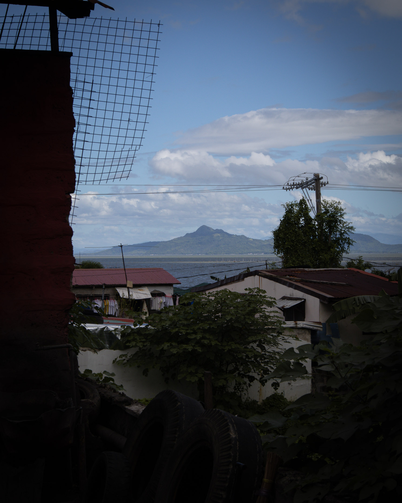

***

Two useful words can help one understand the meaning of place in this archipelago: _ilaya_ and _ilawod_. _Ilaya_ originally meant "where the river comes from." But since most pre-colonial communities began alongside rivers, _ilaya_ eventually meant "an elevated part of a town or settlement." On the other hand, _ilawod_ means "toward the sea" or "toward where the water flows."

Los Baños is a perfect example of a place with both strong _ilaya_ and _ilawod_ characteristics: Mt. Makiling is a colossal rock not to be climbed by the weak of heart. Likewise, Laguna de Bay is the largest lake in the Philippines, sustaining many generations of fisherfolk across several provinces. It is so large that locals call it _dagat_ (sea), not lake.

***

***

I remembered _ilaya_ and _ilawod_ while entering the smaller branch of Jamboree Road, which would lead me to the camping site of the Boy Scouts of the Philippines. After immersing in the sound of waves crashing the hull of fishing boats yesterday, I welcome the soft, gentle singing of an unfamiliar bird, broken only by this helicopter that just passed by.

I stopped for a while to study the light here under these trees. Not much light enters the canopy about 20 to 30 feet above me, so I’m amazed at the lush vegetation growing on the floor. Not even my camera could eat enough light here. I was forced to tweak my camera settings to capture photos. And yet, this short road segment just before the bridge is full of vigor and life. Making do with what light I found, I crossed the bridge and continued walking.

***

***

I heard a child calling from across the hill as I approached the first settlement. Suddenly, his calls were swallowed by the deafening explosion of a firecracker. A woman tending to her garden nearby didn't seem bothered by the blast.

***

***

Here at _ilaya_, I noticed that moments of deep silence occur more often. Even in between the explosion of a firecracker, one could find this silence. I think that this silence is enduring because of the forest. The bushes, the vines, and the towering trees embrace me as I walk, and I feel like I've entered a capsule of wood and leaves that insulate me from the outside world.

Whenever I'm overwhelmed by the sound of the streets, even by the monotony inside my room, I walk toward Mt. Makiling and cling to her limbs, where I might hear that voice fading within me once more.

***

***

Walking on ilaya today, I hear my voice even when I hear the cutting of grasses. I hear it even as I ask these boys what they're reaching on a high branch of a young tree. Spiders, one of them said. Then why are you hunting them while in your best clothes? I asked. Aren't you going to church? No, they said. We're not going to church.

***

***

It has probably been over a year since I last walked Jamboree Road. I'm pretty sure I never set foot on this path the previous year. The last time I walked here alone, it was night. I started walking on the same track but began late in the afternoon. When I finished my first tour of the Boy Scouts of the Philippines camping site and entered the larger Jamboree Road, it was really dark. Fortunately, it was a full moon, and the sky was clear. The moon shining beautifully was enough to make that walk magical. But the small lights on the floor of the road made that walk even spellbinding. No vehicle passed by for more than 30 minutes, and the road was left for me alone. I walked to the side, but my eyes were fixated on the lights. It was like walking on top of a dark sky guided by stars.

***

***

Someone built a cafe on Jamboree Road. It is the only large establishment here. Being among shanties and fruit stalls, it definitely seems out of place. A sign on their door says the cafe should be open now. Instead, I saw the quietest and emptiest chunk of concrete ever.

***

***

I started this series of walks with a question: What sustains me in Los Baños?

Here, while sitting on Jamboree Road overlooking Laguna de Bay and the fishing communities I visited in the previous days, I asked myself whether I'd found any good answer to that question. Perhaps even more importantly, could any of the answers be articulated in words?

The images I saw and the tiny encounters I had throughout these six walks around Los Baños gave me the feeling that my friendship with this place was rekindled, if not deepened. Also, I feel like I've been instructed about something, even if I'm still unsure what it is. What I'm sure of is that these walks helped me see why I chose to stay in Los Baños long enough to call it my home.

Los Baños is the only place I've stayed longer than three years, which isn't named Baguio or San Jacinto. It is difficult for me to take root and find a home away from the familiar north, so to have this connection with Los Baños is not something I take lightly.

These walks helped me realize that Los Baños has given me a place where I could safely and freely embody my current state of liminality. Through its streets, roads, and dirt paths under the thick foliage of trees, between rice paddies, beside calm waters, and under century-old buildings, it has given me a safe space to doubt and question my previous beliefs about the world and myself. It has given me a place to retreat, rest, and rejuvenate as I walk in my spiritual wilderness. Through its _ilaya_, it reminds me that I'm a unique individual aspiring for freedom, and through its _ilawod_, it reminds me that I could be free only when my neighbor is also free.

Los Baños is no longer just the random place I transported myself in 2021, almost in haste during a pandemic. It has become a true _ili_, a home, the center from which I could launch whatever walks I aspire to in the coming days. And like any _ili_, it is a place I could always return to after a long walk.

***

***

I greeted him and held his left arm when he seemed too shaky to stand. I asked him to move closer to me as the vehicles behind him were too fast. He was all smiles when I asked him, louder than usual so he could hear me in the middle of all this traffic noise.

"Grandpa, where are you going?" I asked.

He uttered a place I didn't catch.

Letting go of his arm, I asked him another question.

"Why are you walking by yourself at this age?"

He looked at me for a second, then pointed at his watch.

"It's still early."

I laughed and told him to take care as we went our separate ways.

***

***

Jamboree Road → Manila South Road (Timugan, Anos)

15,101 steps
7.44 km

