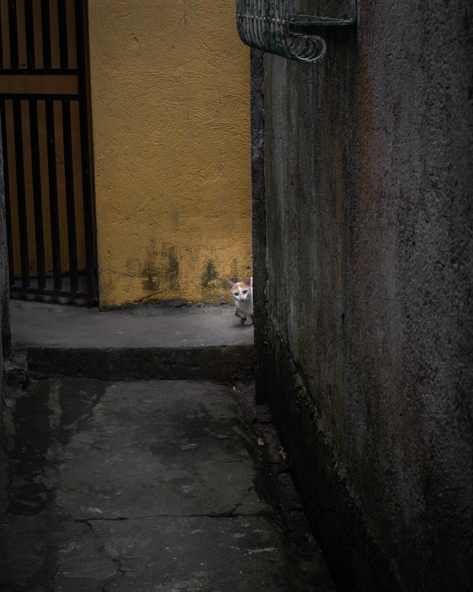

Roots x Gravel is done! Thank you for subscribing and following along.

This was my very first week-long walk project, and while it was deeply fulfilling, it was also physically and mentally demanding. I learned a lot about the limits of my body (i.e., how much walking can be done in seven days) and the limits of my writing and photography (i.e., how much writing and photo editing can be done when the mind and body are still recuperating).

Despite all its challenges, I consider this week one of the most important weeks of my life as a writer, photographer, and walker. It showed me what I can still do, and I'm excited to do more of these walks soon. Watch out for more walks in 2024.

Of course, none of these would have been possible without your support. Sometimes, I can't believe that a wonderful group of individuals care to read any of my writing. This is something I am both amazed and grateful for. Because someone is reading my words and resonating with them, I am encouraged to have faith in my writing and to trust that my voice is something that needs to be heard.

Through your support, I was able to do the following in the past week:

- Walked for six days
- Took more than 1,000 photos
- Wrote over 16,000 words via this newsletter
- Cover 87 streets in 13 out of the 14 barangays of Los Baños

More importantly, you helped me deepen my love of this little town I call home.

I hope you never get tired of being here. Your presence means a lot to me.

To show my appreciation, I edited one favorite photo from each of the six walks we did to fit on your mobile phone screen. Feel free to download these high-resolution photos from this **[Google Drive folder](https://drive.google.com/drive/folders/1I4Zkrkui-g3QfB49vQ7ERrihps-TUBRA?usp=drive_link)**. Use them as a wallpaper or screen saver. I hope that each of these photos can remind you that beauty is all around you and that you can find the spiritual in almost anything.

If at any point you want to return and re-read the missives, the archives will remain on this [link](rxg1).

This closing email will be the last you receive on this email list. I shall retire it after today.

If you haven’t yet, please consider subscribing to my weekly and monthly [newsletters](newsletters). Although I don’t often use social media, you can also follow me on **[Instagram](https://www.instagram.com/vinceimbat/)**.

Thank you once more.

Until next time,

Vince