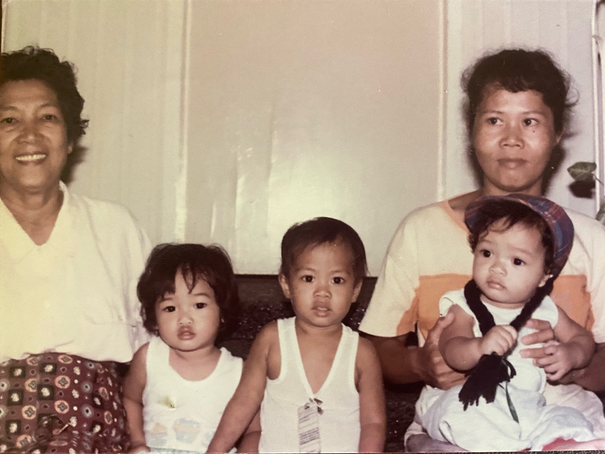
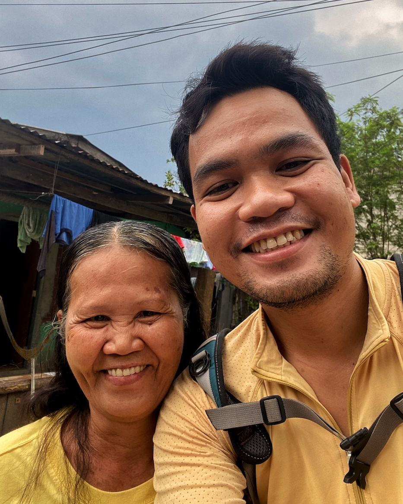

On the morning of July 4, 2022, I walked with my mother and father from our house at Cablong, Sta. Barbara, to a relative's house at nearby Botao. It was a rare occasion. I was already living 170 miles away from them and was only staying for about a week. Before relocating to Los Baños, we no longer walked together, something we used to do around 2011 when I was recovering from depression.

However, my mother almost lost her eyesight from diabetes and was prescribed a strict exercise regimen. Meanwhile, my father had his own existential encounter with mortality due to my mother's recent health debacle and decided to follow suit. As for me, I missed my parents, so I took the chance to walk with them once more after a long, long time.

En route to Botao, we decided to use the Balon Dalan road. It was my father who suggested it, saying we might finally see Sabel, the Deaf woman who took care of me when I was a year old and whom I've never met since.

My sister was just a year old when I was born. My father traveled a lot as part of his job, so my mother needed extra help. They said it was very difficult to find a helper at that time, so when someone recommended a young unmarried lady from Sta. Barbara, my mother readily accepted even when the lady couldn't talk.

Whenever my mother tells stories about Sabel, she would always premise it with, "She loved you so much." She would mention that time when I was sleeping in my crib and my one-year-old sister would play around me, making loud noises. She said Sabel would get mad at her and would unwaveringly defend me throwing random angry sounds at my sister, which my mother would hear from upstairs. My sister, who already knew a few words, would retaliate, calling Sabel "pangit" (ugly), which, fortunately, she didn't hear.

But then, my mother would also blame her for why I started talking very late. She would mention the large cross she hung in her room (my parents are Jehovah's Witnesses). Then she would always end with, "Oh, and she was larcenous!"

When my mother asked her to leave because she was getting sicker and sicker with weak lungs, my mother said Sabel hugged me tightly and kissed me goodbye like a real mother would do to her child.

I was fond of all these stories, but what baffled me the most was the thought of what it would have been like to feel all that gesture of affection from this stranger. I hold a grudge against the universe for giving me all that love at a time when I was unable to register it in my brain and remember. Sometimes, I ask whether it was easier to show love to a stranger when he is but a helpless infant. And so, you can say, I was really looking forward to this occasion—to finally meet Sabel.

We entered an open gate to a compound of two or three houses. There was a kubo in front of a bungalow with a patio typical of houses in Pangasinan. My father immediately recognized a man sitting in the kubo. "Is Sabel here?" my father asked him. "The child he took care of is here," he continued. The man stood up smiling. "Call your Tita Sabel," he told an eavesdropping teenage girl. The girl went off at the back of the house and we waited for a few minutes. When she came back, behind her was the woman in my mother's stories.

She has grown old. Who knows how many other children she took care of after me. But underneath the white hair and the wrinkles on her face was a genuine smile I would always fail to describe. She hugged me and then held my right arm staying close to me as much as possible. She was giggling, making signs in the air about how tall I had grown. We were both excited to see each other.

I remembered all the years that had to pass before this little reunion—30 years—a reunion that would've been different had it not been for the language barrier. She is Deaf but isn't versed in sign language, which I was proficient in, having been an ex-minister to the Deaf. I would've wanted to ask her questions, to get to know her, to have a glimpse of what her life was like during all those 30 years that passed. But I tried to ask her in natural sign language whether she got married or had her own child and she didn't seem to understand any of the signs. The man who asked the girl to call her said she never got married.

We continued walking that morning, leaving Tita Sabel without knowing more of her story aside from what was shared by the man. I don't have a single childhood memory of her. But I trust my mother's stories of how this woman, shunned by the outside world because of her disability, never married, and lived with her family all her life (she's now in her 60s), used to protect me with everything she had, used to treat me like her own blood.

It's a shame I could never remember. But I want to believe that subconsciously, perhaps even in my body, I do remember that during a brief period in the first couple of years of my life on this planet, a quiet stranger showed me true love, something I may never experience again in my adult life.

