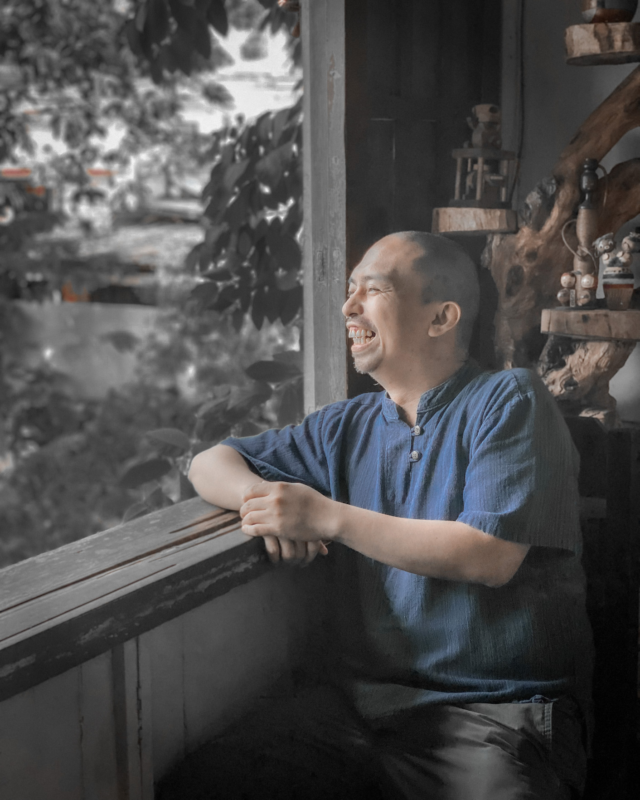
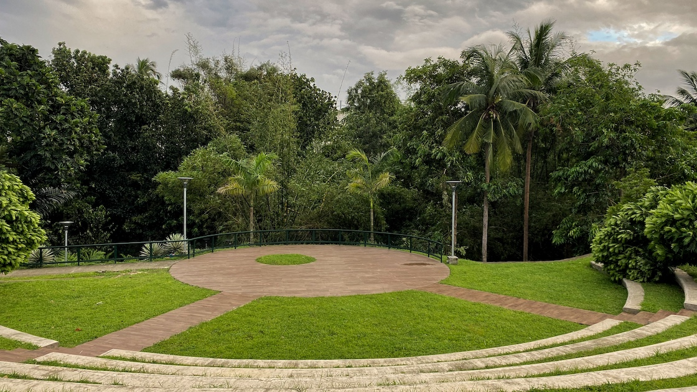
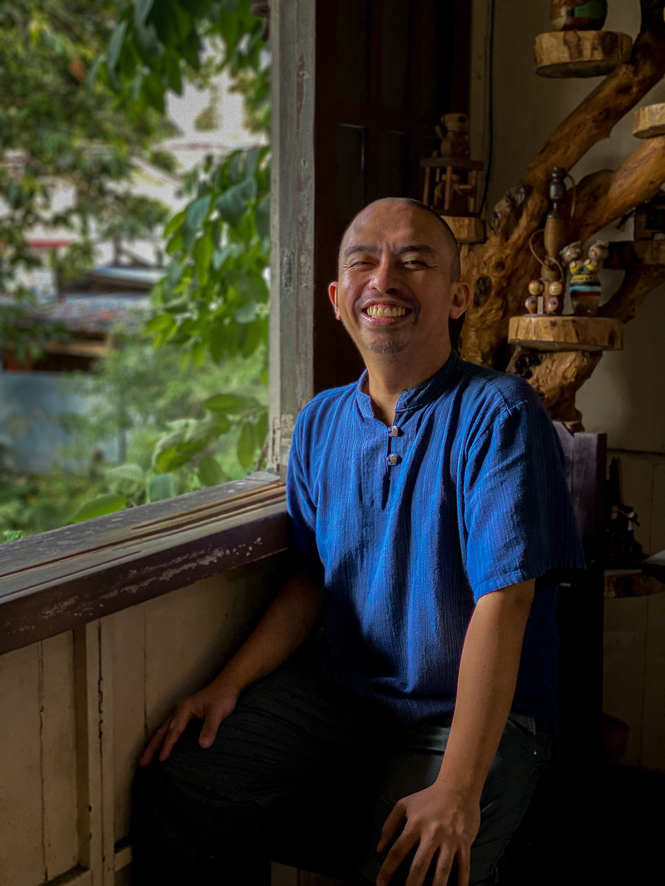

*Lahat tayo'y aninong  
sa langit humaharap.  
Lahat tayo'y karimlang  
uuwi sa liwanag.*

*We are all shadows  
that stand before cosmos.  
We are all darkness  
and to light we go home.*

~ Rem Tanauan

I'm **[Vince Imbat](https://vinceimbat.com/)**, and this is _**[The Long Walk](tlw)**_.

On October 23, 2022, right after I published the third issue of this newsletter, I received the sad news that **[Rem Tanauan](https://www.instagram.com/ditomuna/)**—my poetry and translation mentor who I also considered my closest friend—passed on. This issue of _**The Long Walk**_ presents the footsteps I have taken so far in the valley of grief between remembering Rem and trying to move forward.

## The Long Walk: October 24 to November 5, 2022

### October 24, Monday

It was difficult to fall asleep after learning about what happened to Rem. But I tried. In the morning, when I woke up, I wrote a very brief journal entry.

> Yesterday, I lost a friend. The only truest, closest, most genuine friend I’ve ever had….
> 
> I need to go back to the steps we took together. I need to re-walk my dear friend’s life. I am still in shock. Still in denial.

I started re-walking my friend’s life per necessity. His family needed photos, both his best portraits and those with friends and family. I went through my entire photo library, chose the best samples, edited a few, and uploaded the photos to a shared Google drive.

After re-walking my friendship with Rem in photos, I took a real walk to let thoughts and memories flow. I came home with a handful of words I still didn’t know where to put.

### October 25, Tuesday

I woke up earlier than usual to catch one of the earliest buses to Cubao. My goal was to arrive at Los Baños in the afternoon and visit Rem’s wake in the evening. The trip took more time than I expected, which made it impossible to go to the wake. During the trip, I killed time by listening to music in between writing more thoughts and memories about Rem.

### October 26, Wednesday

I needed something to read on Rem’s eulogy night. The original piece was a collage of the thoughts and memories that came to me in the past two days since learning about Rem’s death. While raw and real, reading them in public didn’t really feel right. Perhaps it was not their time. I listened to Lea’s advice to write things I would’ve wanted to tell Rem. So I rewrote the entire **[piece](https://vinceimbat.com/Kung-natuloy-sa-pancitan-ang-huling-ala-ala-ko-kay-Rem/)** and did just that.

In the afternoon, I visited Rem’s wake for the first time and helped hold his first eulogy night. I knew Rem was good with people, but for the first time in my entire six years of friendship with him, I saw how much deep love Rem was able to flow into this world. I didn’t realize how large his network of communities was and how much people are grieving his loss until I saw it through my own eyes. There were lots of tears shed. But there were also laughter and joy that night. We were all still grieving, but at last, we had hope.

Somewhere in my Obsidian vault, I wrote:

> Rem’s leaving has left me with a profound existential crisis I have never felt since my depression in 2011 when I left my childhood religion. That was my first awakening. This might be my second.

For the first time since 2011, I considered the possibility of doing some “pastoral” work. Inspired by Rem’s ability to connect with each life he has touched on a deep level, I realized I wanted something similar in my life. I was no longer content with publishing a weekly newsletter and calling myself a writer. I wanted to connect with people in flesh and listen to them as I figure out how best I can help. But is there a place for an agnostic like me in that kind of work? I sent a message to a common mentor I shared with Rem. I also read the article “**[Why Would an Agnostic Do Interfaith Work?](https://appliedsentience.com/2015/07/09/2937/)”** and found the beginning of an answer:

> “..do you have to be black in order to see the oppression of African-Americans and fight for racial equality? Or LGTBQ to fight for marriage equality? Why, then, must I be religious in order to see a need for interfaith dialogue?”

### October 28, Friday

I helped hold a second eulogy for Rem on the last night of his wake. We stayed after the eulogy and slept on the chapel’s pew chairs together with his family.

### October 29, Saturday

We left the chapel early in the morning. We wanted to go home to Los Baños to get more sleep before going back to Batangas for Rem’s internment at 2 pm. We arrived home after about two hours of travel. By 11 am, the electricity was gone. By lunchtime, the wind started to get stronger. By 1 pm, torrential rain was pouring. Lea and I decided not to proceed.

We wouldn’t have made it, not even with our own car. In the evening, all entry and exit points to the crematoria were flooded as the strongest storm of the year graced Rem’s ashes with its presence.

### October 30, Sunday

Nothing can be done on the computer or outdoors, so we made it through the day by writing in our journals, reading, and catching up on sleep. Perhaps, a total retreat from the world and our daily comforts were what we needed at this time.

### October 31, Monday

This was Rem’s ninth day after death. Tagalogs call it _pasiyam_ (_siyam_ meaning “nine”). But for me, it was my first return to Rem’s house, the house I was privileged to visit several times throughout the span of our almost six years of friendship. Crossing the street towards the gate was hard, walking on the balcony where we stayed for hours on end talking about poetry was harder, but entering his room hit me the most. There, Rem’s books stared at me. But there was no Rem on the bed where we had many loud laughs before going to sleep. What was only there were some petals on an altar built for him.

In the afternoon, I joined the family walk at a secluded park, which Rem did what might have been his last walk of solitude. There, long and heavy bamboo stems blocked the pathways. We had to duck to pass under them and see the fishponds. This is a beautiful place. I can only wonder what poems may have come to Rem as he walked around here.

That evening, I walked home alone.

### November 1, Tuesday

I did a long journaling session while contemplating the things I can do to help Rem’s friends and family and projects I could start (whenever I am ready) to help continue Rem’s vision or integrate them with mine. Two things I have committed to after Rem’s departure are (1) deepening my poetry practice and (2) continuing my friendship with Rem by communing with his public and private writings.

### November 2, Wednesday

I can feel that my days are starting to go back to their old routine. In the morning after meditation, I journaled quickly about what October meant for me and what I plan on doing this November. I then plunged into review mode—finances, goals, etc.

I felt like Lea rewarded me with a hearty dinner, after which, I rewarded myself with an evening walk alone. On the walk, raw words came to me…

*Kakalahati palang ang buwan  
tulad ng buhay mong  
hindi pa natapos  
sa pag-inog.* 

…and a few more…  

*Nang makita ko  
ang dagsa ng tao  
sa lamay mo,  
napagtanto kong  
maari naman palang  
mabuhay ng makabuluhan  
kahit aapatnapung taon lang.*

Back home, we watched a good movie before retiring to bed.

### November 3, Thursday

I felt my philosophical voice return after almost two weeks of retreating into the background. On my digital forest garden, I wrote the following note:

> **Amoralism does not prevent me from feeling strongly against certain behaviors**
> 
> Just because I am an amoralist doesn't mean that I will have to love the unloveable. Amoralism is a metaphysical stance, which means I am simply believing on a statement about what does or does not exist. In this case, the claim that I am persuaded into is that there are no absolute, objective, and naturally occuring values.
> 
> This belief does not prevent me from feeling strongly about certain behaviors like abusive and violent behaviors. I don't think I want to be around poeple exhibiting these behaviors and if there is a way for me to prevent them from abusing more, and I am in that capacity, then I should act. I am acting purely out of emotions and practical reasons.
> 
> My difference from a moralist could simply be that I do not use talk about "inherent rights" or morality to achieve my goals. But I could imagine a situation where I feel very strongly about protecting victims or would-be victims from an abuser. Amoralism does not automatically make me good or bad. It doesn't even want to use those words. Amoralism does not automatically make me an advocate for safety and lessening of suffering. But it does help me to see things as they really are and from there, hopefully I can lead to my desired course of action.

In the middle of a bath, words more refined than yesterday came to me:

*Sumasabay  
sa daloy ng tubig  
na ibinubuhos ko  
sa aking ulo  
ang daloy  
ng mga  
alala mo.*

In the evening, while washing the dishes, I finished listening to **[a podcast conversation](http://%28https//open.spotify.com/episode/0BTyuAFYXcpXvOOnHal3aT?si=QxVmnrg2QvSD383QvL-TVQ)** between the Riverside Interfaith Council and the Inland Empire Atheists and Agnostics. The conversation reaffirmed my desire to live in a pluralistic world with no single ideology dominating and where peace is possible despite differences in beliefs. This was a vision I shared with Rem.

### November 4, Friday

I started communing with Rem’s public writings. First, I read the overview of his blog **[Pathfinder’s Commune](https://pathfinderscommune.com/)** then wrote a reflection on it. You can read it by clicking on this title: “[Reflections on the overview of Pathfinders Commune](https://vinceimbat.com/Reflections-on-the-overview-of-Pathfinders-Commune/).” In this piece, I reflected on how Rem combined his earlier desire to be a teacher with his latter desire to be a facilitator.

In the evening, I met with some friends to share dinner and grieve together.

### November 5, Saturday

What better way to cap this two weeks’ worth of re-walking Rem Tanaua than to re-walk him once more? In the morning, Lea and I, together with another close friend accompanied the woman Rem loved the most to re-walk the steps they took together 13 years ago inside the Makiling Botanic Gardens.

Here, along the eco-trail leading toward the dipterocarp trees, Rem started his real communion with Love. To re-walk the trail is to re-walk his masterpiece—a masterpiece, which he shared with his other half. And like any other masterpiece, his footsteps will never be recreated no matter how much anyone tries. We can only emulate but never truly recreate what he did—what they did. We can only watch and witness and remember that once, not a long time ago, someone like us tried—no, did his best—to make the most of his one long meandering walk. To bear witness to this and be part of it is one of the greatest gifts I have ever received.

*Pagbaba sa batis  
sa may mga bato  
di mawari  
kung tutubi  
o ikaw  
ang inaantay ko.*

