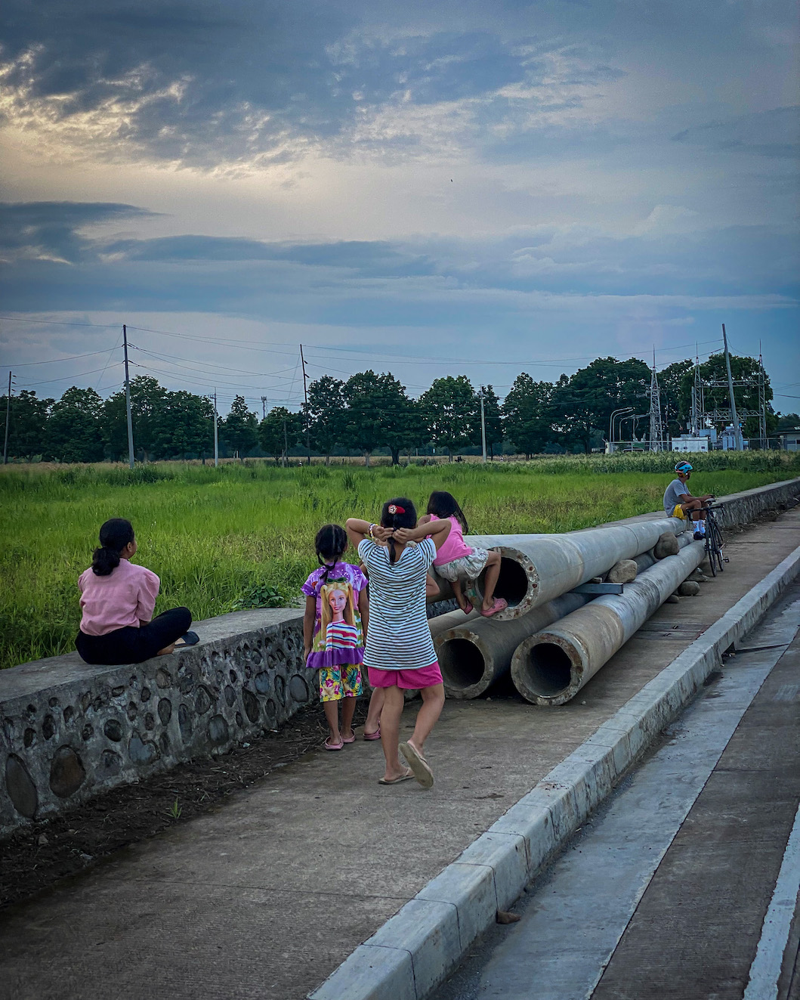

Yesterday, as I was walking back from sampling more of the IPB road, realizing it was difficult to walk on it, I saw this crowd of children and other groups sitting on the side of the road over the short concrete wall that UPLB built around its fields along Pili Drive. A taller adolescent, whom I recognized, joined the group of children. He was one of the fishball vendors at Grove, which I used to frequent in the afternoon before or after my walks. This young man has a crooked pinky finger, which he tries to hide sometimes. He was often shy, especially around female peers. But today, I saw him laughing, toying around the kids. He recognized me and was the first to nod his head to greet me. I nodded back. I walked pass them alongside two elderly ladies walking, taking their time.

On the fields, I saw that a group of boys had entered the concrete wall and were walking on that wide grassy dirt road that tractors use. The boys were exploring the fields, something I've wanted to do. I remember Sta. Maria. I stopped beside the gate to the walkway and sat there.

For the longest time, I've withdrawn from crowds. Earlier on this walk, I even wrote on my phone: "Philippine society is too noisy both in person and online that you need to tear yourself from it to hear yourself." But in the morning, I listened to [[steve patterson|Steve Patterson]]'s reading of [an article](https://steve-patterson.com/the-objectivity-of-structure-outside-our-concepts/) he released this year on [[thoughts/platonism|platonism]]. I was meditating on it while walking, jotting down notes about how [[thoughts/relationship|relationships]] are abstract phenomena instantiated by human [[action|action]] to be near objects and humans. As the sound of children playing, enjoying this dry afternoon in July, filled my background, I suddenly found an affinity with the public. I may not always enjoy them, but I belong with them by being near them.

Constant contact makes relationships inevitable, and I couldn't escape this. My relationship with myself and the place can only go as far as my relationship with the public allows. My method is walking, ideally in nature. But without participating in public affairs, I won't be able to influence how we could protect nature and walking. Suddenly, I am considering my relationship with others—with society, the crowd of strangers I walk with daily, or the nameless faces I share spaces with. And, for the first time in a long time, I considered the possibility of love.

