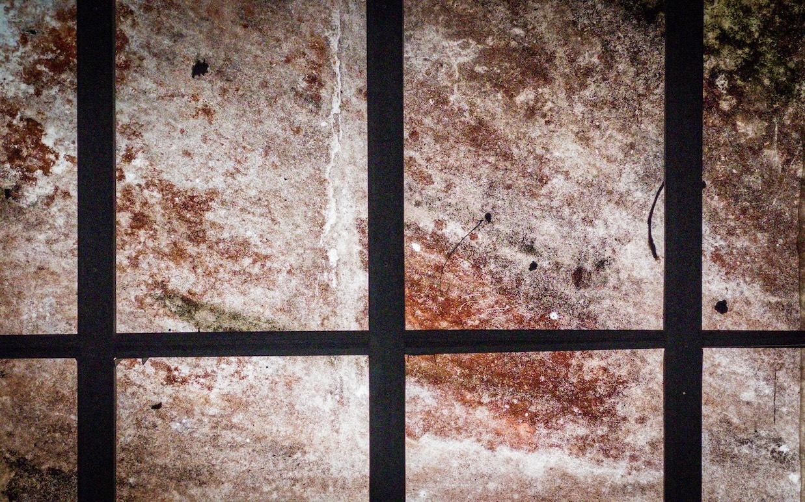

Dear friends,

I am writing to share an update on the trajectory of The Long Walk. As you may remember, I launched this newsletter on November 9, 2022, via Substack. Its tagline then was "Footprints from a philosophical and contemplative life."

In its first eight issues, I released a weekly open diary that contained artifacts I found on my daily walks and studies. Although creating those first issues was fulfilling, they took too much time and effort to prepare, so I switched to a more sustainable strategy. I reverted to sharing works in progress in my Talahardin, a collection of notes in different writing genres and stages of development. I tried to share one poem, vignette, essay, or insight every week. I also returned to using Mailerlite as my email newsletter platform to retake greater control over the publication design.

From day one, I intended to document my own long walk—a metaphor I use to refer to life itself—while touching on issues that I hoped would have a universal appeal to anyone reading. In the About page of the original Substack, I wrote:

>I have two main objectives in writing this newsletter. The first is to force me to make sense of the seemingly unconnected artifacts that often come to me in my reflections while studying or walking. The second is to leave intellectual footprints that others may use as archetypes or sources of inspiration for their intimate philosophical and contemplative journeys.

I still feel strongly about these objectives. However, I have changed and grown over the past year of my long walk, and this change and growth had to be reflected in the publication.

With that in mind, here are some changes I'm instituting in this publication moving forward:

## 1. I am returning to Substack.

Although Mailerlite allows more customizability than Substack, the company running it is losing integrity by the day, removing necessary functionalities that I have greatly depended on in their free tier. This makes it more difficult for someone like me, with a small audience of around a hundred people, to run a newsletter efficiently.

Meanwhile, what Substack misses in customizability, it compensates through its ease of use and growing popularity. Some of you have found this newsletter through Substack's promotional system alone. More importantly, Substack's user-friendly interface allows me to focus on what matters the most: listening to the comings and goings of life, catching a few artifacts worthy of my attention, and sharing some of them with you, hoping they could be of some value to you.

## 2. I am changing the tagline.

I am also changing the publication's tagline from "Footprints from a philosophical and contemplative life" to "Footprints from a philosophical and spiritual life." The change is a way for me to be more explicit about the tectonic changes that have been happening within me in the past two years, which started with the long walk to San Pablo City.

Since that walk, I've confronted the religious past that I have been trying to avoid for over a decade with honesty, trying to find clues to shed light on my path forward. The exercise led me to embrace a part of me that will never leave: a free, creative, religious, and spiritual self. Granted, I've avoided the words "religion" and "spirituality" when describing who I am and what I am doing. I once felt that these words were too slippery and loaded to capture the minimal secular outlook that I've leaned on since leaving the Jehovah's Witnesses in 2012. Nonetheless, how I conduct my life and explore art shows a strong tendency to feel reverence and awe for reality and act intentionally according to these emotions. I now realize that this tendency can never be fully captured by the words "philosophical" and "contemplative."

I am still an agnostic. I still think this is all the life we have (i.e., there is no afterlife), and I shy away from talks of the supernatural. And yet, I am deeply in love with existence—mine, yours, ours—and I am moved to make the most out of this existence through intentional living and creativity. I intend to write more about my evolving relationship with the words religion and spirituality in the future. For now, I am changing this newsletter's tagline to express my openness and acceptance of who I have always been.

## 3. I will be exploring spirituality further.

In connection with #2, this newsletter shall become more explorative of this desire to construct a free, creative spirituality, to live it, and to test how this spirituality could inspire a unique artistic practice, mainly writing and photography (my two primary media).

During the 20th Ateneo National Writers' Workshop, Luna Sicat Cleto told us that there are two writing genres largely unexplored and almost non-existent in the Philippines: nature writing and spiritual writing. As a Filipino writer attracted to nature and spirituality, I considered this a call to arms. Although the European romantics, the American transcendentalists, and classic Eastern spiritual writers are often looked down upon in contemporary literature, they are still the best resources for anyone exploring a writing practice that is both nourishing and expressive.

As I end this letter, I want to take this opportunity once more to thank you for paying attention to my words. Many of you found The Long Walk by meeting me in in-person gatherings and sharing a piece of our lives together. It was a privilege to have met you on your own long walk, and I sincerely desire to give back to you through my humble words, which I hope will always provide you comfort, no matter how small.

With the warmest of wishes,

Vince

