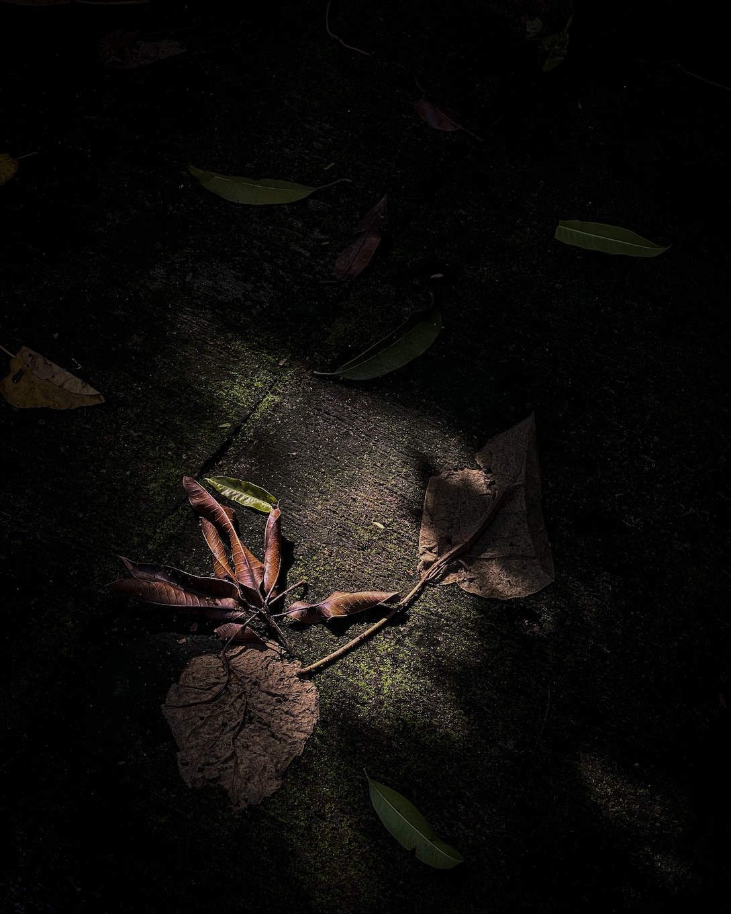
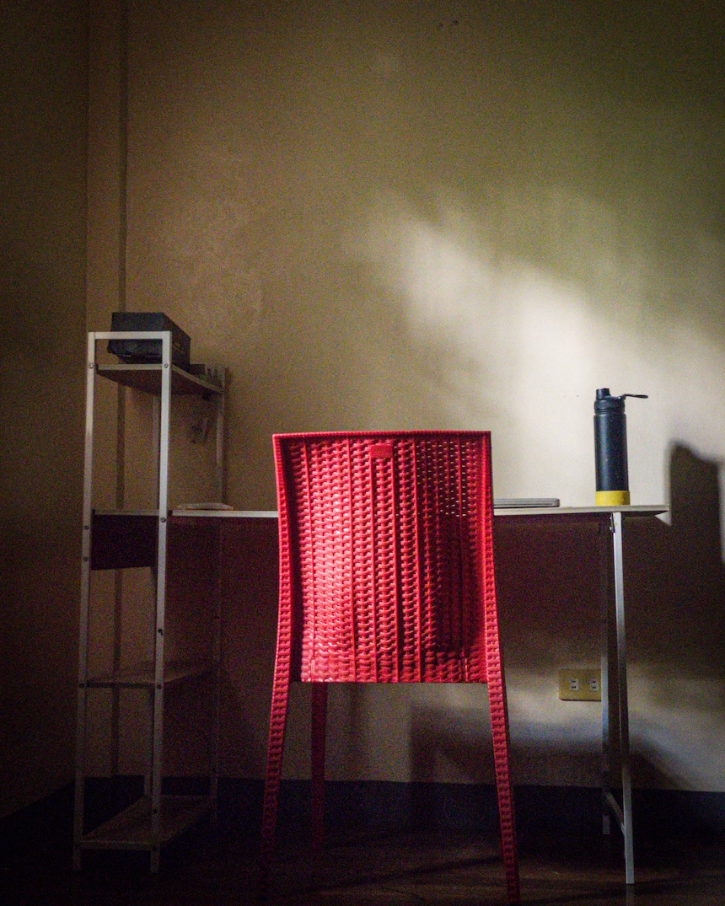
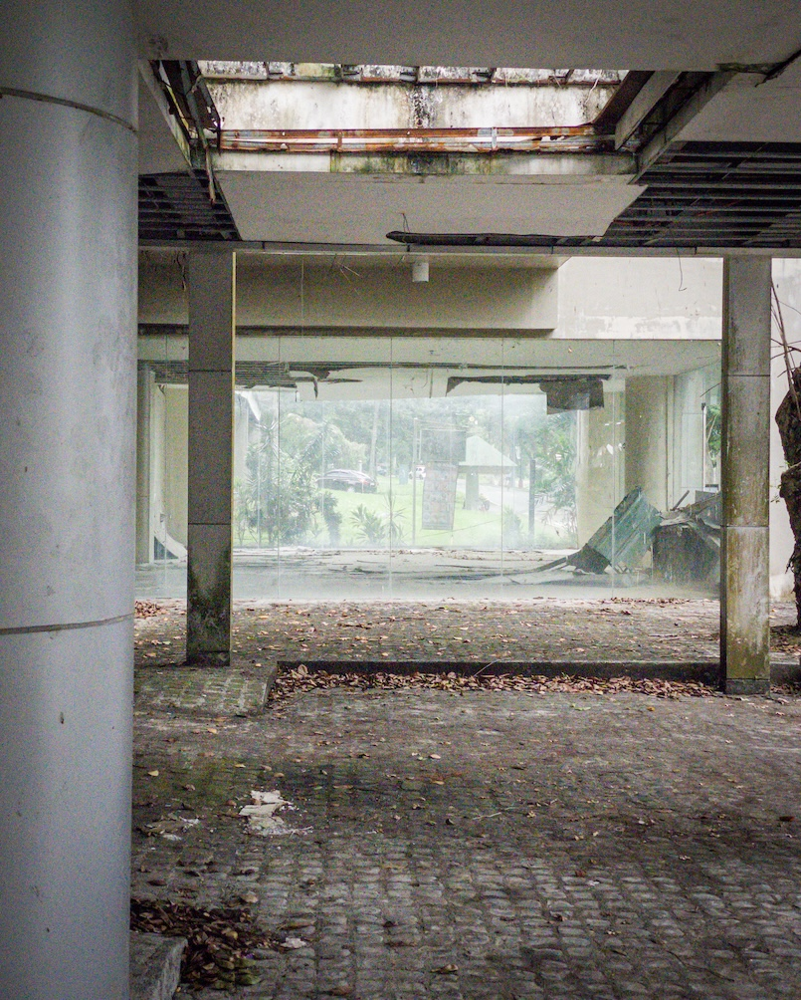

It has been told that the historian Arnold Toynbee once visited the Ise Grand Shrine of Japan. The Ise Grand Shrine, also known as Ise Jingū, is a network of several Shinto shrines scattered around Mie Prefecture and encircling two main shrines, Naikū and Gekū. It was perhaps after seeing these two shrines that Toynbee wrote the following words on the visitor's logbook: "I feel in this holy place the underlying unity of all religions."

I encountered this account in "What is [[jiyu shukyo]]?" one of the seven selected writings of [[shinichiro imaoka|Shin'ichirō Imaoka]] featured in the appendix of *[[cosmic sage williams|Cosmic Sage]]*, George Williams' biography of who was once called "the Emerson of Japan." In the same essay, Imaoka mentioned that the visit of a famous Buddhist poet, Saigyo, to the same shrine moved him to write a poem in tears for "something divine and inexplicable." Imaoka then concluded that both Toynbee and Saigyo are "free religionists" as they perceived the sublime across religious boundaries and that Shinto, the natural religion of the Japanese people, is a form of free religion as it moves anyone visiting regardless of their religious background into an appreciation of what it means to be human.

These accounts tell me that **spirituality is a lot simpler and more accessible than what most of us make it to be**. I am very interested in understanding and articulating this simple spirituality because my personal history with religion and spirituality has led me to an unexpected state where I'm not ready to join a church or any form of institutional faith. Yet, I describe myself as very spiritual and perhaps even very religious.

My gut tells me that any church or group can never monopolize spirituality. It can be institutionalized, but it will never be caged. This is because **spirituality is primarily a personal matter that relies heavily on an individual's subjective experience**. Furthermore, as [[scott barry kaufman|Scott Barry Kaufman]] would agree, spirituality is more prevalent in the population. All human beings are born with a natural predisposition to be spiritual. I will explain more later.

## The Two Farmers

When I was still living in my hometown in Pangasinan, I used to walk every afternoon on this long and winding road about ten minutes away from our house by bicycle. Whenever I reach the beginning of the trail, I get off my bike and start walking. The walk begins around four and ends around six when the sun completely sets. I would sit on the side of the road, usually on the grass, to watch the sun go down.

Around this time, farmers, some of whom I know, begin their way home. One farmer goes home riding a *kuliglig* (cart pulled by an engine) with some hay behind him. Another rides his small, rusty bike. Many walk, especially those living in small huts just along the road.

Most farmers would not care to look at the sunset. Looking forward to a tasty dinner after a long, tiresome day under the sun, most are eager to reach home. But once, I witnessed two farmers walking across the field via a *pilalipil* (dike) as the sun was a few seconds away from disappearing behind the mountains of Zambales. Something moved the first man to stop and watch the sun. The man following him did the same and placed his arm around his companion's shoulders. They joined me from afar in paying homage to this giant ball of fire that tirelessly feeds us and the crops around us with nurturing light day after day.

When I went home that evening, I contemplated what made those two farmers different from all the other farmers I'd seen throughout my many walks. I also thought about what makes me think deeply about perennial questions that don't bother many of those I encounter daily.

## Spirituality is an Attitude of Deeply Caring

It is no complete and conclusive answer, but I am partial to the idea that spirituality, at its core, is simply a way of seeing the world and being in it. In other words, it is an attitude. Specifically, **spirituality is an attitude of deeply caring** as opposed to an attitude of indiscriminate apathy.

Walker-writer [[craig mod|Craig Mod]] sometimes differentiates the United States (his country of origin) from Japan (his country of residence) by using the word "care" to describe the latter. After describing Japan's pro-people social systems, such as its health system and social services that make it easier for the Japanese to pursue creative and entrepreneurial pursuits, Mod would argue that these systems reflect a people who "care" about others. This culture of caring flows from Shinto itself, the Japanese natural spirituality or way of life.

This predisposition to care is at the root of spirituality. We are born with it. It begins with ourselves. It is within our nature to care about the self, preserve it, and seek its flourishing. At the same time, as early as childhood, we can direct this attitude of deeply caring to things outside of ourselves: to a caregiver, a pet, a stranger, or even an inanimate toy.

A closer look at the idea that spirituality is simply an attitude of deeply caring tells me a few things about what spirituality is.

1. **Spirituality is active.**  Attitude is a word that involves both a feeling about something and an expressed behavior toward it. This is exactly what spirituality is. It begins within but always seeks to get out of the confines of the self. It constantly seeks action and expression. Interestingly, the attitude of deeply caring (i.e., spirituality) is often maintained through active practice, whether meditation, praying, writing, or physically active practice, such as walking or yoga. Without this active practice, the attitude could weaken.
2. **Spirituality is dynamic.** Although I naturally can deeply care about myself and others, I won't always express it. It opens then closes only to open again. In my parable of the two farmers, the farmers who didn't stop to look at the sunset are not necessarily "non-spiritual." As human beings, they, without a doubt, deeply care about something. They may not care about the sunset but feel strongly about their wives and children and act toward them with the most significant expression of care—love. This, of course, is profoundly spiritual. Spirituality keeps on changing; it shape-shifts. So, we can never fully institutionalize it or put rules around it. It will always break free from those rules.
3. **Spirituality is object-neutral.** To emphasize the point I just made above, the object of my attitude of deep care could be different from yours. I could deeply care about my craft of writing while you deeply care about a loved one or a principle. Since spirituality is simply the attitude we direct toward something, it doesn't choose its object. We do the choosing, and we can channel it toward anything.
4. **Spirituality is pluralistic.** We don't have to direct our attitude of deeply caring toward a single thing or person. My life is too complex to focus on just one thing or one person. The nature of my life necessitates that I deeply care about many things simultaneously. Some will take more of my attention and care than others at any given moment, but the object of my care could change at any time. I don't have to burden myself with chaining my devotion to a single being.
5. **Spirituality is medium-neutral.** My brand of spirituality can be expressed in different ways. A minister expresses it through preaching, an artist through her works, a meditator through meditation, a philosopher through logic, and the farmer through his crops. Since the attitude of deeply caring is highly subjective, each individual chooses how best to express it based on their strengths and tendencies. Spirituality is not nurtured by a single method alone. There is no ladder to climb, only various spokes connecting to the center of a wheel. Also, I am multifaceted, so I don't have to choose a single medium to express my deep care. I could explore and use different media across cultures and traditions to express my spirituality.
6. **Spirituality is subsistent.** Taken simply as an attitude, my spirituality does not need a lot. It merely requires an object of deep care and a medium of expressing that deep care. It doesn't ask me to follow stringent rules. It simply requests that I be my most loving and caring self toward others.
7. **Spirituality is accessible.** Since it is simply an attitude and doesn't ask a lot from us, it is more accessible to anyone, regardless of their cultural and religious background. Spirituality can be owned by those who attend church and those who don't. It can be owned by those who believe in a personal God and those who do not.
8. **Spirituality is portable.** Since it is simply an attitude, I can carry it wherever I go. I could call upon it at any time. I don't have to be in a specific "holy" place to activate it. I don't need a pastor or a guru to call it forth. It is always with me like a shadow.
9. **Spirituality is inclusive.** The lesser the requirements for spirituality, the wider a net it can cast to include as much of human life in it. Seen simply as an attitude of deeply caring about something, we allow it to include as many diverse people as possible.

## Spirituality as an Alternative to Apathy and Suicide

But why do we need an adjective like "spiritual" to label an attitude of deep caring?

I need a label because I know that it is easy to slide into the way of apathy, a life characterized by not caring about anything at all, sometimes even to oneself. Apathy could lead to thoughts that life is no longer worth living. I've been in that place several times in my short life, and it is a place I hope to never return to again. I am intent on distancing myself from that place, and I need to remind myself of the better alternative constantly. A label, such as "spiritual," can be a useful mnemonic device.

I need to emphasize at this point that the desire to end one's life should never be taken as a sign of a person's "spiritual" weakness, as is often the view in many institutionalized religions. My depression and the suicidal ideations that came with it and returned on two occasions (the end of my six-year relationship in 2018 and the coming of my tinnitus in 2020) have taught me that most, if not all of us who have, at one point, decided to kill ourselves, did so out of our intense longing to end our suffering. Suicide is often seen as a way out of suffering, not life. Remove the suffering and the suicidal will always want to continue living.

And this is why, I think, the question of suicide is so important, if not central, to an understanding of spirituality. I couldn't talk about spirituality without talking about the most existential of all questions: "Why shouldn't I kill myself?"

For me, spirituality (the attitude of deeply caring) is impossible without taking a courageous leap of faith in the goodness lurking behind every tiny crevice of a universe that can be so quickly filled with darkness. The evidence for a world that is beautiful and good is often missing that one needs to believe it is there.

Why shouldn't I kill myself? I'm not sure why I shouldn't, but I trust that if I avoid this thought for just one day, I will find something to convince me to begin "caring" again. This is the simplest yet most profound example of faith I could ever think of.

Once one trusts the goodness lurking out there, one begins to care about oneself, others, society, and the world. Spirituality, this attitude of deeply caring about life in general and specific objects (i.e., people, activities, things, etc.) in particular, becomes this constant practice that strengthens our conviction on the goodness of life as we face many forms of suffering. In other words, once spirituality kindles faith to goodness, it becomes a fuel that will continue to feed the fire of faith. Through it, the will to survive, to exist, is reinforced.

Writing this reminds me of why I like using the word "subsistent" to describe the kind of spirituality I'm proposing here. The word subsistent is primarily used to describe a condition that allows one to continue to exist (i.e., to get by). At the same time, it also refers to something that thrives on minimal resources.

This is the spirituality that I aspire for—a subsistent spirituality that will allow me to continue to believe in the worthiness of living and that is so lightweight that I can run with it freely with the winds of life.

## A Free, Subsistent Spirituality

I first heard of the term "subsistence spirituality" from Barbara Brown Taylor, a former episcopal minister who left church life to pursue teaching. She describes this spirituality as "a way of being with God and one another that is lean enough to live in the wilderness for as long as necessary."

In a talk, she described what that "wilderness" looks like:

>In the beginning, you weep. Because all the familiar landmarks are gone. Because you don’t know where you are. Because the only food left in your backpack is disgusting. And the little bit of water in your canteen has turned green. You’re hungry, you’re tired, you’re lost, you’re alone, it’s getting dark. And even if the sky is clear enough for stars tonight, you don’t know how to read them. You always meant to, but you never learned. So now what? If you’re a pray-er, you pray. If you’re not a pray-er, you pray. What else can you do once you’ve come to the end of what you can do for yourself? It’s time to find out what faith means out beyond the boundaries of where you were warned not to go.

You know that I also use the word [[wilderness|wilderness]] in my writings. I use it to refer to unexplored (or un-walked) geographic space ([[thoughts/geographical wilderness|geographical wilderness]]) and unexplored areas of thought and ideas ([[thoughts/mental wilderness|mental wilderness]]). Walking on both geographical and mental wildernesses leads one to experience the wilderness akin to but to a lesser degree to Taylor's description. However, what Taylor describes above is a third kind of wilderness—a spiritual wilderness.

Our very existence is a wilderness experience. The universe is like a vast expanse, and we've been thrown into it. Not only were we thrown into existence outside our volition, we also received no guidance to prepare us for what is to come. That said, we have something natural within us that keeps us going for the first few years of our lives. As children, we were naturally curious and explorative. In other words, we inherited a natural tendency to trust and care for others, the world, and ourselves.

But as we grew older, this natural faith and attitude of deep care slowly disappeared. Children who face unimaginable suffering lose this attitude even earlier than usual. For many of us, a crisis completely removes the veil of faith that protects us from the violent wilderness. This crisis pushes us to confront questions we never thought to ask ourselves: What is the meaning of all these? Why shouldn't I kill myself?

When our childhood faith and deep care are gone, we are left to do the hard work of rebuilding it. This rebuilding process begins with a spark of faith. The spark could come from even a brief glimpse of beauty in nature. It could come from a kind gesture from a stranger or a loved one. Sometimes, it could be a rational conclusion. Whatever form it takes, it will be enough to save you from yourself.

Interestingly, in the deepest, darkest valleys of one's spiritual wilderness, institutionalized spirituality's rules, doctrines, and rituals do very little to get one through. What saves one is always something more humble.

## Finding My Free, Subsistent Spirituality

All I write here are based on my experiences, which I continue to understand better as I age.

I remember a vibrant childhood. I cared deeply about a lot of things. I had faith in my parents, relatives, the church we attended, and the world. As I grew up and experienced grief after grief (first, the loss of a pet, then the loss of my grandmother), I began to slowly understand that the world isn't always good to me.

Around high school, I began deepening my personal study of the Bible and the publications of my church. This propelled me to an intensely religious life at college, culminating in becoming a ministerial servant (a young pastor) for the Jehovah's Witnesses. The spirituality I built for myself and the community that supported me shielded me from the suffering I saw around me. But that spirituality required a lot from me. It required that I attend meetings twice a week, give 70 hours each month to preach, give some of my allowance to the church, study the Bible, pray, and prepare and deliver talks in the Kingdom Hall. On top of that, I needed to believe in an invisible God, submit to the authority of elders (all men) in the congregation, believe that my entire life was being guided by a dozen Americans in New York, fight any romantic attachment to anyone outside the church, fight urges to explore my sexuality, and fight other forms of "temptations" ever present in the world.

While I felt good that I was doing God's work and that I had a community that supported me, I often felt guilty about coming short of all the standards of the church. I often cried in my prayers.

In 2011, the universe launched me into my very first experience of the spiritual wilderness. A spiraling and excruciatingly painful depressive episode challenged not only my faith in God and his church but, frighteningly, even my faith in the worthiness of being alive. Only two weeks in that spiritual wilderness, it became clear to me that none of the training I received from my childhood religion, the hours of Bible study and preaching, and the friends who promised to support me at that difficult time could save me from my desire to kill myself.

I am only alive today because of the kindness of my parents. I am only alive today because I noticed that whenever the air touched my face during long rides, I felt incredibly good. I am only alive today because whenever my parents brought me to the beach, I found solace near the waters. These are the little things that gave me faith in that difficult time. They were the reason why I built some courage and patience to wait for the meds to kick in finally.

In other words, the little things re-sparked my faith in the goodness that lurked behind the world and made me believe that life is still worth living despite all the suffering. From there, I began to care once more. I began to deeply care about others, the world, and myself.

This new lesson continued to sustain me even after the depressive episode. It helped me face the second spiritual wilderness I experienced when I decided to leave the Jehovah's Witnesses a year after my depressive episode. In that second spiritual wilderness, I took an intensely minimal and careful approach to my spirituality. Yes, I explored different traditions and attended different groups, but I always took a skeptical approach. I took away what resonated with me but left the beliefs and rituals too heavy to carry around. I reasoned that leaving my childhood religion took away a lot from me, and I would like to honor that journey by ensuring that the next version of my spirituality is one I could truly call my own.

It has been over ten years since I entered this second spiritual wilderness. I wouldn't describe it as an ecstatic life. Yes, I've never felt as free as before. But the wilderness is a tough place to be in for obvious reasons. It doesn't give you the same comfort you had back at the place you left. For me, the biggest challenge since embracing a free, subsistent spirituality has always been community. I discovered early on that in spiritual and religious circles, skepticism is often under-appreciated and even subtly discouraged. Most religious and spiritual groups require a strong measure of devotion that is always almost binding. Therefore, it can be difficult to find a community of people who would encourage the same free, subsistent spirituality that I have designed for myself. In fact, it wasn't until this year that I started connecting with individuals who share a similar desire to keep their spiritual lives as lean as possible so that the unnecessary accessories of devotion may never burden them and that they can keep their eyes on what truly matters—developing an attitude of deep caring toward oneself, one's neighbor, society, and the entire universe.

