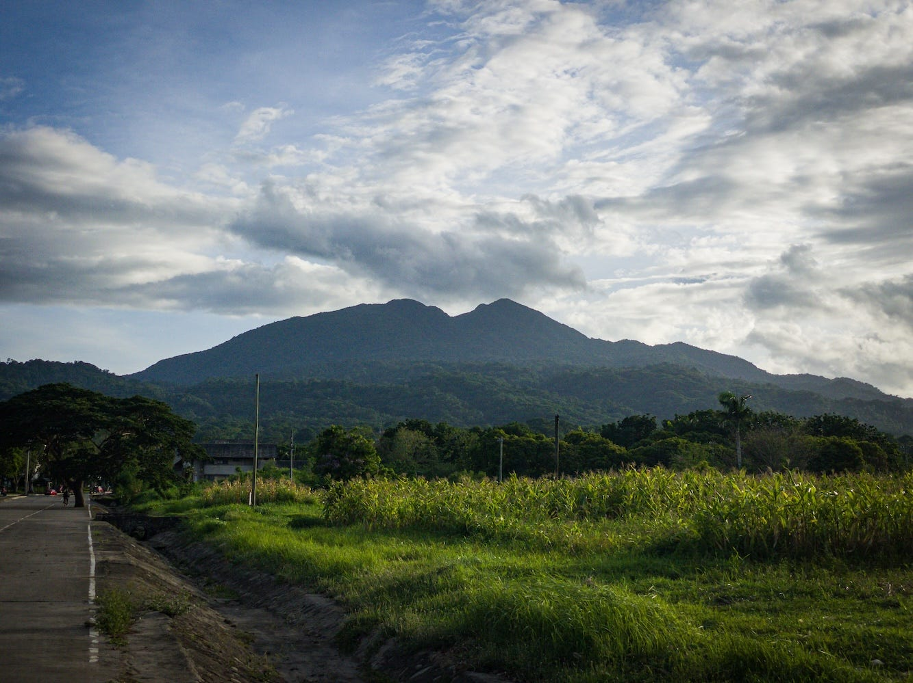

Friends—

I’m launching a new pop-up newsletter (meaning: I’ll delete it after a set period). It is called Roots x Gravel (read: roots by gravel). It begins tomorrow, Monday, December 4.

For seven days, I’ll be re-walking some of my walking routes here in Los Baños, the university town where I currently live. At the end of each day, I’ll send a dispatch of words and images that I’ll put together using prompts I pick up during the walk.

As a subscriber to The Long Walk, you’ll automatically receive the daily emails for seven days starting tomorrow. However, if you would rather not receive them, please go to your Substack account through this **[link](http://your.substack.com/account)**, navigate to notifications, and turn off “Root x Gravel.”

Since this is a pop-up newsletter, I’ll delete it after sending a final email on December 11, 2023.

***

In January 2021, after almost a year of isolation, I decided to beat travel restrictions and relocate to a town in Southern Luzon famous for its hot spring resorts. Los Baños (literally, “The Baths”) has become my home for the past three years. While I’ve walked many other places in the past, it is here in Los Baños where I truly fell in love with the art of walking.

For the first time in my three years here, I ought to further deepen my connection with this place through an intensive seven days of focused walking, photography, and writing.

Here are some rules to guide the walk:

1. I’ll begin the week with a question: What sustains me in Los Baños? While this question begins the project, it won’t necessarily finish with it. I’ll let the thoughts and images that come during the walks shape the entire course of the project.
2. Each walk shall be a practice of radical listening. Although an initial question guides me, my main goal is to listen deeply to whatever comes after and beyond it. I will refrain from imposing theories on my contemplations and writings during the walk. I’ll simply listen to what the walks will tell me.
3. The walk will be solitary. To really hear myself, I won’t be walking with anyone. Interactions with others will come naturally through the walks.
4. There will be no internet or social media access during the walks. Updates will only be sent via this newsletter. Perhaps a few photos will be shared via Instagram at the end of the day, but that would be it.
5. I’ll begin walking by 6:00 a.m. and attempt to finish before lunchtime. If more time is needed, I’ll give myself until 3:00 p.m., but nothing more.
6. Evenings will be spent writing and editing photos for the missives.
7. I’ll walk as slowly as necessary. There is no need to cover all the routes for seven days. I'll be doing at least two more of these walks next year any way, so no need to rush.

***

Why am I doing this?

I’m doing it because I’ve never done it before. I’m doing it because I set this as a goal for 2023, and 2023 is dwindling away fast. But more importantly, I’m doing this to honor Los Baños for everything it has given me for the past three years. This is one of the few places in the Philippines where I felt like people actually cared about their neighbors and the place they inhabit. For me, it is the perfect place to explore the subsistent spirituality I’ve been writing about recently and see how this place shapes the life I’ve been trying to build here. While this is a deeply personal project, I hope it will be helpful to some of you.

There is a communal gap that the project also hopes to address. Writings about Los Baños are surprisingly scarce. Believe it or not, no dedicated history book has been written about this town. Available books about it only tell about the World War II Japanese internment camp that once existed inside the University of the Philippines campus, the successful raid that Americans conducted to liberate the Western prisoners in the camp, and the violent retaliation by the Japanese against the local people that came after the raid. Contemporary writings about Los Baños are scattered around travel blogs and academic lectures. Writings about Los Baños, particularly an intimate portrait of the place and one’s experience of it, are yet to be written. I had these thoughts in mind as I was conceptualizing Roots x Gravel.

So, I hope you’ll join me on this week-long walk and tell others who may want to join us as well. I can’t wait to see what we’ll find on the road tomorrow.

Yours in walking,

V