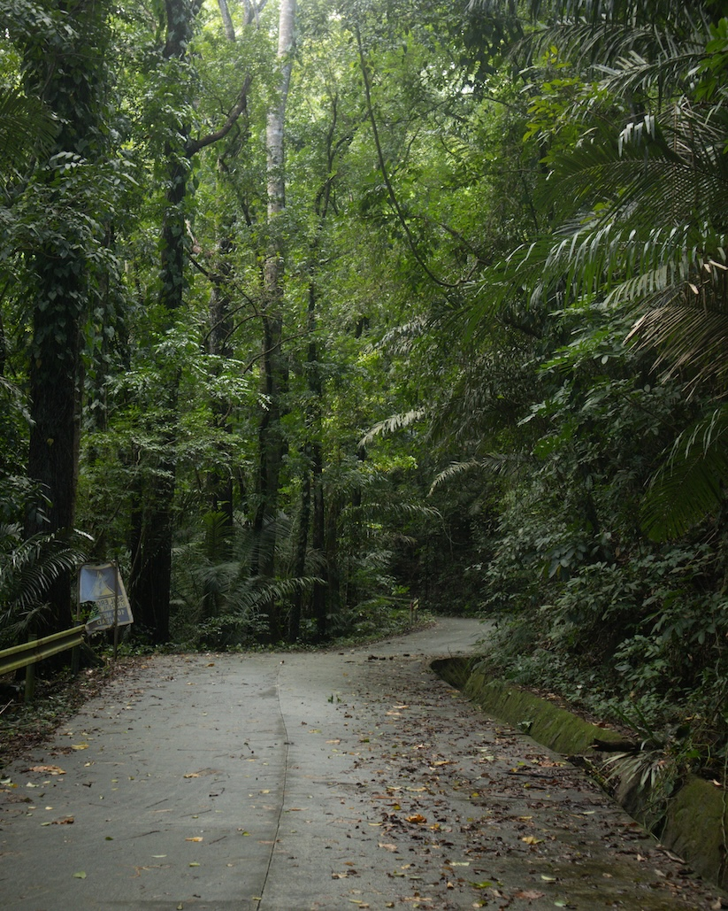

_Bagong Silang is the last barangay of Los Baños, Laguna, before the ascent to Mount Makiling. It covers the first few stations of the Mount Makiling Trail, Aguila base, and a couple more kilometers beyond. It was the only barangay I missed walking during **[my week-long walk of Los Baños](rxg1)** two weeks ago. Here is a lyric essay of my first solo walk in this barangay last November._
***

The clouds were moving too fast I had to stop to watch them. I raised my head and my eyes followed their gray outlines. Where are they going and why do they hurry?

[...]

At the mouth of Mount Makiling Trail, cracking sounds subtly break the silence I've only just found. They seem to come from above. It was the sound of broken wood—branches yielding to the November wind. An entire branch, longer than both my arms combined, fell on the spot I just walked on. I moved to the middle of the road and stood still to listen to the surrounding collapse.

[...]

For a moment, I felt I already had what I came here for. I felt that I no longer had to walk. I just had to stand completely still under these prodigious timber, and I shall hear their hearts beating.

Or was that mine?

[...]

From where I stand, I hear the chorus of insects. Trills ascending, then descending. From where I stand, I too hear the distant sound of a chainsaw. Metal ripping air. Then wood. Ever ascending, never descending. As if ready to devour the forest.

[...]

On the left side of the trail, two large stumps lay still, each the size of a round table. Once foot of giants, they refuse to be broken. They stand even in death.

[...]

It is only here where I truly feel closer to everything else. Such is the paradox of a solitary walk in nature.

[...]

My walk is changed by the subtle positioning of my eyes. Staring at the road ahead, I feel sanguine yet exhausted. Looking up, I feel impassioned yet small. Looking down, I feel placid yet constricted.

Sometimes, I wish I could walk with my eyes closed.

[...]

On this trail, to look down on the ground while walking is to look at decay and death: a dead earthworm, a decomposing bird, a wet frog skin with innards bursting. Of course, fallen branches and dried leaves. This walk is long, but like these things, it too shall end.

[...]

A wild chicken appeared out of nowhere. Hearing me coming, it went straight back to the underbrush where it may have come from.

[...]

I remembered that once, these walks never gave me anything in return, never rewarded the rigor I devoted to them. I remembered realizing that these walks too are walked. Past the initial hump, as if finally trusting the walker, the walks bestowed upon me the awareness that I have a body, that there is so much going on within and outside it, and that if I keep trusting the next step, only the next step, anything and everything that meets me on the road, whatever they would be, shall be and always will be part of me.

