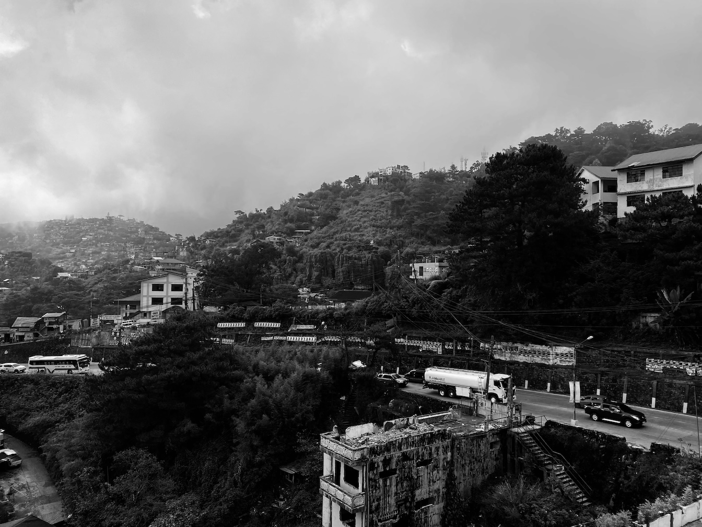
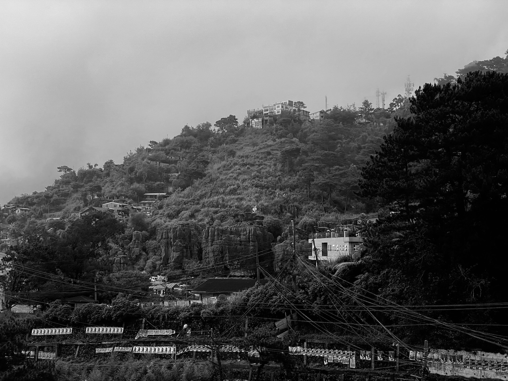

"every breath is filled with champagne, and so invigorating that new blood seems to flow through my veins." — Frank G. Carpenter, *Through the Philippines and Hawaii*, 1925.

"...this climate always does wonders for me when I have been or am ill, and I do not see why it should not keep me well if I could have more of it." — Dean Worcester (February 5, 1908, upon arriving in Baguio)

***
When I consulted Louise Far about this project, she laid down a question I overlooked:

>How are you going to protect yourself while doing it?

Stupid me. How could I have forgotten?

About three months ago, an innocent walk along Magsaysay Avenue in Baguio City brought back memories from a distant past. I recounted the trigger in [[uman 2023-10|the October 2023 issue of 𝌡 Uman]]:

>While walking towards the Taoist temple carelessly called a “Church,” I passed by a restaurant that held memories. I have never been in this restaurant but my friends in the church and I used to kid about this particular place. It was one of the fanciest restaurants in Baguio ten years ago (perhaps it still is?) and we joked that one day we would treat each other there—one day, we would always say. For this very reason, we find the name of the restaurant particularly appropriate: “Future Diner.”
>
>I am yet to eat at Future Diner.

How fast a seemingly innocent walk can transport oneself into what is thought to be forgotten. On that walk, I started seeing things.

>On my way back, I stopped at an intersection to let cars pass before I cross. A woman sitting at the back of a car looked at me eye to eye as the car passed in front of me. I think I knew this woman. I think I knew her very well.
>
>Suddenly, more memories of those three short but filled years in Baguio came rushing inside my head. “I can’t be here any longer. I can’t be here any longer,” I told myself as I walked briskly.

That walk led to feelings of regret (for leaving the church? for letting go of what could've possibly been a secure life around people who loved me? for hurting my parents?) and then of doubts (am I on the right path? is this life really better? is this freedom worth it?)

The questions were too much to bear. I was moved to [[2023 annual review|ask for "spiritual help" for the first time in twelve years]].
***

Why do the streets of Baguio have this power over me?

I wrote an [[a never-ending walk|extended essay]] about my personal history of this place. But here's a quick timeline for those who don't have the time to read it or are reading me for the first time.

- 2008: I left my hometown of San Jacinto, Pangasinan, to study at the University of the Philippines Baguio (UPB), which is about two hours away. While there, I transferred to a congregation with a large membership, many of whom were college students like me. This congregation also had a sign language group, which ministered to people who were deaf or hard of hearing. I joined the group and learned sign language between classes at the university.
- 2009: I grew deep in what was once the religion of my parents. I became very proficient in sign language and nurtured an affinity for the deaf community in Baguio. Around this time, the Governing Body of Jehovah's Witnesses started releasing talks and articles to its congregations worldwide warning about the dangers of higher education. My father, who was an elder at our congregation in Pangasinan, was persecuted by his colleagues for his decision to send me to college away from home. Listening to these talks and reading the articles made me doubt college. I was sure I wanted to dedicate my life to the ministry, dreaming of becoming a missionary to far-flung places, so I also questioned whether a degree in Social Sciences was necessary for my dream. Some friends in my new congregation in Baguio who also went to UPB have left and opted to take two-year technical-vocational courses instead. As days passed, I lost my desire to continue my studies, which was reflected in my grades.
- 2010: The sign language group I was a part of became a full-fledged separate congregation, and with it came my appointment as a ministerial servant, an assistant to the elders in the congregation. Aside from giving talks in the congregation, my main task was to create routes and maps that would help all members reach prospects who were deaf or hard of hearing, many of whom lived far from each other. This assignment made me familiar with the streets and barangays of Baguio City. As my devotion to my faith grew, so was my desire to leave college. After the first semester, I asked my father to allow me to leave college to focus on my ministry. Despite the tears, he rejected my plea.
- 2011: In the last week of my second semester in my third year in college, I started developing symptoms of what I would later learn was clinical depression. I was able to go through my final exams, but I was constantly tired and unable to sleep. Around April my symptoms were too difficult to hide I had to ask for help. Through the assistance of a school guidance counselor, my parents, and a few psychiatrists, I started feeling better, but my suicidal urges were intense. I had to leave school for an entire year and leave my congregation in Baguio to return to Pangasinan and fully recover. While recovering, I started to question the existence of a God who allowed me to suffer. At the height of my suicidal ideations, I intentionally committed an act considered a flagrant sin among JWs, which I told myself I would do before ending my own life. I committed the sin but avoided suicide.
- 2012: Elders inside my new congregation in Pangasinan and those in my previous congregation in Baguio learned about my mistake. They communicated to arrive at a reasonable punishment weighing the sin I committed against the clinical depression I just went through. After long talks and prayers, they concluded that a month of probation would be enough. I was relieved of my responsibilities, including giving talks, as part of my probation. A few days before I was reinstated, a visiting overseer overturned the initial punishment and removed me as a ministerial servant instead. These events led me to question the integrity and "divineness" of my church. A few weeks later, I decided to leave the JWs.

***

Not all streets of Baguio are triggering, and I haven't completely avoided the city. I actually returned to Baguio in 2013, finished my studies in 2014, and frequently returned to visit my sister and her family, where I'll be staying during this week-long walk project.

I feel comfortable walking in most parts of Baguio. But I noticed that, over the years, I've avoided certain areas for fear of seeing people I once knew and remembering what it feels like to be in these places as someone I used to be.

The decision to revisit these places and, dare I say, "re-own" them is not a rushed decision. It started about two years ago when I began making peace with my past. These days, I continue to ask myself what really happened back then and what I can learn from that seldom-visited time in my life that could enrich my present existence and the path I'm treading. For someone who has tried so hard to forget about certain places and specific periods of his life, to say that this project and everything it represents is necessary for me to continue living is an understatement.

***

Since that walk in October, I've been building the courage to do this walk. I'm corresponding with a pastor who is helping me identify the following steps to take in re-owning my spiritual life. I've also started practicing seiza meditation and deepening my contemplative photography practice through consultations with Louise. I'm ready to do this, but what else can I do to protect myself during the project?

First, I'm changing the focus of the project from "remembering" to "returning and reimagining." To do this, I need to treat these walks as a form of meditation in the Buddhist sense. This commitment means using the present moment as an anchor, specifically the physical act of walking toward these places and being on them. This "being in place" is my priority, making the project "process-first." The product, that is, the artifacts of creation that would come from this process, namely text and images, comes only after "being in place."

To help me picture how this approach could be applied in these walks, I listed a few rules of the walk.

1. The walks will only be performed within seven days, from January 15 to 21.
2. The goal is to perform a minimum of four and a maximum of six walks.
3. For a four-walk week, I'll alternate four days of walking and three days of rest.
4. For a six-walk week, I'll walk for three days straight, take a day off, and continue with another three days of walking.
5. I am allowed to stop the project at any point if I think any or all of the walks have been too emotionally and psychologically difficult.
6. As much as I could, I would avoid commuting to and from the locations of these walks. The idea is to use walking itself to set me up for and cool me down from the walk proper of the day.
7. When on the walk proper, I will stop in specific locations that would call to me and stay there for a while to be with the place. I will focus on looking and feeling the place as it is today.
8. Memories would be anticipated, but during these meditations, they would be treated like thought clouds passing by, allowed to arrive as they are without judgment. I will return to the present moment as much as I could
9. I would avoid writing during the walks to focus on experiencing the places unless a thought or memory calls strongly. The decision on when to record a thought or memory would be intuitively made at the moment it happens during the walk.
10. There will be places I will intentionally take photographs of (for example, the Kingdom Hall I used to go to). For these places, I would look at them first, be with them, take them in as they are now, and only take a photo when I've seen how the place asks to be photographed. Again, when the camera is used in this scenario would be intuitively done at the moment it happens in the walk.
11. Aside from the places I intend to photograph, I'll take other photos of things or places that call me during the walk using the same process.
12. The walks would be done in the morning. They would start around 6 or 7 and end around 11.
13. I'll be taking a few hours of rest after the walk.
14. In the afternoons, I'll write about the experience of the walks and the strongest memories that arose from them. Although not my main intention, I welcome ideas on how to relate to these places moving forward.
15. In the evenings, I'll process the photos I've taken and share a few of them in the email I send that day.
16. To protect the privacy of the people I could be writing about, I won't be using their real names or the names of the streets they live on. I also won't be photographing the houses of people I used to know. In addition, I won't be sharing a map of each walk; instead, I will share a single map of the entire project when it ends.

***
One of the thoughts that came to me while discussing my initial plan for this project with Louise was that I could choose not to do it. I mean, this could potentially be a project I would regret doing. Many things can go wrong: the memories could come flooding even before the meditation begins, someone might recognize me, or I might ultimately not produce anything worth reading or looking at.

But I can feel the desire to do this in my veins. Also, it's been twelve years. It's about time.

***

As a subscriber to *The Long Walk*, you will automatically receive the missives (four to six of them, give or take). If you would rather not receive them, please go to your Substack account through this **[link](http://your.substack.com/account)**, navigate to notifications, and turn off "Tall Tales."

After sending a closing email on January 22, I'll delete this list (i.e., I will no longer send anything to it). If you opt not to receive emails after this walk, you can either turn off notifications for the other newsletters I send to this list via the link above or unsubscribe to the list altogether.

