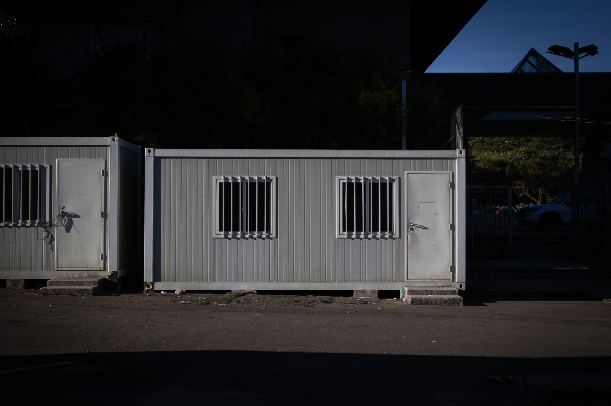
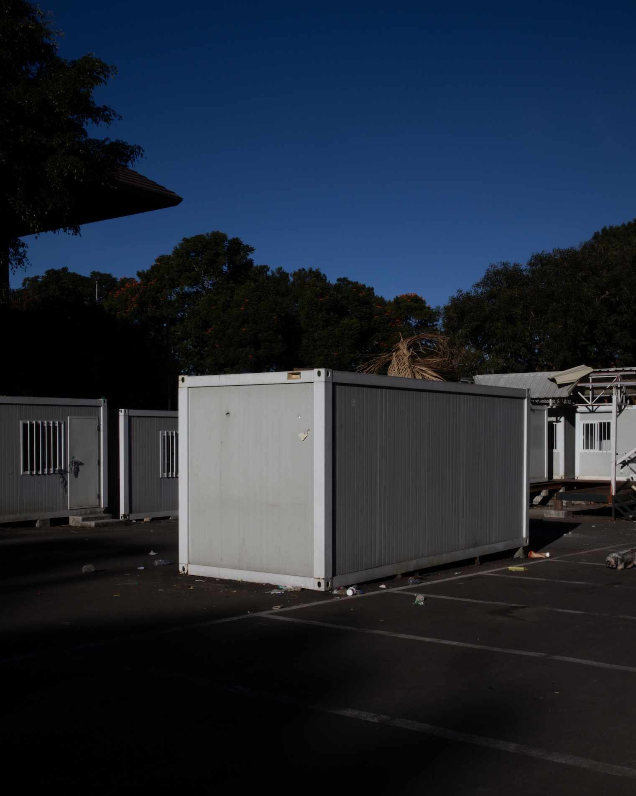
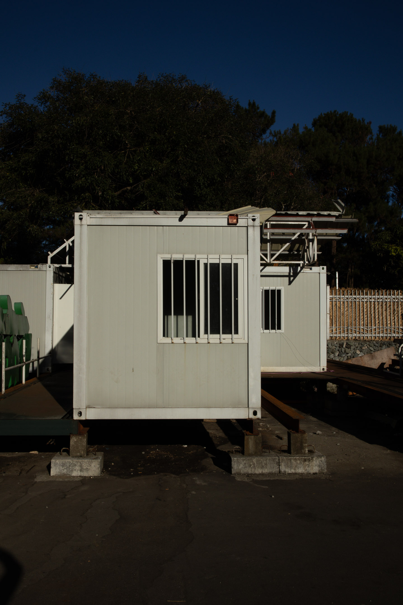
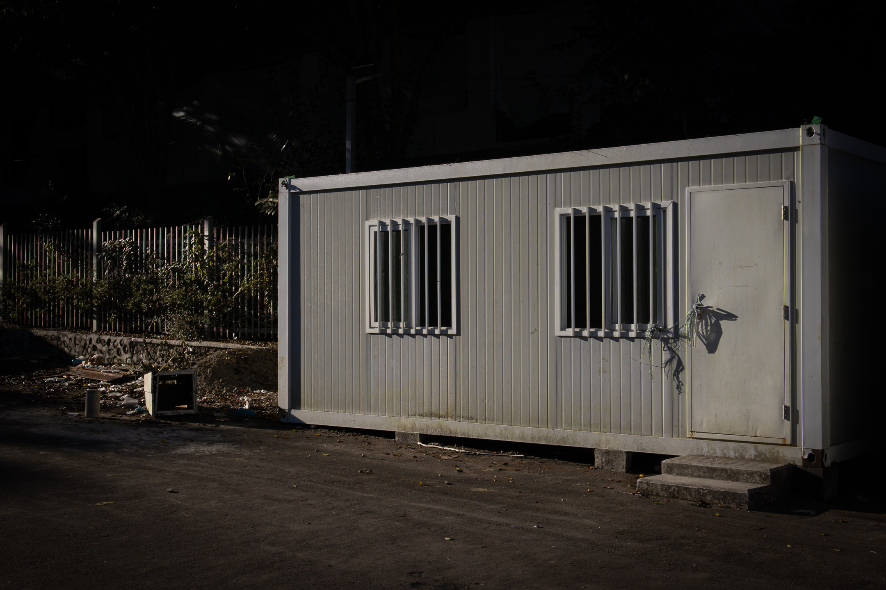

In 1886, in a new preface he wrote for his book *Human, All-Too-Human: A Book for Free Spirits*, [[friedrich nietzsche|Friedrich Nietzsche]] detailed a four-phased journey that an individual takes to become a "free spirit." Gordon Bearn called these phases: hearth health, sickness, convalescence, and the great health of the free spirit.[^1] As the labels suggest, the journey describes a path to recovery from an illness.

[[andrew j brown|Andrew J. Brown]][^2] directed my attention to this four-phased journey during my [[tags/tall tales 1|re-walk]] of Baguio last January 15–21, 2024. On the first day of that week-long walk, I returned to the kingdom hall at Rimando Road, the center of my activities as a Jehovah's Witness (JW) minister fourteen years ago.

As I stood there staring at an entirely new building, the old wooden one destroyed and replaced by a new concrete structure, I felt like a voyeur staring at something I shouldn't look at. There, I started questioning my motivations for returning. I began to have doubts about the purpose of the entire project.[^3]

In the past, I've written about how [[traversing liminality through walking|walking can help us begin a conversation between our past and present selves]], helping us traverse a space of uncertainty—of [[liminality]]. What I still haven't figured out is where this desire to traverse liminality emerges in the first place.

Why is there an urge to return to places and memories we've left behind? After reading about Nietzsche's four-phased journey for the free spirit, I think I have a working answer to my own question.
***
## Hearth Health

The free spirit begins his journey in a state of health, a health he acquires from being near the hearth (fireplace). In Filipino culture, the hearth is reminiscent of *dapog*, a stove made of mud that stands on three legs (*tungko*) and burns through firewood. The *dapog* is where the food that nurtures the family comes from and, therefore, represents everything that keeps us healthy. The hearth also reminds me of the fire in the middle of a *dap-ay*, a gathering place for elders in many indigenous groups around the Philippines, a symbol of tradition handed down to us for generations.

While the hearth provides health—a sense of purpose and security—for the free spirit in this first phase of his journey, Nietzsche says that he isn't truly "free" around it. In fact, Nietzsche says that a free spirit's peak moments while being around the hearth "fetter them the fastest, lay upon them the most enduring obligations." The hearth, therefore, is bondage.

Bearn says that the hearth symbolizes our inherited traditions, and our desire to be around the fire represents our "dutiful reverence" for our elders, country, and teachers. In religious terms, the hearth is the religious tradition we inherited.

In my story, this phase coincides with the period from when I was born and raised in a JW household until the year I became a ministerial servant (1992–2011). This is the first two decades of my life.
***
## Sickness

Nietzsche then pronounces that a sickness befalls the free spirit, a sickness that suddenly takes him away from the hearth. The illness begins with a suspicion that the things that once gave purpose and security to him are, in fact, false. This suspicion later aggravates as hatred for everything that he once loved.

As the illness progresses, she begins to consider that the things she once held "evil" are, in fact, "good." At its worst, nihilism envelopes the sick. He begins to believe that nothing matters, neither what was once good nor what was once evil. These were, of course, caused by the crumbling of the hearth.

In religious terms, the sickness of nihilism results from losing one's inherited religious tradition, which once explained the chaos inherent in the universe and provided purpose to one's life. Without it, the meaning of life is lost.

In my story, this period of sickness began with my depressive episode in 2011. The suffering it caused triggered my suspicion that the Bible isn't the word of God and that the authority of the elders in my religion, which they claim comes from God, is a lie. Later, I questioned the very existence of a lawgiver in heaven.

The suspicion transformed into a hatred of things I once loved, which culminated in my abandonment of the religion in 2012. Throughout this time, I was predominantly nihilistic. After the drugs kicked in, my first insight from the depressive experience was that "the universe was inherently meaningless."
***
## Convalescence

Sickness is followed by "long years of convalescence" in two phases. A cold detachment from the world characterizes the first phase of convalescence.

The metaphor Nietzsche uses here is one of a soaring bird high above the sky. Still recovering from nihilism, the free spirit continues to be skeptical of almost everything. He neither loves nor hates things but sees them through a theoretical or scholarly gaze. At this point, the free spirit is already significantly distant from the hearth that none of the things there already matter, and the intense hatred he once felt toward the hearth during his sickness was now tempered.

In this cold and distant phase, the free spirit is still partial to the idea that nothing matters, but he isn't too worried about it. Enjoying his newfound freedom away from everything else, he begins to smile.

In my story, recovery from nihilism began when I decided to take hold of my life after depression. Recognizing that blaming my parents for what happened and spending my days inside my room, watching movie after movie while gaining weight, wouldn't take me anywhere, I decided to return to school in the first semester of 2012 to finish my college degree. It was also at this time that I chose to leave the JWs.

While finishing my studies from 2012 to 2014, I dipped my toes in atheism and humanism and maintained a detached, scholarly approach to life. I lived mostly inside my head, studying theory after theory, trying to justify my decision to leave the heath. Joining a political organization in school did help me connect with the real world and have some purpose. But those two years were the least spiritual years of my life.
***

***
But then, the free spirit realizes that soaring like a bird above all else will not complete his recovery. While flying away from the world below him, he begins to feel the coldness of a detached and stoic existence. He starts to notice a growing desire to feel the warmth of lower altitudes, of the ground, "where the sun warms."

As the free spirit makes his descent, Nietzsche describes what he experiences:
>It again grows warmer around him, yellower, as it were; feeling and feeling for others acquire depth, warm breezes of all kinds blow across him. It seems to him as if his eyes are only now open to what is near.

These things that he now sees, he sees them for the first time. These things were veiled during the cold phase of his convalescence and sickness. But they were also hidden from his sight while in the hearth. Seeing these things and feeling the sun's warmth gives the free spirit a taste of genuine, natural "health" for the first time.

In religious and metaphysical terms, the things that the free spirit sees for the first time during his descent represent the natural world itself, which, devoid of supernatural explanations and stripped of grand narratives, are finally seen as they really are.

Without a belief in a mysterious impersonal force dictating the trajectory of your life, how would you see a flower for the very first time?

Nietzsche argues that without a metaphysical or supernatural foundation for the world, something that our inherited religious traditions provide, things (and our life, for that matter) are revealed for what they truly are—fragile and transient. And by virtue of their transience and fragility, they become more precious. We want to be nearer them. And this leads us to a newfound warmth, reminiscent of but entirely different from the warmth of the hearth where we came from—a freeing warmth from the sun.

In my story, I entered the warm phase of convalescence around 2014 when I left college and went back home to Pangasinan, which distanced me from my political organization and advocacies. With nothing else to do, I prioritized introspection.

Around this time, I also discovered Eastern philosophy and spirituality through a writer named [Dave Ursillo](https://daveursillo.com/). Reading the [[tao te ching|Tao Te Ching]], the [[bhagavad gita|Bhagavad Gita]], the Yoga Sutras of Patanjali, and more contemporary books like Echart Tolle's [[the power of now|The Power of Now]] made me realize that I still resonated with existential questions, religious subjects, and spiritual practices. For ten years, from 2014 to 2024, I shifted between this warm and cold convalescence and sometimes even returned to nihilism. But these days, I definitely have more moments of warm sunlight.
***
## Great Health

The last phase is "the great health of the spirit," which is simply warm convalescence prolonged. In this phase, the free spirit becomes comfortable with life outside the hearth—outside inherited religious and metaphysical traditions that require supernatural explanations and grand narratives.

The free spirit becomes attuned to being with a fragile universe yet learns a new kind of love. Per Bearn, this "different kind of love, producing a new happiness, is a love of what is precisely not immune to disaster, of what is delicate. This happiness, this great health, is a security within the shadow of risk, of fragility."

The free spirit grows healthy once more precisely because he is no longer afraid of the delicateness and impermanence of life. This fragility motivates him not to run cowering back to the hearth, back toward a God that would save him. Instead, this fragility motivates him to hold every moment of his life with love and care, knowing each could be his last.
***

***
In my story, I have yet to enter great health, and I don't think I'm done with my convalescence. The memories and emotions that flooded me during [[uman 2023-10|my walk around Baguio last October 2023 ]] are proof that there is still some work to be done before I can confidently say I'm comfortable living and thriving away from the religious hearth I inherited from my parents. And here lies the answer to why I need to do the Baguio walks.

First, walking back to these old places allows me to face emotions I haven't been aware of for years. These emotions, in turn, tell me where I am in my journey. Without them, I wouldn't be able to say how much I've healed or if I still need to do anything to get better.

Second, re-walking these routes facilitates the incorporation I've tried to do since 2022 when I started asking the question, "What are the things in my past life that I particularly enjoyed and which I could reintroduce in my new life?"

That question led me to the realization that I want to return to the words "religion" and "spirituality" and use them to describe the life and work I'm doing instead of hiding behind words like "philosophy" or "contemplation." It also made me realize I still want to engage in some form of "ministry," which puts me in direct contact with other people, like the work I did in the past with the Deaf community, unlike the solitary writing life I'm immersed in these days. Thinking about my past life as a JW motivates me to rethink concepts such as faith and prayer and see how I could still use and embrace them even when I now identify as a non-theist.

Heidegger said, "Overcoming is worthy only when we think about incorporation." I overcame my childhood religion but haven't incorporated that rich past into my new life; therefore, I couldn't claim that my work in the convalescence phase is done.

To close this phase, I need to intentionally and carefully return to the past, converse with it, understand what really happened, and see how I can move forward with the insights I take from such a return. Walking is necessary in closing this stage in my journey to becoming free because it facilitates this incorporation process.

Unlike mere recollection, walking is both experiential and intellectual. Experience here is crucial because it guards against potentially hurtful memories. While walking in Baguio, memories did return, but I also couldn't help but notice what the place looked like right *now*. The present, which is still welcoming of the past by nature, is also detached from it. This detachment opens the way for reimagining places and creating new meanings for them.
***
When I joined that progressive political organization in college that same year I left the JWs, I was running toward the nearest tower to save me from a life without Jehovah and his organization. I wouldn't admit it at that time, but I was terrified.

Without the grand narratives of the original sin, salvation through Jesus, the coming end of the world, and Christ's thousand-year reign over a paradise earth, I didn't know how to make sense of the world. The world has almost instantly become an unfamiliar wilderness. Somehow, I fooled myself into believing that a gravely deficient understanding of Marxist thought would save me from all these. Soon after leaving school, I realized how empty and alone my life was.

Fortunately, it didn't take too long to see that what really made me feel warm was engaging with existence—seeing how ordinary objects and events are portals to existential questions and emotions. I feel warmth in spirituality and religion, which is the merging of the cosmic and the personal. And so, no matter how hard I tried to approach the world in a scholarly fashion, using pure theory and the things I learned in the university to interpret the world, this didn't work for me. It's a cold way of approaching reality.

Theory is okay, but it has to help me feel warm. For it to inspire me, I have to extract the poetry out of it, or if it lacks this, I need to use it to create poetry, which I'm using here liberally not to refer to the literary form but to the way of living and expressing one's thoughts and emotions, which resists subordination. In Bernadette Mayer's words, "Poetry makes sure language has no masters."

My convalescence from the sickness of nihilism, this return to where the sun warms, began around 2014, two years after I left the JWs. But it was characterized by an exploration of the spiritual and religious traditions of the "other." I was still resisting returning to my past. In short, I was returning and attempting a return, but it wasn't complete. To complete this return, I need to really return, to walk back to where things started, a return which ironically began through a long walk at an entirely different place in 2022.

I am still in recovery, trying my best to make things a bit warmer. I should be descending in lower altitudes, but funnily, I had to ascend a mountain where it was very cold to feel spiritually warm. But I welcome the irony of existence, which is becoming my norm.
***
While re-walking my path on my first walk in Baguio as a JW away from his parents, I noticed something I hadn't seen before.

>I don't remember walking here and seeing this beautiful view of Mt. Data. Perhaps I saw it but never cared.

While re-walking Rimando Road to return to the kingdom hall, I noticed something for the first time.

>I've walked Rimando Road several times as a JW, but I was too consumed by religious thoughts, I've never stopped to even notice how clear a view it offers of Aurora Hill.

As I walked back, I crossed a bridge that revealed the Balili River from below, a spectacle I saw for the first time.

>Throughout this walk, this was the time when I felt my camera calling. I picked it up and used its zoom not to take a good photo but to look at the river closely and with focus.
>
>While looking closely at the Balili River, I am reminded that I, too, am a river of sorts—ever-changing, ever-flowing. And this ever-flowing nature is what makes me who I am.

Nietzsche says these events are something to be expected. Once removed from the shackles of the hearth, the suicidal sickness of nihilism, and the coldness of a detached existence, the free spirit sits silently astonished and exclaims, "Where had [I] been? These near and nearest things: how changed they seem! What bloom and magic they have acquired!"

[^1]: Bearn, G. (1997). Waking to wonder.
[^2]: Hat tip to Andrew James Brown, from whom I first learned about these four phases through his article [The Freedom to Be Tomorrow What We Are Not Today](https://andrewjbrown.blogspot.com/2022/05/the-freedom-to-be-tomorrow-what-we-are.html)
[^3]: This feeling isn't new. I experienced something similar in the middle of my walk from Los Baños to San Pablo in 2022.