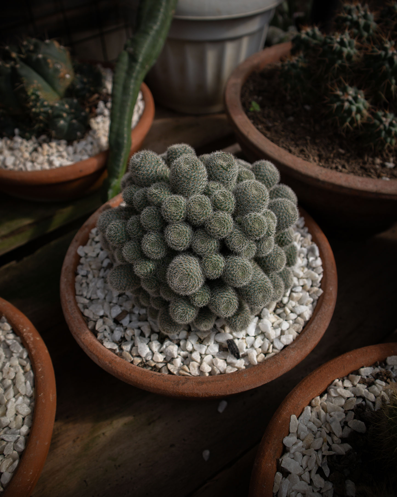

Sitting there on that tiny chair  
across her, I babbled words  
like a platoon commander,  
her eyes teary on both ends.

I felt the need to stop  
but my chest won't let me  
and my mouth went on  
and on until both had had enough,

until both had me raise my head  
to stare at the ceiling briefly  
before I shut my eyes close  
to stay there in that darkness  

for as long as I can  
and muddle on that silence  
that I knew she needed,  
that I most definitely needed,

a lull that stopped me  
from barricading myself  
inside a wall of words,  
a concrete cage of callousness.

