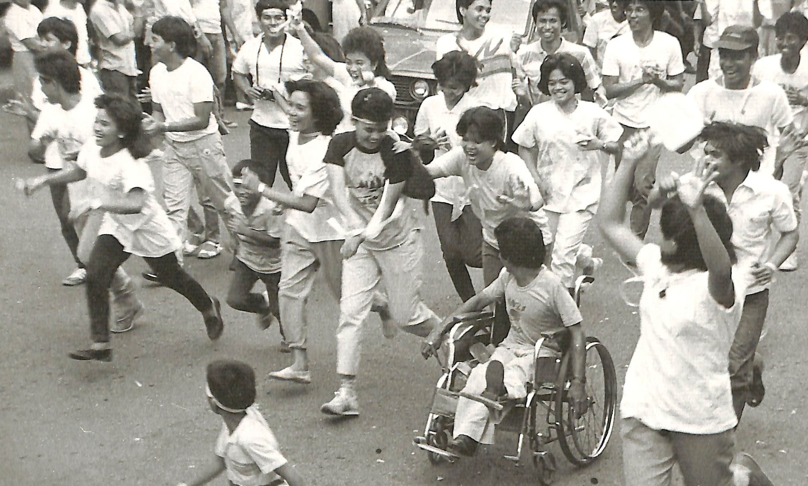

Friends!

This is still [Vince Imbat](/), writer of this newsletter.

This will be a short one, an update of sorts.

I recently created a page on my website that I hope would be the most comprehensive page on walking the Philippines. You can check that page [[walking|here]].

As of the moment, it is populated mostly by links to my own writing on walking, including newsletters, essays, and poems I've written about walking and those that used walking as a method. However, I plan to expand the page to include the works of other walking artists working on walking the Philippines (yes, not just writers!). If you are someone who fits the bill or knows anyone whose work deserves to be included on the page, please let me know.

I hope three sections will be helpful for those of you interested in learning more about walking in the Philippines: the literature on walking in the Philippines, sources for a history of walking in the Philippines, and walking arts in the Philippines.

Currently, there is no walking arts movement in the country. That's okay because, as Phil Smith argued in one of his essays, the existence of a walking arts movement in the world is questionable. In the Philippines, we currently have a few literary works written using walking and a few contemporary artists experimenting with walking, who are disconnected from one another. Perhaps, through this page, we can begin to see a pattern emerging and eventually connect all these artists.

If you missed the link to the page, [[walking|here]] it is again.

As always, thank you for reading, and may you always find joy and meaning in your own long walk.