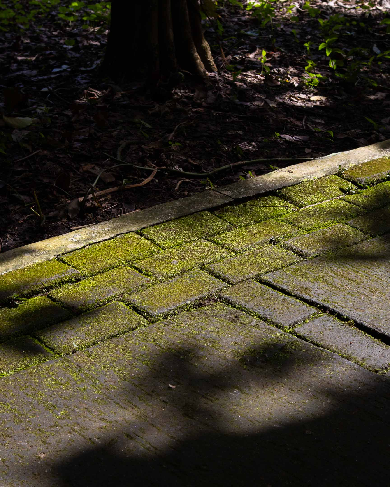

Last Sunday, my partner Lea and I decided to walk inside the University of the Philippines campus near our house. We hiked Lantican Avenue, one of the two roads ascending toward Mt. Makiling. This road leads to the College of Forestry, the last part of the campus before the first station of the Mt. Makiling Trail.

At night, especially on weekends when there are no classes, the study sheds built under the large trees that cover the college remain lit and vacant. Lea and I walked toward these sheds and picked one to settle on. That night, only one other couple used a shed away from ours. They murmured, perhaps also enjoying the silence of the place occasionally broken by the gentle trills of cicadas.

Lea and I decided to walk that night in response to a feeling that has been grown between us for quite some time now. We've been wanting to start a shared practice that could ground us to thoughts and questions that often fall on the wayside during our busy weeks. I have my own practices: I see my writing, photography, and walking as different expressions of my spirituality. But these are often done alone. What Lea and I needed was a practice we could share. However, since we have intentionally distanced ourselves from any local church, congregation, or spiritual group, we don't have that structure readily available to confront perennial thoughts and questions. We knew we had to build that structure ourselves.

Every other Thursday, I join a small group of individuals from different parts of the world to explore how to create and practice a profoundly liberating form of spirituality grounded in interdependence with community and nature. The group calls itself [Kiitsū Kyōkai](https://andrewjbrown.blogspot.com/p/kiitsu-kyokai.html), after a local community founded by [[shinichiro imaoka|Imaoka Shin’ichirō (1881-1988)]] in Japan after the Second World War but which disappeared after he died. The [[kiitsu kyokai|Kiitsū Kyōkai]] format is highly minimalist. It has only two parts: meditation followed by free conversation.

I proposed to Lea that we follow a similar simple structure for our walk, but with the addition of several elements unique to our needs. The thirty-minute walk from our house to the sheds was already part of our structure. The walk was a meditation of itself, which grounded us to our bodies, to each other (through whatever conversations and pauses arise during the walk), and to place. When we settled in the shed, we did a short five-minute silent breathing meditation to help our minds slow down and amplify the peace we found while walking. We know how to meditate but follow different techniques, so we used what was comfortable for each of us.

Since we are both avid diarists, we agreed to use free writing as an entryway to free conversation. To prompt the journaling session, I opened my phone to read a portion of an ebook version of Leo Tolstoy's *Calendar of Wisdom*, a book that contains a short entry for each day of the year. Each entry is a curation of quotes from Tolstoy's readings and his own insights related to these quotes.

Here is the entry for May 5.

>Religious teaching, that is, the explanation of the purpose and meaning of life, should be the basis of any education.
>
>People think that it is no crime to lie to children, and that to lie to children is not really very wrong, but even some­ times necessary. But it is clear that with children you should be especially careful and honest about what you say to them.
>
>You should always be truthful, especially with a child. You should always do what you have promised him, otherwise you will teach him to lie.
>
>—After the Talmud
>
>Man, whose teacher is nature, should not be a piece of wax on which an elevated image of some professor is to be carved.
>
>—George Lichtenberg
>
>Do not say to a child whom you teach that there is a final truth, if you do not believe in something completely, or if you have some doubts. To do such a thing is a great crime.

After I read the entry, we free-wrote for ten minutes about anything that jumped to us from the text. Ten minutes is short for journaling, so our entries were also short. But we were surprised by the depth of the insights that came to us, both of which we admitted arrived to us for the first time.

Here is my entry:

>When I was younger, I used to think I was very original. I gave primacy to originality. When I went to college, in particular, I think I followed a path that really forced me to obey and conform. It was almost a violent change. The University of the Philippines education was violent in some way, but so was the education I had at the Kingdom Hall.
>
>After I left the religion, I became addicted to following someone else's path. My voracious reading reflects this. It was my way of finding a safer path to walk on. I pride myself on being non-conforming, but really, it was so difficult to be original. Until now, I have felt this. To use George Lichtenberg's analogy, I feel like I'm still a "wax on which an elevated image of some professor is to be carved."
>
>I would like to believe that my incessant and earnest efforts to listen to myself without the aid of long sentences and paragraphs and books was and is the beginning of my healing, a process that hopefully would not necessarily make me more original, but more authentic and true and honest to who I really am and move and build a life out of that knowing. That might also be how I become more original.

And here is Lea's entry:

>I think first of all, children, despite how young they are fully expressed human beings. Sure, they come to this earth to learn, but we have just as much to learn from them. It is always believed that children are brutally honest. That is because they say exactly what is on their mind. They have no concept, unless learned, about right or wrong, true or false. Kind of reminds me of the Trisolarians in the Three-Body Problem. Anyway, I do believe that we should not lie to children. Their youth is in their most vulnerable state, which triggers me because, looking back, I now realize how much l've been lied to and how the people in my life didn't even know they were lying to me. I must have had doubts as well in my youth, but I was easily scared by threats of "hell," "Satan the Devil," etc. Perhaps this is why it was always an instruction? to start preaching the "Gospel" to the young ones. Start while young.
>
>Right now, just thinking about it. It is such a cruel, twisted, evil thing. To manipulate an innocent mind and populate it with so much guilt, shame, and self-hate. Doubt enough to make him/her believe that she/he is evil. Done for. A goner. Going to hell. Punished. And for what?

We read each of these entries aloud to each other. Following advice from [[pat schneider|Pat Schneider]] about reacting to vulnerable pieces that have just been born, we responded by sharing what we liked about the other's entry or what jumped to us from it. Only after reading what we wrote were we able to really have an honest and free conversation, a considerable part of which happened on our walk back home.

One of the things that surprised both of us from our conversation was how deep Lea's hurt is from her religious upbringing, a conclusion she hadn't reached before our little walk. I know that she would sometimes read Reddit threads and listen to podcasts about ex-Christians. Still, we both seemed to silently agree that, given the complexity of my religious past, my breakaway from traditional religion was more painful than hers, which only really started when she left home to live with me less than two years ago.

We were both surprised that reading Tolstoy's entry in the context of a walk would make her feel the heaviness of that past, which she still confronts once in a while when she visits her family. Intending to learn more about how we can work together to help her through this process, we agreed to keep the matter a subject for future conversations.

The structure (dare I say, liturgy) that we came up with on our little Sunday walk is as follows:

- ~ 30 mins. walk
- 5 mins. meditation
- 5 mins. reading of prompt
- 10 mins. journaling session
- 10 mins. sharing of entries
- ~ 30 mins. free conversation + walk

Lea and I hope to continue this practice together in the coming weeks and iterate the structure to adapt to our changing needs. For example, we could lengthen the meditation sometime or alternate responsibilities in choosing a prompt to use for journaling.

I am sharing this to illustrate a point that is essential to make. As human beings, we have a shared need to confront existence regardless of our spiritual or philosophical states. But often, at least in the case of the Philippines, secular institutions like schools don't have the structure for the cultivation of inner lives. Those of us interested in perennial questions are left at the mercy of the myriads of churches that require us to commit to a certain ready-made set of doctrines before we can benefit from community and practice.

As far as I am aware, there is no accessible group near me that could cater to my needs as a non-theist individual deeply committed to a spiritual, philosophical, and religious path. Since these structures are not given, we who need them must build them.