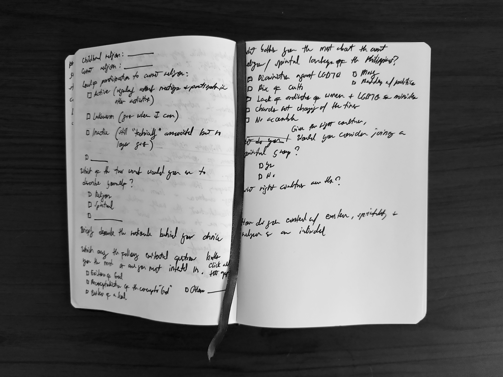
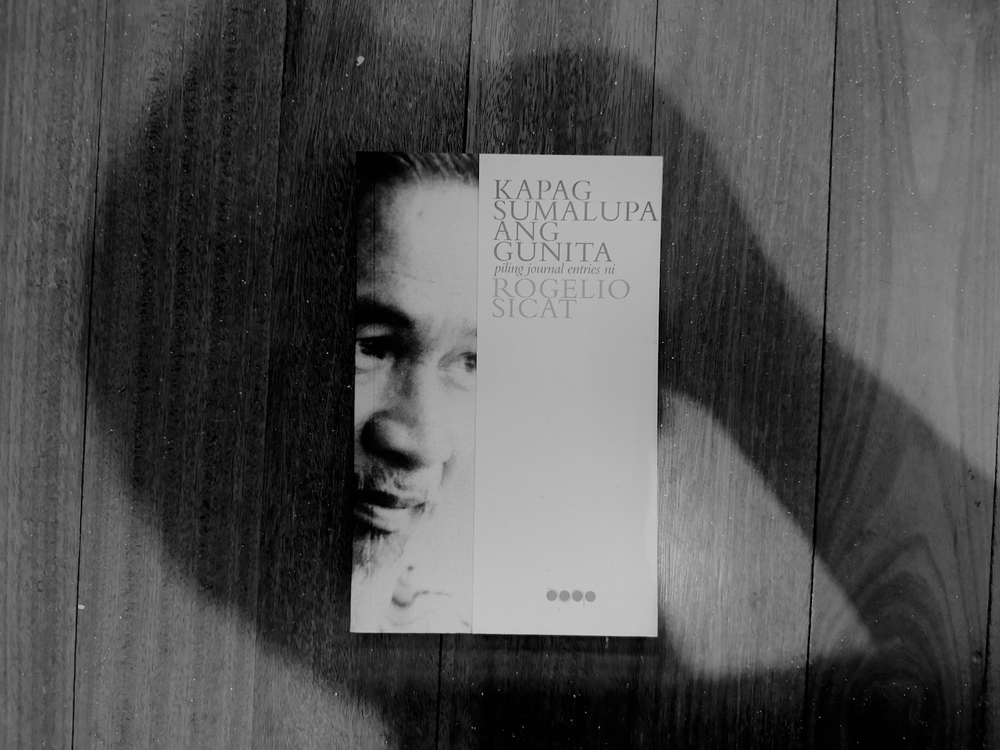
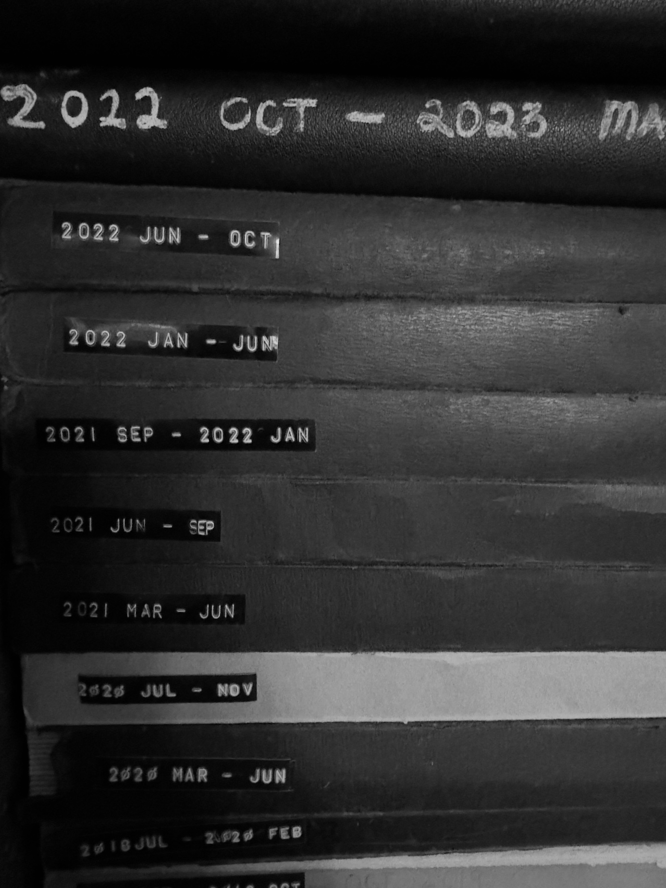

New journal. A beautiful one. Hardbound. Which means easier writing. And thoughts protected for years to come. This is quite possibly the best I've bought in recent memory.

I've been hunting down cheap, blank notebooks like this since 2018, when I started writing down one to three pages of my thoughts every morning after doing a few minutes of meditation. Julia Cameroon calls the practice "morning pages." I call it "whatever comes, comes." Because that is exactly what it looks like.

Some days, I would write these lengthy, logically curated essays about some philosophical question I've been thinking about for days, only to be followed by days with entries filled with lists of things to do: bathe the cats, follow up an invoice, replace that broken doorknob, etc. And that is why I laugh when I see these articles online differentiating between a diary and a journal, calling the former a record of things that happened in a day and the latter a laboratory of academic and artistic pursuits. My notebooks are practically the same.

Lately, I've been thinking a lot about [[uman 2024-04|the role of writing in a spiritual life]] and how a writing practice could be designed to facilitate a free, creative spirituality or [[jiyu shukyo|jiyū shūkyō]]—a direct antithesis to conventional religion that is overprotective of tradition and, therefore, static. After giving it some thought, I'm convinced that the [[draft]], that seemingly "never finished, never arrived" literary specimen, where the journal is a subcategory, could be a potent tool for a person committed to this similarly "never finished, never arrived" brand of spirituality.

Of course, I wouldn't arrive at this conclusion had I not been profoundly moved by reading journals. While dipping my toes into walking, I read [[henry david thoreau|Thoreau's]] journals and [[translating thoreau journal|translated my favorite entries into Filipino]]. Having transferred to Los Baños and started a walking practice around Mt. Makiling, I started reading [[henry bugbee|Henry Bugbee's]] philosophy book in journal form called *[[the inward morning bugbee|The Inward Morning]]*. Both journals influenced how I saw the world these past years, mainly as I got serious with walking.

Since then, I've developed a penchant for published journals, buying them whenever I can. In the Philippines, the journal is a marginalized literary genre, and writers don't usually publish theirs, and studies of journals are hard to come by. This is why when I saw a copy of *Kapag Sumalupa ang Gunita*, a collection of selected journal entries by the Filipino novelist and playwright Rogelio Sicat, sold at Mt. Cloud Bookshop at Baguio during [[tall tales 1|my walk there last January]], I didn't hesitate to buy it.

After reading Thoreau and Bugbee's journals, I feel like the draft is the literature of walking, specifically the walking theorized by the French called [[derive|dérive]], an unplanned walk through a particular landscape. The "never finished, never arrived" quality that one experiences when doing an unplanned dérive, an act focused on the process rather than the product, is captured well with the fleeting pages of the draft-like journal, which itself is "never finished, never arrived." This liminal quality of the journal frees the walker to write what arrives to them during the walk without the pressure one often feels when one needs to publish.

Consider this: if the journal can capture the wandering, fragmented thoughts that arise during a dérive, it can also encapsulate the similarly meandering, shattered fragments of thought that emerge from a mind dedicated to a positionless spirituality like jiyū shūkyō. In this light, the journal emerges as the most fitting vessel to house the trajectories of a free, creative spirituality.

With the aim of understanding why the journal and jiyū shūkyo are a perfect match, I penned down the following points in my journal.

1. **The journal always begins with the self.** The only audience of the journal is the writer themself. While there is a modern understanding that a writer's journal may be eventually released to the public, which may affect how a journal is written, a journal entry begins as a private project at the time of its conception. A journal's first goal is to help the writer confront their inner battles and clarify things for themself. The journal pages become a battleground for a writer's inner life.
2. **The journal does not arrive.** Unlike a book with a clear structure and a rationale behind the arrangement of its elements, the journal is only ordered by (1) time and (2) its source (the writer). The arrangement of the contents of a journal could only be interpreted as the movement of a single person's mind through time. That movement does not end conclusively with an insight or a final revelation. No. It only ends when the mind stops moving. This happens when, as is the case of Thoreau, the writer dies, or, as with Bugbee, the writer decides to stop.
3. **The journal is always tentative and ever-changing.** A journal entry could contradict an earlier entry, and this is expected. Unlike a book where internal logical contradiction is checked during the editorial process, a journal doesn't care about consistency. It doesn't correct itself. It accepts that what is written was written and that the only way forward is forward. A journal entry and a journal as a whole are never final, even if they could imbue an aura of finality. A religious or spiritual life, especially one committed to a dynamic spirituality that embraces change and transformation, is also always tentative and ever-changing, making it the perfect content for a journal.
4. **The journal is a collage.** Journal entries taken as a whole may not just be contradictory. They can also contain multiple interests and subject matters, a tendency that is also noticeable in the searching mind of a spiritual seeker. But these writing pieces are collected in one place, unified by one mind. The journal is, therefore, a collage. As a collage, the journal becomes a creative and material proof that, unlike fossilized religious beliefs, vibrant, contradictory, and ever-changing ideas could exist in one place and embody a certain measure of beautiful writing. As a collage, the journal symbolizes intellectual pluralism and inclusion.
5. **The journal is a launchpad for public work.** Writers like Annie Dillard and David Sedaris use their journals as a laboratory for outward-looking works. The form and practice are flexible enough to hold private and public spheres within its pages. A true spiritual life doesn't stay inside the comforts of privacy and self. It must eventually embrace a public life—much like a writer or artist does. The journal captures, encourages, and even facilitates this metamorphosis.

Of course, I wrote all these in the safe confines of my journal, going through them now, editing them before I send them to you. But even published works like this essay you are probably reading in your email or as a page on my website could still be considered drafts. It's all a matter of perspective. And because they are written and published electronically, it is very easy to revise and reshare them.

This is how I see my writings these days, an archive of loose drafts that haven't really ended, much like the form of spirituality I sought to study and practice, a spirituality captured by A. R. Ammons' confession in his poem *Corsons Inlet*:

>I will try  
>to fasten into order enlarging grasps of disorder,  
>widening  
>scope, but enjoying the freedom that  
>Scope eludes my grasp, that there is no finality of vision,  
>that I have perceived nothing completely,  
>that tomorrow a new walk is a new walk.

