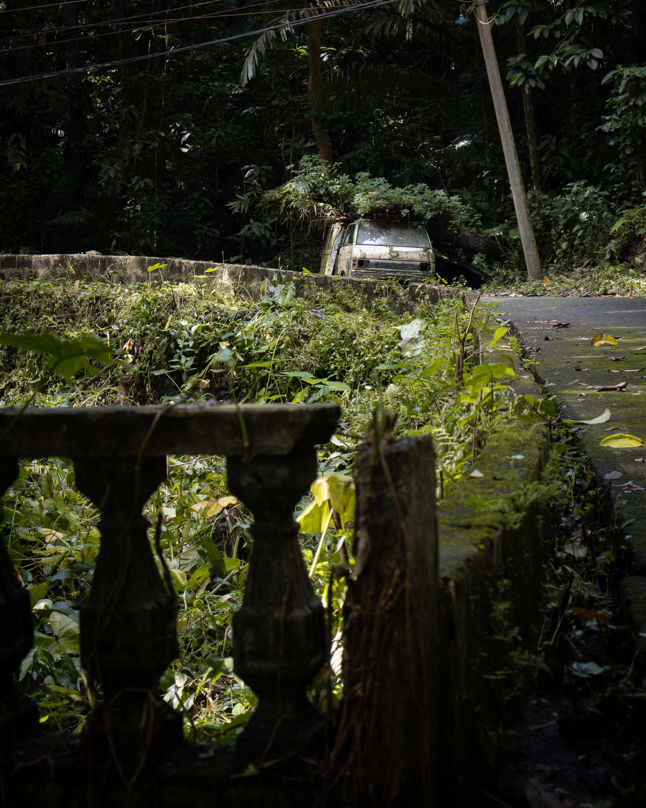

"Bathala nawa."

It is a unique phrase that some of my friends use to conclude their sentences. The last time I encountered it was in a Facebook comment, where a friend signed off with "ingat kapatid. BHL NW" ("take care brother. BHL NW"). I deduced that "BHL NW" was a shorthand for "Bathala nawa," a phrase written without vowels in the ancient Tagalog script, known as baybayin.

The use of 'Bathala nawa' is not widespread, but it is prevalent among a specific group of people I know. These individuals are either directly or indirectly associated with a contemporary movement that seeks to revive precolonial Filipino spirituality and incorporate it into modern life.[^1]

"Bathala nawa" is a Tagalog phrase. I have yet to encounter a similar expression in Pangasinan, the language I spoke growing up. I haven't looked closely at the phrase, but I know enough to make a few points about it.

The phrase comprises two Tagalog words: "Bathala" and "nawa." Bathala is the name of the most powerful god in Tagalog mythology. Like all the other ethnolinguistic groups in the Philippines, the Tagalogs have multiple gods, but Bathala is usually described as the most powerful. Among the Igorots ("people of the mountain") in the northern Philippines, a similar god is called Kabunyian. The existence of an all-powerful god, such as Bathala or Kabuniyan, is one reason why the natives quickly accepted Western monotheism's concept of the one true [[god|"God"]], leading to its dominance throughout the Philippines from the 1500s until now.

On the other hand, "Nawa" is a word that is more difficult to define. In ancient Tagalog, as an adjective, it refers to something that isn't easily done. In contemporary usage, "nawa" expresses hope, as in "may it happen." Combining ancient and modern usage, one could understand "nawa" as an expression of hope that things that don't easily happen happen. Taken as a whole, "Bathala nawa" could mean "May Bathala will it to happen." A Christianized interpretation I read somewhere translates it as "May Bathala's will be done."

You won't hear this phrase used in current everyday Tagalog. However, a derivative of the phrase is one of the most common phrases in the language: "Bahala na."

"Bahala na" is what you would say when faced with a situation where almost everything is beyond your control and that certainty, especially of any favorable outcome, is impossible. You say "Bahala na" to recognize that you will do whatever is left for you to do, but that you are letting whoever has control of the rest (historically, "Bathala") determine the outcome.

While I may sometimes use "bahala na," I use it stripped of any mythological or religious sense. I have never used the phrase "Bathala nawa" because, even if the phrase is situated outside the Christian tradition that has dominated the religious consciousness of these islands for more than five centuries, it still is anchored to the belief that an all-powerful being looking down at us somewhere from the sky rules our lives and dictates the trajectory of everything. While I've spent the first eighteen years of my life developing a relationship with such a being, it is a pursuit I have long since abandoned. And with this abandon came the play of words: "Bathala nawa" has become, at least for me, "Bathala wala" ("Bathala none").

***

I've tried to avoid thinking about the idea of God since around 2012 [[a never-ending walk|when I left the Jehovah's Witnesses]]. Of course, I continued to encounter the word even after I left organized religion. Theism, specifically monotheism, is believed by the overwhelming majority of Filipinos. If I'm going to make an estimate, I would confidently say that around 99 percent of Filipinos are theists, and almost all theists are monotheists.[^2] So, it is impossible not to encounter the idea. It is everywhere, and since I chose to hang around spiritual circles in search of the next best thing to fill the void left by my childhood faith, this meant I encountered the idea repeatedly, even after leaving my religion.

Since 2012, when God has been mentioned casually in conversations with friends and family, the concept has had little meaning to me. However, when it became the subject of more serious discussions, like when my friends philosophize over it or share their experiences of feeling God in their lives, old feelings about the concept were triggered, and I felt very uncomfortable. My partner told me recently that whenever this happened, I usually grew silent and withdrew from the conversation.

When I think about it long and hard, there was a point in my life when I stopped believing in God and another point when I stopped caring about God. When precisely these two things happened, I can't say.

However, it is important to emphasize their differences. You could stop believing in God, but that disbelief could spur you to think even more about the concept. Your disbelief becomes a fuel that motivates you to get to the bottom of it and find the truth about God's nature.

But it is also possible to stop believing in God and caring about the matter. You stop thinking about God's characteristics and how God's existence is possible. As the years passed after leaving the JWs, I saw myself becoming increasingly someone who no longer cares about God.

I haven't wholly reflected on this distancing from a concept that once organized and directed my life. I have a good hunch that during all those years of ministry with the JWs, I built a relationship with this imaginary being that I firmly believed to be genuine, and the breakage of this relationship was too emotionally hurtful to revisit. And so, like all other aspects of my previous religion, I avoided thinking about God.

It didn't help that I lacked the right people and community to think critically about the concept of God. I met individuals who were already entirely sure of their faith in this one true God and left no space for doubt in their religious or spiritual lives. I have a big problem with this way of being in the world. Doubt was the very reason why I left the JWs. To disbelieve a specific worldview because of doubt only to agree to another worldview immediately doesn't seem reasonable. It defeats the very purpose of why I left.

In retrospect, this lack of a shared safe space where I could confront my disbelief with God in a way that is sensitive to my past and honors the process I went through to get here was the number one reason why I avoided confronting the concept of God. Lacking this space but in need of community, I settled with available religious and spiritual communities that gave almost zero space to doubt and who never entertained liberal questions about their own beliefs, including that of God.

***

So why am I confronting the idea of God now?

There are two reasons: one internal, the other external.

My internal reason: There have been times (and they're becoming more frequent recently) when I felt the urge to pray, that is, to converse using words to whatever this thing is out there that is the object of all my "spiritual" and "religious" actions. When I walk, I can feel a connection to the place and the humans and non-humans that inhabit the place, and I feel an urge to express what I am feeling using words. As a writer who exists almost every day surrounded by letters, I know that being able to do this is a big thing. But without me confronting the available ideas behind the word "God," I feel an uncomfortable resistance to converse with this reality, which also seems to hinder my ability to connect with it during my walks.

My external reason came to me during a walk with my partner, Lea, which I wrote about in [[a sunday walk|a previous issue of this newsletter]]. Another reason I actively avoided thinking about God is that the idea is loaded with so much metaphysics (i.e., questions and answers about what fundamentally exists). While metaphysics profoundly interests me, people too obsessed with metaphysical questions tend to feel so strongly about their beliefs that conversations with them often lead to heated debates. I share the Buddha's stand: he avoided answering his disciples' metaphysical questions because he thought they were obstacles to what was most important—practicing compassion toward others.

But hearing how Lea is still profoundly disturbed by things taught to her as a child about what exists—hell, Satan, God, etc.—made me think about the importance of confronting metaphysical questions. For many of us, facing these questions (no matter how difficult such an undertaking is) is the only way to move forward, to find closure to a traumatic past centered around beliefs that did more damage than to protect us, so that we could finally open ourselves to healthier ways of looking at and being in the world. Lea has helped me realize that avoiding ideas about God is preventing me from truly making peace with my religious past, a requirement in crafting [[jiyu shukyo|a new free and creative spirituality]].
***

In the following weeks, I'll work on a series of essays to share how I'm currently confronting the idea of God. The essays will document my recollections of how I used the concept in the past and articulate how I'm considering available reimaginings of the idea through reading and reflection. As I often do, I'll use [[walking]] as a platform for processing and reflection. Since I anticipate that [[nature]] will be integral in thinking through the idea of God, I'll be doing the walks on the most accessible nature path where I live: the Mt. Makiling Trail.

Instead of consecutive days of walking like I did during my [[rxg|Roots x Gravel]] and [[tall tales 1|Tall Tales]] walks, I'll do a series of walks spread out through several weeks with a maximum of one walk per week. I won't be giving a cap on the number of walks I'll be doing; this project ends when I've arrived somewhere comfortable enough to move on. I'm not seeking any form of finality since I don't think we'll ever get clear about these things. But I hope to understand the object of my devotion better and whether I still feel comfortable calling that "God."

The first few walks will be purely recollections—unearthing childhood and early adolescence memories about my relationship with "God." After these recollections, I will combine reading and walking; that is, I'll read a few days before the walk and hold these ideas during the walk as triggers to new lines of thought that the road will generate. The following list is not final, but it's a good starting point for what these walks would be about:

- Walk 1: A recollection of my concept of God growing up as a child.
- Walk 2: A recollection of ideas that made me disbelieve in God.
- Walk 3: A recollection of my switch from radical atheism to nontheism.
- Walk 4: Pondering God as the immovable mover.
- Walk 5: Pondering God as nature.
- Walk 6: Pondering God as an event.
- Etc.

Walks 4 onwards would be reflections on readings about God, so if there are books or articles you think I should consider for this project, I would appreciate it if you send them my way.

I'll still combine photography and writing with the walks, but I will prioritize my thought process, so I'm anticipating that I'll take fewer photographs than on previous walks.

This essay is an introduction for the following essays to come, but this also serves as an invitation to anyone who would like to come along. If you know anyone who might benefit, please send them this newsletter. I don't know when I'll do the first walk. The wet season may have already started in my part of the world, welcoming us with the first tropical cyclone of the year, so walking the Mt. Makiling trail could be tricky. But I'll do my best to walk in the weeks to come.

Thank you for being here.

[^1]: The idea of a "Filipino spirituality" is inherently problematic because what is often described as Filipino is just one of the almost two hundred ethnolinguistic groups scattered across the Philippine archipelago. It is easy to make the mistake that Filipino culture is the culture of the people who live in Manila, the country's capital, and its surrounding provinces: the Tagalogs ("people by the river").
[^2]: Data from the 2020 Census confirm my hunch. According to the census, only 0.04 percent (or around 43,000) of Filipinos had no religious affiliation. Not all of the irreligious are atheists, of course. If I'm going to make another guess, the majority of these 43,000 Filipinos are still theists, but they are simply non-churchgoers. A smaller segment would be those who call themselves "spiritual but not religious." These people still tend to be theists, but they worship God in the context of "spiritual communities," many of which adhere to some form of New Age or Eastern spirituality.