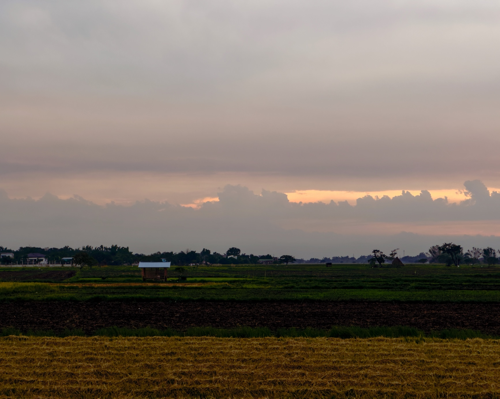

Around 30 minutes ago, it started drizzling outside, creating a thick film of moisture on my window. Since the film formed outside, I couldn't wipe it away, and it blocked my view of the landmarks we were passing by. Fearing I might miss my stop, I fixed my eyes on the map on my phone, watching as the circle moved along the blue line.

I arrived at Lozano Junction around 5:00 PM. As I got off the bus, I noticed the drizzle had already ended, leaving puddles on the poorly constructed road. A car whooshed by, hitting a large puddle and splashing water on the other side of the bus. I waited for the bus to move, along with the line of vehicles that formed behind it before I crossed the highway. Seeing that I was clearing the pedestrian lane, a lady ran to join me.

Across the junction is the Maronong Road, leading to my parents' house, where I'm staying for a few days to attend a literary conference. Usually, three or four tricycles are waiting for passengers at the mouth of the road. This time, there was only one, and it was already full. As I stopped by the waiting shed, the tricycle's engine whirred as the driver stepped on the accelerator, leaving me alone.

I took the moment to take the scent of freshly wet grass and the cool air. I looked at the road ahead, where a group of youngsters was already walking. Surely, they weren't heading as far as Sitio Bayog. But all signs tell me I have to follow them. I took the first step of what would be a 30-minute walk.
``
The rain had left minimal traces on the ground. Except for several puddles along the edges, the concrete road was dry. I walked on the left side, sharing it with approaching vehicles. Drivers were kind enough to move aside as they saw me coming. I gazed at the vast fields of green *palay* on my left, trusting that incoming traffic wouldn't hurt me.

When the side of the road widened, I gave the whole road to the motorists. In this country, locals understand that concrete roads, although built for things with wheels, are also for the many who still travel on foot. In rural Philippines, walking isn't a conscious cultural act that inspires insights, verses, and art. It's simply a practical mode of travel to move bodies and goods from one point to another.

As I approached a bridge built over a tributary of the Sinucalan River, I saw a man, possibly in his 50s or 60s, standing on the side of the bridge in front of his motorcycle. He was obviously from nearby. He watched and listened as the river, replenished by the rain, rushed below the bridge.

I greeted him in Pangasinan, "Ngarem ed sikayo" (Good afternoon). But he didn't seem to hear it. He responded in Tagalog, "Buti nalang katatapos lang ng ulan!" (Good thing it just rained!). "Oo nga po eh. Malamig," I replied in Tagalog as I continued walking.

As the man grew smaller in the distance, I pondered our brief exchange. Why did he speak to me in Tagalog? He surely didn't hear me talk in Pangasinan. There is only one explanation: locals opt to speak Tagalog to those who look too young to know Pangasinan (and I certainly didn't look too young!) or (the more likely explanation) those who look too strange to be considered locals. I wondered what made me seem out of place. Was it my shoes, my large bag, or the fact that I was walking instead of waiting for the next tricycle? It could have been all of these.

After covering the first two kilometers and entering my last, I passed an older man carrying a young child in his arms, possibly a two-year-old. The man walked outside the gate of what seemed to be their house. I greeted him too, "Ngarem ed sikayo," and he responded with a smile and some words I didn't quite catch.

Walking and greeting people felt good. These were people living a couple of kilometers away from my parents. Some might even have been customers of my vet father. Some could even be distant relatives. There's no better place to practice greeting people while walking than in these parts.

It wasn't always easy greeting people on my walks. Almost all my walks were solitary retreats meant to get away from people as much as possible. But as I matured in my understanding of why we walk and why we live, the concept of kapwa (the "self" in the "other") occupied my mind more and more during my walks. In a country where people often walk to earn a living, ask for alms, suffer under colonizers, protest, and are repeatedly denied their requests, how can I walk better?

I passed by a group of older people, all women, walking in the opposite direction. I've walked this road several times, and I can't help but notice that most people I meet here are older adults. While the youngsters zoomed beside them on their motorcycles, these people, some already frail in body, chose to walk to get to where they needed to be. Give me ten more years, and there would be no one to greet on this road. Everyone alive would be these youngsters filling the road with motorbikes and cars. This gives me another good reason to walk as much as I can.

Although I didn't speak, I smiled at the women wide enough to radiate my newfound confidence. Of course, there's always a risk in trying to connect with strangers through a short greeting or a smile. There's a risk that one's gesture of goodwill won't be reciprocated. So, framing these actions as "practices" is helpful. We do them for the sake of doing them, not for an outcome beyond our control.

Sometimes, no matter how much energy we put into a greeting, no matter how far out of our comfort zone we reach, people don't reciprocate. And it isn't entirely their fault. We now live in a world where it is easy to ignore gestures of goodwill and overlook the recognition of our existence. We've been alienated long enough to accept this as our default reality.

But walking constantly reminds me that the default isn't necessarily correct, and there is always an opportunity to create better defaults. [[wanderlust solnit|Rebecca Solnit]] said, "Walking is one way of maintaining a bulwark against this erosion of the mind, the body, the landscape, and the city, and every walker is a guard on patrol to protect the ineffable."

Sometimes, the walker who greets another body receives no response. When the walker is lucky, as I was with this group of women, about half of them smile back. And that response is as good as any other. It is enough fuel for the long walk ahead.