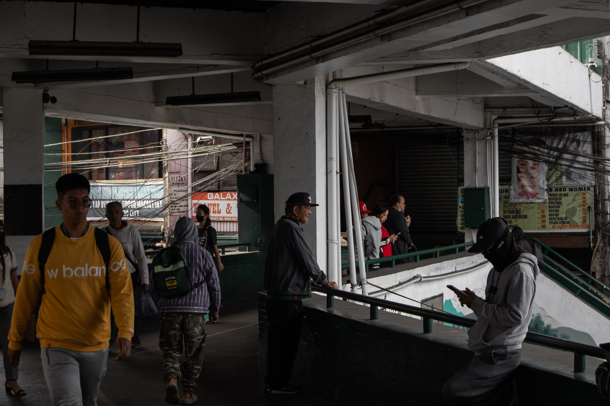
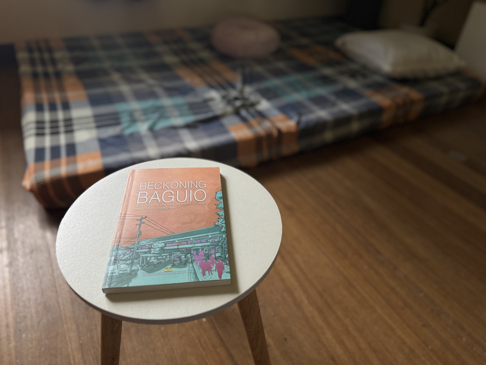

I was four years out of Baguio when [Ivan Labanye](https://chopsueyngarod.wordpress.com/) started writing columns for a local newspaper called *[Baguio Chronicle](https://thebaguiochronicle.com/)* only in fairly recent 2018, but for some reason, a measure of nostalgia creeps from every page of Ivan's first book, *Beckoning Baguio*. My gut tells me that anyone who has had the opportunity to call Baguio a home for at least a year will feel the same when reading anything written about Baguio. I was feeling nostalgic reading the first few essays of his book when suddenly, on page 37, Ivan talked about nostalgia:

>*There is a way of reading nostalgia that departs from defeatism. Instead of just being mired in memories of the past, one can take off from such fond recollections in sizing up and seizing the present and future.*

>*Is not nostalgia a still dominant attitude among long-time Baguio residents, especially those who have lived through the earthquake and the pre-mall Luneta Hill, and why not, even through the Japanese occupation?*

***

Ivan was just a year ahead of me when he came to the University of the Philippines Baguio (UPB) in 2007 I in 2008. And that is why I find his face very familiar. It is a shame, though, that while Ivan was developing his writing voice and the activism that propels it, and still is very much felt in these essays, our paths never coincided in Baguio. From 2008 to 2011, I was deep into my evangelical ministry, while my last three years in Baguio from 2012 to 2014 were spent on interpreting and organizing work with the Deaf community there. I already quit my religion in 2012, but I thought I could still do something for the Deaf community before I left Baguio.

As I read Ivan's book, the only thing that I know somehow connects us all those years is the ambulation. The streets that Ivan's feet walked on were the same streets I walked on and knew (and still know as deeply as he does). With a funny turn of cosmic events, our ambulations seem to have brought us to Los Baños, where we both live now and where our meeting is finally ripe for the making. Last September, while I was in the middle of [walking](https://talahardin.vinceimbat.com/walking) the pages of *Beckoning Baguio*, Ivan and I did our first walk together along the mountain and gem streets of Batong Malake.

***

Until I'm proven otherwise, I think it is safe to declare that Ivan Labanye is Baguio's first millennial flaneur and *Beckoning Baguio*, the first book borne out of walking Baguio in the twenty-first century. I'm okay with making such grand claims and celebrating them even if I'm proven wrong later because I think it is critical to demarcate time when talking about walking in a place made complex by history like Baguio. Also, with what I think is the most walkable city in the Philippines, I am compelled to express how much I find it surprising not to have come across a book about walking Baguio by a local until now.

I finished *Beckoning Baguio* right before September ended after buying it at this year's MIBF and using it as my *pampatulog* book. I am tempted to conclude that it wasn't the beginnings of insomnia that caused my unusually frequent sleepless nights in September, but this book. Ivan cautioned us in the foreword that this book is a collection of his columns from 2018 to 2020, an information I understand was necessary to divulge but one I personally didn't need to know. Read without this foreknowledge, Ivan's 49 essays would've read like vignettes, a form chosen by some walkers writing prose. The rambling subjects of his writing easily make this a walking book. Reading several essays before hitting the sack felt like taking a quick walk with long strides that made me traverse Harrison, then Session, then Magsaysay. How could I ever sleep with all those striding?

***

But the collation of essays into eight sections I take as a reflection of the tempered nature of walking Baguio. Yeah, walking Baguio can still feel scattered, but it mostly feels arranged. Due to the city's smallness, familiarity with spaces becomes easy, and with that familiarity comes indescribable comfort. In other words, walking Baguio doesn't feel as messy as walking Manila. This comparison is important because Baguio and Manila were the first guinea pigs of American-enforced city planning, the goal of which was to paint in the minds of the newly colonized that everything was okay and beautiful. With this historical knowledge, one might say the Americans found more success in Baguio. *Beckoning Baguio* is a reminder, though, that the city of pines, as pretty as it is, is mired by the same problems recognizable throughout the country's many urban landscapes. If this is a walking book, then it would move the reader to walk and, specifically, to walk Baguio. When the reader ever reaches that point, I think of no better companion than these essays.

What I love the most about Ivan's writing is the "walkiness" of each piece. Unlike a sitting-in-the-park Tiempo-esque reading experience, I had to make frequent and unexpected turns as Ivan cites this book then that before making a comment on a specific spot in the city and, after citing one last book, brings us all to a dead end, a construction site or a vandalized wall at a seldom walked street. The cul-de-sac is, of course, Ivan's signature witty synthesis. I felt this most in the consecutive essays "Too Calm for Snow" and "Tahimik na Tumatalak."

Despite the columns being written only in a span of three years, Ivan chose to subtitle his book "A Decade of Walking in a City of Pines," and why not? I don't think he could've written these essays without a decade's worth of intimate knowledge of Baguio gained only through pure love of the streets.

As I re-walk the ministry routes I walked in Baguio from 2008 to 2011, a project I call [Tall Tales: Baguio Walk No. 1](tt1), which I started in January of this year, I would say that *Beckoning Baguio* has given me a familiar but entirely different perspective of the city I once and still call home, a perspective I'm hoping could bear new interpretations and reinterpretations of my walks there.

