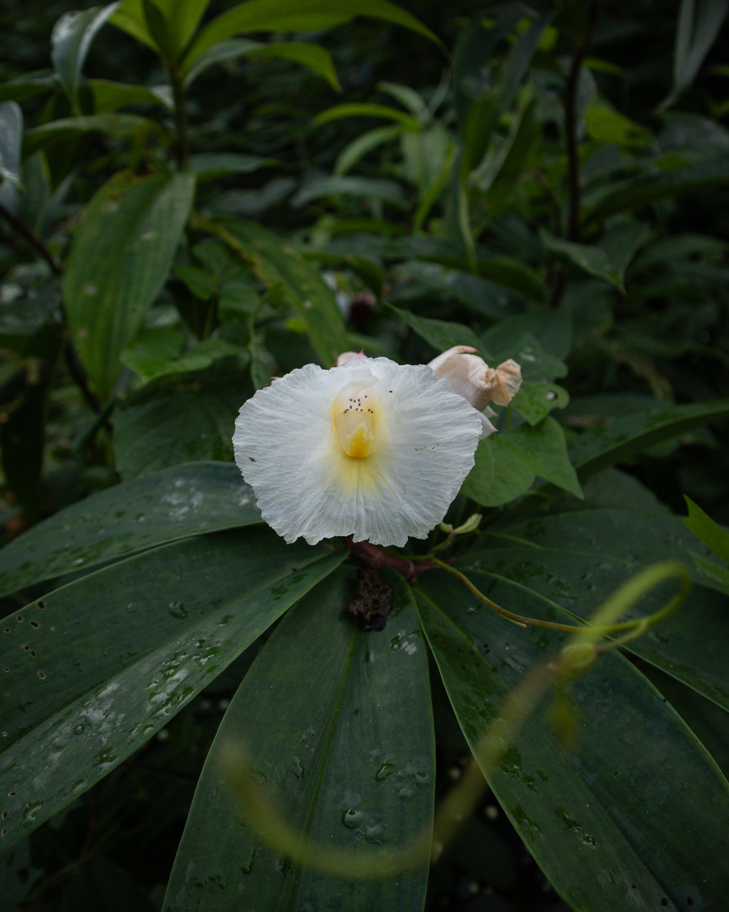

>there are dunes of motion,  
>organizations of grass, white sandy paths of  
>remembrance  
>in the overall wandering of mirroring mind:  
>but Overall is beyond me: is the sum of these events

— A. R. Ammons, *Corsons Inlet*

Friends, I'm walking again—rewalking Los Baños (LB), where I currently live, to be exact. It's a walk I must've done last year, but last year had other plans for me. And so before the coming of what could only be (yet again) a scorching dry season (around April to June) and a torrential wet season (around June to December), I must walk.

This is a very late notice, as I plan to do the walks beginning tomorrow, January 25, until the end of the month. This walk must be done now or it will never happen this year.

As I did before, I'll send daily missives about the walk for those who want to receive them. To avoid overcrowding your email inbox, I'll only send them to you if you really want them. If you really want them, you'll have to sign up your email on a separate list by [clicking this link](https://sendy.lawak.ph/subscription?f=DfC5TjtbX24Vx5EO8ryARBqQdgS763w3892u9qUwYbAZdkSiM9ASXErOZpva1P2xt763Ho). I'll delete that link after the walk.

***

***

But haven't I walked LB before? Yes. I did a week-long walk of LB last December 4–11, 2023, which I called [**Roots ྾ Gravel** (R྾G)](rxg1). This new walk was supposed to be an exact repeat of that walk, a return to the six routes I visited. But a lot has happened around me and within me since that walk, and while it would be nice to return to those routes, this is not what is calling me now.

What I'll be doing instead in this new walk I'm calling _**but Overall is beyond me**_ or *bOibm* (after an excerpt from the poem above), is to return to some familiar places here in LB and immerse—really immerse in them as slowly as I can. The walks, therefore, would be shorter and slower than the R྾G walk.

The R྾G walk featured six routes that totaled 72 kilometers (44 miles) in length and covered almost all major walkable areas around LB (87 streets in 13 out of 14 barangays). My goal then was breadth—to see as much of the town as I could, to see the difference between communities in the hillier parts of town and the communities along Laguna de Bay, and to get a pulse on the speed of industrial development in this rapidly developing suburban municipality located in between the legendary Mt. Makiling and the largest lake in the Philippines. My intention with R྾G was to know the place through quick strokes of my feet.

I produced more than a thousand photos and sixteen thousand words during that week. I began the walks in the early morning, finished before noon, and went straight to writing and editing photographs in the afternoon. I sent missives to subscribers almost before midnight. The project required a significant measure of physical endurance.

With *bOibm*, I'm hoping to let go of all those for now and approach the week-long walk with a gentler, more attentive pace. My reason for doing this is to explore the possibility of a real relationship with some of the last silent places in LB. The routes and places I chose for this walk demand a gentler, more attentive, and slower pace, and I handpicked them for this project to remind me of this very intention. Why do I need to explore this new form of relationship? I guess for two reasons: fear and necessity.

Fear because in my four years living here, I've seen how spaces have rapidly changed. A new multistory dormitory is being built in my neighborhood, which is one of the quietest. It will be built this year and the street won't feel the same. I just know. The same is happening in almost all major streets in LB. If I don't walk them now, get to know them better, there could be very little chance to do so in the coming years.

Necessity because, like you, I'm vulnerable to the unpredictable disappointments and blows innate in human life. I assume that once a true relationship with the last silent places in LB is established, they could serve as places of quick retreat, a thing that is also rapidly becoming a form of privilege these days, left to be enjoyed only by those who have the material means to do a quick excursion out of urban and rapidly developing suburban places.

But privilege is not what I'm looking for in my walks but pilgrimage. One that is inward first (and, therefore, always cheap and accessible) but also a pilgrimage to that often overlooked Other that makes up the Overall that is beyond me—the non-human world of rocks, soil, water, clouds, plants, trees, animals, and even the objects that pollute them. While human encounters and narratives were at the heart of R྾G, *bOibm* would focus on silent encounters. Because of this, I'm expecting that the missives I'll be sending during the walk will primarily contain photos. Words, if any, would be limited. Whatever words come my way during these walks that I'm moved to share, I'll do so in their rawest form. This would ensure that I'm handling this new walk with as light a touch as possible.

Beyond what I've written here, I really don't have a comprehensive theory on why and how I want to do this walk. Like I've said in previous essays: walking is just being who I've always been.

I hope you consider joining me on this week-long rewalk of LB, and if there's anyone you know who might enjoy receiving these emails, please forward them this email or send them **[the signup link](https://sendy.lawak.ph/subscription?f=DfC5TjtbX24Vx5EO8ryARBqQdgS763w3892u9qUwYbAZdkSiM9ASXErOZpva1P2xt763Ho)**.

Thank you!

