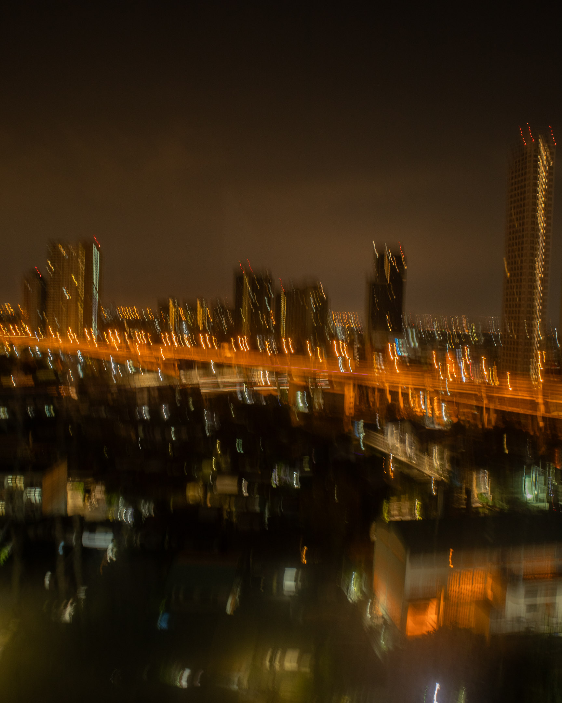
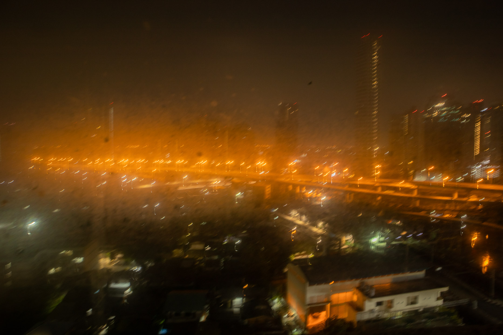

I said good morning as I opened the door. He gave me nothing but silence. I was afraid to offend him in any way, so I kept my mouth shut for the entire 30-minute ride.

If not for the orange light of the city, it would be totally dark outside. From inside the car, I see a fog crawling, slowly thickening, stricken by orange. In many areas we passed by, there were almost no vehicles. At this hour, the metropolis tries to sleep.

---

At my destination, I wasn't sure where I should stop, so I patted him on his shoulder and asked him to drop me off at what looked like an empty community café. I asked him whether I'd already paid by card when I booked the ride, or if I should pay him in cash. I heard his voice, finally, one of the meekest I've heard in a long time. He said, "By card." I misunderstood how he pronounced the end of that word. Card and cash in his Thai almost sounded the same. He noticed my confusion, so he showed it on his phone. "Card," he repeated. I nodded and smiled and thanked him as I got out of his car. Almost instantly, I regretted that I didn't try to lure him into a conversation a while ago.

There was a large bench outside the community café. From afar, it looked like it was made of rattan, but really it was all plastic. I walked toward it, heaved my bag onto it, and sat down. I pulled my phone from my pocket and began typing a message to my friend.

"Not sure where to go. So went here to what looks like a café. Will wait for you until you wake up."

As soon as the light on my phone vanished, I heard some whistling up in the trees. These trees have grown as tall as the third floor of the building beside them. I saw cars on each floor---parking for the middle-class living in this condominium at a less fancy part of Bangkok.

The whistle continued briefly, a sharp staccato. I counted six or seven segments in that thread. After a short pause, I heard another whistle, which I'm sure was coming from a different part of the tree. This whistle was longer, slower, still segmented, but struck a lower note. Again, a brief pause before another whistle from a farther place I'm no longer sure of. I felt like it was no longer coming from the tree. This went on and on, and the whistles were luring me to sleep. I looked at my phone again. It was now 3:00 in the morning.

At one point, I stood up to check the vending machine to see whether I might be able to buy a drink. The whistles, of course, continued in the background. I walked toward a large white refrigerator. There were the familiar sodas. There was cold coffee and what I was sure was Thai milk tea. I'm not a vending machine person. In fact, the Philippines isn't a vending machine country. The mayor of my town placed machines like these all around town after assuming office. The one nearest my house was at a waiting shed in front of an elementary school. I've always doubted whether people bought into that machine. I know for a fact that we would rather buy at _sari-sari_ stores where we could talk to the person handling us the goods we need. A part of me wants to believe we resist all these new technologies because we still desire that ease we associate with interacting with a body and a talking head. But this is just me dreaming.

I brought this Filipino fear with me as I stared at the machine. All its labels were in Thai, and all I'm sure of is that it could accept coins. I wasn't sure, really. All I had were bills, and I wasn't sure where to put them. So I gave up and walked back to the bench. I walked back to the whistles, which were everything one could hear at this hour. I sat and closed my eyes, and I listened closer. I remembered the silence inside that taxi a while ago.

---

---

When my friend arrived, we started walking to the unit. I shared about the whistles, told how good they sounded, and told how they almost succeeded in serenading me to sleep. My friend said the birds actually whistled to mark their territory, warn others of their boundaries. Hearing this was enough to make me silent for a while.

I could still hear them---all those whistles---as I stood inside the glass wall in my room. I've turned off the light, covered myself with the thick blanket as if to protect myself from the now heavy fog that has already enveloped the entire city. It was still very dark, but the flyover visible from my window is now beginning to fill up. I closed the curtains and lay down my silence beside me, allowing it to fill the room. Suddenly, the whistles were gone.

