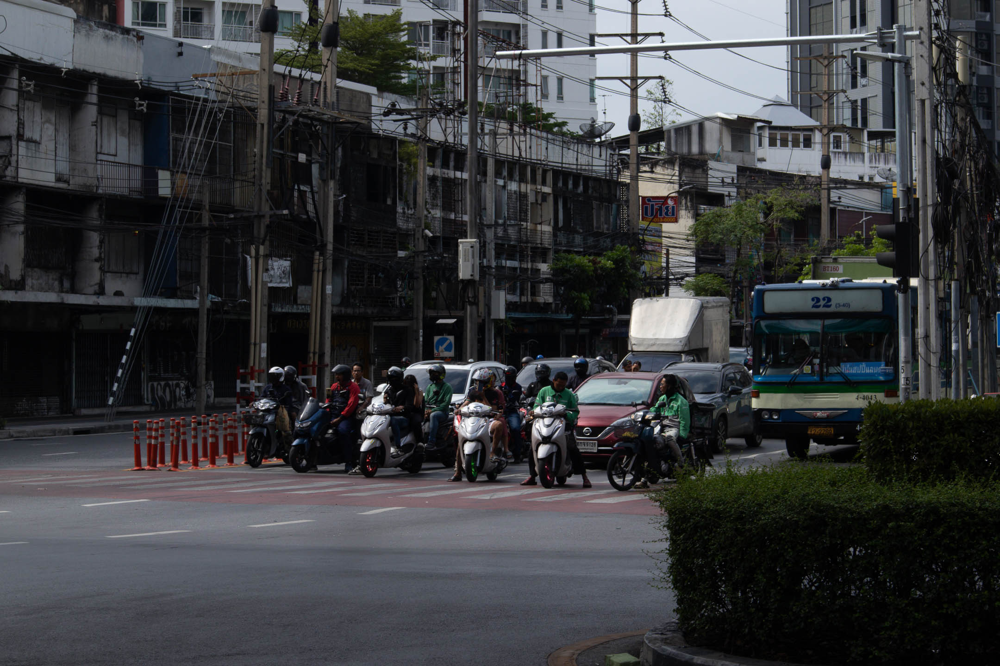
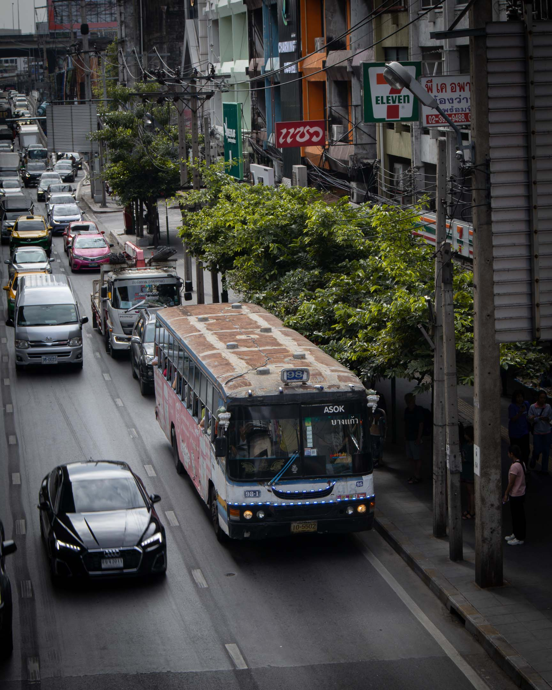
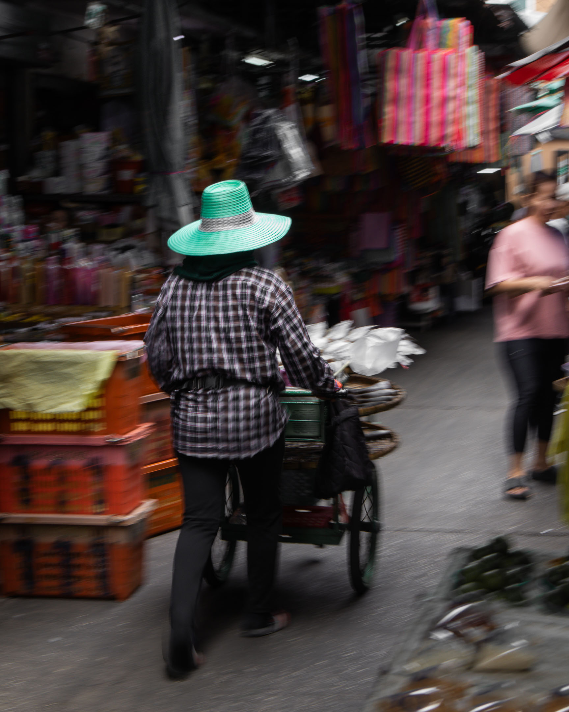
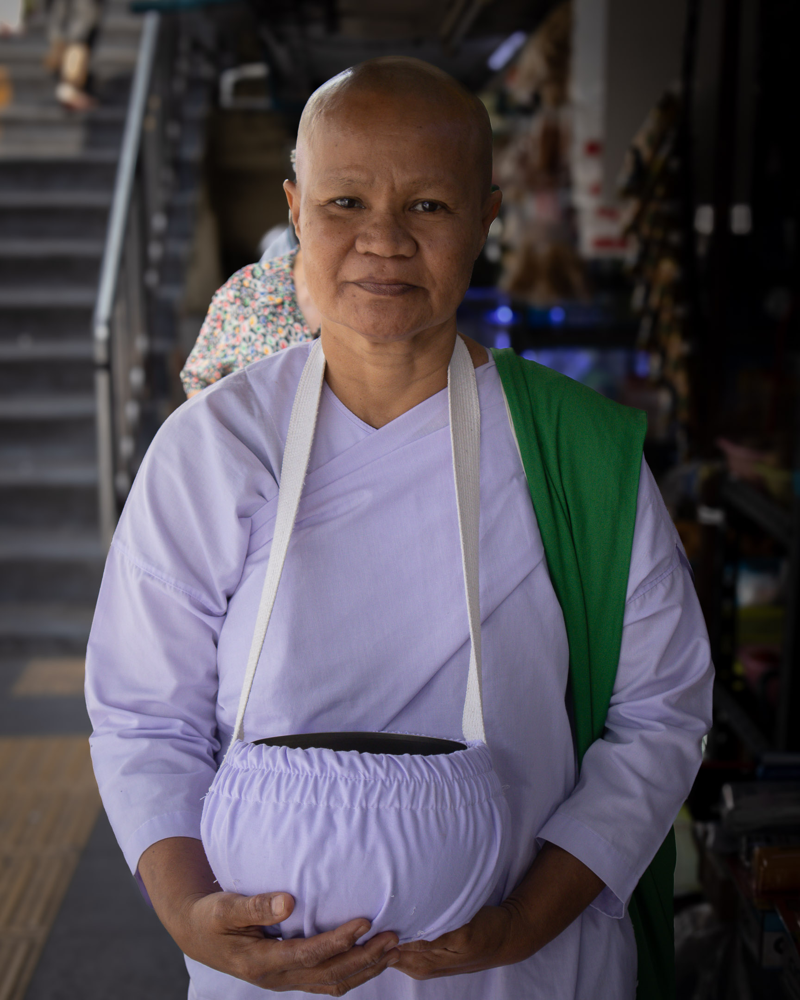
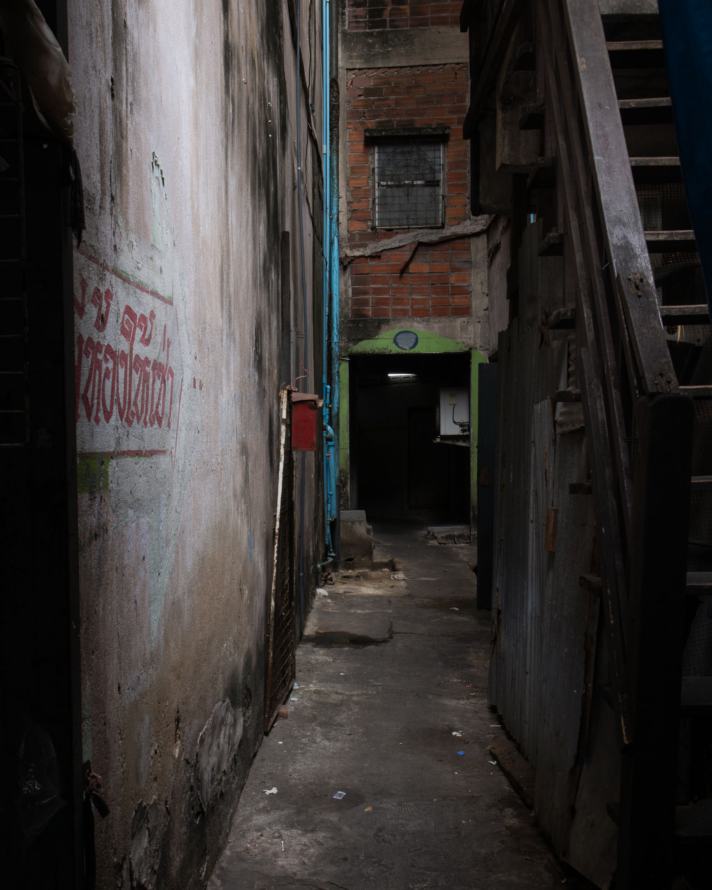
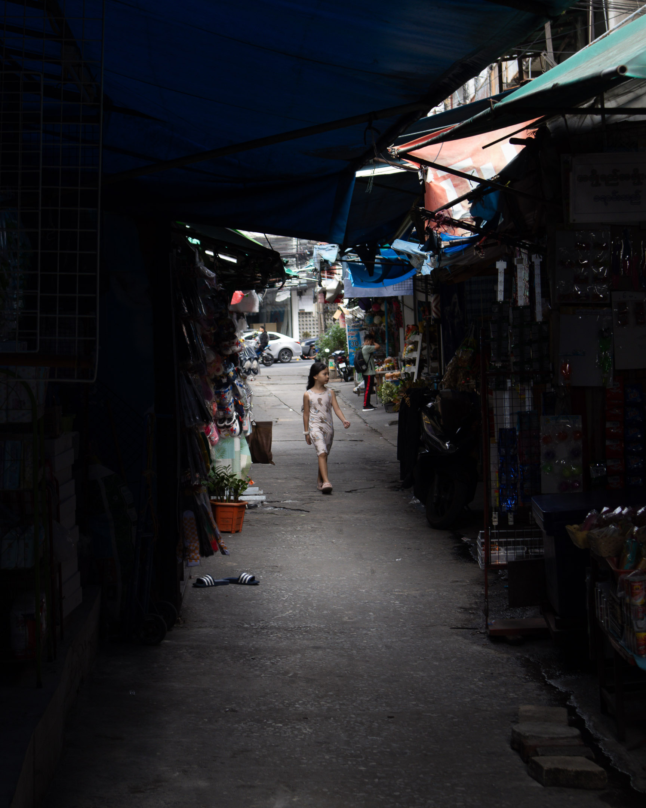

*Khun daydreaming again? Don’t daydream too much. There are a lot of ghosts in Bangkok. Khun will be possessed.*

*I’m already possessed. You’re in my heart. That’s the first possession I’ve experienced.*

— Moemoe Rizal, Bangkok: The Journal

***

When one prepares for a trip like this, one needs to look at the map. There is an innate fear of being lost, especially when one is alone. Then, there is the fear that the fear of being lost would devour what pleasantness is left of the trip.

But when we started walking along Sukhumvit, the street immediately sucked me in. A spiraling into images that are new yet familiar. "This could've been the Philippines," I caught myself saying.

The glass wall of a store hangs a large neon green logo: a cannabis leaf. Outside its door, a sign: "don't Panic... it's a safe space! Every Saturday Hiphop o' Clock Party Starts at 10 PM." In my country, a store like this along EDSA would've made us all forget 2016.

Like EDSA, Sukhumvit is almost always busy. But unlike EDSA, there are almost no one blasting their horn. The roads in Thailand, I would later learn, kill more than anything in this country. My last night in Bangkok, before I went to Ayutthaya, my friend made me ride the motorcycle. "It's a different experience!" she said. To her credit, it was! One I will never go through again. Like Filipino riders, Thais like to make their bikes fly. But unlike Filipino riders, they don't give their passengers helmets. I swear it was by miracle that I was alive after that night.

At Rhama IV Road, the pedestrian lights just turned green. I was fortunate to reach the center island before the vehicles came. A white man tried to do what he would usually do where he came from—walk. A large truck blasted its horn (the first time I heard someone do so since I got here). The white man, startled, pointed his palm at the light, visibly frustrated. But there's nothing he can do. In Thailand, the roads follow a sort of natural selection. The larger vehicles devour the little ones. The little ones devour the pedestrian. In the Philippines, I could look at the driver in the eye, and he would almost always stop. If not, he would get an earful from me. But here, I whimper like a stray dog. Bangkok is walkable except in its pedestrian lanes. Thank God for their wide sidewalks and lengthy skywalks. This could've been the Philippines.

***

***

At the Jim Thompson Museum, the house and estate left by this rich American textile enthusiast who walked into the mountains of Malaysia never to return, the tour guide was catching her breath. She seems to be trying to get the tour over with. But in the guest room, she slowed her pace to ask a question. "Which among the objects in this room is the chamber pot?"

I saw how the tail of this cat figurine curled on its back to land on its neck, making some sort of a handle, and I immediately knew there was something funny about it. So I pointed it out to the guide. She nodded and began to describe that the tail was, in fact, the handle, and the head the cover. A boy guest could remove the head and stick his penis in the cat's body to pee. The guide went on to say that Jim Thompson insisted that the figurine was just for display, and his guests never used it. "But one would wonder," the tour guide said, "why there are yellow marks around the cat's neck."

***

***

In the morning of my second day in Bangkok, I decided to walk the streets of Phra Khanong by myself. At the mouth of Soi Sukhumvit 48, an older lady was selling pan cakes. Thai pan cakes, says the translation of her signboard. I went to her and said good morning, but this didn't register. I pointed at one of her signboards, which shows a box of cakes and 20 baht under it. She seemed to have understood. She packed a set of cakes, placed them in a paper box, wrapped the box with plastic, and handed it over to me. In return, I gave her my 20 baht. I started munching the cakes as I walked toward Sukhumvit and up the overpass to the other side of the road. Wow, this is probably one of the best things I've ever tasted.

It was past 10 in the morning. I looked down from the overpass and saw the vehicles passing by Sukhumvit. There is enough road for everyone. A garbage truck passes by, its pile of black bags momentarily blocking my view. On the other lane, a bus stops to drop passengers. On the overpass, a beggar was sitting under the sun—the first I've seen since I arrived. When walking on the overpasses of Manila, the world's capital of homelessness, I would often see four, maybe five homeless people sleeping, resting, or begging. I remember them as I left some coins on his pan.

From here, I saw an old building. Residential. Home to around twenty or so families. Its facade is stained, made old and tired by all the keeping up it's been doing. One won't see the building unless from this vantage point. Bangkok does a good job of hiding the ruins of industry. I walked down the overpass and saw a Buddhist nun in purple garb standing with a brass bowl hanging on her neck through a purple cloth bag. Begging, too, but under the shade of a store selling some glassware. With no more coins, I dropped a bill in her bowl and bowed with my palms together. 

This morning, this is what I do.

***

***

I continued walking and entered the small road toward the wet market.

On the walk, a poem:

The soul of the city is in this wet market. The conscience of its people, red spicy and aromatic wrapped inside plastic bags, set on the table where old men and women line up to grab what they need, exchanging pleasantries, exchanging baht. Sometimes a young boy hangs them on the handles of his bicycle.

The heart of the city beats in its little daughters, two of them walking ever trustfully as they watch some reels on their phones. Another plays house over vacant steel tables, acting like a mother berating her two daughters. This city's life force flows in the veins of billiard tables. Old men begin their day here with beers.

The spirit of this city descends in the shape of a pigeon strutting unabashedly beside my feet. Sometimes it shape shifts into the form of an almost silent motorcycle, whizzing an inch away from my belly, startling the hell out of me. But the soul of this city is barely breathing. I could see its ribs move on the rotting facade of closed shops, hear it wheezing from behind their walls. Whatever's left of this city, whatever cigarette butts, lie underneath this man's table. He crawls under it, grabs the dark slime that has clogged his sewer, and throws it on the concrete.

This city knows how to hide its scars, they're barely seen. But the light is always honest, always true. At this intersection where light plays house with silence, a child, one with long black hair, emerged out of nowhere and walked in between this city's shadows. I dropped a bill inside the brass bowl of a Buddhist nun in purple garb, only to return later to take her photograph.

***

***

At an intersection before the BTS station, a street shrine stands in front of a donut shop. Motorcycle riders park in front of it while waiting for their next ride. A woman in red, carrying a white tote bag, crosses the pedestrian lane next to the shrine safely. A man with a hat moves in the opposite direction. Nearby, mothers hold the arms of their daughters as they walk past vendors of snacks: sandwiches, salads, bread, and water. One vendor sells flowers, perhaps for the shrine. A few yards from the station, a lady fervently prays in front of a large statue of Ganesh. Some steps away, in front of Taisin Square, another street shrine. As if none of that was enough, at Ekkamai, where I ended the walk, I stopped by Wat That Thong to look at the Buddha in various poses.

In Bangkok, the street is the shrine; the walker inescapably a pilgrim.

