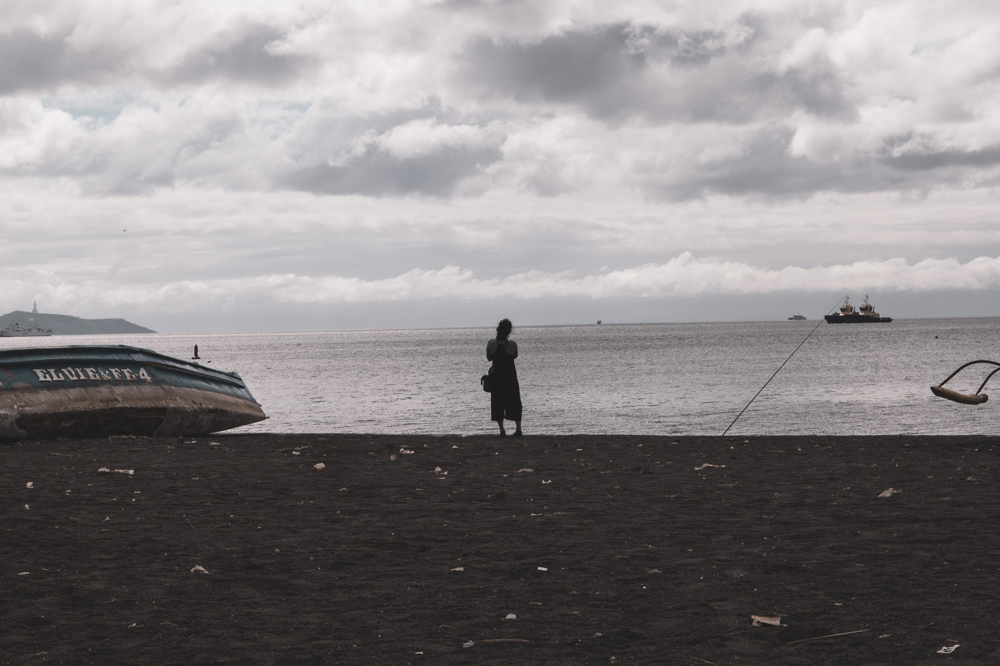
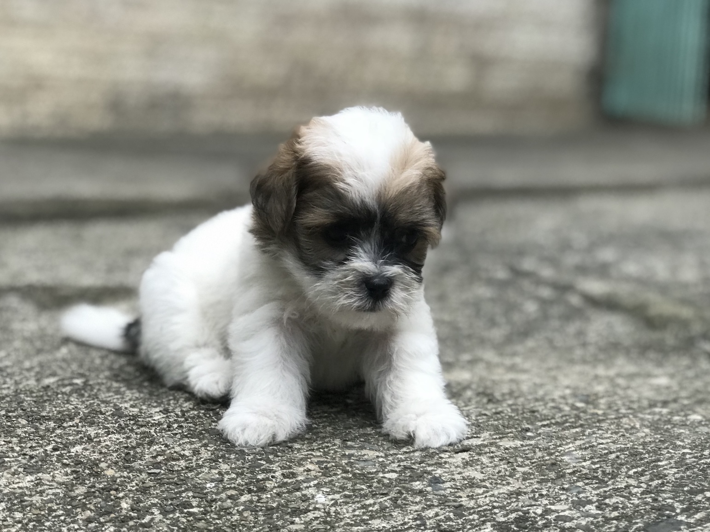
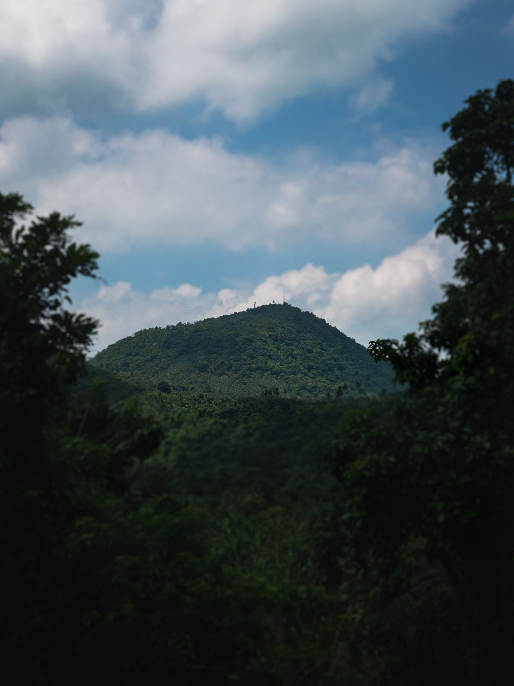
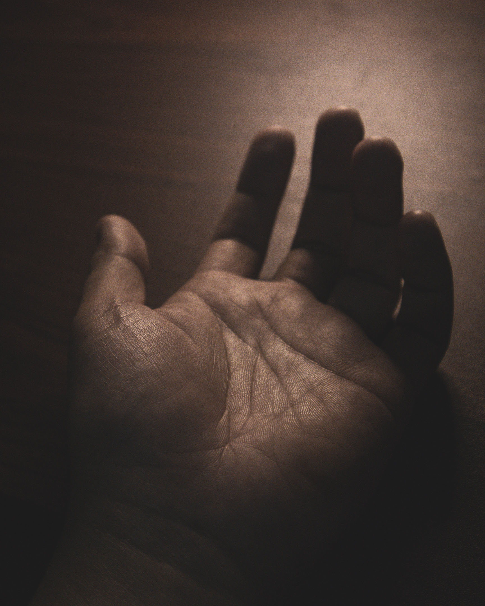

Yesterday, I was trying to understand why the f-stop number indicated on the digital viewfinder of my camera increases when the aperture shrinks in size. The aperture is the hole in a camera lens that lets light in. The larger this hole, the more light enters my camera. The size of the aperture could be adjusted with a physical dial. Its size is indicated by a number called the f-stop. A low f-stop number, say f/4.5, means a wider aperture, while a bigger f-stop number, say f/10, means a narrower aperture. I later learned that the f-stop number, while not exactly its measurement, increases when the size of the diaphragm of my camera's lens also increases. The diaphragm is a set of overlapping blades that look like leaves that come closer together to shut the aperture and move away from each other to open it.

After writing the piece that follows, I thought about the semantics of closing, shutting, and coming in, and remember how much of the same words apply to my relationship with photography. To be able to let the light in, to truly open myself up to the wide variety of images waiting to permeate themselves into my being, I have to increase the size of my inner aperture by shedding my leaves of insecurity, self-distrust, and pain that may have accumulated for years.

---

Let me tell you a secret: I am the most amateur of all amateur photographers. And yet, I've owned this label, this identity, this appendage to the [bio](about). I don't say, "Hey, I'm a writer who walks." I say, "I'm a writer **and photographer** who walks." How did I arrive at this audacity? I don't know. Who taught me to do this? No one. As soon as I felt an inner urge to study how I could shoot better images with my camera, it just made natural sense to call myself this—a photographer—in a way that didn't happen to me with other ways of expressing myself, including writing.

With writing, I had to fool myself first. I started by writing three things I was grateful for in a small journal for five minutes every morning. After doing this for a few weeks, it became quite apparent that the practice was too limited, so I extended it into a thirty-minute free writing session. This journaling practice became a platform for writing drafts of blog articles and newsletters by hand, which later became building blocks for essays sent to [workshops](essays/traversing-liminality-through-walking), essays recognized by tastemakers, a [zine](books), and so on. It was only around the time when I established a daily journaling habit that I felt comfortable calling myself "a writer."

Photography—at least the way I experienced it—was more welcoming. I felt it was okay to take refuge under the identity of being a photographer, even if I don't go out and take a photo every day (I still don't). During times when I can't write a single word on the blank page or just don't know what else to say, I find myself looking for the silence and modesty of photography. I like to think of it not as a complement to but an extension of my writing. Through photography, it is impossible for me to stop writing. Photography, after all, is writing with light.

---

Despite the audacity of taking shelter under the label of photographer, I have more proof of my dilettante status than I care to admit. For one, I didn't really care about photos until I started blogging in 2014. But even then, I mostly relied on stock photos to accompany my essays. It was only around 2016, when I got my first smartphone—an Android phone with a decent camera—did I began accumulating photos. But I took photos like everyone else. I point, shoot, and repeat, not caring about composition, exposure, or color.

About a year after this, my Android phone broke down due to seawater damage while island hopping in Palawan. I didn't know anything about backing up, so none of those photos from that year were saved. I got the iPhone 7 Plus as a replacement and immediately noticed the difference in image quality and experience. The 7 Plus was the first iPhone model to have a portrait mode, so I experimented a lot with taking portraits of people and animals. I took it with me during my afternoon bike rides and also shot some of the landscape of rural Pangasinan. I was far from being good, but I was learning to identify what subjects I liked to photograph.

I was elated. Not only was I cultivating a photographic taste of sorts, but I was also producing my own images for my blog. I no longer relied on stock photos. However, I still largely took photos within the context of maintaining a blog. In my mind, photography wasn't yet a thing of its own.

This changed in 2021 when I started taking walking more seriously and was exposed to the work of [Craig Mod](https://craigmod.com/). Suddenly, I found someone whose approach to photography moves me. Like Craig, photography for me was simple. I didn't treat it as a complex fine art. It was simply a way to record moments. Sometimes, those recordings turn out beautiful. To raise my chances of recording beautiful moments, I started taking photography more seriously and calling myself a photographer.

But even then, I was still doing mobile photography. The first photography course I bought was an iPhone photography course, which helped me take the most advantage of the iPhone 11 Pro Max's native camera, the only camera I had at the time. I learned how to use the Lightroom mobile app's camera so I could take photos in RAW, then learned how to use presets to edit and improve the quality of my photos. Equipped with this meagre training, I went on [my first multi-day walk in 2022](uman/006), a walk from Los Baños, Laguna, where I'm based, to San Pablo City. I took a lot of photos during that walk, all of them using the iPhone 11 Pro Max. It was during that walk that I came face-to-face with the possibility of returning to my troubled religious past as a way to embrace a still very religious present. That walk turned into an essay that landed me a spot in a writers workshop, which solidified further my commitment to writing, photography, and walking as my trifecta for navigating spiritual grief.

It was only after that long walk from Los Baños to San Pablo in 2022 did I finally hit the trigger and bought my first DSLR, the Canon EOS M50 Mark II, which is the only camera I use until now. But I was so intimidated by the thought of shooting photos through that camera that it stayed for almost a year inside my cabinet. What made me take the leap from mobile to DSLR and helped me build confidence in using the Mark II was a book called [Read This If You Want to Take Great Photos by Henry Carroll](https://www.amazon.com/Read-This-Want-Great-Photographs/dp/1399606956?sr=8-1). That book convinced me that I didn't have to know everything that there is to know about the DSLR or photography in general. All I needed to learn was the basics of photography and a minimum viable knowledge of how to use my camera, which the book so eloquently provided in simple language. Equipped with this good enough knowledge, I could then focus on mastering composition, which developed my photographic taste and sharpened my eye. It felt good to have someone say this to me (even if it was just in book form). After almost a year of being locked up in my cabinet, I was excited to finally test drive the Mark II. I brought it with me on a trip to Bohol in September 2023 and took photos in aperture priority (AV) mode. I made a lot of mistakes (really dumb mistakes) during that trip, but I knew I needed to take the leap if I wanted to begin a relationship with my DSLR.

Since then, I've used the Mark II in all my photographic projects, including:

- [Roots ྾ Gravel](rxg1)
- [Tall Tales: Baguio Walk No. 1](tt1)
- [Walking Binondo](tlw/031)
- [but Overall is beyond me](boibm)

I also brought it with me as I photographed the walks I did in [Bangkok](tlw/040) and Ayutthaya in Thailand.

If any, what all of these show is that I still don't know what I'm doing most of the time. I just happen to know enough to take some decent photos while on the walk. But quiz me about the difference between the field of view and depth of field, and I might answer you with silence. In addition, my editing skills are still almost non-existent. I still rely a lot on a limited set of presets I copied from other photographers, coupled with a few techniques. Other than that, I really don't do much after taking photos. I rarely touch the colors of my photos when editing. I could produce decent photographs and depend a lot on taking a great photo, so I don't have to do much editing, but I admit I could do a much better job in this area.

Despite all these proofs of inexperience, I'm quite confident I was able to develop what I think is the most important quality of any photographer—love of the craft. I found that love of the craft is enough to help me sharpen my eye. The technical know-how of photography does very little in sharpening my eye, being mindful of what is in front of me, and expressing myself through a kind of silence I only find in light. In fact, the technical know-how of photography could sometimes even be an obstacle to truly seeing that thing in front of me because it is so easy to get lost in a tool and forget that the tool is an extension of my humanity, not the other way around.

Don't get me wrong. I am moving and working toward mastering the technical side of photography because it is what my love of the craft is pointing me to. My love of the craft inevitably wants to go deep, and the technical side of photography is part of that depth to explore. But I couldn't overstate that the healthiest and most democratic way to approach photography is to never feel or make others feel insufficient around a camera. We have to remove all the inner hurdles we may associate with photography because this readies our eyes to see what's truly out there, which is also often a reflection of what is in here.

I have the same philosophy about writing. The more I prune my insecurities around it, the more I strip it off the toxic competition inherent in our traditional education of what writing is, the more affection I'm able to feel for it. I sincerely feel that love for a craft, whatever it is, is the only true prerequisite to committing to its mastery, because it is love that will make us stick to it when the practice becomes difficult or the community surrounding the practice becomes unsupportive.

# A mindful photography and holistic biography workshop

I'm happy to share that from June to July 2025, I'll be supporting [Louise Far](https://makingvisiblewithlouise.com/) as she conducts a photography workshop that aims to help photographers build confidence in their innate ability to see and take photos by applying mindfulness and self-reflection practices from the field of holistic biography work.

I met Louise in 2023, a few months before I started using my DSLR. Louise is way, way ahead of me in photography, a person with whom the label of amateur may no longer apply. Her portfolio is a testament to that. However, being around her and talking with her about photography as well as doing photographic exercises with her feels like doing so with a supportive friend who comes along with no other agenda other than being with you as you take the shot. Knowing her and seeing how she approaches photography as a spiritual practice has helped me develop more confidence in this craft despite my still limited knowledge.

Whenever I ask her for advice regarding what tool or lens to purchase or about anything on the technical side of photography, Louise always approaches my questions as questions of the heart. I once asked her whether I should buy a telephoto lens to accompany me on my walks so I could photograph subjects from afar. She reminded me that the impulse to buy a zoom lens could sometimes come from the fear of coming near someone or something. I always remember her words whenever I'm photographing on a walk. I remind myself that the purpose of my walk is to be closer to others, both human and non-human. Therefore, it makes sense that closeness should also be a guiding principle in how I approach photography. To this day, I'm yet to buy a more powerful zoom lens and always opt to come closer to my subjects whenever possible.

Louise will share bits of wisdom like this and many more in the workshop called [The Creative Selfie](https://makingvisiblewithlouise.com/the-creative-selfie/), which will span four weeks. During those weeks, Louise will be sending weekly assignments, which will then be processed during the three five-hour live sessions via Zoom that complete the workshop. I'll be in all of those sessions, managing the technical side of the calls as well as providing my own insights and feedback on the assignments and exercises.

If you are someone like me who takes refuge in photography and finds comfort in calling yourself a photographer (no matter how much you kid yourself by saying your knowledge is insufficient) and if anything I mentioned here resonates with you, I invite you to click this [link](https://makingvisiblewithlouise.com/the-creative-selfie/) to learn more about the workshop and sign up to join us if you feel called to.

I would love to take photos with you (and celebrate your images together) no matter what device you use, how much you know about photography, and how much you think you need to learn to be "good enough."

Here's a new definition of the word photographer I want to propose:

photographer: (n.) someone who takes photos regardless of knowledge, device, and self-belief.
