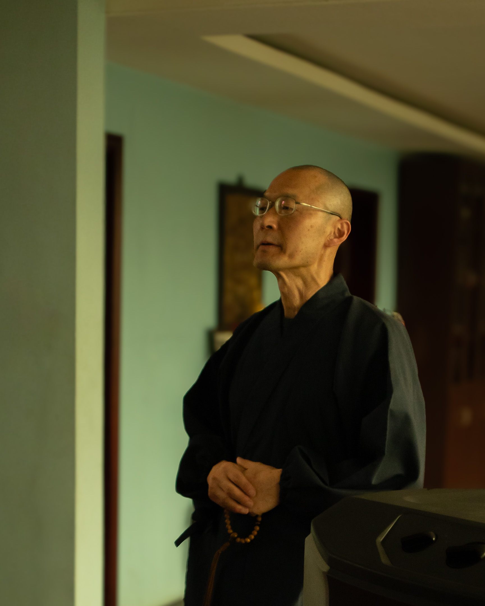
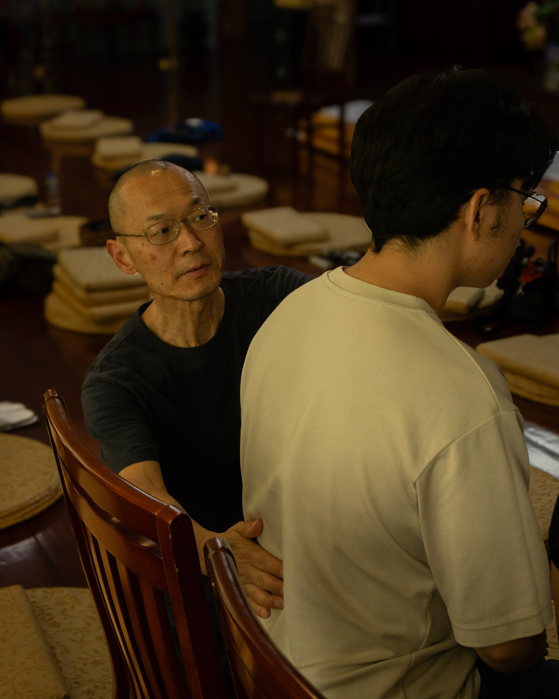
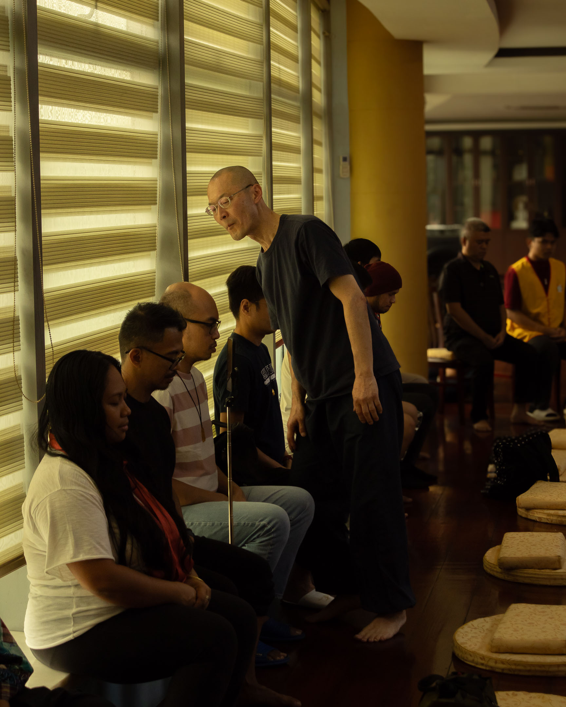
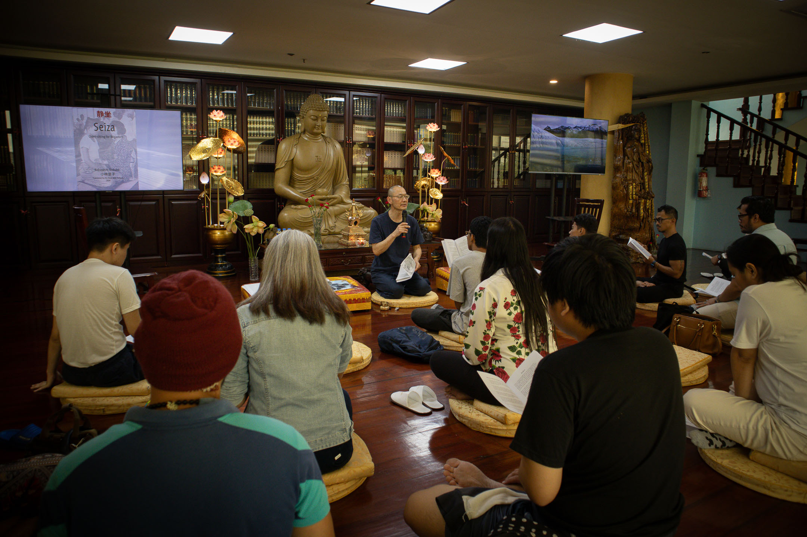
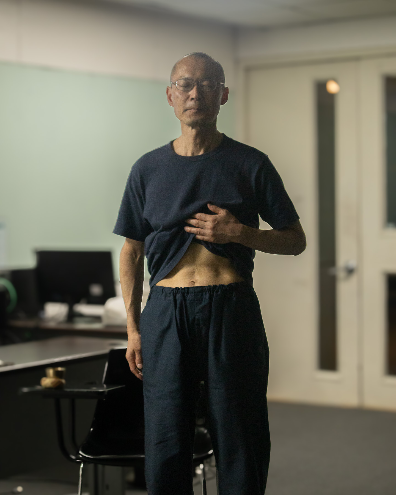
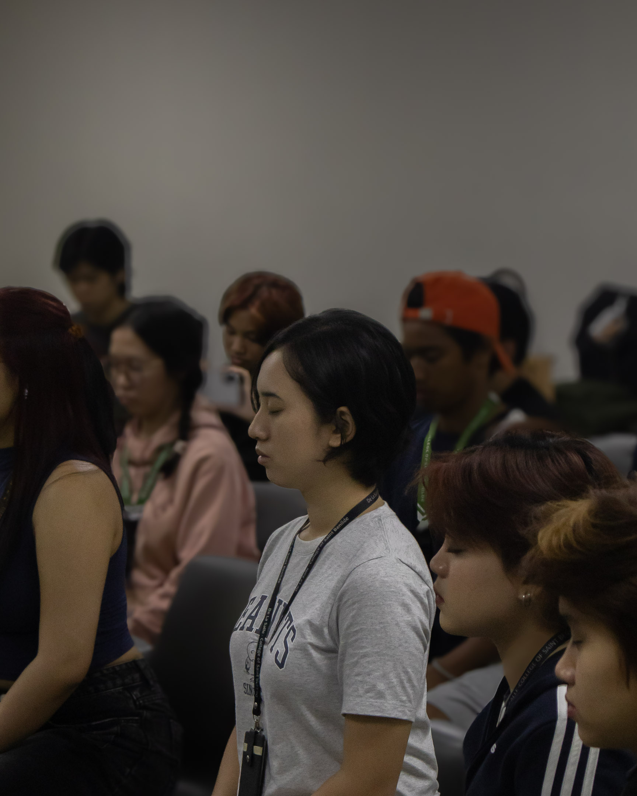
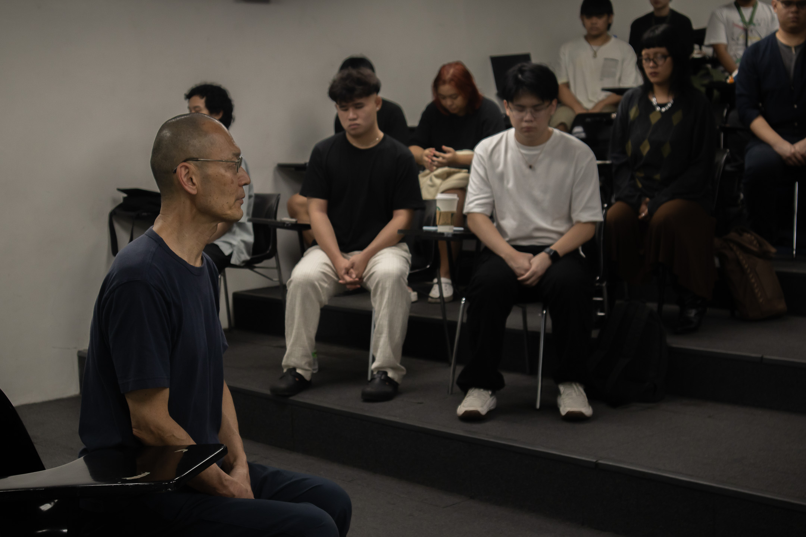
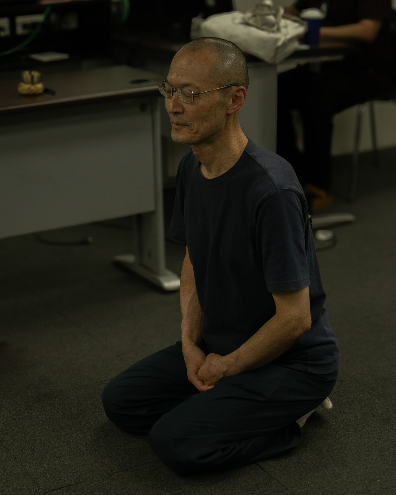
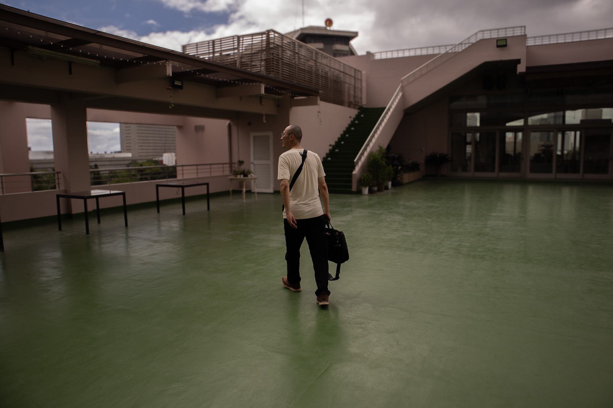

When I saw Miki Nakura walking on the nave of the Mount Carmel Shrine, I was so moved I had to pull back my tears. Miki walked around, a briskly moving blip in a humongous dark brown interior, lit only by sunlight striking the large stained glass windows that lined the sides of the gallery. The stained glass depicted scenes from the Virgin Mary's life from her infancy to her assumption into heaven.

I told Miki about this later that day as we drank our beers inside a tiny restobar along one of the _eskinitas_ near Taft Avenue in Manila. I told him my tears may have something to do with the sight of alacrity emanating from him as he walked the shrine—a nonverbal, innocent message that comes from someone's pure veneration of someone else's objects of faith. The sight of Miki—a Jōdo Shinshū Buddhist minister, born in Japan, currently residing in New York, traveling the world to guide meditators and talk about his faith—walking in a Catholic church is not a sight I often see.

In the Philippines, religion demarcates clear lines of boundaries: Luzon and Visayas are for Catholics, Mindanao is for Muslims; this home is Protestant, not Catholic; this church votes for this politician and not that. While my friend Argel and I were preparing for Miki's arrival, looking for possible venues for him to hold his seiza meditation and talk, a Buddhist group rejected our proposal, stressing they are already following a Buddhist tradition and they want to maintain doing that.

The Philippines is a country that breathes a form of religiosity so strong and devotional that it is also extremely parochial. This parochialism runs so deep within our culture that it has even become a meme. During the 2015 _Iglesia ni Cristo_ (INC, Church of Christ) protests against the government's investigations on the alleged kidnapping of several of their ministers by their own church authorities, a photo of clothes commonly worn by members with a heading "Kami Lang ang Maliligtas (Only Us Will Be Saved) Starter Pack" went viral.

At the restobar, I understood what I felt, as I told Miki about it—him looking at me with a smile across his mouth and eyes—that what his walk around the shrine reminded me of was how this parochialism could be shattered. Miki's desire to pay respects to the shrine and walk around it showed me the kind of spirituality I wanted to practice and see more in my country—a form of dynamic, borderless spirituality.

In ancient Japan, during the time of the shogunate, checkpoints filled the boundaries of feudal domains to protect them from nearby unrest. Because of the frequent civil wars, travel wasn't easy. Pilgrims, however, carrying a document bearing a signature of a representative of their village's temple, could simply present this document and be allowed passage. A pilgrimage—a walk in search for spiritual renewal—became a way to transcend borders in what were difficult times. As Miki walked around the Mount Carmel Shrine, I was reminded of this. I was reminded of the power of religious expressions in breaking down walls.

---

---

I first met Miki Nakura virtually on a Zoom call. I was struggling with insomnia and couldn't sleep one night, so I booted my laptop and clicked the Zoom link. As I entered the call, I recognized Miki. With him were about three more people. I remember an older lady expressing surprise when she heard I was joining them from the Philippines at two in the morning.

Miki spent about ten minutes showing us how to do seiza. Following this, we spent the next thirty minutes in quiet sitting meditation. I can't remember whether that seiza session helped me sleep that night. All I'm sure of is that it was enough to convince me to return.

It's now 2025, nearly two years since that first encounter, and I've missed very few of Miki's online sessions. I've totally transitioned from zen to seiza, meditating through this method for an average of fifteen minutes twice a day—once in the morning after waking up and another in the evening before going to bed.

---

---

A few days before that first Zoom encounter with Miki, I was watching a [YouTube video](https://www.youtube.com/watch?v=QOAyD3BwCAc&ab_channel=AndrewJamesBrown) of him demonstrating seiza for the [Cambridge Unitarian Church](https://www.cambridgeunitarian.org/), where [Andrew James Brown](https://andrewjbrown.blogspot.com/) is minister. As I shared in a [recent talk](essays/encountering-a-creative-free-spirituality-jiyu-shukyo-through-walking), Andrew helped me get through a really tough time in late 2023 when it became very clear to me how spiritually sick I was and how much I needed help. One of the things Andrew suggested for me to try was _seiza_ meditation. It was the preferred form of meditation of Shin'ichirō Imaoka, the Japanese Unitarian theologian whose idea of [jiyū shūkyō](https://andrewjbrown.blogspot.com/p/free-religion.html) (free, creative spirituality) guides Andrew's spirituality and that of his community in Cambridge. Andrew sent me a link to Miki's YouTube video, which I used to guide me in doing my first individual seiza session.

I'm not new to meditation. I've already been practicing Zen since 2016. But I've been disconnected from any sangha since 2020, when the pandemic started. For years until then, Zen has been the closest thing I had to a religion. I've built relationships with fellow practitioners, some of which I still have until now. However, I must confess, I struggle with Zen's definition of enlightenment and the stringency of the process to "getting there." When I attended _zazen_ (sitting meditation) and _sesshin_ (zen retreat), I was mostly there for the sitting. That said, I attribute a huge part of my recovery from depression to Zen. It is the single most potent thing that has brought peace of mind and personality change to me over the years. I am less sad, angry, and complaining because of Zen.

Zen has done so much for me that I think seiza is now in my life to do the next work—healing my spiritual convalescence. Since it got to me alongside jiyū shūkyō, when I was really trying to pay attention to my religious past and present, beginning in 2022 after [my long walk from Los Baños to San Pablo City](essays/traversing-liminality-through-walking), I'm beginning to feel like seiza is here to accompany me as I deal with spiritual grief and I create a free, creative, inquiring, and liberative spirituality for myself in community with others.

A few people, including Miki, argue that seiza is Zen made more palatable to people. The irony is that there seem to be more Zen practitioners today than there are seiza practitioners. That said, seiza has certain qualities that may appeal to the more secular and less religious person. In Zen, there are more rituals and religious relics—multiple bows, altars, dharma talks, scripture readings, one-on-one conversations with the teacher, and more. These are all part of its long tradition, and the job of the Zen teacher and the sangha is to safeguard them. However, not all meditators resonate with an elaborate system of practice. This is why meditation has thrived in purely secular and nonsectarian contexts like mindfulness clinics and wellness centers. Seiza was born out of this setting. It is a method unattached to any religious tradition. Okada Torajiro, the primary proponent of seiza in the twentieth century, popularized the method in Japan as a method for spiritual cultivation by self-harmonization, not a religious practice. In addition, seiza has no other goal but to sit quietly and strengthen one's connection with a part of the body the Japanese call _tanden_ or lower belly. Beyond this explicit goal, there is no elaborate ladder to climb toward enlightenment or salvation. This is the reason why the practice appeals to me at this point in my spiritual journey. It is minimal, unassuming, and modest.

---

---

Miki arrived in the Philippines for the first time on June 7, 2025. His only connection with the country is that his father worked at the Ninoy Aquino International Airport (NAIA) at one time. His father's death from cancer when he was just 23 years old was what triggered him to seek the truth, a search that ultimately led him to Buddhism and seiza. Asked what particular place he wanted to see when he arrived in the Philippines, Miki said he hoped to see Manila Bay at sunset. When he was alive, Miki's father used to tell him how he was enamored with the view of water at Manila Bay at sunset.

Argel Tuason, a Roman Catholic Benedictine Oblate of the Monastery Without Walls who became a wonderful collaborator in bringing Miki to the Philippines, arranged for Miki to be lodged at Wisdom Park, a Buddhist center in Quezon City that accommodates ministers and practitioners from all forms of Buddhist traditions. We walked all the floors of the large building that occupies the bulk of the park. Each floor was full of Buddha statues and figurines, mostly kept inside glass cabinets in the hallway, alongside large tomes of sacred texts. Large statues—some bigger than a human—are placed at the center of the hallways. One hallway was dedicated to Tibetan Buddhism and another to Pure Land Buddhism. The Pure Land hallway had a large Amida Buddha statue in the middle of its wall. When Miki saw it, he requested his seiza session the following day to be relocated from the meditation hall at the basement—a beautiful, well-adorned hall—to the more modest hallway. Since he was also giving a talk about Jōdo Shinshū after the seiza practice, he thought it was appropriate to hold everything there in front of the Amida Buddha statue.[^1]

"I've never seen anything like this place. This place is wonderful!" Miki said about Wisdom Park. Since Miki has traveled a lot in Europe, Asia, and the Americas, I'm taking his word on this. In a country mired in religious parochialism, I'm relieved to learn that there lies in its heart a place where differences in religious faith are celebrated, and it is these differences that seem to bring people together.

---

---

A few hours before his session at Wisdom Park, Miki met with Argel and me to do seiza. This was the first time I'll be doing seiza with a teacher in person in over a year since I started the practice. Miki demonstrated how to sit both in the Japanese traditional sitting position and the more common and easier chair sitting. Argel daringly tried the Japanese sitting position on a couch, the only soft surface available at that time, while I contented myself with doing seiza on a chair, which is what I'm used to anyway.

The most difference-making part of doing seiza with a teacher in person, I think, isn't really seeing the teacher do it in person. I've seen Miki demonstrate seiza visually many times. What I needed to learn was how seiza feels on a teacher's body; that is, I needed to learn seiza tactilely. I needed to touch Miki's belly to understand how much and how long it stays concave when he breathes out and what it feels like when he breathes in. Also, I needed him to touch my belly so he could tell me whether I'm breathing correctly. This one-on-one tactile feedback is just impossible to replicate in a Zoom session.

I was able to do this on that first in-person seiza session. I learned that Miki is able to maintain a concave belly for at least ten seconds when he breathes out, and that his inhale is as sudden and as natural as I feel it in my own belly. This immediately provided me with a benchmark for later practice sessions. Miki would let me touch his belly for a second time during the evening seiza we did together before sleeping the night before I dropped him at the airport. On that night, he reiterated where he thinks I am in my seiza practice and where I could move toward. Miki said, "To tell the truth, your posture is very good. Also, the movement of your upper belly is excellent. Therefore, my advice for you is to focus on putting your full energy into the lower belly when you exhale."

This gentle nurturing of attention on a specific part of my body feels amazing. I've never paid this kind of attention to a part of my body before. In Zen, I either put my attention to the breath, to counting it, or to reciting a syllable like _mu_. During my deepest zazen meditations, I completely forget my body. On some occasions, I can't even feel my body. But with seiza, the opposite becomes true. I've never been in my body as I am with seiza. It's almost similar to what I experience during deep, long walks when my mind has stopped rambling around and my attention is focused on the path or the sensation of my feet on the ground. I am brought into the body where I mostly don't reside during the day. Seiza is walking—my inhaling is the raising of my foot, and my exhaling is the pressing of it on the ground that is my belly.

---

---

While Miki conducted his seiza session and delivered his dharma talk, I roamed around to take photos. The crowd was composed mostly of adults who are already sincere Buddhists, many of whom are coming from traditions with established sitting practices. Jōdo Shinshū, the Buddhist tradition where Miki comes from, is not really known to teach meditation, their preferred practice being simply the recitation of the Nembutsu or "Namu Amida Butsu" ("I take refuge in Amida Buddha"). By combining seiza and the Nembutsu, Miki is, therefore, a rare Jōdo Shinshū Buddhist minister (at least in the West), so much so that when he wrote about how seiza sits well with Jōdo Shinshū it rattled the Buddhist community a bit and _Tricycle_, the popular Buddhist magazine, adapted his [original article](https://higashihonganjiusa.org/2023/04/03/meditation-and-jodo-shinshu/) and recirculated it in [their website](https://tricycle.org/magazine/jodo-shinshu-miki-nakura/).

But the greatest challenge of Miki's work, in my opinion, is not reaching sincere meditators from other Buddhist traditions but bringing seiza to non-Buddhist settings, where it could actually have a bigger effect. Fortunately, a part of his visit to the Philippines included an opportunity for me to witness how this could happen.

---

---

A day before his flight back to Japan, where he'll be staying for about a week before returning to New York, I accompanied Miki to photograph him again as he conducts seiza sessions with two of Argel's classes at the De La Salle University–College of Saint Benilde in Manila.

Compared with his audience at Wisdom Park, the college students he was meeting that afternoon were trying out meditation, perhaps for the first time, in the context of a school requirement. As the person roaming around the room to take photos while the seiza session was going on, I saw several students who showed a lack of interest in the activity. Some barely closed their eyes or assumed the hand position. Some were on their phones while the others meditated. Some didn't join the second sit or went out of the room for extended minutes.

That said, I was amazed that an overwhelming majority of the students actually took the activity seriously. They listened to every word coming out of Miki's mouth. They closed their eyes and sat still, leaning slightly forward to prevent their backs from touching the chair. And by the end of the meditation, the same people opened their eyes and smiled or expressed a sigh of relief, not because the thing was finally over, but because the thing was over too fast! I felt like these students, who were probably mentally and physically depleted coming into their class, found in seiza, a few precious minutes to unburden themselves and just be with their breath and body.

This result was completely unexpected. Before the beginning of the sessions, Argel and I negotiated with Miki to keep the practices shorter. We assumed that because most of the students were coming to seiza with zero experience of meditation, they would struggle to do it for an entire 30 minutes, the suggested length of a session. Miki heard us and agreed to keep it to 15–20 minutes. We still felt that was too long, but the two seiza sessions proved that students, even first-timers, could sit in silence for 20 minutes (perhaps even a bit longer) with no problem. I did notice, though, that at the first class where Miki conducted a second, although shorter session, most students were no longer as enthusiastic at the first time. A single seiza session, 20–30 minutes in length, might be the best way to introduce seiza to young beginners in the Philippines.

---

---

When I think of it, the only downside of starting a seiza practice, particularly in the Philippines, is the lack of available teachers who could teach in person. I think in-person practice is even more important with seiza since success in the practice relies heavily on physical posture. Here, particularly if one lives in Manila, one could find a handful of places to meditate with a group and a teacher in person. There are at least two Zen centers, a Plum Village group, a Theravada group, and a growing number of groups offering meditation outside sectarian walls. No one, however, is teaching seiza.

One is only left to practice it virtually with a group and a teacher like Miki. But even these groups and teachers are rare on the Internet. I know no one else other than Miki who offers seiza meditation online. A quick Google search won't easily yield anything. To make things more challenging, one can't easily become a seiza teacher. According to Miki, a seiza practitioner can't teach seiza until he has practiced it for at least 15 years. This time requirement comes from Okada Torajiro himself who said, "Even if you've been sitting for about ten years, I won't allow you to teach others, but sixteen years is fine." I understand that mastery in seiza, as it is in other Japanese arts like tea ceremony, flower arrangement, and martial arts, is too subtle. It may indeed need that long to become a teacher. However, the time requirement definitely poses a challenge to the wider adoption of the practice.

Since there isn't always a teacher and a group to practice with in person, one is left to join online sessions such as those offered by Miki. Miki has set times but varies his schedule per month. To get updates about his seiza schedule, you can contact him directly at [mikinakura87@gmail.com](mailto:mikinakura87@gmail.com).

Aside from practicing with a group like Miki's, one could, of course, begin doing it oneself. Here are two resources that could help you begin a personal seiza practice today:

- [The Life and Times of Okada Torajiro and His Seiza Method of Self-Harmonization](https://kyotojournal.org/spirit/the-life-and-times-of-okada-torajiro-and-his-seiza-method-of-self-harmonization/)
- [Seiza Meditation](https://andrewjbrown.blogspot.com/p/seiza-meditation.html) – This link includes a beginner's guide to seiza written by Kobayashi Nobuko and translated by Miki himself with Andrew James Brown's help. The guide is formatted in a beautiful PDF that you can print as a booklet.

---

---

Whenever I listen to Miki talk or share about his life, a constant and central subject seems to be this tight relationship between dependence and independence. On one hand, Miki's Buddhist tradition, Jōdo Shinshū, emphasizes the aspiration toward absolute dependence or faith on this Other Power (_tariki_) or Power Beyond the Self. In my understanding, this refers to this dynamic process happening outside of my little self, which will continue to happen outside my control. Since most things happening in the universe are outside my control, this invitation to let the Power Beyond the Self do the work, like wind pushing the sail, is a logical position to take.

I would often hear Miki say that he found his path because of this Other Power and that he can continue living as a Buddhist minister traveling the world to help others in seiza and Jōdo Shinshū because he relies on this Other Power that takes the form of generous individuals supporting him materially. Such faith doesn't always produce results, though. Miki shared with us that in Japan, many Buddhist ministers have to take on a day job to support their ministry, something I could definitely relate to. While I study, practice, and write about spirituality, I can only continue doing so if I work a portion of my month as an editor and writer for a publishing company, where I earn the money I use to pay for rent, utilities, and food.

On the other hand, seiza is a practice of independence. "In everyday life, whatever you are doing, please try not to lean back on the chair," Miki always says. According to him, leaning back on a chair isn't good for posture and general health. He calls taking on a seiza sitting position, always straightening one's lower back, "a very independent posture." However, this demonstration of independence still leads one to dependence. By practicing seiza, it may seem that Miki moves himself closer to other Buddhist traditions, which emphasize self-power (_jiriki_) through meditation, but it's not actually the case because seiza is not a self-power practice. Per Miki, by doing seiza, one intentionally obeys gravity and the laws of nature. Through this obedience, one actually demonstrates dependence or faith on this Other Power. Furthermore, Miki's seiza practice is always balanced, always negotiating. "Of course, when I'm tired or sleepy, I lean on the chair," Miki answered once when asked whether he really straightens his back non-stop during the day. Seiza, by itself, is balanced. It only asks for two 30-minute practice sessions a day. Other meditation traditions want more than this, or at least aspire to lengthen sessions or increase their numbers.

There is a beautiful harmony between the independence sought by seiza and the radical dependence or faith that Jōdo Shinshū advocates. It is a connection succinctly summarized by Morimoto Shonen-roshi, a Rinzai Buddhist master, who Miki also quoted in his widely circulated essay ["Meditation and Jōdo Shinshū"](https://tricycle.org/magazine/jodo-shinshu-miki-nakura/):

> When we first consider Jodo-shu or Jodo Shinshu, they seem like schools of the “Easy Path.” Actually, it’s quite difficult to have faith (_shinjin_). Rennyo Shonin praised the devout follower Doshu for “consistently maintaining right faith” (_shonen-sozoku_). He was none other than a devoted practitioner of seiza. Seiza is the form and attitude of “consistently maintaining right faith.” Seiza itself is shonen-sozoku . . . because it is not one’s own practice, but rather, the meditation of Shakyamuni and other Buddhas in the ten directions, past, present, and future.

After reading this quote, I understood Miki's life and calling better and realized why his work resonates with me at this point in my life. Miki Nakura, a meditating Buddhist minister born in Japan and living in New York, reminds me of what is possible when spirituality transcends the boundaries between religious traditions. When he was walking the hall of Mt. Carmel Shrine, portraying, albeit unconsciously, how this transcendence could be done in real life, I could've taken a photo of him to freeze that moment. I opted not to. I wanted to take that image in my mind as purely as I can and keep it there for myself, to guide me in my own walk ahead.

[^1]: Amida is the Japanese transliteration of the Sanskrit Amitabha. Amida Buddha or Amitabha Buddha is the central figure of veneration in Mahayana Buddhism, especially in East Asian traditions like Pure Land Buddhism.
