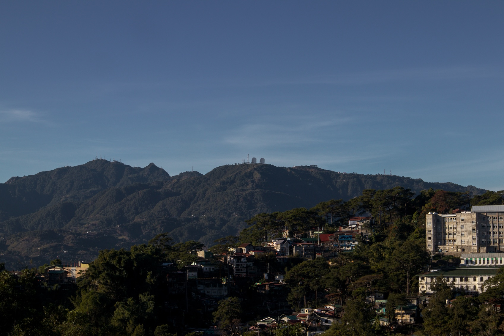
I begin here where it all started: a boarding house downstairs from an elevated road. When I walked down this road in the past, coming home from school, I used to see the roof of the house below me, red as it still is today.

Aside from this red roof and the stairs, I have very little memory of what the house looked like from the outside. All I know is that it is no longer as I remember it. The walls of this new house are painted orange and white. It is now tightly fenced (with chicken wires above the fence). And a guard house was built beside what was once just a humble gate.
***
A taxi stops in front of the heavily secured house. I walked past the gate and found a space across the road where I could stand from afar while still seeing the house. I joined a man waiting for a ride. Many vehicles drive by this road at this hour. Definitely more than what used to pass by here 15 years ago. There are a few jeepneys but most are taxis.
***
The taxi leaves.

A few moments later, someone comes out of the gate. A teenager with her ID's garland hanging around her neck. She locks the gate as she leaves.
***
I remember that there were two rooms on the first floor: one beside the living room and one beside the kitchen. I slept in the room near the kitchen along with two other boys from the same high school I went to back home. Upstairs were two rooms. One of those rooms had a large window, the largest in this house.

It is in this house where my first actual tests of obedience to the religion of my parents came. On the first week of college, my housemates, including my room mates (both minors like me) pressured me to join them in visiting the nearby drinking spots. I succeeded in rejecting their invitation but felt weird as I was left alone in the house that night.

Once, after arriving from a meeting at the Kingdom Hall, my sophomore housemates asked me to stay for a while so I could answer some of their questions about the end of the world. So who will be saved? they asked me. No one really knows, I said. But one can have more chance of being saved if one at least listens to Jehovah's message in the Bible.

I talked about the series of events leading to the complete annihilation of evil. When evil is wiped out, those saved will remain on earth to become co-creators of a paradise world. I left that conversation convincing most of them except one who was constantly skeptical.
***
The first walk I took as a JW living the religion of my parents away from them was most likely on a Wednesday on my way to attend a mid-week meeting. I wore maroon long sleeves partnered with a yellow tie with silver spots. I carried a leather sling bag with my bible, a songbook, and other pamphlets. Of course, I wore my leather shoes—the one with a long nose.

I said goodbye to my roommates, passed by my housemates in the living room, climbed the stairs to the road, and began the walk to the nearest Kingdom Hall at Valenzuela Street. The meetings start before sunset and end at dark. I particularly love the walk back, the streets illuminated only by flickering street lights.

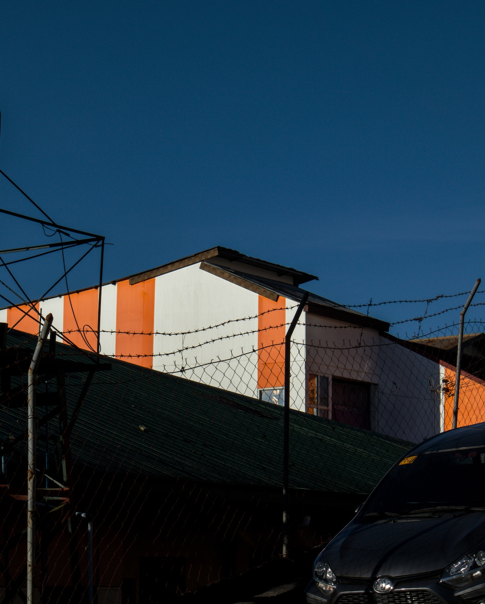
***
I don't remember walking here and seeing this beautiful view of Mt. Data. Perhaps I saw it but never cared. This point on the road gives one an excellent view of the mountain, famous for its Mickey-Mouse-like satellite disks and, of course, La Fresa, that fictional place popularized by a Tagalog television series.

Mt. Data is one of the most beautiful hikes I've ever done. In my first year, I took a PE class called "Walking for Fitness." I took the course not because I already loved walking as I do now but because it sounded easy. It wasn't.

One of the walks we did was a hike to Mt. Data. We camped on a small hill under which, they said, was an ancestral graveyard. The morning after we spent the night over the mountain, I took a short walk from the camp to a nearby cliff where birds flew below. When I saw that beautiful cliff, I sat on a rock and remember telling myself, "I'll return to you in paradise."

About two years later, I would return to Mt. Data with a group of JW sign language interpreters to survey people who are deaf or hard of hearing. We spent an entire day asking around but found none.

Today, I don't know if a paradise earth is ever possible. I do know that I still hope to return to that beautiful cliff one day to see it as it was before.

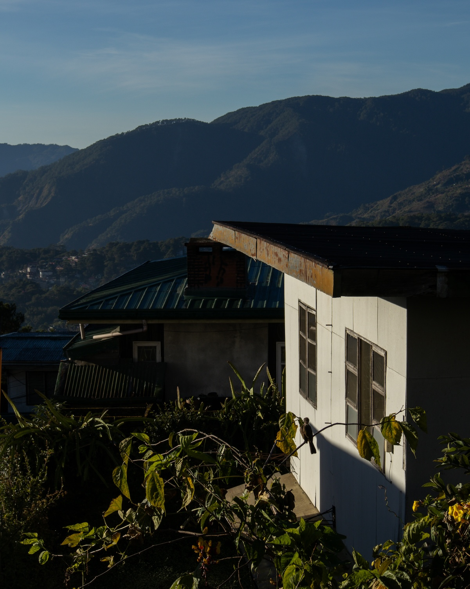
***
I walked outside the Baguio Convention Center, a place that meant very little to me the first time I passed it during my first year in Baguio. Later, it became an essential place of gravity in my growth as a JW.

In recent years, the Convention Center has gone through several transformations. For a while, it became an alternative bus terminal. During the COVID-19 pandemic, it was used as a triage center for everyone entering the city.

Today, skater boys play around its mostly vacant parking lot. I watched them for a few minutes before a guard asked them to leave.

I took a photo of the Convention Center from afar, making the guard turn his eyes to me. He walked toward me but never approached. Perhaps he was making his presence known.

One of the many residues of Imelda Marcos' cultural investment in the 70s and 80s, the Convention Center was used sparingly during significant events and rented to private and religious groups for similar purposes. Security wasn't this tight fifteen years ago and years before that. These guards, these fences that now surround it, and that gate in front only rose after I left Baguio in 2014.

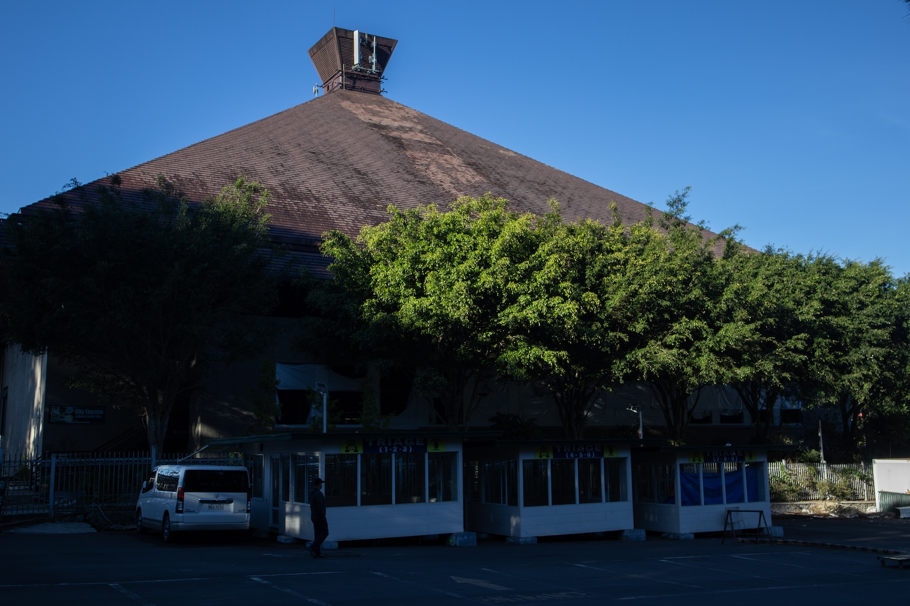
***
Before I left, JWs had two assemblies and one convention per year. As the name suggests, circuit assemblies gather several adjacent congregations and groups from a circuit. Circuit assemblies are usually held for two days. The same circuit meets again in a special assembly held only for a day. When several circuits come together, it becomes a district convention, which happens once a year.

JW sign language groups and congregations often rented the Convention Center for assemblies and conventions at least three times a year. The sign language congregations of Baguio and Benguet hosted these events, with congregations from lowland La Union, Ilocos, Pangasinan, Nueva Ecija, Isabela, Tarlac, and Pampanga coming to the City of Pines for several days of spiritual nourishment.

Those events were filled with camaraderie, and for a young minister and pastor with a dream to eventually be a missionary for this religion, learning about the different situations of the deaf community of Northern Luzon was also greatly instructional. My elders at the Baguio congregation trusted my sign language skills so much that in one district convention, they let me interpret the main talk of the district overseer who wasn't versed in sign language.

After I left the Baguio congregation in 2011 to recover from my depression, I transferred to a sign language group in Pangasinan. In an assembly or convention that year (which was also my last), I returned no longer as the host but as the guest. I remember feeling sad as I watched my former congregation members gather for lunch inside one of the few rooms inside the Convention Center. I stayed with my new group below, thinking of all the things I lost due to my illness.

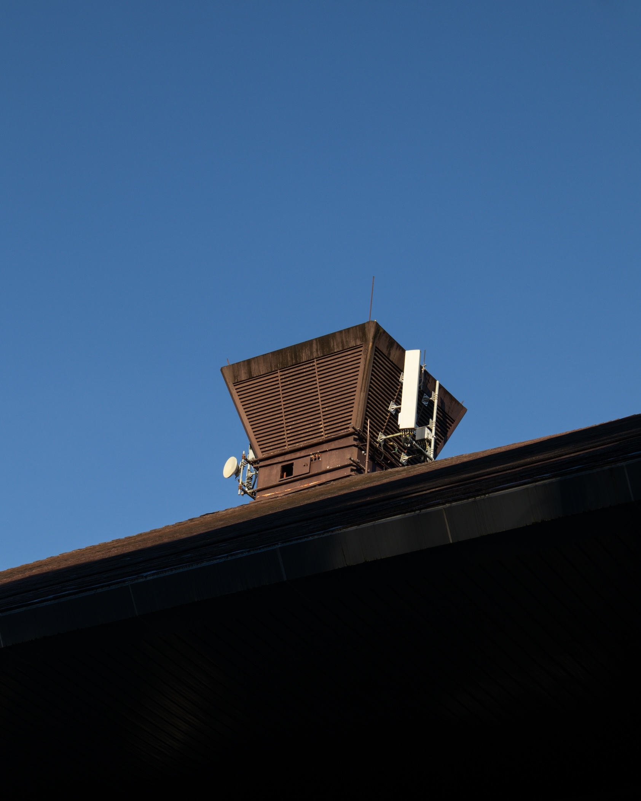
***
My first boarding house at Military Cut-off has changed. The road that leads to it has changed. The Baguio Convention Center has changed. What has endured is this nearby piece of land filled with century-old pine trees. Guarded by heavy iron fences, I remember them looking like this fifteen years ago when I arrived in my first year in college. But I've noticed them before when I accompanied my father once when he renewed his license at the licensure office just across this park.

Now, I stand behind the fence admiring these unmoved timbers, hoping to borrow some of their enduring fortitude for the walk ahead.
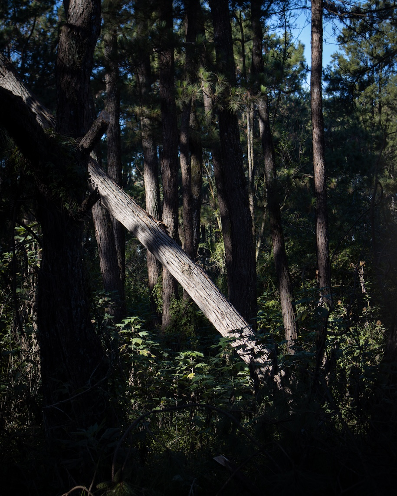
***
Leaving Military Cut-off, the Baguio Convention Center, and the pine trees, I followed my feet toward the rest of TM Kalaw Street, leading to Upper Session Road, trying my best to remember the exact route I would've used in the past to get to the nearest Kingdom Hall.

Although unsure of the exact route, I'm sure I used to go down the Igorot Stairs near the once-abandoned Casa Vallejo. This route is not the easiest. However, I was afraid of getting lost in wide Baguio, so I stuck with it during those first few weeks (or months?). I walked down these stairs and up after the meetings, making me completely exhausted when I got home.

I would later learn of two more accessible routes: the first using Leonard Wood Road and North Drive and the second using Leonard Wood Road and Upper Session Road. Both are longer routes but avoid the stairs.
***
The kingdom hall was closed. Not closed as in it would open tomorrow but closed as in for good. The doors of its gate were padlocked and tied together by a rusty chain. A phallus graffiti adorns the left door, suggesting it has been closed for a while.

Before I left in 2012, this Kingdom Hall was home to four congregations: an Ilocano, a Tagalog, an English, and a Korean congregation (Baguio was that ripe in JW ministry). I no longer know the story behind this closure, but all of those congregations could only be accommodated by the new, bigger Kingdom Hall at Rimando Road, which I'll see later in this walk.
***
This kingdom hall at Valenzuela Street was the first I ever worshipped in Baguio. Even before 2008 (my first year in college), I've already accompanied Brent, an American from Missouri who married a Filipina family friend from our congregation in Pangasinan, in Baguio, at least twice to attend the English congregation where he was previously associated. Brent had two of his toes cut due to diabetes, making him prone to tripping. During weeks with Brent, I assisted him when he walked to the kingdom hall and visited English-speaking foreigners around Baguio. Brent would later go back to the States with his wife. He would first die a few years before his wife. I've never reached out to them after I left the religion in 2012.
***
In my first week in Baguio as a first-year college student, I returned to this kingdom hall to attend several meetings of the English congregation. I can't remember exactly why I didn't continue attending those meetings at that congregation. My best guess was that the congregation lacked enough youngsters like me. Without people I knew I could befriend, I couldn't feel the warmth I sought in a congregation. This moved me to attend other congregations. I moved to the Summerhill congregation, a larger Tagalog-speaking congregation whose membership is half composed of high school and college students. That congregation also had a sign language group at which I volunteered.
***
I slowly moved my eyes across those iron letters welded above the gate's doors. JWs have used this place for years. They may have thought they would use it forever. I'm reminded of the malleability and impermanence of things. I'm reminded of my own malleability and impermanence.

Black and white garbage bags lay along Valenzuela Street. It's trash day, and the truck will arrive soon. A garbage man passes by. With only Php 20 or 30, residents hire someone like him to haul their garbage to the roadside.

I, too, have things in need of hauling. But today, I am my own garbage man.

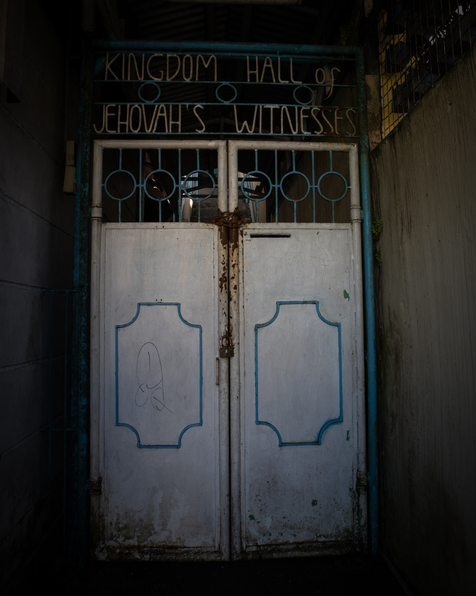
***
My niece and nephew go to this elementary school. This morning, before the walk, I escorted my nephew to his first class here. I returned after visiting the old kingdom hall, sitting on the renovated waiting shed and looking down. Below, I see two vehicles parked on the side of the road.
***
I used to know a little boy and his sister who also attended this school. In 2011, when I left Baguio, the sister had graduated elementary school and, therefore, moved to the public high school. But since her brother still went to this school, she went here after her classes to join her parents, who parked their fx at either of the spots where these vehicles are now parked.

I, too, used to go here to meet the family's father in the afternoons. Their father is the closest thing to a spiritual father I've ever had. He was an elder at an Ilocano-speaking congregation (the Ilocano-speaking congregation that used the shutdown kingdom hall I just visited). After learning that the sign language group needed another elder to become a congregation, he talked to his wife about the matter, and both decided to move. Their move was the key for the group to become a full-fledged congregation, an achievement that happened in 2010, about a year before my depressive episode.

I went here on this spot on afternoons to teach the family sign language since they never went through formal training. But I also went here to be mentored by the father (and, in some measure, even by the mother). The couple were regular pioneers. Regular pioneers or RPs are what JWs call members who have pledged 70 hours of preaching per month. Since this is a significant amount of time, only those who have genuinely simplified their lives by only taking part-time jobs could succeed in becoming RPs. The couple taught me everything they knew about living a life centered on serving Jehovah.
***
The boy and his sister have a brother who was a few years older than me. This brother was baptized in the faith but left later as a form of rebellion. I knew this brother. He lived with me in my second boarding house, in a spare area in the attic. He worked as a call center agent, so he was usually about to leave for work when I arrived and asleep during the weekends. We seldom talked.

Their mother used to tell me that the boy and the girl saw me like a spiritual brother, a replacement for the one they lost, a brother they looked up to and were proud of.

Today, as I seat here, I wonder how the boy and the girl took it when I left them without saying goodbye. How could they've dealt with losing another brother?

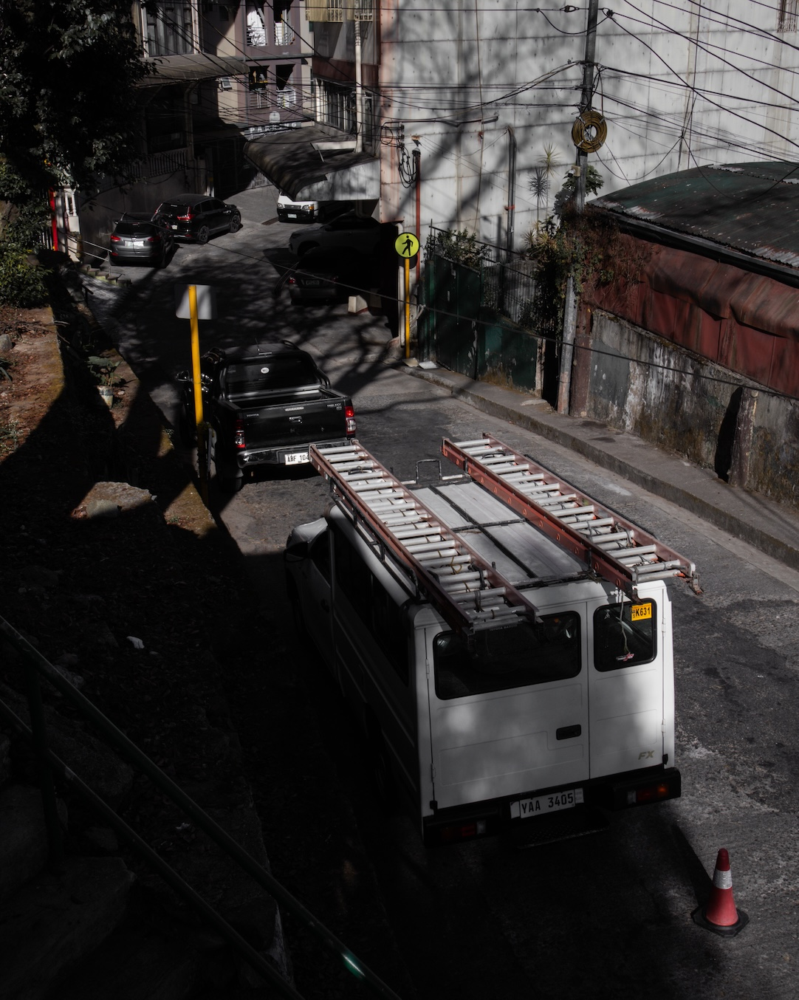
***
It is a lot easier to walk this street now.

I remember walking this long street one evening after class to attend the midweek meeting at the kingdom hall at Rimando Road. The traffic wasn't moving so I got off the jeep and began walking. I arrived 15 minutes before the end the meeting.

I look at my clock and see that it is now 9:16. Some buildings block the light giving shade to my walk

I walk here no longer wearing polo, slacks, and leather shoes but a hooded sweater, shorts, and a pair of slippers. I walk here no longer as an evangelist Christian whose life is centered around learning and preaching a single way of looking at the world. I walk now as a photographer-writer looking for lights and different ways of seeing a things.

After taking off my Christian clothes, I noticed that it was natural for me to avoid holding strong beliefs or convictions about anything. At school I struggled taking a stand or took a stand blindly for fear of ridicule. After school, I floated around different religious, political, and philosophical perspectives hoping for something to stick. Very little did.

I was attracted to perspectives that aren't black and white. Nuanced. Didn't demand me to always take a stand. Didn't demand me to fight for something before I fully understand it. Didn't preach to me or belittled me for my ignorance. I avoided groups and people who behaved this way. This way of thinking represented everything I left. To honor the unique journey I've been dealt with, I had to resist the urge to be someone I'm not yet. If this means I take a less popular stand, so be it.

I think I have earned the right to enjoy epistemological freedom a bit longer after I've offered a quarter of my life to a belief system that honored no such thing.
***
I've walked Rimando Road several times as a JW, but I was too consumed by religious thoughts. I've never stopped to even notice how clear a view it offers of Aurora Hill.

I go down the stairs from Bonifacio Street and almost immediately see Aurora Hill. I stopped to stare at it for a while, looking for familiar places. I'm looking for Bayan Park, but perhaps it is hidden behind all those houses. What is visible are the still unoccupied areas of the hill that leads to Ambiong, the barangay of Baguio that connects with the caldera municipality of La Trinidad, Benguet.

The sight of Ambiong calms me down as I walk slowly down Rimando Road. I'm about to reach the end of the walk, where I'll come face to face with one of the most challenging places to visit on this walk.

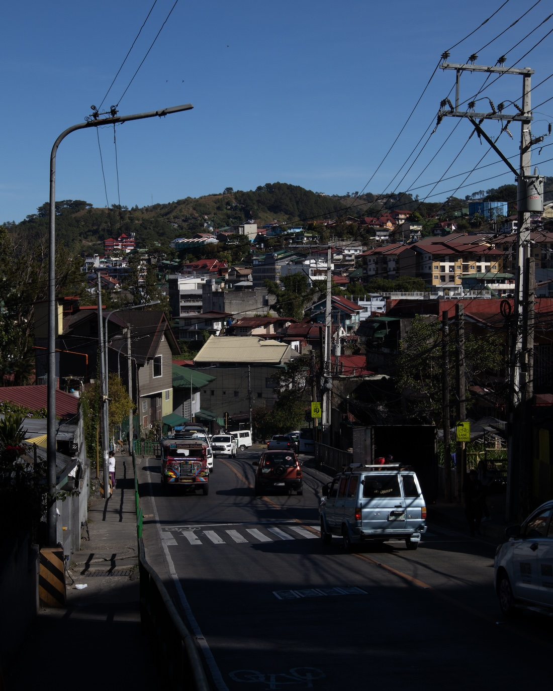
***
Crossing the bridge over the Balili River, I begin to see the intersection of Rimando Road and Manuel Roxas Street, an intersection where the most defining events of my 16th, 17th, and 18th year occurred.

At this intersection, I met people who treated me like their own brother and son, people I thought I would grow old and die with. At this intersection, I first learned sign language—interpreted for people who were deaf and hard of hearing then later delivered full talks purely in sign language. At this intersection, I met a woman I would love even for just a very short time. Here, I learned faith, community, responsibility—things I didn't learn enough back at home.

I looked across the street and saw two establishments where I used to eat with my friends before and after meetings. In one of these establishments, while having dinner with friends, I watched a tsunami engulf vehicles and houses in Japan on March 11, 2011, the same day my depressive symptoms first appeared.

As I approached the kingdom hall, however, I felt unease. I stood outside 7-eleven and looked at it from afar. It is no longer the same building I knew. It was totally different thing.

Today, three men wearing hard hats were walking around the building. They seem to be cleaning or repairing something. I recognize at least one of them. Remembering my promise not to take a photo of people I used to know in the church, I crossed the street to move to another side of the building away from the men.
***
This renovation only meant that the entire building was destroyed. In fact, the foundation of the old building, what was once a ground floor with a kitchen we used to hang out and rooms we took naps in, was destroyed. What is left is a hollow parking lot. The building still had two large halls, which means it could still accommodate the same number of congregations it used to support (perhaps even more). But it is no longer the old building made predominantly with wood, a building where people wearing leather shoes walking on the wooden second floor created a sound I can still hear as I write these words.

I no longer recognize this building. It is something entirely new. As I am. We meet like strangers for the first time.
***
After just a few minutes of staring at it, I decided I had done what I ought to do. I began walking back to where I came from.

As I walked, I took note of the unease I felt during this reunion, an unease borne not out of nostalgia but out of meeting something I barely recognize, something that isn't that which would create nostalgia. I left early because there was nothing left for me there.

The people I loved in that kingdom hall, at least most of them, are now gone. And even if they're still there, they won't be the same people I fell in love with. As I am.

I remind myself that I expect nothing out of these walks, like I expect nothing out of meditation. I'm not doing this to find closure or reconciliation. Not even reintegration. I do this with a complete openness to whatever arises.

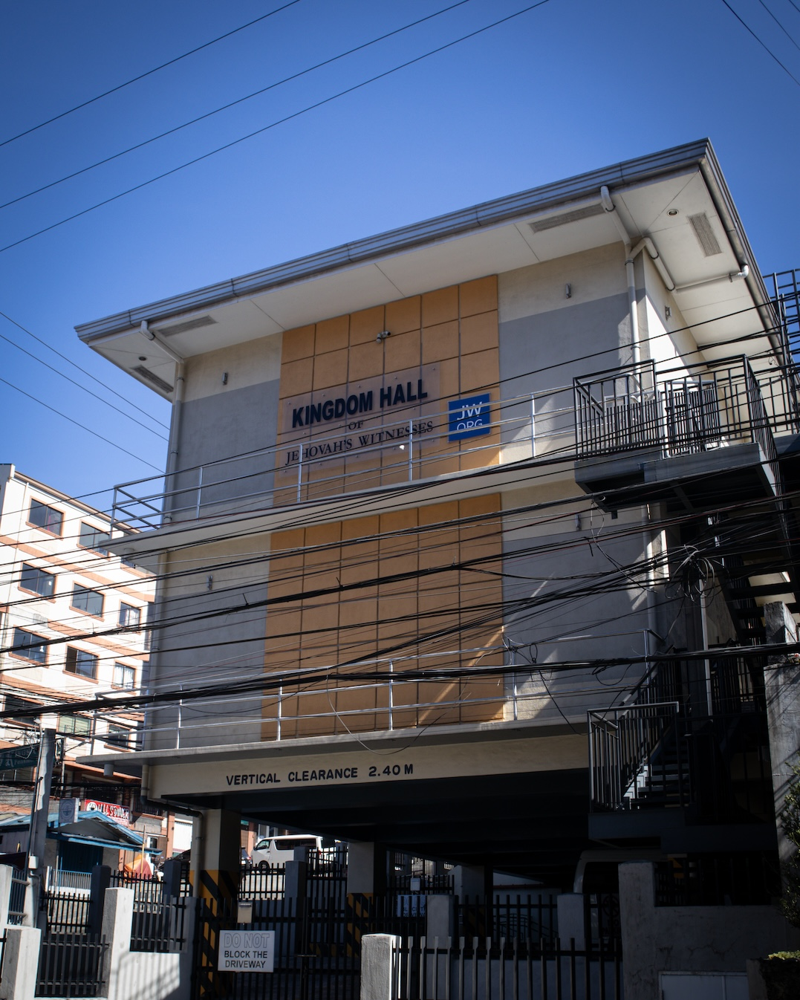
***
As I crossed the bridge over the Balili River, I was reminded once more that this was another thing I failed to look closely at in the past. Throughout this walk, this was the time when I felt my camera calling. I picked it up and used its zoom not to take a good photo but to look at the river closely and with focus.

While looking closely at the Balili River, I am reminded that I, too, am a river of sorts—ever-changing, ever-flowing. And this ever-flowing nature is what makes me who I am.

The years 2008–2012 were beautiful years that had to end dramatically. They had to end because without them ending, the river wouldn't flow, wouldn't change course, and would've stopped being a river. In other words, it would've stopped being itself.

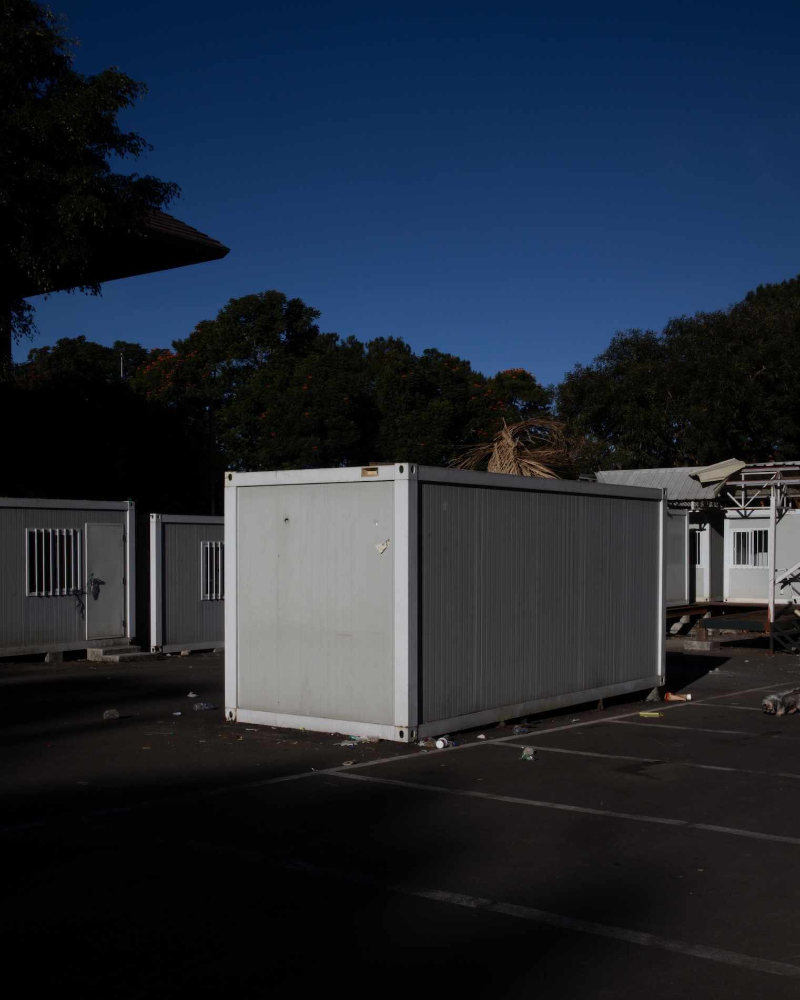