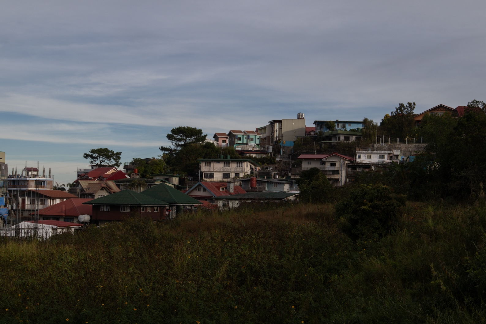
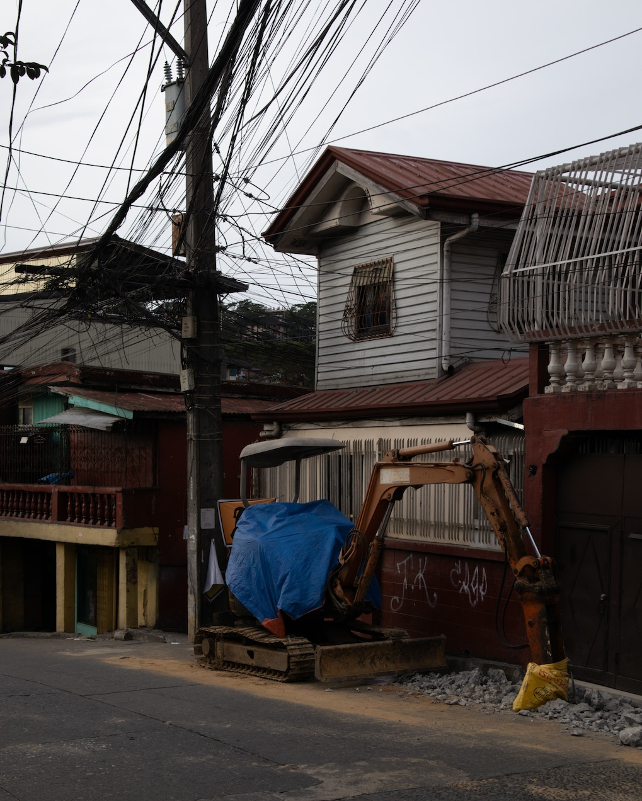
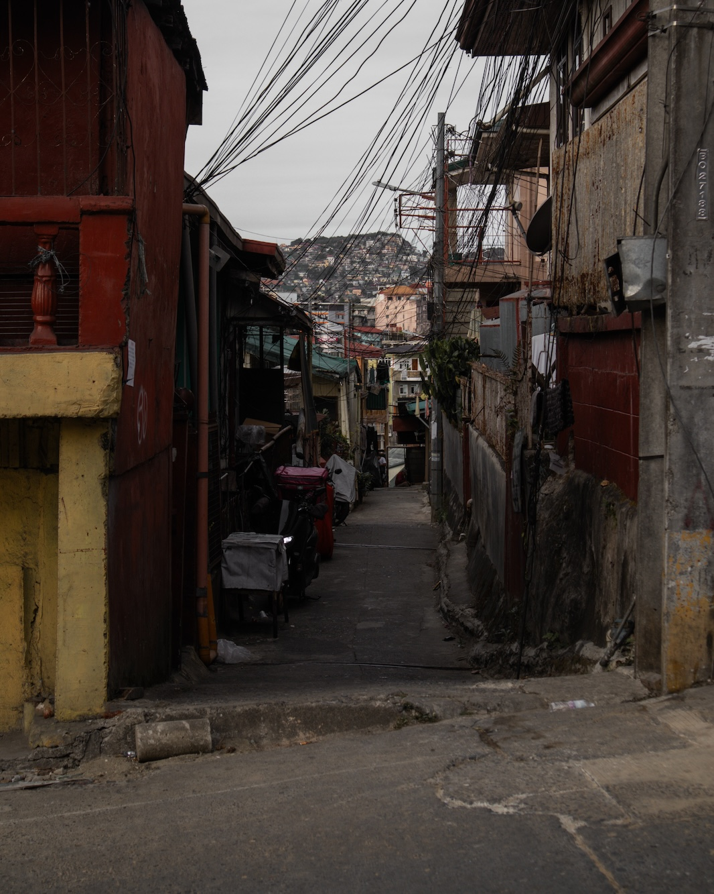
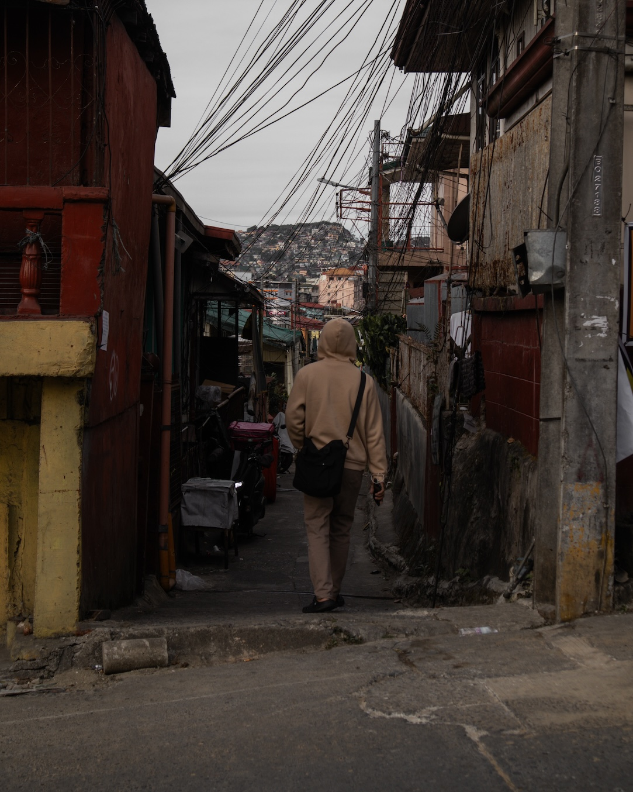
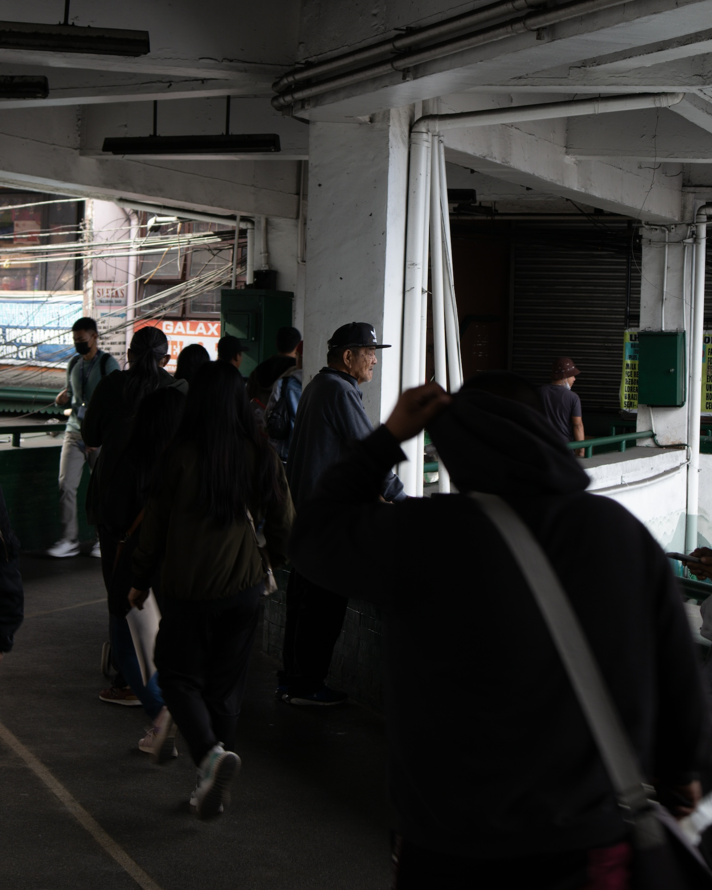
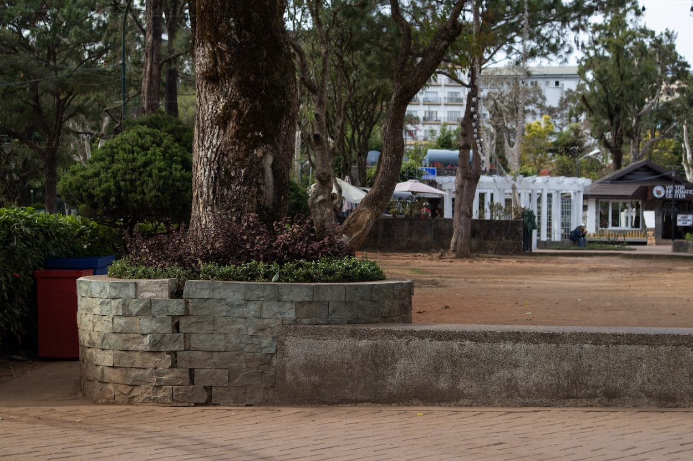
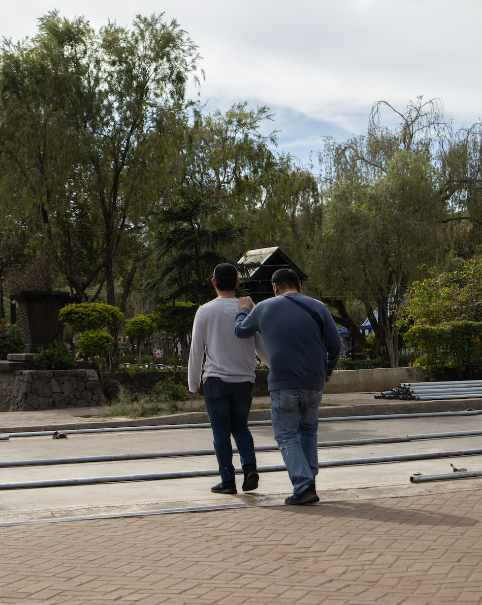

On my way to Bugallon Street, I walked past the kingdom hall at Rimando once more. Unlike yesterday, no people were working around it today. The building is all by itself. I stopped beside the road directly opposite it and stared at this side of the building.

I immediately saw the schedule of services posted just outside its gate. The Tagalog congregation seems to have changed its name from Summerhill to North. The sign language congregation has retained its old schedule: Friday evenings and Sunday afternoons.

The Sunday afternoon schedule was strategic. Signers (what we used to call most "hearing" sign language interpreters) would use Sunday mornings to fetch their bible students, who usually lived in far places of Baguio (like Outlook Drive) or even La Trinidad, so that they could attend the afternoon meetings.

Sundays are usually busy for us in the sign language ministry. We fetched bible students in the morning, attended the meetings in the afternoon, and then conducted individual bible studies with the same students we fetched in the morning right after the meetings. By doing everything in one day, we save time and money. For a college student with limited financial resources, this strategy was crucial for me. Almost always, I pay for my bible student's fare and lunch. The organization had no funds for such expenses. We volunteered our time as well as our money. This is how I learned selflessness.
***
I walked past the house of an elder I was close with. I made a mental note that this was where I learned how to drink at 17.

Unlike most other Christian denominations, JWs are not too strict about drinking (at least during the years I was there). Alcoholic beverages were expected to be available during the more casual gatherings, and even elders used them to build camaraderie among the men in the congregation. The organization perhaps has been a bit lax in how it dealt with alcohol that alcoholism became a common problem among several congregations in Baguio, a place with a deep indigenous cultural attachment with intoxicants. This is, of course, knowledge handed to me during many gossiping sessions with my mentors in the church.
***

A small bulldozer is parked where we used to wait for a taxi. In front of the bulldozer are pieces of broken cement, perhaps the same cement the soles of our leather shoes touched during all those hours of waiting for rides.

At first, the sister, her husband, and I rode the taxi. Sometimes, Kuya Mon would ride with us. I stayed with the sister and her husband for two months in 2010 before the second semester of my second year ended. The following semester, my sister (the youngest) would join me in Baguio for her first year in college. She landed a spot in the Language and Literature program at UPB. To prepare for her arrival, I looked for an apartment we would share.

While looking for an apartment, the sister and her husband generously took me in. I didn't pay for rent or utilities. They even fed me breakfast and dinner. For the first time, I was treated like a real brother by people I don't share my blood with.

The sister and her husband had a huge age gap, and this fact made its way to many of our jokes. They also didn't have a child (didn't want one or couldn't have one?), so welcoming me into their space was easier. The sister's mother often visited and, at one point, decided to stay with the couple for a year or so. She arrived when I was there and soon joined our little band of taxi waiters.

She, too, made me feel like I was her son. We talked and talked for hours on end. She told me about her suitors and life in the fishing village in Quezon, where she grew up. I told her that although our municipality was quite far from the sea, it was near my heart.

***
Around the time when I moved out of the sister and her husband's apartment to join my sister in our place in Aurora Hill, a cousin of the sister moved from Manila to Baguio with her three sons. One of her sons was going to college, and they thought a new start in Baguio could be helpful to all of them. I grew an affinity with these boys and often slept over on Saturday nights to help the family prepare for the Tagalog meetings the following morning.

The sister's cousin had an unbeliever husband who worked abroad. Left with no male to lead her boys at home, she told me once I was a father figure to them. Hearing this from her surprised me. I had just turned 18, yet through my words and actions, I was already shaping the character of three young men, the eldest being only two years younger than me. During that year before my depression, I did my best to live up to their mother's expectations. Having been mentored by grown men in the congregation, I thought sharing that gift with these boys who badly needed it was just right.
***
When they learned I had to leave school and go home to recover from my depression, the eldest son called me. He was crying on the phone. He asked whether I had caught something severe. He talked to me like I had cancer. I told him I'm not dying. But that call made me feel how much I meant to him.
***
Writing this now puts more perspective on the suffering I went through. While in the middle of depression, it's difficult to see beyond the pain. The mind reorganizes itself and dramatically changes. It forgets about others, shuts them down completely, so people who once relied on a person with depression are neglected.

Even when I was relieved of my worst symptoms (insomnia, panic attacks, chronic fatigue, and suicidal ideations) and saw a glimmer of hope, I still had to focus on getting back on my feet. The work required by all of these is too much it could take years before one could acclimate with one's new brain. The decision to leave the religion made things worse: I abandoned my bible students, I abandoned my friends, I abandoned the younger human who looked up to me, I abandoned Kuya Mon.

I woke up one day after several years, realizing that I've lost almost everyone I knew, almost everyone I've ever cared for.

***
Kuya Mon wasn't born blind. He got blind in middle age. He grew up with the sister's husband in non-JW households. Kuya Mon didn't tell me his story directly. Perhaps it was too difficult for him to return to those memories. But the sister's husband told me when Kuya Mon lost his eyesight, his family (yes, his immediate family), seeing that he would no longer be of use and would be too much trouble, packed his things one day and kicked him out of the house. His own blood forsook Kuya Mon because of his disability.

The sister's husband said Kuya Mon wanted to kill himself and was very much intent on doing so. Moved by what happened to his close friend and unable to ignore Kuya Mon's situation, the sister's husband, with his mother's permission, took Kuya Mon in. The mother treated him like her own son.

The sister's husband later met the JWs and got baptized. Kuya Mon followed suit. Becoming a JW gave Kuya Mon a purpose, one that was enough for him to forget about suicide. When I met Kuya Mon, he was already a regular pioneer in the Tagalog congregation. Unable to read, he listened to all available audio recordings of JW publications, including the bible. Kuya Mon had a sharp memory. He could recite several bible verses by heart.
***
Sometimes, religion and spirituality give purpose to people like Kuya Mon, who have lost almost everything. In cases like Kuya Mon's, I honestly (although still uneasy) feel genuine gratefulness for beliefs, even those I don't necessarily agree with. When one witnesses how certain ideas tailored into spoken and written words could affect how individuals behave toward each other, creating a new family for those who lost theirs, one could at least be happy for those whose lives have been uplifted by such ideas.

Of course, not all ideas are for everyone. Now that I think about it, I could've just disregarded the doctrines taught in the kingdom hall, which I no longer resonated with—doctrines like the existence of a God, the divine inspiration of the bible, and the divine authority of the governing body. When I was removed as a ministerial servant, I could've just reminded myself of the good things the religion has done for people like Kuya Mon and stayed. But I'm not Kuya Mon. I was given an entirely different set of cards.

A gift I owe from my depression experience was the realization that for an idea to take hold of me (as it did with Kuya Mon), it isn't enough that it is beautiful and inspiring. Sometimes, I don't care whether an idea is beautiful at all. What holds me and inspires me are ideas that are honest and true. Even if they don't inspire many people, even if they're unpopular, they resonate strongly with me.

It wasn't enough that an idea was beautiful or that it could change lives. First, I need it to be honest and truthful before I can really embrace it as my own.

Yes, I could've stayed and continued to enjoy the family I had within the organization. But depression has already broken the parchment curtain. I can't unsee what I have seen. For me, to stay is to live in a beautiful thing built under a foundation of lies.
***
Back at Rimando Road, I walked slowly, trying to remember what it felt like to have Kuya Mon's palm on my right shoulder and the pace of our walk. I don't remember slowing down. Kuya Mon always kept up. We just had to be mindful of our steps, especially on staircases. But he walked fast and well like anyone else.

Suddenly, I felt the burden of imagining someone holding my right shoulder. Suddenly, it felt right to return to the walk as it is happening today. Suddenly, letting go of Kuya Mon walking behind me felt alright.
***
Where is he now? Did he ever learn to walk by himself? Is he still even alive? Gosh, it's been 12 years, I told myself. Who among them is still alive?

***
This is where we used to gather before field ministry. Almost all JWs, no matter what congregation, used this spot. It is where we waited for brothers and sisters. Due to the terrible Baguio traffic, they almost always arrived late. While waiting, some of us would sit in this space holding a magazine up for people to see, an archaic method. Those more contemporary in their approach walked around giving tracts to people.

A photographer once held an exhibit at SM Baguio. His works featured different religious individuals in various scenarios around the city. One of his photos featured a sister sitting on this bench holding a magazine up and chatting with another sister while someone was doing her toenails. The photographer named his piece "Sunday Manicure."

***
Today, I sit across it: an empty bench. People pass by, but no one sits on it. Fifteen years ago, this bench was rarely vacated. A sister or brother, usually an older one, was always sitting on this bench holding a magazine up. Today, alone, it breathes and breathes well. Like me, it tries to catch up to all those lost years.
***
Nearby, a young man walks slowly as an older guy holds him on his right shoulder. The older guy wasn't blind; probably had a stroke. It's an entirely different thing, but it was close to how me and Kuya Mon looked like years ago when we walked Rose Garden and Burnham Park looking for a meek-looking person to talk to about the hope we both shared about a new world devoid of all illness and disability and filled only with joy and compassion.

It's a message I've let go twelve years ago when I left the JWs. But everyone who walks with their truth in their hearts will always have a soft place in my heart.

