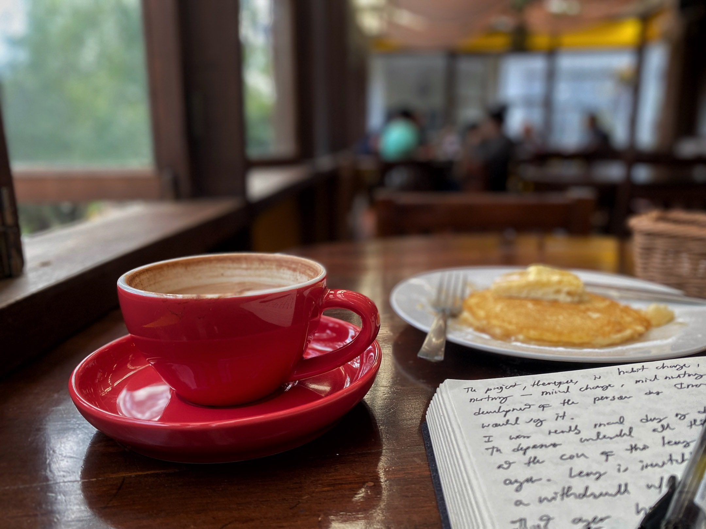
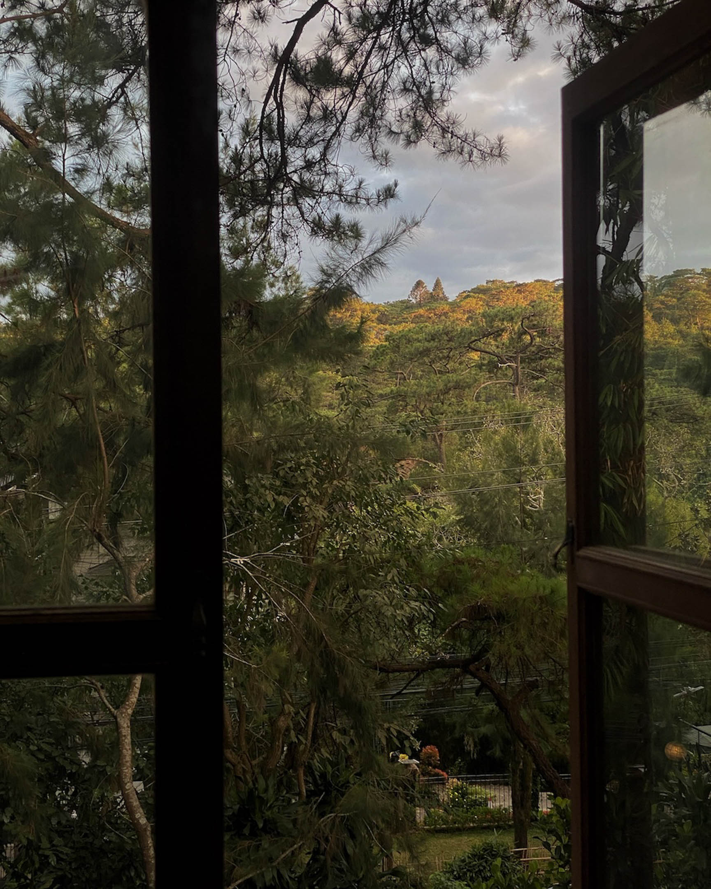

Walking on the inclining driveway, I saw that the cafe's windows above the parking lot were open. There seemed to be no customers, and I even thought they were close had I not heard an almost silent jazz tune playing on a small speaker as I climbed the stairs that led me to the door.

La Casa Bianca. For a crowded city like Baguio, it is one of a kind. I discovered it through two friends, a couple who sold their house in South Luzon and relocated to Baguio only to move back south to Manila after frequent power interruptions prevented them from conducting their startup. They said they liked it because it is usually empty, even on the weekends, and the music isn't distracting. One can write or read here, and the food isn't bad.
***
I decided to take the day off. I wasn't tired. The two walks I did in the past two days were shorter than those I did in Los Baños last December. However, I needed space to process some of the thoughts and emotions from those two walks, mainly because these are new ones.
***
The crew stood up from their seats when they saw me enter the door. Good afternoon, they greeted. Good afternoon, I greeted back. I walked straight to my favorite spot: a table at the left corner of the cafe beside a window. I sat down to read the menu then went to the cashier to order. As I returned to my table, I closed half of the window: it was getting colder and colder as the days pass by here in Baguio, a reason why I've decided to cut the days of the walk.

Instead of ending it on the 21st, I've decided to do a final walk on the 19th before traveling to Pangasinan to stay with my parents for about a week. Aside from the cold, Baguio is currently experiencing an outbreak of acute gastroenteritis due to contaminated water in some areas of the city. I've been safe so far, but I don't want to put myself at more risk. So, I'll do one more walk tomorrow and see if I could do another on Friday. But two walks would be my max. There are so many routes I could still walk on, so many more places to be with, so many more memories that could be unearth, but I'll reserve all of them on a second Baguio walk, probably around summer, on May, when it is less colder.
***
Sitting here at La Casa Bianca, alone, I think about the reasons why we seek for places such as this. Last week, I finished reading Craig Mod's pop-up newsletter on his tour of Jazz kissas around Japan. The word kissa comes from the Japanese word kissaten or "tea-drinking shop." It is Japan's version of the cafe, a space where people gather to drink and commune. Jazz kissas, which became popular when Japan embraced the West after World War II, are spaces dedicated solely for listening to jazz. Dark lit and with loud music, jazz kissas discourage reading and talking. Patrons visit them for a particular experience often not found in their day-to-day lives.

In populous Baguio, a place like La Casa Bianca provides me with a specific experience I can't find at my sister's place or in any other of the popular cafes down Session Road: the solitude I need to review the thoughts and emotions I experienced in two walks I just completed.
***
As a writer and artist with a particular interest to philosophy, religion, and spirituality, I'd like to think of my work also as something that creates a particular experience, an experience my readers seldom find out there. Therefore, the question I should be asking is not "where can I find this experience?" but "how can I co-create this experience for myself and others who might need it?" In other words, instead of looking for a kissa or cafe that would give me what I'm looking for, wouldn't it be better for me to co-create that space and, therefore, expand the access to the experience I and others are looking for? According to Craig Mod, this is exactly how jazz kissas grew in popularity in Japan. Patrons of existing jazz kissas fell in love with them that they were inspired to open their own kissas in consultation with the owners of the original kissas.
***
I would like to see myself as a kissa of sorts. But what I'm building is not an unmoving physical structure but a living, breathing, portable, walking kissa. What I hope is that my words, writings, photographs, actions, and, more importantly, my very presence bring the experience I want others to have, one that isn't always readily available in the world out there.
***
After finishing two walks, is there anything I could already take home from this project? 

One day, I would like to return to these spaces, not hiding or avoiding encounters, but bringing my truest self. I don't mean seeking encounters but being open to them when they occur and trusting that something good will come out of seeing people I used to know and love.

This is something I need to think about because I can't run away from these potential encounters. My parents are both deep in the faith. They've grown deeper ever since I left. They're also getting older each year and I can't help but contemplate how I would continue to exist when either or both of them are gone.

They would both want a JW sendoff where JW families and friends would gather to remember them. I would be there, of course. In fact, that would only be the occasion when, I think, I'll truly be there around people I've left in the church. I want to be there as my truest self, not someone who has grown cold in faith and in need of assistance to return (as my parents and those who know me in the church clearly see me). I want my words, actions, and presence to show that I'm someone completely new. I want them to radiate the experience I want people to have when my kissa is around them—an experience I am yet to articulate, but something that is definitely filled with compassion and openness to differences. That won't happen unless I make peace with the past, unless I rediscover the emotions I tried to forget but can't, unless I process and alchemize them into something more inspiring and useful.
***
Although it was a rational decision, triggered by depression, my choice to leave my religion was propelled with a lot of anger. I was angry to my parents for not granting my request to leave my studies a semester before the depression happened. I was angry to the elders who didn't defend their initial decision and to the overseer who overturned it. For a while, I was angry at religion and agreed that all its forms must be eliminated.

That anger has now subsided, and I owe this from my meditation practice, which began with zen and has now transitioned to seiza. And in the past two days, walking, being present in these long-forgotten places, and writing about the people once dear to my heart for the first time, I can't help but to notice the complete absence of anger. Instead, what I honestly feel now is a genuine curiosity to what might have happened to all these people I left.

Remember one of the child I wrote about in day one, the one whose older brother also left the church years before I did, I saw her that very day after I wrote about her on my phone. I was crossing the overpass at Maharlika on my way home when I saw her stop just before the stairs I was climbing. I wanted to hug her, tell her it was me, ask her how she is, where she've been, how her parents are. But I can't. I just can't. And I felt it in my bones that whatever this thing that held me back from being human at that moment was just wrong, was something that has to be overcome.

Our beliefs shouldn't be what prevents us from communion. Instead, they should make us thirsty for connection (and reconnection).
***
My dream is to come to these unavoidable encounters a different but kind person, someone who isn't angry about anything or anyone, but someone who is genuinely interested and curious, perhaps even to catch up with all those lost years, to co-create a space for human to human communion, without judgement and prejudice, to listen deeply despite the barrier of religious difference.

This is the direction I want to take—to explore the possibility of sitting down with my neighbor no matter how different they are. And it is my hope that, somehow, these walks will take me toward that direction.

